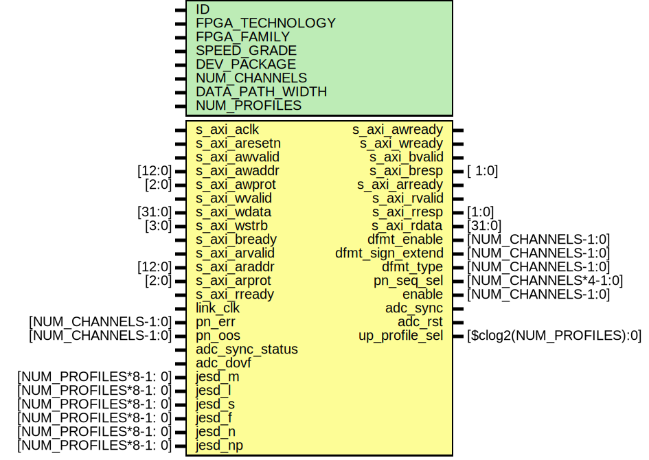

# Entity: ad_ip_jesd204_tpl_adc_regmap

## Diagram

## Description

***************************************************************************
 ***************************************************************************
 Copyright 2018 (c) Analog Devices, Inc. All rights reserved.
 Each core or library found in this collection may have its own licensing terms.
 The user should keep this in in mind while exploring these cores.
 Redistribution and use in source and binary forms,
 with or without modification of this file, are permitted under the terms of either
  (at the option of the user):
   1. The GNU General Public License version 2 as published by the
      Free Software Foundation, which can be found in the top level directory, or at:
 https://www.gnu.org/licenses/old-licenses/gpl-2.0.en.html
 OR
   2.  An ADI specific BSD license as noted in the top level directory, or on-line at:
 https://github.com/analogdevicesinc/hdl/blob/dev/LICENSE
 ***************************************************************************
 ***************************************************************************
 
## Generics

| Generic name    | Type | Value | Description                       |
| --------------- | ---- | ----- | --------------------------------- |
| ID              |      | 0     |                                   |
| FPGA_TECHNOLOGY |      | 0     |                                   |
| FPGA_FAMILY     |      | 0     |                                   |
| SPEED_GRADE     |      | 0     |                                   |
| DEV_PACKAGE     |      | 0     |                                   |
| NUM_CHANNELS    |      | 1     |                                   |
| DATA_PATH_WIDTH |      | 1     |                                   |
| NUM_PROFILES    |      | 1     | Number of supported JESD profiles |
## Ports

| Port name        | Direction | Type                     | Description                          |
| ---------------- | --------- | ------------------------ | ------------------------------------ |
| s_axi_aclk       | input     |                          | axi interface                        |
| s_axi_aresetn    | input     |                          |                                      |
| s_axi_awvalid    | input     |                          |                                      |
| s_axi_awaddr     | input     | [12:0]                   |                                      |
| s_axi_awprot     | input     | [2:0]                    |                                      |
| s_axi_awready    | output    |                          |                                      |
| s_axi_wvalid     | input     |                          |                                      |
| s_axi_wdata      | input     | [31:0]                   |                                      |
| s_axi_wstrb      | input     | [3:0]                    |                                      |
| s_axi_wready     | output    |                          |                                      |
| s_axi_bvalid     | output    |                          |                                      |
| s_axi_bresp      | output    | [ 1:0]                   |                                      |
| s_axi_bready     | input     |                          |                                      |
| s_axi_arvalid    | input     |                          |                                      |
| s_axi_araddr     | input     | [12:0]                   |                                      |
| s_axi_arprot     | input     | [2:0]                    |                                      |
| s_axi_arready    | output    |                          |                                      |
| s_axi_rvalid     | output    |                          |                                      |
| s_axi_rresp      | output    | [1:0]                    |                                      |
| s_axi_rdata      | output    | [31:0]                   |                                      |
| s_axi_rready     | input     |                          |                                      |
| link_clk         | input     |                          | control interface                    |
| dfmt_enable      | output    | [NUM_CHANNELS-1:0]       | Data format conversion configuration |
| dfmt_sign_extend | output    | [NUM_CHANNELS-1:0]       |                                      |
| dfmt_type        | output    | [NUM_CHANNELS-1:0]       |                                      |
| pn_seq_sel       | output    | [NUM_CHANNELS*4-1:0]     | PN sequence monitor                  |
| pn_err           | input     | [NUM_CHANNELS-1:0]       |                                      |
| pn_oos           | input     | [NUM_CHANNELS-1:0]       |                                      |
| enable           | output    | [NUM_CHANNELS-1:0]       |                                      |
| adc_sync_status  | input     |                          |                                      |
| adc_sync         | output    |                          |                                      |
| adc_rst          | output    |                          |                                      |
| adc_dovf         | input     |                          | Underflow                            |
| jesd_m           | input     | [NUM_PROFILES*8-1: 0]    | Deframer interface                   |
| jesd_l           | input     | [NUM_PROFILES*8-1: 0]    |                                      |
| jesd_s           | input     | [NUM_PROFILES*8-1: 0]    |                                      |
| jesd_f           | input     | [NUM_PROFILES*8-1: 0]    |                                      |
| jesd_n           | input     | [NUM_PROFILES*8-1: 0]    |                                      |
| jesd_np          | input     | [NUM_PROFILES*8-1: 0]    |                                      |
| up_profile_sel   | output    | [$clog2(NUM_PROFILES):0] |                                      |
## Signals

| Name             | Type                    | Description               |
| ---------------- | ----------------------- | ------------------------- |
| up_rack          | reg                     |                           |
| up_wack          | reg                     |                           |
| up_rdata         | reg [31:0]              |                           |
| up_rdata_all     | reg [31:0]              |                           |
| up_status_pn_err | reg                     |                           |
| up_status_pn_oos | reg                     |                           |
| adc_status       | reg                     |                           |
| up_clk           | wire                    | internal clocks & resets  |
| up_rstn          | wire                    |                           |
| up_wreq_s        | wire                    |                           |
| up_waddr_s       | wire [10:0]             |                           |
| up_wdata_s       | wire [31:0]             |                           |
| up_wack_s        | wire [NUM_CHANNELS+1:0] |                           |
| up_rreq_s        | wire                    |                           |
| up_raddr_s       | wire [10:0]             |                           |
| up_rdata_s       | wire [31:0]             |                           |
| up_rack_s        | wire [NUM_CHANNELS+1:0] |                           |
| up_adc_pn_err_s  | wire [NUM_CHANNELS-1:0] |                           |
| up_adc_pn_oos_s  | wire [NUM_CHANNELS-1:0] |                           |
| n                | integer                 |                           |
## Constants

| Name      | Type   | Value           | Description |
| --------- | ------ | --------------- | ----------- |
| CLK_RATIO | [31:0] | DATA_PATH_WIDTH |             |
## Processes
- unnamed: ( @(posedge link_clk) )
**Description**
status

- unnamed: ( @(*) )
- unnamed: ( @(posedge up_clk) )
## Instantiations

- i_up_axi: up_axi
**Description**
up bus interface

- i_up_adc_common: up_adc_common
**Description**
common processor control

- i_up_tpl_adc: up_tpl_common
