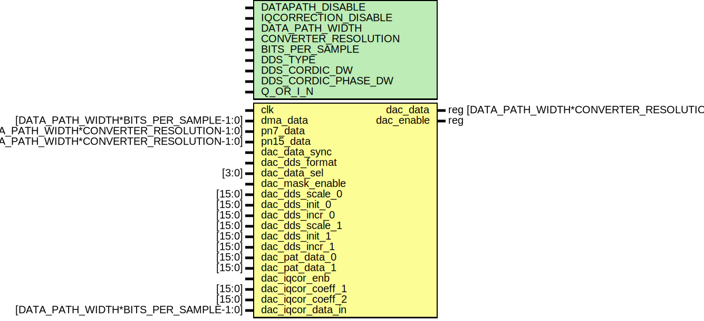

# Entity: ad_ip_jesd204_tpl_dac_channel

- **File**: ad_ip_jesd204_tpl_dac_channel.v
## Diagram

## Description

 ***************************************************************************
 ***************************************************************************
 Copyright 2018 (c) Analog Devices, Inc. All rights reserved.

 Each core or library found in this collection may have its own licensing terms.
 The user should keep this in in mind while exploring these cores.

 Redistribution and use in source and binary forms,
 with or without modification of this file, are permitted under the terms of either
  (at the option of the user):

   1. The GNU General Public License version 2 as published by the
      Free Software Foundation, which can be found in the top level directory, or at:
 https://www.gnu.org/licenses/old-licenses/gpl-2.0.en.html

 OR

   2.  An ADI specific BSD license as noted in the top level directory, or on-line at:
 https://github.com/analogdevicesinc/hdl/blob/dev/LICENSE

 ***************************************************************************
 ***************************************************************************

## Generics

| Generic name         | Type | Value | Description |
| -------------------- | ---- | ----- | ----------- |
| DATAPATH_DISABLE     |      | 0     |             |
| IQCORRECTION_DISABLE |      | 1     |             |
| DATA_PATH_WIDTH      |      | 4     |             |
| CONVERTER_RESOLUTION |      | 16    |             |
| BITS_PER_SAMPLE      |      | 16    |             |
| DDS_TYPE             |      | 1     |             |
| DDS_CORDIC_DW        |      | 16    |             |
| DDS_CORDIC_PHASE_DW  |      | 16    |             |
| Q_OR_I_N             |      | 0     |             |
## Ports

| Port name         | Direction | Type                                           | Description    |
| ----------------- | --------- | ---------------------------------------------- | -------------- |
| clk               | input     |                                                |  dac interface |
| dma_data          | input     | [DATA_PATH_WIDTH*BITS_PER_SAMPLE-1:0]          |                |
| dac_data          | output    | reg [DATA_PATH_WIDTH*CONVERTER_RESOLUTION-1:0] |                |
| pn7_data          | input     | [DATA_PATH_WIDTH*CONVERTER_RESOLUTION-1:0]     |  PN data       |
| pn15_data         | input     | [DATA_PATH_WIDTH*CONVERTER_RESOLUTION-1:0]     |                |
| dac_data_sync     | input     |                                                |  Configuration |
| dac_dds_format    | input     |                                                |                |
| dac_data_sel      | input     | [3:0]                                          |                |
| dac_mask_enable   | input     |                                                |                |
| dac_dds_scale_0   | input     | [15:0]                                         |                |
| dac_dds_init_0    | input     | [15:0]                                         |                |
| dac_dds_incr_0    | input     | [15:0]                                         |                |
| dac_dds_scale_1   | input     | [15:0]                                         |                |
| dac_dds_init_1    | input     | [15:0]                                         |                |
| dac_dds_incr_1    | input     | [15:0]                                         |                |
| dac_pat_data_0    | input     | [15:0]                                         |                |
| dac_pat_data_1    | input     | [15:0]                                         |                |
| dac_iqcor_enb     | input     |                                                |                |
| dac_iqcor_coeff_1 | input     | [15:0]                                         |                |
| dac_iqcor_coeff_2 | input     | [15:0]                                         |                |
| dac_iqcor_data_in | input     | [DATA_PATH_WIDTH*BITS_PER_SAMPLE-1:0]          |                |
| dac_enable        | output    | reg                                            |                |
## Signals

| Name             | Type                          | Description        |
| ---------------- | ----------------------------- | ------------------ |
| dac_dds_data_s   | wire [CHANNEL_DATA_WIDTH-1:0] |  internal signals  |
| dac_dma_data_s   | wire [CHANNEL_DATA_WIDTH-1:0] |                    |
| dac_pat_data_s   | wire [CHANNEL_DATA_WIDTH-1:0] |                    |
| dac_iqcor_data_s | wire [CHANNEL_DATA_WIDTH-1:0] |                    |
## Constants

| Name               | Type | Value                | Description |
| ------------------ | ---- | -------------------- | ----------- |
| CR                 |      | CONVERTER_RESOLUTION |             |
| CHANNEL_DATA_WIDTH |      | DATA_PATH_WIDTH * CR |             |
## Processes
- unnamed: ( @(posedge clk) )
  - **Type:** always
**Description**
 dac data select 
## Instantiations

- i_ad_iqcor: ad_iqcor
- i_dds: ad_dds
**Description**
 dds

