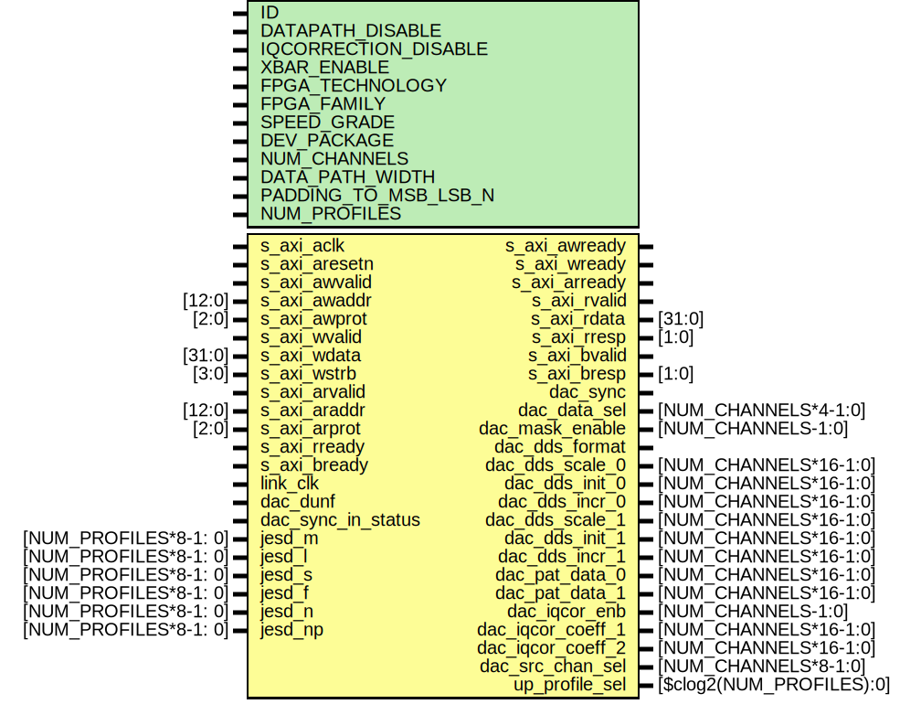

# Entity: ad_ip_jesd204_tpl_dac_regmap

- **File**: ad_ip_jesd204_tpl_dac_regmap.v
## Diagram

## Description

***************************************************************************
 ***************************************************************************
 Copyright 2018 (c) Analog Devices, Inc. All rights reserved.
 Each core or library found in this collection may have its own licensing terms.
 The user should keep this in in mind while exploring these cores.
 Redistribution and use in source and binary forms,
 with or without modification of this file, are permitted under the terms of either
  (at the option of the user):
   1. The GNU General Public License version 2 as published by the
      Free Software Foundation, which can be found in the top level directory, or at:
 https://www.gnu.org/licenses/old-licenses/gpl-2.0.en.html
 OR
   2.  An ADI specific BSD license as noted in the top level directory, or on-line at:
 https://github.com/analogdevicesinc/hdl/blob/dev/LICENSE
 ***************************************************************************
 ***************************************************************************
 
## Generics

| Generic name         | Type | Value | Description                       |
| -------------------- | ---- | ----- | --------------------------------- |
| ID                   |      | 0     |                                   |
| DATAPATH_DISABLE     |      | 0     |                                   |
| IQCORRECTION_DISABLE |      | 1     |                                   |
| XBAR_ENABLE          |      | 0     |                                   |
| FPGA_TECHNOLOGY      |      | 0     |                                   |
| FPGA_FAMILY          |      | 0     |                                   |
| SPEED_GRADE          |      | 0     |                                   |
| DEV_PACKAGE          |      | 0     |                                   |
| NUM_CHANNELS         |      | 2     |                                   |
| DATA_PATH_WIDTH      |      | 16    |                                   |
| PADDING_TO_MSB_LSB_N |      | 0     |                                   |
| NUM_PROFILES         |      | 1     | Number of supported JESD profiles |
## Ports

| Port name          | Direction | Type                     | Description      |
| ------------------ | --------- | ------------------------ | ---------------- |
| s_axi_aclk         | input     |                          |                  |
| s_axi_aresetn      | input     |                          |                  |
| s_axi_awvalid      | input     |                          |                  |
| s_axi_awready      | output    |                          |                  |
| s_axi_awaddr       | input     | [12:0]                   |                  |
| s_axi_awprot       | input     | [2:0]                    |                  |
| s_axi_wvalid       | input     |                          |                  |
| s_axi_wready       | output    |                          |                  |
| s_axi_wdata        | input     | [31:0]                   |                  |
| s_axi_wstrb        | input     | [3:0]                    |                  |
| s_axi_arvalid      | input     |                          |                  |
| s_axi_arready      | output    |                          |                  |
| s_axi_araddr       | input     | [12:0]                   |                  |
| s_axi_arprot       | input     | [2:0]                    |                  |
| s_axi_rvalid       | output    |                          |                  |
| s_axi_rready       | input     |                          |                  |
| s_axi_rdata        | output    | [31:0]                   |                  |
| s_axi_rresp        | output    | [1:0]                    |                  |
| s_axi_bvalid       | output    |                          |                  |
| s_axi_bready       | input     |                          |                  |
| s_axi_bresp        | output    | [1:0]                    |                  |
| link_clk           | input     |                          |                  |
| dac_dunf           | input     |                          |                  |
| dac_sync           | output    |                          |                  |
| dac_sync_in_status | input     |                          |                  |
| dac_data_sel       | output    | [NUM_CHANNELS*4-1:0]     |                  |
| dac_mask_enable    | output    | [NUM_CHANNELS-1:0]       |                  |
| dac_dds_format     | output    |                          |                  |
| dac_dds_scale_0    | output    | [NUM_CHANNELS*16-1:0]    |                  |
| dac_dds_init_0     | output    | [NUM_CHANNELS*16-1:0]    |                  |
| dac_dds_incr_0     | output    | [NUM_CHANNELS*16-1:0]    |                  |
| dac_dds_scale_1    | output    | [NUM_CHANNELS*16-1:0]    |                  |
| dac_dds_init_1     | output    | [NUM_CHANNELS*16-1:0]    |                  |
| dac_dds_incr_1     | output    | [NUM_CHANNELS*16-1:0]    |                  |
| dac_pat_data_0     | output    | [NUM_CHANNELS*16-1:0]    |                  |
| dac_pat_data_1     | output    | [NUM_CHANNELS*16-1:0]    |                  |
| dac_iqcor_enb      | output    | [NUM_CHANNELS-1:0]       |                  |
| dac_iqcor_coeff_1  | output    | [NUM_CHANNELS*16-1:0]    |                  |
| dac_iqcor_coeff_2  | output    | [NUM_CHANNELS*16-1:0]    |                  |
| dac_src_chan_sel   | output    | [NUM_CHANNELS*8-1:0]     |                  |
| jesd_m             | input     | [NUM_PROFILES*8-1: 0]    | Framer interface |
| jesd_l             | input     | [NUM_PROFILES*8-1: 0]    |                  |
| jesd_s             | input     | [NUM_PROFILES*8-1: 0]    |                  |
| jesd_f             | input     | [NUM_PROFILES*8-1: 0]    |                  |
| jesd_n             | input     | [NUM_PROFILES*8-1: 0]    |                  |
| jesd_np            | input     | [NUM_PROFILES*8-1: 0]    |                  |
| up_profile_sel     | output    | [$clog2(NUM_PROFILES):0] |                  |
## Signals

| Name         | Type                    | Description                 |
| ------------ | ----------------------- | --------------------------- |
| up_wack      | reg                     | internal registers          |
| up_rack      | reg                     |                             |
| up_rdata     | reg [31:0]              |                             |
| up_rdata_all | reg [31:0]              |                             |
| up_wreq_s    | wire                    |                             |
| up_waddr_s   | wire [10:0]             |                             |
| up_wdata_s   | wire [31:0]             |                             |
| up_wack_s    | wire [NUM_CHANNELS+1:0] |                             |
| up_rreq_s    | wire                    |                             |
| up_raddr_s   | wire [10:0]             |                             |
| up_rdata_s   | wire [31:0]             |                             |
| up_rack_s    | wire [NUM_CHANNELS+1:0] |                             |
| up_clk       | wire                    | internal clocks and resets  |
| up_rstn      | wire                    |                             |
| dac_rst      | wire                    |                             |
| n            | integer                 |                             |
## Constants

| Name               | Type | Value     | Description |
| ------------------ | ---- | --------- | ----------- |
| CONFIG             |      |           |             |
| link_clk           |      | undefined |             |
| dac_rst            |      | undefined |             |
| dac_sync           |      | undefined |             |
| dac_sync_in_status |      | undefined |             |
| dac_frame          |      | undefined |             |
| dac_clksel         |      | undefined |             |
| dac_par_type       |      | undefined |             |
| dac_par_enb        |      | undefined |             |
| dac_r1_mode        |      | undefined |             |
| dac_dds_format     |      | undefined |             |
| dac_datarate       |      | undefined |             |
| dac_status         |      | undefined |             |
| dac_dunf           |      | undefined |             |
| DATA_PATH_WIDTH    |      | undefined |             |
| up_drp_sel         |      | undefined |             |
| up_drp_wr          |      | undefined |             |
| up_drp_addr        |      | undefined |             |
| up_drp_wdata       |      | undefined |             |
| d0                 |      | undefined |             |
| d0                 |      | undefined |             |
| d1                 |      | undefined |             |
| up_usr_chanmax     |      | undefined |             |
| NUM_CHANNELS       |      | undefined |             |
| d0                 |      | undefined |             |
| up_dac_gpio_out    |      | undefined |             |
| up_dac_ce          |      | undefined |             |
| h00                |      | undefined |             |
| up_pps_status      |      | undefined |             |
| up_pps_irq_mask    |      | undefined |             |
| up_clk             |      | undefined |             |
| up_rstn            |      | undefined |             |
| up_wreq_s          |      | undefined |             |
| up_waddr           |      | undefined |             |
| up_waddr_s         |      | undefined |             |
| up_wdata_s         |      | undefined |             |
| up_wack_s          |      | undefined |             |
| up_rreq_s          |      | undefined |             |
| up_raddr           |      | undefined |             |
| up_raddr_s         |      | undefined |             |
| up_rdata_s         |      | undefined |             |
| up_rack_s          |      | undefined |             |
## Processes
- unnamed: ( @(*) )
- unnamed: ( @(posedge up_clk) )
## Instantiations

- i_up_axi: up_axi
**Description**
up bus interface

- i_up_tpl_dac: up_tpl_common
