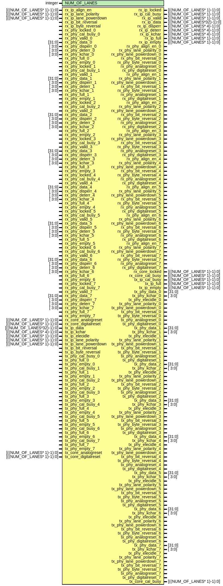

# Entity: avl_adxphy

## Diagram

## Description

***************************************************************************
 ***************************************************************************
 Copyright 2014 - 2017 (c) Analog Devices, Inc. All rights reserved.
 In this HDL repository, there are many different and unique modules, consisting
 of various HDL (Verilog or VHDL) components. The individual modules are
 developed independently, and may be accompanied by separate and unique license
 terms.
 The user should read each of these license terms, and understand the
 freedoms and responsibilities that he or she has by using this source/core.
 This core is distributed in the hope that it will be useful, but WITHOUT ANY
 WARRANTY; without even the implied warranty of MERCHANTABILITY or FITNESS FOR
 A PARTICULAR PURPOSE.
 Redistribution and use of source or resulting binaries, with or without modification
 of this file, are permitted under one of the following two license terms:
   1. The GNU General Public License version 2 as published by the
      Free Software Foundation, which can be found in the top level directory
      of this repository (LICENSE_GPL2), and also online at:
      <https://www.gnu.org/licenses/old-licenses/gpl-2.0.html>
 OR
   2. An ADI specific BSD license, which can be found in the top level directory
      of this repository (LICENSE_ADIBSD), and also on-line at:
      https://github.com/analogdevicesinc/hdl/blob/master/LICENSE_ADIBSD
      This will allow to generate bit files and not release the source code,
      as long as it attaches to an ADI device.
 ***************************************************************************
 ***************************************************************************
 AUTO GENERATED BY avl_adxphy.pl, DO NOT MODIFY!
 
## Generics

| Generic name | Type    | Value | Description |
| ------------ | ------- | ----- | ----------- |
| NUM_OF_LANES | integer | 4     | parameters  |
## Ports

| Port name               | Direction | Type                      | Description         |
| ----------------------- | --------- | ------------------------- | ------------------- |
| rx_ip_locked            | output    | [((NUM_OF_LANES* 1)-1):0] | rx-ip interface     |
| rx_ip_cal_busy          | output    | [((NUM_OF_LANES* 1)-1):0] |                     |
| rx_ip_valid             | output    | [((NUM_OF_LANES* 1)-1):0] |                     |
| rx_ip_data              | output    | [((NUM_OF_LANES*32)-1):0] |                     |
| rx_ip_disperr           | output    | [((NUM_OF_LANES* 4)-1):0] |                     |
| rx_ip_deterr            | output    | [((NUM_OF_LANES* 4)-1):0] |                     |
| rx_ip_kchar             | output    | [((NUM_OF_LANES* 4)-1):0] |                     |
| rx_ip_full              | output    | [((NUM_OF_LANES* 1)-1):0] |                     |
| rx_ip_empty             | output    | [((NUM_OF_LANES* 1)-1):0] |                     |
| rx_ip_align_en          | input     | [((NUM_OF_LANES* 1)-1):0] |                     |
| rx_ip_lane_polarity     | input     | [((NUM_OF_LANES* 1)-1):0] |                     |
| rx_ip_lane_powerdown    | input     | [((NUM_OF_LANES* 1)-1):0] |                     |
| rx_ip_bit_reversal      | input     |                           |                     |
| rx_ip_byte_reversal     | input     |                           |                     |
| rx_phy_locked_0         | input     |                           | rx-phy interface(s) |
| rx_phy_cal_busy_0       | input     |                           |                     |
| rx_phy_valid_0          | input     |                           |                     |
| rx_phy_data_0           | input     | [31:0]                    |                     |
| rx_phy_disperr_0        | input     | [ 3:0]                    |                     |
| rx_phy_deterr_0         | input     | [ 3:0]                    |                     |
| rx_phy_kchar_0          | input     | [ 3:0]                    |                     |
| rx_phy_full_0           | input     |                           |                     |
| rx_phy_empty_0          | input     |                           |                     |
| rx_phy_align_en_0       | output    |                           |                     |
| rx_phy_lane_polarity_0  | output    |                           |                     |
| rx_phy_lane_powerdown_0 | output    |                           |                     |
| rx_phy_bit_reversal_0   | output    |                           |                     |
| rx_phy_byte_reversal_0  | output    |                           |                     |
| rx_phy_analogreset_0    | output    |                           |                     |
| rx_phy_digitalreset_0   | output    |                           |                     |
| rx_phy_locked_1         | input     |                           |                     |
| rx_phy_cal_busy_1       | input     |                           |                     |
| rx_phy_valid_1          | input     |                           |                     |
| rx_phy_data_1           | input     | [31:0]                    |                     |
| rx_phy_disperr_1        | input     | [ 3:0]                    |                     |
| rx_phy_deterr_1         | input     | [ 3:0]                    |                     |
| rx_phy_kchar_1          | input     | [ 3:0]                    |                     |
| rx_phy_full_1           | input     |                           |                     |
| rx_phy_empty_1          | input     |                           |                     |
| rx_phy_align_en_1       | output    |                           |                     |
| rx_phy_lane_polarity_1  | output    |                           |                     |
| rx_phy_lane_powerdown_1 | output    |                           |                     |
| rx_phy_bit_reversal_1   | output    |                           |                     |
| rx_phy_byte_reversal_1  | output    |                           |                     |
| rx_phy_analogreset_1    | output    |                           |                     |
| rx_phy_digitalreset_1   | output    |                           |                     |
| rx_phy_locked_2         | input     |                           |                     |
| rx_phy_cal_busy_2       | input     |                           |                     |
| rx_phy_valid_2          | input     |                           |                     |
| rx_phy_data_2           | input     | [31:0]                    |                     |
| rx_phy_disperr_2        | input     | [ 3:0]                    |                     |
| rx_phy_deterr_2         | input     | [ 3:0]                    |                     |
| rx_phy_kchar_2          | input     | [ 3:0]                    |                     |
| rx_phy_full_2           | input     |                           |                     |
| rx_phy_empty_2          | input     |                           |                     |
| rx_phy_align_en_2       | output    |                           |                     |
| rx_phy_lane_polarity_2  | output    |                           |                     |
| rx_phy_lane_powerdown_2 | output    |                           |                     |
| rx_phy_bit_reversal_2   | output    |                           |                     |
| rx_phy_byte_reversal_2  | output    |                           |                     |
| rx_phy_analogreset_2    | output    |                           |                     |
| rx_phy_digitalreset_2   | output    |                           |                     |
| rx_phy_locked_3         | input     |                           |                     |
| rx_phy_cal_busy_3       | input     |                           |                     |
| rx_phy_valid_3          | input     |                           |                     |
| rx_phy_data_3           | input     | [31:0]                    |                     |
| rx_phy_disperr_3        | input     | [ 3:0]                    |                     |
| rx_phy_deterr_3         | input     | [ 3:0]                    |                     |
| rx_phy_kchar_3          | input     | [ 3:0]                    |                     |
| rx_phy_full_3           | input     |                           |                     |
| rx_phy_empty_3          | input     |                           |                     |
| rx_phy_align_en_3       | output    |                           |                     |
| rx_phy_lane_polarity_3  | output    |                           |                     |
| rx_phy_lane_powerdown_3 | output    |                           |                     |
| rx_phy_bit_reversal_3   | output    |                           |                     |
| rx_phy_byte_reversal_3  | output    |                           |                     |
| rx_phy_analogreset_3    | output    |                           |                     |
| rx_phy_digitalreset_3   | output    |                           |                     |
| rx_phy_locked_4         | input     |                           |                     |
| rx_phy_cal_busy_4       | input     |                           |                     |
| rx_phy_valid_4          | input     |                           |                     |
| rx_phy_data_4           | input     | [31:0]                    |                     |
| rx_phy_disperr_4        | input     | [ 3:0]                    |                     |
| rx_phy_deterr_4         | input     | [ 3:0]                    |                     |
| rx_phy_kchar_4          | input     | [ 3:0]                    |                     |
| rx_phy_full_4           | input     |                           |                     |
| rx_phy_empty_4          | input     |                           |                     |
| rx_phy_align_en_4       | output    |                           |                     |
| rx_phy_lane_polarity_4  | output    |                           |                     |
| rx_phy_lane_powerdown_4 | output    |                           |                     |
| rx_phy_bit_reversal_4   | output    |                           |                     |
| rx_phy_byte_reversal_4  | output    |                           |                     |
| rx_phy_analogreset_4    | output    |                           |                     |
| rx_phy_digitalreset_4   | output    |                           |                     |
| rx_phy_locked_5         | input     |                           |                     |
| rx_phy_cal_busy_5       | input     |                           |                     |
| rx_phy_valid_5          | input     |                           |                     |
| rx_phy_data_5           | input     | [31:0]                    |                     |
| rx_phy_disperr_5        | input     | [ 3:0]                    |                     |
| rx_phy_deterr_5         | input     | [ 3:0]                    |                     |
| rx_phy_kchar_5          | input     | [ 3:0]                    |                     |
| rx_phy_full_5           | input     |                           |                     |
| rx_phy_empty_5          | input     |                           |                     |
| rx_phy_align_en_5       | output    |                           |                     |
| rx_phy_lane_polarity_5  | output    |                           |                     |
| rx_phy_lane_powerdown_5 | output    |                           |                     |
| rx_phy_bit_reversal_5   | output    |                           |                     |
| rx_phy_byte_reversal_5  | output    |                           |                     |
| rx_phy_analogreset_5    | output    |                           |                     |
| rx_phy_digitalreset_5   | output    |                           |                     |
| rx_phy_locked_6         | input     |                           |                     |
| rx_phy_cal_busy_6       | input     |                           |                     |
| rx_phy_valid_6          | input     |                           |                     |
| rx_phy_data_6           | input     | [31:0]                    |                     |
| rx_phy_disperr_6        | input     | [ 3:0]                    |                     |
| rx_phy_deterr_6         | input     | [ 3:0]                    |                     |
| rx_phy_kchar_6          | input     | [ 3:0]                    |                     |
| rx_phy_full_6           | input     |                           |                     |
| rx_phy_empty_6          | input     |                           |                     |
| rx_phy_align_en_6       | output    |                           |                     |
| rx_phy_lane_polarity_6  | output    |                           |                     |
| rx_phy_lane_powerdown_6 | output    |                           |                     |
| rx_phy_bit_reversal_6   | output    |                           |                     |
| rx_phy_byte_reversal_6  | output    |                           |                     |
| rx_phy_analogreset_6    | output    |                           |                     |
| rx_phy_digitalreset_6   | output    |                           |                     |
| rx_phy_locked_7         | input     |                           |                     |
| rx_phy_cal_busy_7       | input     |                           |                     |
| rx_phy_valid_7          | input     |                           |                     |
| rx_phy_data_7           | input     | [31:0]                    |                     |
| rx_phy_disperr_7        | input     | [ 3:0]                    |                     |
| rx_phy_deterr_7         | input     | [ 3:0]                    |                     |
| rx_phy_kchar_7          | input     | [ 3:0]                    |                     |
| rx_phy_full_7           | input     |                           |                     |
| rx_phy_empty_7          | input     |                           |                     |
| rx_phy_align_en_7       | output    |                           |                     |
| rx_phy_lane_polarity_7  | output    |                           |                     |
| rx_phy_lane_powerdown_7 | output    |                           |                     |
| rx_phy_bit_reversal_7   | output    |                           |                     |
| rx_phy_byte_reversal_7  | output    |                           |                     |
| rx_phy_analogreset_7    | output    |                           |                     |
| rx_phy_digitalreset_7   | output    |                           |                     |
| rx_core_analogreset     | input     | [((NUM_OF_LANES* 1)-1):0] | rx-core interface   |
| rx_core_digitalreset    | input     | [((NUM_OF_LANES* 1)-1):0] |                     |
| rx_core_locked          | output    | [((NUM_OF_LANES* 1)-1):0] |                     |
| rx_core_cal_busy        | output    | [((NUM_OF_LANES* 1)-1):0] |                     |
| tx_ip_cal_busy          | output    | [((NUM_OF_LANES* 1)-1):0] | tx-ip interface     |
| tx_ip_full              | output    | [((NUM_OF_LANES* 1)-1):0] |                     |
| tx_ip_empty             | output    | [((NUM_OF_LANES* 1)-1):0] |                     |
| tx_ip_data              | input     | [((NUM_OF_LANES*32)-1):0] |                     |
| tx_ip_kchar             | input     | [((NUM_OF_LANES* 4)-1):0] |                     |
| tx_ip_elecidle          | input     | [((NUM_OF_LANES* 1)-1):0] |                     |
| tx_ip_lane_polarity     | input     | [((NUM_OF_LANES* 1)-1):0] |                     |
| tx_ip_lane_powerdown    | input     | [((NUM_OF_LANES* 1)-1):0] |                     |
| tx_ip_bit_reversal      | input     |                           |                     |
| tx_ip_byte_reversal     | input     |                           |                     |
| tx_phy_cal_busy_0       | input     |                           | tx-phy interface    |
| tx_phy_full_0           | input     |                           |                     |
| tx_phy_empty_0          | input     |                           |                     |
| tx_phy_data_0           | output    | [31:0]                    |                     |
| tx_phy_kchar_0          | output    | [ 3:0]                    |                     |
| tx_phy_elecidle_0       | output    |                           |                     |
| tx_phy_lane_polarity_0  | output    |                           |                     |
| tx_phy_lane_powerdown_0 | output    |                           |                     |
| tx_phy_bit_reversal_0   | output    |                           |                     |
| tx_phy_byte_reversal_0  | output    |                           |                     |
| tx_phy_analogreset_0    | output    |                           |                     |
| tx_phy_digitalreset_0   | output    |                           |                     |
| tx_phy_cal_busy_1       | input     |                           |                     |
| tx_phy_full_1           | input     |                           |                     |
| tx_phy_empty_1          | input     |                           |                     |
| tx_phy_data_1           | output    | [31:0]                    |                     |
| tx_phy_kchar_1          | output    | [ 3:0]                    |                     |
| tx_phy_elecidle_1       | output    |                           |                     |
| tx_phy_lane_polarity_1  | output    |                           |                     |
| tx_phy_lane_powerdown_1 | output    |                           |                     |
| tx_phy_bit_reversal_1   | output    |                           |                     |
| tx_phy_byte_reversal_1  | output    |                           |                     |
| tx_phy_analogreset_1    | output    |                           |                     |
| tx_phy_digitalreset_1   | output    |                           |                     |
| tx_phy_cal_busy_2       | input     |                           |                     |
| tx_phy_full_2           | input     |                           |                     |
| tx_phy_empty_2          | input     |                           |                     |
| tx_phy_data_2           | output    | [31:0]                    |                     |
| tx_phy_kchar_2          | output    | [ 3:0]                    |                     |
| tx_phy_elecidle_2       | output    |                           |                     |
| tx_phy_lane_polarity_2  | output    |                           |                     |
| tx_phy_lane_powerdown_2 | output    |                           |                     |
| tx_phy_bit_reversal_2   | output    |                           |                     |
| tx_phy_byte_reversal_2  | output    |                           |                     |
| tx_phy_analogreset_2    | output    |                           |                     |
| tx_phy_digitalreset_2   | output    |                           |                     |
| tx_phy_cal_busy_3       | input     |                           |                     |
| tx_phy_full_3           | input     |                           |                     |
| tx_phy_empty_3          | input     |                           |                     |
| tx_phy_data_3           | output    | [31:0]                    |                     |
| tx_phy_kchar_3          | output    | [ 3:0]                    |                     |
| tx_phy_elecidle_3       | output    |                           |                     |
| tx_phy_lane_polarity_3  | output    |                           |                     |
| tx_phy_lane_powerdown_3 | output    |                           |                     |
| tx_phy_bit_reversal_3   | output    |                           |                     |
| tx_phy_byte_reversal_3  | output    |                           |                     |
| tx_phy_analogreset_3    | output    |                           |                     |
| tx_phy_digitalreset_3   | output    |                           |                     |
| tx_phy_cal_busy_4       | input     |                           |                     |
| tx_phy_full_4           | input     |                           |                     |
| tx_phy_empty_4          | input     |                           |                     |
| tx_phy_data_4           | output    | [31:0]                    |                     |
| tx_phy_kchar_4          | output    | [ 3:0]                    |                     |
| tx_phy_elecidle_4       | output    |                           |                     |
| tx_phy_lane_polarity_4  | output    |                           |                     |
| tx_phy_lane_powerdown_4 | output    |                           |                     |
| tx_phy_bit_reversal_4   | output    |                           |                     |
| tx_phy_byte_reversal_4  | output    |                           |                     |
| tx_phy_analogreset_4    | output    |                           |                     |
| tx_phy_digitalreset_4   | output    |                           |                     |
| tx_phy_cal_busy_5       | input     |                           |                     |
| tx_phy_full_5           | input     |                           |                     |
| tx_phy_empty_5          | input     |                           |                     |
| tx_phy_data_5           | output    | [31:0]                    |                     |
| tx_phy_kchar_5          | output    | [ 3:0]                    |                     |
| tx_phy_elecidle_5       | output    |                           |                     |
| tx_phy_lane_polarity_5  | output    |                           |                     |
| tx_phy_lane_powerdown_5 | output    |                           |                     |
| tx_phy_bit_reversal_5   | output    |                           |                     |
| tx_phy_byte_reversal_5  | output    |                           |                     |
| tx_phy_analogreset_5    | output    |                           |                     |
| tx_phy_digitalreset_5   | output    |                           |                     |
| tx_phy_cal_busy_6       | input     |                           |                     |
| tx_phy_full_6           | input     |                           |                     |
| tx_phy_empty_6          | input     |                           |                     |
| tx_phy_data_6           | output    | [31:0]                    |                     |
| tx_phy_kchar_6          | output    | [ 3:0]                    |                     |
| tx_phy_elecidle_6       | output    |                           |                     |
| tx_phy_lane_polarity_6  | output    |                           |                     |
| tx_phy_lane_powerdown_6 | output    |                           |                     |
| tx_phy_bit_reversal_6   | output    |                           |                     |
| tx_phy_byte_reversal_6  | output    |                           |                     |
| tx_phy_analogreset_6    | output    |                           |                     |
| tx_phy_digitalreset_6   | output    |                           |                     |
| tx_phy_cal_busy_7       | input     |                           |                     |
| tx_phy_full_7           | input     |                           |                     |
| tx_phy_empty_7          | input     |                           |                     |
| tx_phy_data_7           | output    | [31:0]                    |                     |
| tx_phy_kchar_7          | output    | [ 3:0]                    |                     |
| tx_phy_elecidle_7       | output    |                           |                     |
| tx_phy_lane_polarity_7  | output    |                           |                     |
| tx_phy_lane_powerdown_7 | output    |                           |                     |
| tx_phy_bit_reversal_7   | output    |                           |                     |
| tx_phy_byte_reversal_7  | output    |                           |                     |
| tx_phy_analogreset_7    | output    |                           |                     |
| tx_phy_digitalreset_7   | output    |                           |                     |
| tx_core_analogreset     | input     | [((NUM_OF_LANES* 1)-1):0] | tx-core interface   |
| tx_core_digitalreset    | input     | [((NUM_OF_LANES* 1)-1):0] |                     |
| tx_core_cal_busy        | output    | [((NUM_OF_LANES* 1)-1):0] |                     |
