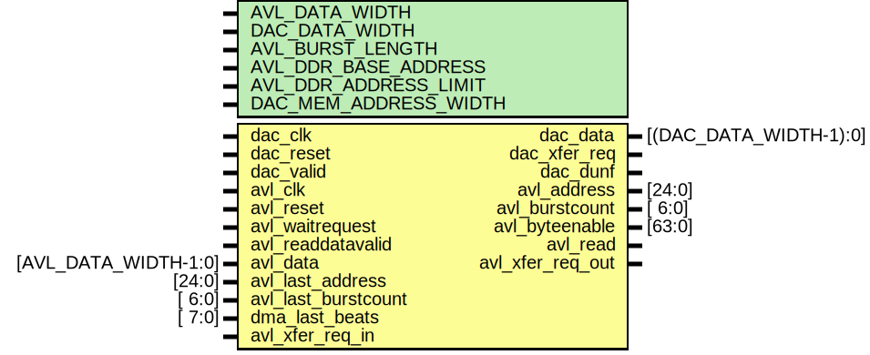
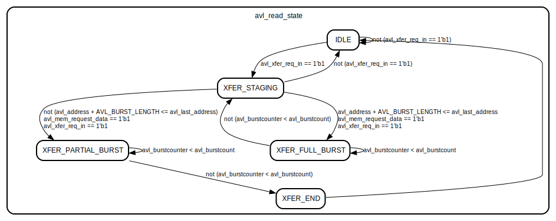

# Entity: avl_dacfifo_rd

## Diagram

## Description

***************************************************************************
 ***************************************************************************
 Copyright 2014 - 2017 (c) Analog Devices, Inc. All rights reserved.
 In this HDL repository, there are many different and unique modules, consisting
 of various HDL (Verilog or VHDL) components. The individual modules are
 developed independently, and may be accompanied by separate and unique license
 terms.
 The user should read each of these license terms, and understand the
 freedoms and responsibilities that he or she has by using this source/core.
 This core is distributed in the hope that it will be useful, but WITHOUT ANY
 WARRANTY; without even the implied warranty of MERCHANTABILITY or FITNESS FOR
 A PARTICULAR PURPOSE.
 Redistribution and use of source or resulting binaries, with or without modification
 of this file, are permitted under one of the following two license terms:
   1. The GNU General Public License version 2 as published by the
      Free Software Foundation, which can be found in the top level directory
      of this repository (LICENSE_GPL2), and also online at:
      <https://www.gnu.org/licenses/old-licenses/gpl-2.0.html>
 OR
   2. An ADI specific BSD license, which can be found in the top level directory
      of this repository (LICENSE_ADIBSD), and also on-line at:
      https://github.com/analogdevicesinc/hdl/blob/master/LICENSE_ADIBSD
      This will allow to generate bit files and not release the source code,
      as long as it attaches to an ADI device.
 ***************************************************************************
 ***************************************************************************
 
## Generics

| Generic name          | Type | Value    | Description |
| --------------------- | ---- | -------- | ----------- |
| AVL_DATA_WIDTH        |      | 512      |             |
| DAC_DATA_WIDTH        |      | 64       |             |
| AVL_BURST_LENGTH      |      | 127      |             |
| AVL_DDR_BASE_ADDRESS  |      | 0        |             |
| AVL_DDR_ADDRESS_LIMIT |      | 33554432 |             |
| DAC_MEM_ADDRESS_WIDTH |      | 8        |             |
## Ports

| Port name           | Direction | Type                   | Description |
| ------------------- | --------- | ---------------------- | ----------- |
| dac_clk             | input     |                        |             |
| dac_reset           | input     |                        |             |
| dac_valid           | input     |                        |             |
| dac_data            | output    | [(DAC_DATA_WIDTH-1):0] |             |
| dac_xfer_req        | output    |                        |             |
| dac_dunf            | output    |                        |             |
| avl_clk             | input     |                        |             |
| avl_reset           | input     |                        |             |
| avl_address         | output    | [24:0]                 |             |
| avl_burstcount      | output    | [ 6:0]                 |             |
| avl_byteenable      | output    | [63:0]                 |             |
| avl_waitrequest     | input     |                        |             |
| avl_readdatavalid   | input     |                        |             |
| avl_read            | output    |                        |             |
| avl_data            | input     | [AVL_DATA_WIDTH-1:0]   |             |
| avl_last_address    | input     | [24:0]                 |             |
| avl_last_burstcount | input     | [ 6:0]                 |             |
| dma_last_beats      | input     | [ 7:0]                 |             |
| avl_xfer_req_in     | input     |                        |             |
| avl_xfer_req_out    | output    |                        |             |
## Signals

| Name                   | Type                                    | Description        |
| ---------------------- | --------------------------------------- | ------------------ |
| avl_mem_waddr          | reg         [AVL_MEM_ADDRESS_WIDTH-1:0] | internal register  |
| avl_mem_laddr          | reg         [AVL_MEM_ADDRESS_WIDTH-1:0] |                    |
| avl_mem_laddr_toggle   | reg                                     |                    |
| avl_mem_waddr_g        | reg         [AVL_MEM_ADDRESS_WIDTH-1:0] |                    |
| avl_mem_raddr          | reg         [DAC_MEM_ADDRESS_WIDTH-1:0] |                    |
| avl_mem_raddr_m1       | reg         [DAC_MEM_ADDRESS_WIDTH-1:0] |                    |
| avl_mem_raddr_m2       | reg         [DAC_MEM_ADDRESS_WIDTH-1:0] |                    |
| avl_mem_request_data   | reg                                     |                    |
| avl_mem_addr_diff      | reg         [AVL_MEM_ADDRESS_WIDTH-1:0] |                    |
| avl_read_state         | reg         [ 4:0]                      |                    |
| avl_burstcounter       | reg         [ 7:0]                      |                    |
| avl_inread             | reg                                     |                    |
| dac_mem_waddr          | reg         [AVL_MEM_ADDRESS_WIDTH-1:0] |                    |
| dac_mem_waddr_m1       | reg         [AVL_MEM_ADDRESS_WIDTH-1:0] |                    |
| dac_mem_waddr_m2       | reg         [AVL_MEM_ADDRESS_WIDTH-1:0] |                    |
| dac_mem_laddr          | reg         [DAC_MEM_ADDRESS_WIDTH-1:0] |                    |
| dac_mem_raddr          | reg         [DAC_MEM_ADDRESS_WIDTH-1:0] |                    |
| dac_mem_raddr_g        | reg         [DAC_MEM_ADDRESS_WIDTH-1:0] |                    |
| dac_mem_addr_diff      | reg         [DAC_MEM_ADDRESS_WIDTH-1:0] |                    |
| dac_mem_laddr_waddr    | reg         [ 7:0]                      |                    |
| dac_mem_laddr_raddr    | reg         [ 7:0]                      |                    |
| dac_mem_laddr_valid    | reg                                     |                    |
| dac_avl_xfer_req       | reg                                     |                    |
| dac_avl_xfer_req_m1    | reg                                     |                    |
| dac_avl_xfer_req_m2    | reg                                     |                    |
| dac_dma_last_beats_m1  | reg         [ 7:0]                      |                    |
| dac_dma_last_beats_m2  | reg         [ 7:0]                      |                    |
| dac_dma_last_beats     | reg         [ 7:0]                      |                    |
| dac_mem_laddr_toggle_m | reg         [ 3:0]                      |                    |
| dac_mem_laddr_b        | reg         [DAC_MEM_ADDRESS_WIDTH-1:0] |                    |
| dac_mem_renable        | reg                                     |                    |
| dac_mem_valid          | reg                                     |                    |
| dac_xfer_req_d         | reg                                     |                    |
| avl_fifo_reset_s       | wire                                    | internal signals   |
| avl_mem_raddr_s        | wire [AVL_MEM_ADDRESS_WIDTH-1:0]        |                    |
| avl_mem_addr_diff_s    | wire [AVL_MEM_ADDRESS_WIDTH:0]          |                    |
| avl_mem_waddr_b2g_s    | wire [AVL_MEM_ADDRESS_WIDTH-1:0]        |                    |
| avl_mem_raddr_g2b_s    | wire [DAC_MEM_ADDRESS_WIDTH-1:0]        |                    |
| avl_mem_laddr_s        | wire [DAC_MEM_ADDRESS_WIDTH-1:0]        |                    |
| avl_read_int_s         | wire                                    |                    |
| avl_end_of_burst_s     | wire                                    |                    |
| dac_fifo_reset_s       | wire                                    |                    |
| dac_mem_addr_diff_s    | wire [DAC_MEM_ADDRESS_WIDTH:0]          |                    |
| dac_mem_waddr_s        | wire [DAC_MEM_ADDRESS_WIDTH-1:0]        |                    |
| dac_mem_waddr_g2b_s    | wire [AVL_MEM_ADDRESS_WIDTH-1:0]        |                    |
| dac_mem_raddr_b2g_s    | wire [DAC_MEM_ADDRESS_WIDTH-1:0]        |                    |
| dac_mem_data_s         | wire [DAC_DATA_WIDTH-1:0]               |                    |
| dac_mem_laddr_wea_s    | wire                                    |                    |
| dac_mem_laddr_rea_s    | wire                                    |                    |
| dac_mem_laddr_unf_s    | wire                                    |                    |
| dac_mem_laddr_s        | wire [DAC_MEM_ADDRESS_WIDTH-1:0]        |                    |
| dac_mem_dunf_s         | wire                                    |                    |
| else                   | end                                     |                    |
| dac_mem_raddr          | begin                                   |                    |
| dac_mem_raddr_b2g_s    | end                                     |                    |
| end                    | end                                     |                    |
## Constants

| Name                  | Type | Value                         | Description                    |
| --------------------- | ---- | ----------------------------- | ------------------------------ |
| MEM_RATIO             |      | AVL_DATA_WIDTH/DAC_DATA_WIDTH | Max supported MEM_RATIO is 16  |
| AVL_MEM_ADDRESS_WIDTH |      |                               |                                |
| XFER_STAGING          |      | 5'b00010                      |                                |
| XFER_FULL_BURST       |      | 5'b00100                      |                                |
| XFER_PARTIAL_BURST    |      | 5'b01000                      |                                |
| XFER_END              |      | 5'b10000                      |                                |
## Processes
- unnamed: ( @(posedge avl_clk) )
**Description**
loop back the avl_xfer_req to the WRITE module -- this way we can make
sure, that in case of a new DMA transfer, the last avalon read burst is
finished, so the upcomming avalon writes will not block the interface

- unnamed: ( @(posedge avl_clk) )
**Description**
FSM to generate the necessary Avalon Write transactions

- unnamed: ( @(posedge avl_clk) )
**Description**
Avalon address generation and read control signaling

- unnamed: ( @(posedge avl_clk) )
- unnamed: ( @(posedge avl_clk) )
**Description**
Avalon burstcounter

- unnamed: ( @(posedge avl_clk) )
**Description**
write data from Avalon interface into the async FIFO

- unnamed: ( @(posedge avl_clk) )
- unnamed: ( @(posedge dac_clk) )
- unnamed: ( @(posedge dac_clk) )
- unnamed: ( @(posedge dac_clk) )
- unnamed: ( @(posedge dac_clk) )
- unnamed: ( @(posedge dac_clk) )
- unnamed: ( @(posedge dac_clk) )
- unnamed: ( @(posedge dac_clk) )
- unnamed: ( @(posedge dac_clk) )
## Instantiations

- i_mem_asym: ad_mem_asym_rd
**Description**
An asymmetric memory to transfer data from Avalon interface to DAC
interface

- i_avl_mem_wr_addr_b2g: ad_b2g
- i_avl_mem_rd_addr_g2b: ad_g2b
- i_mem: ad_mem
- i_dac_mem_wr_addr_g2b: ad_g2b
- i_dac_mem_rd_addr_b2g: ad_b2g
## State machines

- FSM to generate the necessary Avalon Write transactions