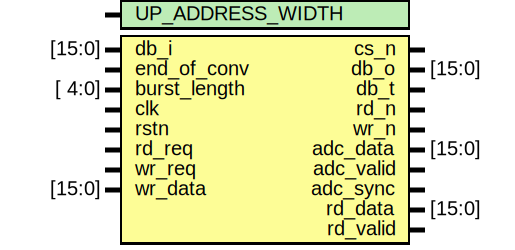

# Entity: axi_ad7616_pif

- **File**: axi_ad7616_pif.v
## Diagram

## Description

 ***************************************************************************
 ***************************************************************************
 Copyright 2014 - 2017 (c) Analog Devices, Inc. All rights reserved.

 In this HDL repository, there are many different and unique modules, consisting
 of various HDL (Verilog or VHDL) components. The individual modules are
 developed independently, and may be accompanied by separate and unique license
 terms.

 The user should read each of these license terms, and understand the
 freedoms and responsibilities that he or she has by using this source/core.

 This core is distributed in the hope that it will be useful, but WITHOUT ANY
 WARRANTY; without even the implied warranty of MERCHANTABILITY or FITNESS FOR
 A PARTICULAR PURPOSE.

 Redistribution and use of source or resulting binaries, with or without modification
 of this file, are permitted under one of the following two license terms:

   1. The GNU General Public License version 2 as published by the
      Free Software Foundation, which can be found in the top level directory
      of this repository (LICENSE_GPL2), and also online at:
      <https://www.gnu.org/licenses/old-licenses/gpl-2.0.html>

 OR

   2. An ADI specific BSD license, which can be found in the top level directory
      of this repository (LICENSE_ADIBSD), and also on-line at:
      https://github.com/analogdevicesinc/hdl/blob/master/LICENSE_ADIBSD
      This will allow to generate bit files and not release the source code,
      as long as it attaches to an ADI device.

 ***************************************************************************
 ***************************************************************************

## Generics

| Generic name     | Type | Value | Description |
| ---------------- | ---- | ----- | ----------- |
| UP_ADDRESS_WIDTH |      | 14    |             |
## Ports

| Port name    | Direction | Type   | Description         |
| ------------ | --------- | ------ | ------------------- |
| cs_n         | output    |        |  physical interface |
| db_o         | output    | [15:0] |                     |
| db_i         | input     | [15:0] |                     |
| db_t         | output    |        |                     |
| rd_n         | output    |        |                     |
| wr_n         | output    |        |                     |
| adc_data     | output    | [15:0] |  FIFO interface     |
| adc_valid    | output    |        |                     |
| adc_sync     | output    |        |                     |
| end_of_conv  | input     |        |  end of convertion  |
| burst_length | input     | [ 4:0] |                     |
| clk          | input     |        |  register access    |
| rstn         | input     |        |                     |
| rd_req       | input     |        |                     |
| wr_req       | input     |        |                     |
| wr_data      | input     | [15:0] |                     |
| rd_data      | output    | [15:0] |                     |
| rd_valid     | output    |        |                     |
## Signals

| Name                | Type           | Description          |
| ------------------- | -------------- | -------------------- |
| transfer_state      | reg     [ 2:0] |  internal registers  |
| transfer_state_next | reg     [ 2:0] |                      |
| width_counter       | reg     [ 1:0] |                      |
| burst_counter       | reg     [ 4:0] |                      |
| wr_req_d            | reg            |                      |
| rd_req_d            | reg            |                      |
| rd_conv_d           | reg            |                      |
| xfer_req_d          | reg            |                      |
| rd_valid_d          | reg            |                      |
| start_transfer_s    | wire           |  internal wires      |
| rd_valid_s          | wire           |                      |
## Constants

| Name        | Type   | Value | Description       |
| ----------- | ------ | ----- | ----------------- |
| IDLE        | [ 2:0] | 3'h0  |  state registers  |
| CS_LOW      | [ 2:0] | 3'h1  |  state registers  |
| CNTRL0_LOW  | [ 2:0] | 3'h2  |  state registers  |
| CNTRL0_HIGH | [ 2:0] | 3'h3  |  state registers  |
| CNTRL1_LOW  | [ 2:0] | 3'h4  |  state registers  |
| CNTRL1_HIGH | [ 2:0] | 3'h5  |  state registers  |
| CS_HIGH     | [ 2:0] | 3'h6  |  state registers  |
## Processes
- unnamed: ( @(posedge clk) )
  - **Type:** always
**Description**
 FSM state register 
- unnamed: ( @(posedge clk) )
  - **Type:** always
- unnamed: ( @(posedge clk) )
  - **Type:** always
- unnamed: ( @(negedge clk) )
  - **Type:** always
- unnamed: ( @(*) )
  - **Type:** always
**Description**
 FSM next state logic 
- unnamed: ( @(posedge clk) )
  - **Type:** always
- unnamed: ( @(posedge clk) )
  - **Type:** always
**Description**
 sync will be asserted at the first valid data right after the convertion start 
