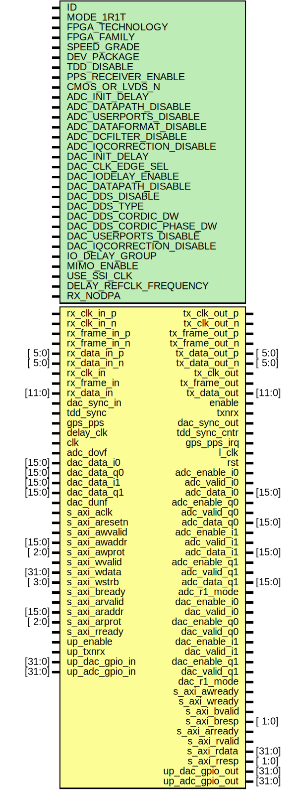

# Entity: axi_ad9361

## Diagram

## Description

***************************************************************************
 ***************************************************************************
 Copyright 2014 - 2017 (c) Analog Devices, Inc. All rights reserved.
 In this HDL repository, there are many different and unique modules, consisting
 of various HDL (Verilog or VHDL) components. The individual modules are
 developed independently, and may be accompanied by separate and unique license
 terms.
 The user should read each of these license terms, and understand the
 freedoms and responsibilities that he or she has by using this source/core.
 This core is distributed in the hope that it will be useful, but WITHOUT ANY
 WARRANTY; without even the implied warranty of MERCHANTABILITY or FITNESS FOR
 A PARTICULAR PURPOSE.
 Redistribution and use of source or resulting binaries, with or without modification
 of this file, are permitted under one of the following two license terms:
   1. The GNU General Public License version 2 as published by the
      Free Software Foundation, which can be found in the top level directory
      of this repository (LICENSE_GPL2), and also online at:
      <https://www.gnu.org/licenses/old-licenses/gpl-2.0.html>
 OR
   2. An ADI specific BSD license, which can be found in the top level directory
      of this repository (LICENSE_ADIBSD), and also on-line at:
      https://github.com/analogdevicesinc/hdl/blob/master/LICENSE_ADIBSD
      This will allow to generate bit files and not release the source code,
      as long as it attaches to an ADI device.
 ***************************************************************************
 ***************************************************************************
 
## Generics

| Generic name             | Type | Value                | Description |
| ------------------------ | ---- | -------------------- | ----------- |
| ID                       |      | 0                    | parameters  |
| MODE_1R1T                |      | 0                    |             |
| FPGA_TECHNOLOGY          |      | 0                    |             |
| FPGA_FAMILY              |      | 0                    |             |
| SPEED_GRADE              |      | 0                    |             |
| DEV_PACKAGE              |      | 0                    |             |
| TDD_DISABLE              |      | 0                    |             |
| PPS_RECEIVER_ENABLE      |      | 0                    |             |
| CMOS_OR_LVDS_N           |      | 0                    |             |
| ADC_INIT_DELAY           |      | 0                    |             |
| ADC_DATAPATH_DISABLE     |      | 0                    |             |
| ADC_USERPORTS_DISABLE    |      | 0                    |             |
| ADC_DATAFORMAT_DISABLE   |      | 0                    |             |
| ADC_DCFILTER_DISABLE     |      | 0                    |             |
| ADC_IQCORRECTION_DISABLE |      | 0                    |             |
| DAC_INIT_DELAY           |      | 0                    |             |
| DAC_CLK_EDGE_SEL         |      | 0                    |             |
| DAC_IODELAY_ENABLE       |      | 0                    |             |
| DAC_DATAPATH_DISABLE     |      | 0                    |             |
| DAC_DDS_DISABLE          |      | 0                    |             |
| DAC_DDS_TYPE             |      | 1                    |             |
| DAC_DDS_CORDIC_DW        |      | 14                   |             |
| DAC_DDS_CORDIC_PHASE_DW  |      | 13                   |             |
| DAC_USERPORTS_DISABLE    |      | 0                    |             |
| DAC_IQCORRECTION_DISABLE |      | 0                    |             |
| IO_DELAY_GROUP           |      | "dev_if_delay_group" |             |
| MIMO_ENABLE              |      | 0                    |             |
| USE_SSI_CLK              |      | 1                    |             |
| DELAY_REFCLK_FREQUENCY   |      | 200                  |             |
| RX_NODPA                 |      | 0                    |             |
## Ports

| Port name       | Direction | Type   | Description                        |
| --------------- | --------- | ------ | ---------------------------------- |
| rx_clk_in_p     | input     |        | physical interface (receive-lvds)  |
| rx_clk_in_n     | input     |        |                                    |
| rx_frame_in_p   | input     |        |                                    |
| rx_frame_in_n   | input     |        |                                    |
| rx_data_in_p    | input     | [ 5:0] |                                    |
| rx_data_in_n    | input     | [ 5:0] |                                    |
| rx_clk_in       | input     |        | physical interface (receive-cmos)  |
| rx_frame_in     | input     |        |                                    |
| rx_data_in      | input     | [11:0] |                                    |
| tx_clk_out_p    | output    |        | physical interface (transmit-lvds) |
| tx_clk_out_n    | output    |        |                                    |
| tx_frame_out_p  | output    |        |                                    |
| tx_frame_out_n  | output    |        |                                    |
| tx_data_out_p   | output    | [ 5:0] |                                    |
| tx_data_out_n   | output    | [ 5:0] |                                    |
| tx_clk_out      | output    |        | physical interface (transmit-cmos) |
| tx_frame_out    | output    |        |                                    |
| tx_data_out     | output    | [11:0] |                                    |
| enable          | output    |        | ensm control                       |
| txnrx           | output    |        |                                    |
| dac_sync_in     | input     |        | transmit master/slave              |
| dac_sync_out    | output    |        |                                    |
| tdd_sync        | input     |        | tdd sync                           |
| tdd_sync_cntr   | output    |        |                                    |
| gps_pps         | input     |        |                                    |
| gps_pps_irq     | output    |        |                                    |
| delay_clk       | input     |        | delay clock                        |
| l_clk           | output    |        | master interface                   |
| clk             | input     |        |                                    |
| rst             | output    |        |                                    |
| adc_enable_i0   | output    |        | dma interface                      |
| adc_valid_i0    | output    |        |                                    |
| adc_data_i0     | output    | [15:0] |                                    |
| adc_enable_q0   | output    |        |                                    |
| adc_valid_q0    | output    |        |                                    |
| adc_data_q0     | output    | [15:0] |                                    |
| adc_enable_i1   | output    |        |                                    |
| adc_valid_i1    | output    |        |                                    |
| adc_data_i1     | output    | [15:0] |                                    |
| adc_enable_q1   | output    |        |                                    |
| adc_valid_q1    | output    |        |                                    |
| adc_data_q1     | output    | [15:0] |                                    |
| adc_dovf        | input     |        |                                    |
| adc_r1_mode     | output    |        |                                    |
| dac_enable_i0   | output    |        |                                    |
| dac_valid_i0    | output    |        |                                    |
| dac_data_i0     | input     | [15:0] |                                    |
| dac_enable_q0   | output    |        |                                    |
| dac_valid_q0    | output    |        |                                    |
| dac_data_q0     | input     | [15:0] |                                    |
| dac_enable_i1   | output    |        |                                    |
| dac_valid_i1    | output    |        |                                    |
| dac_data_i1     | input     | [15:0] |                                    |
| dac_enable_q1   | output    |        |                                    |
| dac_valid_q1    | output    |        |                                    |
| dac_data_q1     | input     | [15:0] |                                    |
| dac_dunf        | input     |        |                                    |
| dac_r1_mode     | output    |        |                                    |
| s_axi_aclk      | input     |        | axi interface                      |
| s_axi_aresetn   | input     |        |                                    |
| s_axi_awvalid   | input     |        |                                    |
| s_axi_awaddr    | input     | [15:0] |                                    |
| s_axi_awprot    | input     | [ 2:0] |                                    |
| s_axi_awready   | output    |        |                                    |
| s_axi_wvalid    | input     |        |                                    |
| s_axi_wdata     | input     | [31:0] |                                    |
| s_axi_wstrb     | input     | [ 3:0] |                                    |
| s_axi_wready    | output    |        |                                    |
| s_axi_bvalid    | output    |        |                                    |
| s_axi_bresp     | output    | [ 1:0] |                                    |
| s_axi_bready    | input     |        |                                    |
| s_axi_arvalid   | input     |        |                                    |
| s_axi_araddr    | input     | [15:0] |                                    |
| s_axi_arprot    | input     | [ 2:0] |                                    |
| s_axi_arready   | output    |        |                                    |
| s_axi_rvalid    | output    |        |                                    |
| s_axi_rdata     | output    | [31:0] |                                    |
| s_axi_rresp     | output    | [ 1:0] |                                    |
| s_axi_rready    | input     |        |                                    |
| up_enable       | input     |        | gpio                               |
| up_txnrx        | input     |        |                                    |
| up_dac_gpio_in  | input     | [31:0] |                                    |
| up_dac_gpio_out | output    | [31:0] |                                    |
| up_adc_gpio_in  | input     | [31:0] |                                    |
| up_adc_gpio_out | output    | [31:0] |                                    |
## Signals

| Name                  | Type           | Description                 |
| --------------------- | -------------- | --------------------------- |
| adc_valid_i0_int      | reg            | internal registers          |
| adc_valid_q0_int      | reg            |                             |
| adc_valid_i1_int      | reg            |                             |
| adc_valid_q1_int      | reg            |                             |
| adc_data_i0_int       | reg     [15:0] |                             |
| adc_data_q0_int       | reg     [15:0] |                             |
| adc_data_i1_int       | reg     [15:0] |                             |
| adc_data_q1_int       | reg     [15:0] |                             |
| dac_valid_i0_int      | reg            |                             |
| dac_valid_q0_int      | reg            |                             |
| dac_valid_i1_int      | reg            |                             |
| dac_valid_q1_int      | reg            |                             |
| up_wack               | reg            |                             |
| up_rack               | reg            |                             |
| up_rdata              | reg     [31:0] |                             |
| up_clk                | wire           | internal clocks and resets  |
| up_rstn               | wire           |                             |
| mmcm_rst              | wire           |                             |
| delay_rst             | wire           |                             |
| adc_ddr_edgesel_s     | wire           | internal signals            |
| adc_valid_s           | wire           |                             |
| adc_valid_i0_s        | wire           |                             |
| adc_valid_q0_s        | wire           |                             |
| adc_valid_i1_s        | wire           |                             |
| adc_valid_q1_s        | wire           |                             |
| adc_data_i0_s         | wire [15:0]    |                             |
| adc_data_q0_s         | wire [15:0]    |                             |
| adc_data_i1_s         | wire [15:0]    |                             |
| adc_data_q1_s         | wire [15:0]    |                             |
| adc_data_s            | wire [47:0]    |                             |
| adc_status_s          | wire           |                             |
| dac_clksel_s          | wire           |                             |
| dac_valid_s           | wire           |                             |
| dac_data_s            | wire [47:0]    |                             |
| dac_valid_i0_s        | wire           |                             |
| dac_valid_q0_s        | wire           |                             |
| dac_valid_i1_s        | wire           |                             |
| dac_valid_q1_s        | wire           |                             |
| dac_data_i0_s         | wire           |                             |
| dac_data_q0_s         | wire           |                             |
| dac_data_i1_s         | wire           |                             |
| dac_data_q1_s         | wire           |                             |
| dac_sync_enable       | wire           |                             |
| up_adc_dld_s          | wire [12:0]    |                             |
| up_adc_dwdata_s       | wire [64:0]    |                             |
| up_adc_drdata_s       | wire [64:0]    |                             |
| up_dac_dld_s          | wire [15:0]    |                             |
| up_dac_dwdata_s       | wire [79:0]    |                             |
| up_dac_drdata_s       | wire [79:0]    |                             |
| delay_locked_s        | wire           |                             |
| up_wreq_s             | wire           |                             |
| up_waddr_s            | wire [13:0]    |                             |
| up_wdata_s            | wire [31:0]    |                             |
| up_wack_rx_s          | wire           |                             |
| up_wack_tx_s          | wire           |                             |
| up_rreq_s             | wire           |                             |
| up_raddr_s            | wire [13:0]    |                             |
| up_rdata_rx_s         | wire [31:0]    |                             |
| up_rack_rx_s          | wire           |                             |
| up_rdata_tx_s         | wire [31:0]    |                             |
| up_rack_tx_s          | wire           |                             |
| up_wack_tdd_s         | wire           |                             |
| up_rack_tdd_s         | wire           |                             |
| up_rdata_tdd_s        | wire [31:0]    |                             |
| tdd_enable_s          | wire           |                             |
| tdd_txnrx_s           | wire           |                             |
| tdd_mode_s            | wire           |                             |
| tdd_tx_valid_s        | wire           |                             |
| tdd_rx_valid_s        | wire           |                             |
| tdd_rx_vco_en_s       | wire           |                             |
| tdd_tx_vco_en_s       | wire           |                             |
| tdd_rx_rf_en_s        | wire           |                             |
| tdd_tx_rf_en_s        | wire           |                             |
| tdd_status_s          | wire [ 7:0]    |                             |
| up_drp_sel            | wire           |                             |
| up_drp_wr             | wire           |                             |
| up_drp_addr           | wire [11:0]    |                             |
| up_drp_wdata          | wire [31:0]    |                             |
| up_drp_rdata          | wire [31:0]    |                             |
| up_drp_ready          | wire           |                             |
| up_drp_locked         | wire           |                             |
| up_pps_rcounter_s     | wire [31:0]    |                             |
| up_pps_status_s       | wire           |                             |
| up_irq_mask_s         | wire           |                             |
| adc_up_pps_irq_mask_s | wire           |                             |
| dac_up_pps_irq_mask_s | wire           |                             |
## Constants

| Name                         | Type | Value                    | Description         |
| ---------------------------- | ---- | ------------------------ | ------------------- |
| ADC_USERPORTS_DISABLE_INT    |      | ADC_USERPORTS_DISABLE    | derived parameters  |
| ADC_DATAFORMAT_DISABLE_INT   |      | ADC_DATAFORMAT_DISABLE   |                     |
| ADC_DCFILTER_DISABLE_INT     |      | ADC_DCFILTER_DISABLE     |                     |
| ADC_IQCORRECTION_DISABLE_INT |      | ADC_IQCORRECTION_DISABLE |                     |
| DAC_DDS_DISABLE_INT          |      | DAC_DDS_DISABLE          |                     |
| DAC_USERPORTS_DISABLE_INT    |      | DAC_USERPORTS_DISABLE    |                     |
| DAC_DELAYCNTRL_DISABLE_INT   |      | undefined                |                     |
| DAC_IQCORRECTION_DISABLE_INT |      | DAC_IQCORRECTION_DISABLE |                     |
## Processes
- unnamed: ( @(negedge up_rstn or posedge up_clk) )
**Description**
processor read interface

- unnamed: ( @(posedge clk) )
- unnamed: ( @(posedge clk) )
- unnamed: ( @(posedge clk) )
## Instantiations

- i_rx: axi_ad9361_rx
**Description**
receive

- i_tx: axi_ad9361_tx
**Description**
transmit

- i_up_axi: up_axi
**Description**
axi interface

