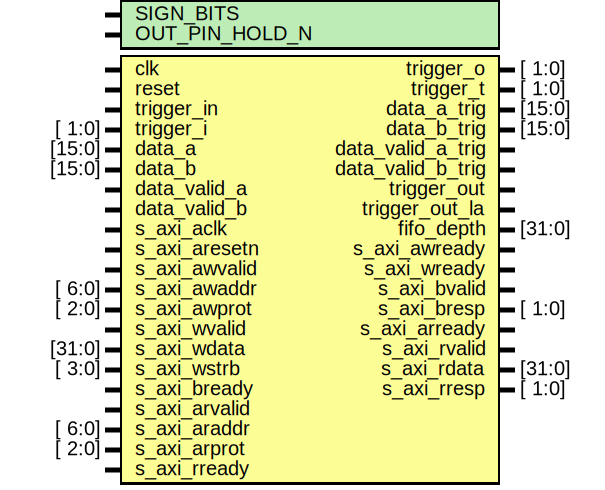

# Entity: axi_adc_trigger

- **File**: axi_adc_trigger.v
## Diagram

## Description

 ***************************************************************************
 ***************************************************************************
 Copyright 2014 - 2017 (c) Analog Devices, Inc. All rights reserved.

 In this HDL repository, there are many different and unique modules, consisting
 of various HDL (Verilog or VHDL) components. The individual modules are
 developed independently, and may be accompanied by separate and unique license
 terms.

 The user should read each of these license terms, and understand the
 freedoms and responsibilities that he or she has by using this source/core.

 This core is distributed in the hope that it will be useful, but WITHOUT ANY
 WARRANTY; without even the implied warranty of MERCHANTABILITY or FITNESS FOR
 A PARTICULAR PURPOSE.

 Redistribution and use of source or resulting binaries, with or without modification
 of this file, are permitted under one of the following two license terms:

   1. The GNU General Public License version 2 as published by the
      Free Software Foundation, which can be found in the top level directory
      of this repository (LICENSE_GPL2), and also online at:
      <https://www.gnu.org/licenses/old-licenses/gpl-2.0.html>

 OR

   2. An ADI specific BSD license, which can be found in the top level directory
      of this repository (LICENSE_ADIBSD), and also on-line at:
      https://github.com/analogdevicesinc/hdl/blob/master/LICENSE_ADIBSD
      This will allow to generate bit files and not release the source code,
      as long as it attaches to an ADI device.

 ***************************************************************************
 ***************************************************************************

## Generics

| Generic name   | Type | Value  | Description  |
| -------------- | ---- | ------ | ------------ |
| SIGN_BITS      |      | 2      |  parameters  |
| OUT_PIN_HOLD_N |      | 100000 |              |
## Ports

| Port name         | Direction | Type   | Description    |
| ----------------- | --------- | ------ | -------------- |
| clk               | input     |        |  interface     |
| reset             | input     |        |                |
| trigger_in        | input     |        |                |
| trigger_i         | input     | [ 1:0] |                |
| trigger_o         | output    | [ 1:0] |                |
| trigger_t         | output    | [ 1:0] |                |
| data_a            | input     | [15:0] |                |
| data_b            | input     | [15:0] |                |
| data_valid_a      | input     |        |                |
| data_valid_b      | input     |        |                |
| data_a_trig       | output    | [15:0] |                |
| data_b_trig       | output    | [15:0] |                |
| data_valid_a_trig | output    |        |                |
| data_valid_b_trig | output    |        |                |
| trigger_out       | output    |        |                |
| trigger_out_la    | output    |        |                |
| fifo_depth        | output    | [31:0] |                |
| s_axi_aclk        | input     |        |  axi interface |
| s_axi_aresetn     | input     |        |                |
| s_axi_awvalid     | input     |        |                |
| s_axi_awaddr      | input     | [ 6:0] |                |
| s_axi_awprot      | input     | [ 2:0] |                |
| s_axi_awready     | output    |        |                |
| s_axi_wvalid      | input     |        |                |
| s_axi_wdata       | input     | [31:0] |                |
| s_axi_wstrb       | input     | [ 3:0] |                |
| s_axi_wready      | output    |        |                |
| s_axi_bvalid      | output    |        |                |
| s_axi_bresp       | output    | [ 1:0] |                |
| s_axi_bready      | input     |        |                |
| s_axi_arvalid     | input     |        |                |
| s_axi_araddr      | input     | [ 6:0] |                |
| s_axi_arprot      | input     | [ 2:0] |                |
| s_axi_arready     | output    |        |                |
| s_axi_rvalid      | output    |        |                |
| s_axi_rdata       | output    | [31:0] |                |
| s_axi_rresp       | output    | [ 1:0] |                |
| s_axi_rready      | input     |        |                |
## Signals

| Name                    | Type              | Description                                               |
| ----------------------- | ----------------- | --------------------------------------------------------- |
| up_clk                  | wire              |  internal signals                                         |
| up_rstn                 | wire              |                                                           |
| up_waddr                | wire [ 4:0]       |                                                           |
| up_wdata                | wire [31:0]       |                                                           |
| up_wack                 | wire              |                                                           |
| up_wreq                 | wire              |                                                           |
| up_rack                 | wire              |                                                           |
| up_rdata                | wire [31:0]       |                                                           |
| up_rreq                 | wire              |                                                           |
| up_raddr                | wire [ 4:0]       |                                                           |
| io_selection            | wire [ 7:0]       |                                                           |
| low_level               | wire [ 1:0]       |                                                           |
| high_level              | wire [ 1:0]       |                                                           |
| any_edge                | wire [ 1:0]       |                                                           |
| rise_edge               | wire [ 1:0]       |                                                           |
| fall_edge               | wire [ 1:0]       |                                                           |
| limit_a                 | wire [15:0]       |                                                           |
| function_a              | wire [ 1:0]       |                                                           |
| hysteresis_a            | wire [31:0]       |                                                           |
| trigger_l_mix_a         | wire [ 3:0]       |                                                           |
| limit_b                 | wire [15:0]       |                                                           |
| function_b              | wire [ 1:0]       |                                                           |
| hysteresis_b            | wire [31:0]       |                                                           |
| trigger_l_mix_b         | wire [ 3:0]       |                                                           |
| trigger_out_control     | wire [16:0]       |                                                           |
| trigger_delay           | wire [31:0]       |                                                           |
| trigger_holdoff         | wire [31:0]       |                                                           |
| trigger_out_hold_pins   | wire [19:0]       |                                                           |
| data_a_cmp              | wire [DW:0]       |                                                           |
| data_b_cmp              | wire [DW:0]       |                                                           |
| limit_a_cmp             | wire [DW:0]       |                                                           |
| limit_b_cmp             | wire [DW:0]       |                                                           |
| comp_low_a_s            | wire              | signal is over the limit                                  |
| comp_low_b_s            | wire              | signal is over the limit                                  |
| trigger_a_fall_edge     | wire              |                                                           |
| trigger_a_rise_edge     | wire              |                                                           |
| trigger_b_fall_edge     | wire              |                                                           |
| trigger_b_rise_edge     | wire              |                                                           |
| trigger_a_any_edge      | wire              |                                                           |
| trigger_b_any_edge      | wire              |                                                           |
| trigger_out_delayed     | wire              |                                                           |
| trigger_up_o_s          | wire [ 1:0]       |                                                           |
| trigger_out_holdoff     | wire              |                                                           |
| holdoff_cnt_en          | wire              |                                                           |
| streaming               | wire              |                                                           |
| trigger_out_s           | wire              |                                                           |
| embedded_trigger        | wire              |                                                           |
| external_trigger        | wire              |                                                           |
| trigger_a_d1            | reg               | synchronization flip flop                                 |
| trigger_a_d2            | reg               | synchronization flip flop                                 |
| trigger_a_d3            | reg               |                                                           |
| trigger_b_d1            | reg               | synchronization flip flop                                 |
| trigger_b_d2            | reg               | synchronization flip flop                                 |
| trigger_b_d3            | reg               |                                                           |
| comp_high_a             | reg               | signal is over the limit                                  |
| old_comp_high_a         | reg               | t + 1 version of comp_high_a                              |
| hyst_high_limit_pass_a  | reg               | valid hysteresis range on passthrough high trigger limit  |
| hyst_low_limit_pass_a   | reg               | valid hysteresis range on passthrough low trigger limit   |
| hyst_a_high_limit       | reg signed [DW:0] |                                                           |
| hyst_a_low_limit        | reg signed [DW:0] |                                                           |
| comp_high_b             | reg               | signal is over the limit                                  |
| old_comp_high_b         | reg               | t + 1 version of comp_high_b                              |
| hyst_high_limit_pass_b  | reg               | valid hysteresis range on passthrough high trigger limit  |
| hyst_low_limit_pass_b   | reg               | valid hysteresis range on passthrough low trigger limit   |
| hyst_b_high_limit       | reg signed [DW:0] |                                                           |
| hyst_b_low_limit        | reg signed [DW:0] |                                                           |
| passthrough_high_a      | reg               | trigger when rising through the limit                     |
| passthrough_low_a       | reg               | trigger when fallingh thorugh the limit                   |
| passthrough_high_b      | reg               | trigger when rising through the limit                     |
| passthrough_low_b       | reg               | trigger when fallingh thorugh the limit                   |
| trigger_pin_a           | reg               |                                                           |
| trigger_pin_b           | reg               |                                                           |
| trigger_o_m             | reg        [ 1:0] |                                                           |
| trig_o_hold_0           | reg               |                                                           |
| trig_o_hold_1           | reg               |                                                           |
| trig_o_hold_cnt_0       | reg        [19:0] |                                                           |
| trig_o_hold_cnt_1       | reg        [19:0] |                                                           |
| trigger_adc_a           | reg               |                                                           |
| trigger_adc_b           | reg               |                                                           |
| trigger_a               | reg               |                                                           |
| trigger_b               | reg               |                                                           |
| trigger_out_mixed       | reg               |                                                           |
| up_triggered            | reg               |                                                           |
| up_triggered_d1         | reg               |                                                           |
| up_triggered_d2         | reg               |                                                           |
| up_triggered_set        | reg               |                                                           |
| up_triggered_reset      | reg               |                                                           |
| up_triggered_reset_d1   | reg               |                                                           |
| up_triggered_reset_d2   | reg               |                                                           |
| trigger_delay_counter   | reg        [31:0] |                                                           |
| trigger_holdoff_counter | reg        [31:0] |                                                           |
| triggered               | reg               |                                                           |
| trigger_out_m1          | reg               |                                                           |
| trigger_out_m2          | reg               |                                                           |
| streaming_on            | reg               |                                                           |
| trigger_out_hold        | reg               |                                                           |
| trigger_out_ack         | reg               |                                                           |
## Constants

| Name | Type | Value          | Description |
| ---- | ---- | -------------- | ----------- |
| DW   |      | 15 - SIGN_BITS |             |
## Processes
- unnamed: ( @(*) )
  - **Type:** always
- unnamed: ( @(posedge clk) )
  - **Type:** always
 **Description**
 External trigger output hold 100000 clock cycles(1ms) on polarity change.  All trigger signals that are to be outputted on the external trigger after a  trigger out is acknowledged by the hold counter will be disregarded for 1ms.  This was done to avoid noise created by high frequency switches on long  wires. 
- unnamed: ( @(posedge clk) )
  - **Type:** always
 **Description**
 1. keep data in sync with the trigger. The trigger bypasses the variable  fifo. The data goes through and it is delayed with 4 clock cycles)  2. For non max sample rate of the ADC, the trigger signal that originates  from an external source is stored until the valid acknowledges the trigger. 
- unnamed: ( @(posedge clk) )
  - **Type:** always
- unnamed: ( @(posedge clk) )
  - **Type:** always
 **Description**
 delay out trigger 
- unnamed: ( @(posedge clk) )
  - **Type:** always
- unnamed: ( @(posedge clk) )
  - **Type:** always
- unnamed: ( @(posedge clk) )
  - **Type:** always
- unnamed: ( @(posedge up_clk) )
  - **Type:** always
- unnamed: ( @(*) )
  - **Type:** always
- unnamed: ( @(*) )
  - **Type:** always
- unnamed: ( @(*) )
  - **Type:** always
- unnamed: ( @(*) )
  - **Type:** always
- unnamed: ( @(posedge clk) )
  - **Type:** always
- unnamed: ( @(*) )
  - **Type:** always
- unnamed: ( @(*) )
  - **Type:** always
- unnamed: ( @(*) )
  - **Type:** always
- unnamed: ( @(posedge clk) )
  - **Type:** always
- unnamed: ( @(posedge clk) )
  - **Type:** always
## Instantiations

- adc_trigger_registers: axi_adc_trigger_reg
- i_up_axi: up_axi
