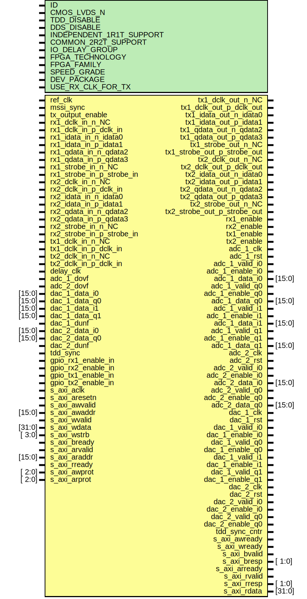

# Entity: axi_adrv9001

- **File**: axi_adrv9001.v
## Diagram

## Description

 ***************************************************************************
 ***************************************************************************
 Copyright 2014 - 2020 (c) Analog Devices, Inc. All rights reserved.

 In this HDL repository, there are many different and unique modules, consisting
 of various HDL (Verilog or VHDL) components. The individual modules are
 developed independently, and may be accompanied by separate and unique license
 terms.

 The user should read each of these license terms, and understand the
 freedoms and responsibilities that he or she has by using this source/core.

 This core is distributed in the hope that it will be useful, but WITHOUT ANY
 WARRANTY; without even the implied warranty of MERCHANTABILITY or FITNESS FOR
 A PARTICULAR PURPOSE.

 Redistribution and use of source or resulting binaries, with or without modification
 of this file, are permitted under one of the following two license terms:

   1. The GNU General Public License version 2 as published by the
      Free Software Foundation, which can be found in the top level directory
      of this repository (LICENSE_GPL2), and also online at:
      <https://www.gnu.org/licenses/old-licenses/gpl-2.0.html>

 OR

   2. An ADI specific BSD license, which can be found in the top level directory
      of this repository (LICENSE_ADIBSD), and also on-line at:
      https://github.com/analogdevicesinc/hdl/blob/master/LICENSE_ADIBSD
      This will allow to generate bit files and not release the source code,
      as long as it attaches to an ADI device.

 ***************************************************************************
 ***************************************************************************

## Generics

| Generic name             | Type | Value                | Description |
| ------------------------ | ---- | -------------------- | ----------- |
| ID                       |      | 0                    |             |
| CMOS_LVDS_N              |      | 0                    |             |
| TDD_DISABLE              |      | 0                    |             |
| DDS_DISABLE              |      | 0                    |             |
| INDEPENDENT_1R1T_SUPPORT |      | 1                    |             |
| COMMON_2R2T_SUPPORT      |      | 1                    |             |
| IO_DELAY_GROUP           |      | "dev_if_delay_group" |             |
| FPGA_TECHNOLOGY          |      | 0                    |             |
| FPGA_FAMILY              |      | 0                    |             |
| SPEED_GRADE              |      | 0                    |             |
| DEV_PACKAGE              |      | 0                    |             |
| USE_RX_CLK_FOR_TX        |      | 0                    |             |
## Ports

| Port name                   | Direction | Type   | Description         |
| --------------------------- | --------- | ------ | ------------------- |
| ref_clk                     | input     |        |                     |
| mssi_sync                   | input     |        |                     |
| tx_output_enable            | input     |        |                     |
| rx1_dclk_in_n_NC            | input     |        |  physical interface |
| rx1_dclk_in_p_dclk_in       | input     |        |                     |
| rx1_idata_in_n_idata0       | input     |        |                     |
| rx1_idata_in_p_idata1       | input     |        |                     |
| rx1_qdata_in_n_qdata2       | input     |        |                     |
| rx1_qdata_in_p_qdata3       | input     |        |                     |
| rx1_strobe_in_n_NC          | input     |        |                     |
| rx1_strobe_in_p_strobe_in   | input     |        |                     |
| rx2_dclk_in_n_NC            | input     |        |                     |
| rx2_dclk_in_p_dclk_in       | input     |        |                     |
| rx2_idata_in_n_idata0       | input     |        |                     |
| rx2_idata_in_p_idata1       | input     |        |                     |
| rx2_qdata_in_n_qdata2       | input     |        |                     |
| rx2_qdata_in_p_qdata3       | input     |        |                     |
| rx2_strobe_in_n_NC          | input     |        |                     |
| rx2_strobe_in_p_strobe_in   | input     |        |                     |
| tx1_dclk_out_n_NC           | output    |        |                     |
| tx1_dclk_out_p_dclk_out     | output    |        |                     |
| tx1_dclk_in_n_NC            | input     |        |                     |
| tx1_dclk_in_p_dclk_in       | input     |        |                     |
| tx1_idata_out_n_idata0      | output    |        |                     |
| tx1_idata_out_p_idata1      | output    |        |                     |
| tx1_qdata_out_n_qdata2      | output    |        |                     |
| tx1_qdata_out_p_qdata3      | output    |        |                     |
| tx1_strobe_out_n_NC         | output    |        |                     |
| tx1_strobe_out_p_strobe_out | output    |        |                     |
| tx2_dclk_out_n_NC           | output    |        |                     |
| tx2_dclk_out_p_dclk_out     | output    |        |                     |
| tx2_dclk_in_n_NC            | input     |        |                     |
| tx2_dclk_in_p_dclk_in       | input     |        |                     |
| tx2_idata_out_n_idata0      | output    |        |                     |
| tx2_idata_out_p_idata1      | output    |        |                     |
| tx2_qdata_out_n_qdata2      | output    |        |                     |
| tx2_qdata_out_p_qdata3      | output    |        |                     |
| tx2_strobe_out_n_NC         | output    |        |                     |
| tx2_strobe_out_p_strobe_out | output    |        |                     |
| rx1_enable                  | output    |        |                     |
| rx2_enable                  | output    |        |                     |
| tx1_enable                  | output    |        |                     |
| tx2_enable                  | output    |        |                     |
| delay_clk                   | input     |        |                     |
| adc_1_clk                   | output    |        |  user interface     |
| adc_1_rst                   | output    |        |                     |
| adc_1_valid_i0              | output    |        |                     |
| adc_1_enable_i0             | output    |        |                     |
| adc_1_data_i0               | output    | [15:0] |                     |
| adc_1_valid_q0              | output    |        |                     |
| adc_1_enable_q0             | output    |        |                     |
| adc_1_data_q0               | output    | [15:0] |                     |
| adc_1_valid_i1              | output    |        |                     |
| adc_1_enable_i1             | output    |        |                     |
| adc_1_data_i1               | output    | [15:0] |                     |
| adc_1_valid_q1              | output    |        |                     |
| adc_1_enable_q1             | output    |        |                     |
| adc_1_data_q1               | output    | [15:0] |                     |
| adc_1_dovf                  | input     |        |                     |
| adc_2_clk                   | output    |        |                     |
| adc_2_rst                   | output    |        |                     |
| adc_2_valid_i0              | output    |        |                     |
| adc_2_enable_i0             | output    |        |                     |
| adc_2_data_i0               | output    | [15:0] |                     |
| adc_2_valid_q0              | output    |        |                     |
| adc_2_enable_q0             | output    |        |                     |
| adc_2_data_q0               | output    | [15:0] |                     |
| adc_2_dovf                  | input     |        |                     |
| dac_1_clk                   | output    |        |                     |
| dac_1_rst                   | output    |        |                     |
| dac_1_valid_i0              | output    |        |                     |
| dac_1_enable_i0             | output    |        |                     |
| dac_1_data_i0               | input     | [15:0] |                     |
| dac_1_valid_q0              | output    |        |                     |
| dac_1_enable_q0             | output    |        |                     |
| dac_1_data_q0               | input     | [15:0] |                     |
| dac_1_valid_i1              | output    |        |                     |
| dac_1_enable_i1             | output    |        |                     |
| dac_1_data_i1               | input     | [15:0] |                     |
| dac_1_valid_q1              | output    |        |                     |
| dac_1_enable_q1             | output    |        |                     |
| dac_1_data_q1               | input     | [15:0] |                     |
| dac_1_dunf                  | input     |        |                     |
| dac_2_clk                   | output    |        |                     |
| dac_2_rst                   | output    |        |                     |
| dac_2_valid_i0              | output    |        |                     |
| dac_2_enable_i0             | output    |        |                     |
| dac_2_data_i0               | input     | [15:0] |                     |
| dac_2_valid_q0              | output    |        |                     |
| dac_2_enable_q0             | output    |        |                     |
| dac_2_data_q0               | input     | [15:0] |                     |
| dac_2_dunf                  | input     |        |                     |
| tdd_sync                    | input     |        |  TDD interface      |
| tdd_sync_cntr               | output    |        |                     |
| gpio_rx1_enable_in          | input     |        |                     |
| gpio_rx2_enable_in          | input     |        |                     |
| gpio_tx1_enable_in          | input     |        |                     |
| gpio_tx2_enable_in          | input     |        |                     |
| s_axi_aclk                  | input     |        |  axi interface      |
| s_axi_aresetn               | input     |        |                     |
| s_axi_awvalid               | input     |        |                     |
| s_axi_awaddr                | input     | [15:0] |                     |
| s_axi_awready               | output    |        |                     |
| s_axi_wvalid                | input     |        |                     |
| s_axi_wdata                 | input     | [31:0] |                     |
| s_axi_wstrb                 | input     | [ 3:0] |                     |
| s_axi_wready                | output    |        |                     |
| s_axi_bvalid                | output    |        |                     |
| s_axi_bresp                 | output    | [ 1:0] |                     |
| s_axi_bready                | input     |        |                     |
| s_axi_arvalid               | input     |        |                     |
| s_axi_araddr                | input     | [15:0] |                     |
| s_axi_arready               | output    |        |                     |
| s_axi_rvalid                | output    |        |                     |
| s_axi_rresp                 | output    | [ 1:0] |                     |
| s_axi_rdata                 | output    | [31:0] |                     |
| s_axi_rready                | input     |        |                     |
| s_axi_awprot                | input     | [ 2:0] |                     |
| s_axi_arprot                | input     | [ 2:0] |                     |
## Signals

| Name             | Type                           | Description                |
| ---------------- | ------------------------------ | -------------------------- |
| up_wreq_s        | wire                           |  internal signals          |
| up_rreq_s        | wire                           |                            |
| up_waddr_s       | wire [13:0]                    |                            |
| up_raddr_s       | wire [13:0]                    |                            |
| up_wdata_s       | wire [31:0]                    |                            |
| up_rdata_s       | wire [31:0]                    |                            |
| up_wack_s        | wire                           |                            |
| up_rack_s        | wire                           |                            |
| rx1_data_i       | wire [15:0]                    |                            |
| rx1_data_q       | wire [15:0]                    |                            |
| rx1_data_valid   | wire                           |                            |
| rx1_single_lane  | wire                           |                            |
| rx1_sdr_ddr_n    | wire                           |                            |
| rx1_symb_op      | wire                           |                            |
| rx1_symb_8_16b   | wire                           |                            |
| rx2_data_i       | wire [15:0]                    |                            |
| rx2_data_q       | wire [15:0]                    |                            |
| rx2_data_valid   | wire                           |                            |
| rx2_single_lane  | wire                           |                            |
| rx2_sdr_ddr_n    | wire                           |                            |
| rx2_symb_op      | wire                           |                            |
| rx2_symb_8_16b   | wire                           |                            |
| tx1_data_i       | wire [15:0]                    |                            |
| tx1_data_q       | wire [15:0]                    |                            |
| tx1_data_valid   | wire                           |                            |
| tx1_single_lane  | wire                           |                            |
| tx1_sdr_ddr_n    | wire                           |                            |
| tx1_symb_op      | wire                           |                            |
| tx1_symb_8_16b   | wire                           |                            |
| tx2_data_i       | wire [15:0]                    |                            |
| tx2_data_q       | wire [15:0]                    |                            |
| tx2_data_valid   | wire                           |                            |
| tx2_single_lane  | wire                           |                            |
| tx2_sdr_ddr_n    | wire                           |                            |
| tx2_symb_op      | wire                           |                            |
| tx2_symb_8_16b   | wire                           |                            |
| adc_1_valid      | wire                           |                            |
| adc_2_valid      | wire                           |                            |
| dac_1_valid      | wire                           |                            |
| dac_2_valid      | wire                           |                            |
| up_rstn          | wire                           |  internal clocks & resets  |
| up_clk           | wire                           |                            |
| up_rx1_dld       | wire [NUM_LANES-1:0]           |                            |
| up_rx1_dwdata    | wire [DRP_WIDTH*NUM_LANES-1:0] |                            |
| up_rx1_drdata    | wire [DRP_WIDTH*NUM_LANES-1:0] |                            |
| up_rx2_dld       | wire [NUM_LANES-1:0]           |                            |
| up_rx2_dwdata    | wire [DRP_WIDTH*NUM_LANES-1:0] |                            |
| up_rx2_drdata    | wire [DRP_WIDTH*NUM_LANES-1:0] |                            |
| delay_rx1_rst    | wire                           |                            |
| delay_rx2_rst    | wire                           |                            |
| delay_rx1_locked | wire                           |                            |
| delay_rx2_locked | wire                           |                            |
| adc_clk_ratio    | wire [31:0]                    |                            |
| dac_clk_ratio    | wire [31:0]                    |                            |
## Constants

| Name            | Type | Value                                    | Description |
| --------------- | ---- | ---------------------------------------- | ----------- |
| SEVEN_SERIES    |      | 1                                        |             |
| ULTRASCALE      |      | 2                                        |             |
| ULTRASCALE_PLUS |      | 3                                        |             |
| DRP_WIDTH       |      | FPGA_TECHNOLOGY == ULTRASCALE      ? 9 : |             |
| NUM_LANES       |      | CMOS_LVDS_N ? 5 : 3                      |             |
## Instantiations

- i_if: axi_adrv9001_if
- i_core: axi_ad9001_core
**Description**
 common processor control

- i_up_axi: up_axi
**Description**
 up bus interface

