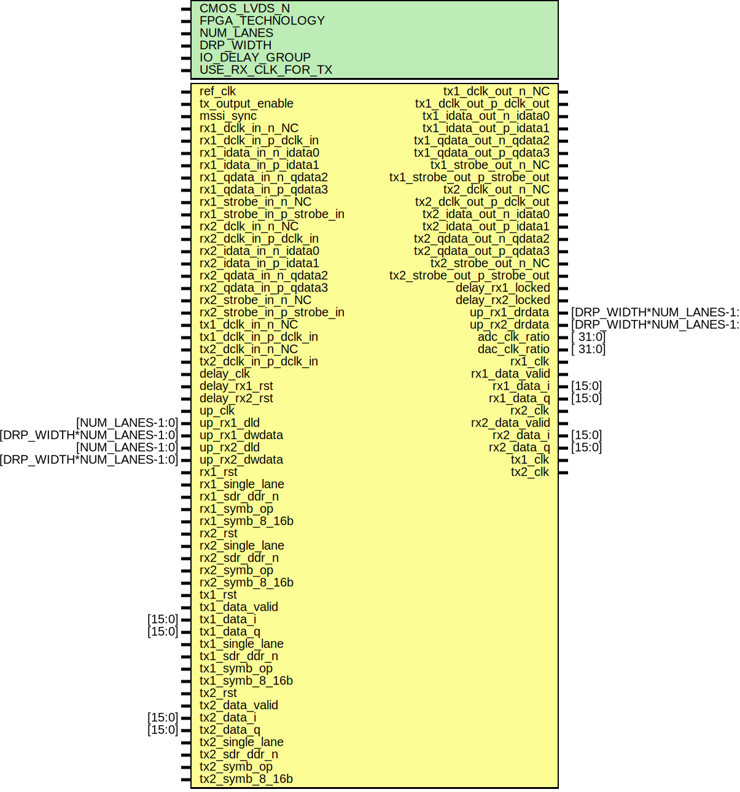

# Entity: axi_adrv9001_if

## Diagram

## Description

***************************************************************************
 ***************************************************************************
 Copyright 2014 - 2020 (c) Analog Devices, Inc. All rights reserved.
 In this HDL repository, there are many different and unique modules, consisting
 of various HDL (Verilog or VHDL) components. The individual modules are
 developed independently, and may be accompanied by separate and unique license
 terms.
 The user should read each of these license terms, and understand the
 freedoms and responsibilities that he or she has by using this source/core.
 This core is distributed in the hope that it will be useful, but WITHOUT ANY
 WARRANTY; without even the implied warranty of MERCHANTABILITY or FITNESS FOR
 A PARTICULAR PURPOSE.
 Redistribution and use of source or resulting binaries, with or without modification
 of this file, are permitted under one of the following two license terms:
   1. The GNU General Public License version 2 as published by the
      Free Software Foundation, which can be found in the top level directory
      of this repository (LICENSE_GPL2), and also online at:
      <https://www.gnu.org/licenses/old-licenses/gpl-2.0.html>
 OR
   2. An ADI specific BSD license, which can be found in the top level directory
      of this repository (LICENSE_ADIBSD), and also on-line at:
      https://github.com/analogdevicesinc/hdl/blob/master/LICENSE_ADIBSD
      This will allow to generate bit files and not release the source code,
      as long as it attaches to an ADI device.
 ***************************************************************************
 ***************************************************************************
 
## Generics

| Generic name      | Type | Value                | Description |
| ----------------- | ---- | -------------------- | ----------- |
| CMOS_LVDS_N       |      | 0                    |             |
| FPGA_TECHNOLOGY   |      | 0                    |             |
| NUM_LANES         |      | 3                    |             |
| DRP_WIDTH         |      | 5                    |             |
| IO_DELAY_GROUP    |      | "dev_if_delay_group" |             |
| USE_RX_CLK_FOR_TX |      | 0                    |             |
## Ports

| Port name                   | Direction | Type                      | Description                         |
| --------------------------- | --------- | ------------------------- | ----------------------------------- |
| ref_clk                     | input     |                           |                                     |
| tx_output_enable            | input     |                           |                                     |
| mssi_sync                   | input     |                           |                                     |
| rx1_dclk_in_n_NC            | input     |                           | device interface                    |
| rx1_dclk_in_p_dclk_in       | input     |                           |                                     |
| rx1_idata_in_n_idata0       | input     |                           |                                     |
| rx1_idata_in_p_idata1       | input     |                           |                                     |
| rx1_qdata_in_n_qdata2       | input     |                           |                                     |
| rx1_qdata_in_p_qdata3       | input     |                           |                                     |
| rx1_strobe_in_n_NC          | input     |                           |                                     |
| rx1_strobe_in_p_strobe_in   | input     |                           |                                     |
| rx2_dclk_in_n_NC            | input     |                           |                                     |
| rx2_dclk_in_p_dclk_in       | input     |                           |                                     |
| rx2_idata_in_n_idata0       | input     |                           |                                     |
| rx2_idata_in_p_idata1       | input     |                           |                                     |
| rx2_qdata_in_n_qdata2       | input     |                           |                                     |
| rx2_qdata_in_p_qdata3       | input     |                           |                                     |
| rx2_strobe_in_n_NC          | input     |                           |                                     |
| rx2_strobe_in_p_strobe_in   | input     |                           |                                     |
| tx1_dclk_out_n_NC           | output    |                           |                                     |
| tx1_dclk_out_p_dclk_out     | output    |                           |                                     |
| tx1_dclk_in_n_NC            | input     |                           |                                     |
| tx1_dclk_in_p_dclk_in       | input     |                           |                                     |
| tx1_idata_out_n_idata0      | output    |                           |                                     |
| tx1_idata_out_p_idata1      | output    |                           |                                     |
| tx1_qdata_out_n_qdata2      | output    |                           |                                     |
| tx1_qdata_out_p_qdata3      | output    |                           |                                     |
| tx1_strobe_out_n_NC         | output    |                           |                                     |
| tx1_strobe_out_p_strobe_out | output    |                           |                                     |
| tx2_dclk_out_n_NC           | output    |                           |                                     |
| tx2_dclk_out_p_dclk_out     | output    |                           |                                     |
| tx2_dclk_in_n_NC            | input     |                           |                                     |
| tx2_dclk_in_p_dclk_in       | input     |                           |                                     |
| tx2_idata_out_n_idata0      | output    |                           |                                     |
| tx2_idata_out_p_idata1      | output    |                           |                                     |
| tx2_qdata_out_n_qdata2      | output    |                           |                                     |
| tx2_qdata_out_p_qdata3      | output    |                           |                                     |
| tx2_strobe_out_n_NC         | output    |                           |                                     |
| tx2_strobe_out_p_strobe_out | output    |                           |                                     |
| delay_clk                   | input     |                           | delay interface (for IDELAY macros) |
| delay_rx1_rst               | input     |                           |                                     |
| delay_rx2_rst               | input     |                           |                                     |
| delay_rx1_locked            | output    |                           |                                     |
| delay_rx2_locked            | output    |                           |                                     |
| up_clk                      | input     |                           |                                     |
| up_rx1_dld                  | input     | [NUM_LANES-1:0]           |                                     |
| up_rx1_dwdata               | input     | [DRP_WIDTH*NUM_LANES-1:0] |                                     |
| up_rx1_drdata               | output    | [DRP_WIDTH*NUM_LANES-1:0] |                                     |
| up_rx2_dld                  | input     | [NUM_LANES-1:0]           |                                     |
| up_rx2_dwdata               | input     | [DRP_WIDTH*NUM_LANES-1:0] |                                     |
| up_rx2_drdata               | output    | [DRP_WIDTH*NUM_LANES-1:0] |                                     |
| adc_clk_ratio               | output    | [ 31:0]                   | upper layer data interface          |
| dac_clk_ratio               | output    | [ 31:0]                   |                                     |
| rx1_clk                     | output    |                           |                                     |
| rx1_rst                     | input     |                           |                                     |
| rx1_data_valid              | output    |                           |                                     |
| rx1_data_i                  | output    | [15:0]                    |                                     |
| rx1_data_q                  | output    | [15:0]                    |                                     |
| rx1_single_lane             | input     |                           |                                     |
| rx1_sdr_ddr_n               | input     |                           |                                     |
| rx2_clk                     | output    |                           |                                     |
| rx2_rst                     | input     |                           |                                     |
| rx2_data_valid              | output    |                           |                                     |
| rx2_data_i                  | output    | [15:0]                    |                                     |
| rx2_data_q                  | output    | [15:0]                    |                                     |
| rx2_single_lane             | input     |                           |                                     |
| rx2_sdr_ddr_n               | input     |                           |                                     |
| tx1_clk                     | output    |                           |                                     |
| tx1_rst                     | input     |                           |                                     |
| tx1_data_valid              | input     |                           |                                     |
| tx1_data_i                  | input     | [15:0]                    |                                     |
| tx1_data_q                  | input     | [15:0]                    |                                     |
| tx1_single_lane             | input     |                           |                                     |
| tx1_sdr_ddr_n               | input     |                           |                                     |
| tx2_clk                     | output    |                           |                                     |
| tx2_rst                     | input     |                           |                                     |
| tx2_data_valid              | input     |                           |                                     |
| tx2_data_i                  | input     | [15:0]                    |                                     |
| tx2_data_q                  | input     | [15:0]                    |                                     |
| tx2_single_lane             | input     |                           |                                     |
| tx2_sdr_ddr_n               | input     |                           |                                     |
## Signals

| Name              | Type       | Description |
| ----------------- | ---------- | ----------- |
| adc_1_clk_div     | wire       |             |
| adc_1_data_0      | wire [7:0] |             |
| adc_1_data_1      | wire [7:0] |             |
| adc_1_data_2      | wire [7:0] |             |
| adc_1_data_3      | wire [7:0] |             |
| adc_1_data_strobe | wire [7:0] |             |
| adc_1_clk         | wire       |             |
| adc_1_valid       | wire       |             |
| adc_1_ssi_rst     | wire       |             |
| adc_2_clk_div     | wire       |             |
| adc_2_data_0      | wire [7:0] |             |
| adc_2_data_1      | wire [7:0] |             |
| adc_2_data_2      | wire [7:0] |             |
| adc_2_data_3      | wire [7:0] |             |
| adc_2_data_strobe | wire [7:0] |             |
| adc_2_clk         | wire       |             |
| adc_2_valid       | wire       |             |
| adc_2_ssi_rst     | wire       |             |
| dac_1_clk_div     | wire       |             |
| dac_1_data_0      | wire [7:0] |             |
| dac_1_data_1      | wire [7:0] |             |
| dac_1_data_2      | wire [7:0] |             |
| dac_1_data_3      | wire [7:0] |             |
| dac_1_data_strobe | wire [7:0] |             |
| dac_1_data_clk    | wire [7:0] |             |
| dac_1_data_valid  | wire       |             |
| dac_2_clk_div     | wire       |             |
| dac_2_data_0      | wire [7:0] |             |
| dac_2_data_1      | wire [7:0] |             |
| dac_2_data_2      | wire [7:0] |             |
| dac_2_data_3      | wire [7:0] |             |
| dac_2_data_strobe | wire [7:0] |             |
| dac_2_data_clk    | wire [7:0] |             |
| dac_2_data_valid  | wire       |             |
| rx_ssi_sync_out   | wire       |             |
## Constants

| Name         | Type | Value         | Description                              |
| ------------ | ---- | ------------- | ---------------------------------------- |
| TX_NUM_LANES |      | NUM_LANES + 1 | Tx has an extra lane to drive the clock  |
## Instantiations

- i_rx_1_phy: adrv9001_rx
- i_rx_1_link: adrv9001_rx_link
- i_rx_2_phy: adrv9001_rx
- i_rx_2_link: adrv9001_rx_link
- i_tx_1_phy: adrv9001_tx
- i_tx_1_link: adrv9001_tx_link
- i_tx_2_phy: adrv9001_tx
- i_tx_2_link: adrv9001_tx_link
