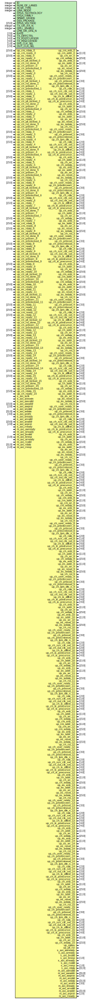

# Entity: axi_adxcvr

## Diagram

## Description

***************************************************************************
 ***************************************************************************
 Copyright 2014 - 2017 (c) Analog Devices, Inc. All rights reserved.
 In this HDL repository, there are many different and unique modules, consisting
 of various HDL (Verilog or VHDL) components. The individual modules are
 developed independently, and may be accompanied by separate and unique license
 terms.
 The user should read each of these license terms, and understand the
 freedoms and responsibilities that he or she has by using this source/core.
 This core is distributed in the hope that it will be useful, but WITHOUT ANY
 WARRANTY; without even the implied warranty of MERCHANTABILITY or FITNESS FOR
 A PARTICULAR PURPOSE.
 Redistribution and use of source or resulting binaries, with or without modification
 of this file, are permitted under one of the following two license terms:
   1. The GNU General Public License version 2 as published by the
      Free Software Foundation, which can be found in the top level directory
      of this repository (LICENSE_GPL2), and also online at:
      <https://www.gnu.org/licenses/old-licenses/gpl-2.0.html>
 OR
   2. An ADI specific BSD license, which can be found in the top level directory
      of this repository (LICENSE_ADIBSD), and also on-line at:
      https://github.com/analogdevicesinc/hdl/blob/master/LICENSE_ADIBSD
      This will allow to generate bit files and not release the source code,
      as long as it attaches to an ADI device.
 ***************************************************************************
 ***************************************************************************
 AUTO GENERATED BY axi_adxcvr.pl, DO NOT MODIFY!
 
## Generics

| Generic name    | Type    | Value | Description              |
| --------------- | ------- | ----- | ------------------------ |
| ID              | integer | 0     | parameters               |
| NUM_OF_LANES    | integer | 8     |                          |
| XCVR_TYPE       | integer | 0     |                          |
| LINK_MODE       | integer | 1     | 2 - 64B/66B;  1 - 8B/10B |
| FPGA_TECHNOLOGY |         | 0     |                          |
| FPGA_FAMILY     |         | 0     |                          |
| SPEED_GRADE     |         | 0     |                          |
| DEV_PACKAGE     |         | 0     |                          |
| FPGA_VOLTAGE    | [15:0]  | 0     |                          |
| TX_OR_RX_N      | integer | 0     |                          |
| QPLL_ENABLE     | integer | 1     |                          |
| LPM_OR_DFE_N    |         | 1     |                          |
| RATE            | [ 2:0]  | 3'd0  |                          |
| TX_DIFFCTRL     | [ 4:0]  | 5'd8  |                          |
| TX_POSTCURSOR   | [ 4:0]  | 5'd0  |                          |
| TX_PRECURSOR    | [ 4:0]  | 5'd0  |                          |
| SYS_CLK_SEL     | [ 1:0]  | 2'd3  |                          |
| OUT_CLK_SEL     | [ 2:0]  | 3'd4  |                          |
## Ports

| Port name              | Direction | Type   | Description |
| ---------------------- | --------- | ------ | ----------- |
| up_cm_enb_0            | output    |        |             |
| up_cm_addr_0           | output    | [11:0] |             |
| up_cm_wr_0             | output    |        |             |
| up_cm_wdata_0          | output    | [15:0] |             |
| up_cm_rdata_0          | input     | [15:0] |             |
| up_cm_ready_0          | input     |        |             |
| up_es_enb_0            | output    |        |             |
| up_es_addr_0           | output    | [11:0] |             |
| up_es_wr_0             | output    |        |             |
| up_es_reset_0          | output    |        |             |
| up_es_wdata_0          | output    | [15:0] |             |
| up_es_rdata_0          | input     | [15:0] |             |
| up_es_ready_0          | input     |        |             |
| up_ch_pll_locked_0     | input     |        |             |
| up_ch_rst_0            | output    |        |             |
| up_ch_user_ready_0     | output    |        |             |
| up_ch_rst_done_0       | input     |        |             |
| up_ch_prbsforceerr_0   | output    |        |             |
| up_ch_prbssel_0        | output    | [ 3:0] |             |
| up_ch_prbscntreset_0   | output    |        |             |
| up_ch_prbserr_0        | input     |        |             |
| up_ch_prbslocked_0     | input     |        |             |
| up_ch_lpm_dfe_n_0      | output    |        |             |
| up_ch_rate_0           | output    | [ 2:0] |             |
| up_ch_sys_clk_sel_0    | output    | [ 1:0] |             |
| up_ch_out_clk_sel_0    | output    | [ 2:0] |             |
| up_ch_tx_diffctrl_0    | output    | [ 4:0] |             |
| up_ch_tx_postcursor_0  | output    | [ 4:0] |             |
| up_ch_tx_precursor_0   | output    | [ 4:0] |             |
| up_ch_enb_0            | output    |        |             |
| up_ch_addr_0           | output    | [11:0] |             |
| up_ch_wr_0             | output    |        |             |
| up_ch_wdata_0          | output    | [15:0] |             |
| up_ch_rdata_0          | input     | [15:0] |             |
| up_ch_ready_0          | input     |        |             |
| up_es_enb_1            | output    |        |             |
| up_es_addr_1           | output    | [11:0] |             |
| up_es_wr_1             | output    |        |             |
| up_es_reset_1          | output    |        |             |
| up_es_wdata_1          | output    | [15:0] |             |
| up_es_rdata_1          | input     | [15:0] |             |
| up_es_ready_1          | input     |        |             |
| up_ch_pll_locked_1     | input     |        |             |
| up_ch_rst_1            | output    |        |             |
| up_ch_user_ready_1     | output    |        |             |
| up_ch_rst_done_1       | input     |        |             |
| up_ch_prbsforceerr_1   | output    |        |             |
| up_ch_prbssel_1        | output    | [ 3:0] |             |
| up_ch_prbscntreset_1   | output    |        |             |
| up_ch_prbserr_1        | input     |        |             |
| up_ch_prbslocked_1     | input     |        |             |
| up_ch_lpm_dfe_n_1      | output    |        |             |
| up_ch_rate_1           | output    | [ 2:0] |             |
| up_ch_sys_clk_sel_1    | output    | [ 1:0] |             |
| up_ch_out_clk_sel_1    | output    | [ 2:0] |             |
| up_ch_tx_diffctrl_1    | output    | [ 4:0] |             |
| up_ch_tx_postcursor_1  | output    | [ 4:0] |             |
| up_ch_tx_precursor_1   | output    | [ 4:0] |             |
| up_ch_enb_1            | output    |        |             |
| up_ch_addr_1           | output    | [11:0] |             |
| up_ch_wr_1             | output    |        |             |
| up_ch_wdata_1          | output    | [15:0] |             |
| up_ch_rdata_1          | input     | [15:0] |             |
| up_ch_ready_1          | input     |        |             |
| up_es_enb_2            | output    |        |             |
| up_es_addr_2           | output    | [11:0] |             |
| up_es_wr_2             | output    |        |             |
| up_es_reset_2          | output    |        |             |
| up_es_wdata_2          | output    | [15:0] |             |
| up_es_rdata_2          | input     | [15:0] |             |
| up_es_ready_2          | input     |        |             |
| up_ch_pll_locked_2     | input     |        |             |
| up_ch_rst_2            | output    |        |             |
| up_ch_user_ready_2     | output    |        |             |
| up_ch_rst_done_2       | input     |        |             |
| up_ch_prbsforceerr_2   | output    |        |             |
| up_ch_prbssel_2        | output    | [ 3:0] |             |
| up_ch_prbscntreset_2   | output    |        |             |
| up_ch_prbserr_2        | input     |        |             |
| up_ch_prbslocked_2     | input     |        |             |
| up_ch_lpm_dfe_n_2      | output    |        |             |
| up_ch_rate_2           | output    | [ 2:0] |             |
| up_ch_sys_clk_sel_2    | output    | [ 1:0] |             |
| up_ch_out_clk_sel_2    | output    | [ 2:0] |             |
| up_ch_tx_diffctrl_2    | output    | [ 4:0] |             |
| up_ch_tx_postcursor_2  | output    | [ 4:0] |             |
| up_ch_tx_precursor_2   | output    | [ 4:0] |             |
| up_ch_enb_2            | output    |        |             |
| up_ch_addr_2           | output    | [11:0] |             |
| up_ch_wr_2             | output    |        |             |
| up_ch_wdata_2          | output    | [15:0] |             |
| up_ch_rdata_2          | input     | [15:0] |             |
| up_ch_ready_2          | input     |        |             |
| up_es_enb_3            | output    |        |             |
| up_es_addr_3           | output    | [11:0] |             |
| up_es_wr_3             | output    |        |             |
| up_es_reset_3          | output    |        |             |
| up_es_wdata_3          | output    | [15:0] |             |
| up_es_rdata_3          | input     | [15:0] |             |
| up_es_ready_3          | input     |        |             |
| up_ch_pll_locked_3     | input     |        |             |
| up_ch_rst_3            | output    |        |             |
| up_ch_user_ready_3     | output    |        |             |
| up_ch_rst_done_3       | input     |        |             |
| up_ch_prbsforceerr_3   | output    |        |             |
| up_ch_prbssel_3        | output    | [ 3:0] |             |
| up_ch_prbscntreset_3   | output    |        |             |
| up_ch_prbserr_3        | input     |        |             |
| up_ch_prbslocked_3     | input     |        |             |
| up_ch_lpm_dfe_n_3      | output    |        |             |
| up_ch_rate_3           | output    | [ 2:0] |             |
| up_ch_sys_clk_sel_3    | output    | [ 1:0] |             |
| up_ch_out_clk_sel_3    | output    | [ 2:0] |             |
| up_ch_tx_diffctrl_3    | output    | [ 4:0] |             |
| up_ch_tx_postcursor_3  | output    | [ 4:0] |             |
| up_ch_tx_precursor_3   | output    | [ 4:0] |             |
| up_ch_enb_3            | output    |        |             |
| up_ch_addr_3           | output    | [11:0] |             |
| up_ch_wr_3             | output    |        |             |
| up_ch_wdata_3          | output    | [15:0] |             |
| up_ch_rdata_3          | input     | [15:0] |             |
| up_ch_ready_3          | input     |        |             |
| up_cm_enb_4            | output    |        |             |
| up_cm_addr_4           | output    | [11:0] |             |
| up_cm_wr_4             | output    |        |             |
| up_cm_wdata_4          | output    | [15:0] |             |
| up_cm_rdata_4          | input     | [15:0] |             |
| up_cm_ready_4          | input     |        |             |
| up_es_enb_4            | output    |        |             |
| up_es_addr_4           | output    | [11:0] |             |
| up_es_wr_4             | output    |        |             |
| up_es_reset_4          | output    |        |             |
| up_es_wdata_4          | output    | [15:0] |             |
| up_es_rdata_4          | input     | [15:0] |             |
| up_es_ready_4          | input     |        |             |
| up_ch_pll_locked_4     | input     |        |             |
| up_ch_rst_4            | output    |        |             |
| up_ch_user_ready_4     | output    |        |             |
| up_ch_rst_done_4       | input     |        |             |
| up_ch_prbsforceerr_4   | output    |        |             |
| up_ch_prbssel_4        | output    | [ 3:0] |             |
| up_ch_prbscntreset_4   | output    |        |             |
| up_ch_prbserr_4        | input     |        |             |
| up_ch_prbslocked_4     | input     |        |             |
| up_ch_lpm_dfe_n_4      | output    |        |             |
| up_ch_rate_4           | output    | [ 2:0] |             |
| up_ch_sys_clk_sel_4    | output    | [ 1:0] |             |
| up_ch_out_clk_sel_4    | output    | [ 2:0] |             |
| up_ch_tx_diffctrl_4    | output    | [ 4:0] |             |
| up_ch_tx_postcursor_4  | output    | [ 4:0] |             |
| up_ch_tx_precursor_4   | output    | [ 4:0] |             |
| up_ch_enb_4            | output    |        |             |
| up_ch_addr_4           | output    | [11:0] |             |
| up_ch_wr_4             | output    |        |             |
| up_ch_wdata_4          | output    | [15:0] |             |
| up_ch_rdata_4          | input     | [15:0] |             |
| up_ch_ready_4          | input     |        |             |
| up_es_enb_5            | output    |        |             |
| up_es_addr_5           | output    | [11:0] |             |
| up_es_wr_5             | output    |        |             |
| up_es_reset_5          | output    |        |             |
| up_es_wdata_5          | output    | [15:0] |             |
| up_es_rdata_5          | input     | [15:0] |             |
| up_es_ready_5          | input     |        |             |
| up_ch_pll_locked_5     | input     |        |             |
| up_ch_rst_5            | output    |        |             |
| up_ch_user_ready_5     | output    |        |             |
| up_ch_rst_done_5       | input     |        |             |
| up_ch_prbsforceerr_5   | output    |        |             |
| up_ch_prbssel_5        | output    | [ 3:0] |             |
| up_ch_prbscntreset_5   | output    |        |             |
| up_ch_prbserr_5        | input     |        |             |
| up_ch_prbslocked_5     | input     |        |             |
| up_ch_lpm_dfe_n_5      | output    |        |             |
| up_ch_rate_5           | output    | [ 2:0] |             |
| up_ch_sys_clk_sel_5    | output    | [ 1:0] |             |
| up_ch_out_clk_sel_5    | output    | [ 2:0] |             |
| up_ch_tx_diffctrl_5    | output    | [ 4:0] |             |
| up_ch_tx_postcursor_5  | output    | [ 4:0] |             |
| up_ch_tx_precursor_5   | output    | [ 4:0] |             |
| up_ch_enb_5            | output    |        |             |
| up_ch_addr_5           | output    | [11:0] |             |
| up_ch_wr_5             | output    |        |             |
| up_ch_wdata_5          | output    | [15:0] |             |
| up_ch_rdata_5          | input     | [15:0] |             |
| up_ch_ready_5          | input     |        |             |
| up_es_enb_6            | output    |        |             |
| up_es_addr_6           | output    | [11:0] |             |
| up_es_wr_6             | output    |        |             |
| up_es_reset_6          | output    |        |             |
| up_es_wdata_6          | output    | [15:0] |             |
| up_es_rdata_6          | input     | [15:0] |             |
| up_es_ready_6          | input     |        |             |
| up_ch_pll_locked_6     | input     |        |             |
| up_ch_rst_6            | output    |        |             |
| up_ch_user_ready_6     | output    |        |             |
| up_ch_rst_done_6       | input     |        |             |
| up_ch_prbsforceerr_6   | output    |        |             |
| up_ch_prbssel_6        | output    | [ 3:0] |             |
| up_ch_prbscntreset_6   | output    |        |             |
| up_ch_prbserr_6        | input     |        |             |
| up_ch_prbslocked_6     | input     |        |             |
| up_ch_lpm_dfe_n_6      | output    |        |             |
| up_ch_rate_6           | output    | [ 2:0] |             |
| up_ch_sys_clk_sel_6    | output    | [ 1:0] |             |
| up_ch_out_clk_sel_6    | output    | [ 2:0] |             |
| up_ch_tx_diffctrl_6    | output    | [ 4:0] |             |
| up_ch_tx_postcursor_6  | output    | [ 4:0] |             |
| up_ch_tx_precursor_6   | output    | [ 4:0] |             |
| up_ch_enb_6            | output    |        |             |
| up_ch_addr_6           | output    | [11:0] |             |
| up_ch_wr_6             | output    |        |             |
| up_ch_wdata_6          | output    | [15:0] |             |
| up_ch_rdata_6          | input     | [15:0] |             |
| up_ch_ready_6          | input     |        |             |
| up_es_enb_7            | output    |        |             |
| up_es_addr_7           | output    | [11:0] |             |
| up_es_wr_7             | output    |        |             |
| up_es_reset_7          | output    |        |             |
| up_es_wdata_7          | output    | [15:0] |             |
| up_es_rdata_7          | input     | [15:0] |             |
| up_es_ready_7          | input     |        |             |
| up_ch_pll_locked_7     | input     |        |             |
| up_ch_rst_7            | output    |        |             |
| up_ch_user_ready_7     | output    |        |             |
| up_ch_rst_done_7       | input     |        |             |
| up_ch_prbsforceerr_7   | output    |        |             |
| up_ch_prbssel_7        | output    | [ 3:0] |             |
| up_ch_prbscntreset_7   | output    |        |             |
| up_ch_prbserr_7        | input     |        |             |
| up_ch_prbslocked_7     | input     |        |             |
| up_ch_lpm_dfe_n_7      | output    |        |             |
| up_ch_rate_7           | output    | [ 2:0] |             |
| up_ch_sys_clk_sel_7    | output    | [ 1:0] |             |
| up_ch_out_clk_sel_7    | output    | [ 2:0] |             |
| up_ch_tx_diffctrl_7    | output    | [ 4:0] |             |
| up_ch_tx_postcursor_7  | output    | [ 4:0] |             |
| up_ch_tx_precursor_7   | output    | [ 4:0] |             |
| up_ch_enb_7            | output    |        |             |
| up_ch_addr_7           | output    | [11:0] |             |
| up_ch_wr_7             | output    |        |             |
| up_ch_wdata_7          | output    | [15:0] |             |
| up_ch_rdata_7          | input     | [15:0] |             |
| up_ch_ready_7          | input     |        |             |
| up_cm_enb_8            | output    |        |             |
| up_cm_addr_8           | output    | [11:0] |             |
| up_cm_wr_8             | output    |        |             |
| up_cm_wdata_8          | output    | [15:0] |             |
| up_cm_rdata_8          | input     | [15:0] |             |
| up_cm_ready_8          | input     |        |             |
| up_es_enb_8            | output    |        |             |
| up_es_addr_8           | output    | [11:0] |             |
| up_es_wr_8             | output    |        |             |
| up_es_reset_8          | output    |        |             |
| up_es_wdata_8          | output    | [15:0] |             |
| up_es_rdata_8          | input     | [15:0] |             |
| up_es_ready_8          | input     |        |             |
| up_ch_pll_locked_8     | input     |        |             |
| up_ch_rst_8            | output    |        |             |
| up_ch_user_ready_8     | output    |        |             |
| up_ch_rst_done_8       | input     |        |             |
| up_ch_prbsforceerr_8   | output    |        |             |
| up_ch_prbssel_8        | output    | [ 3:0] |             |
| up_ch_prbscntreset_8   | output    |        |             |
| up_ch_prbserr_8        | input     |        |             |
| up_ch_prbslocked_8     | input     |        |             |
| up_ch_lpm_dfe_n_8      | output    |        |             |
| up_ch_rate_8           | output    | [ 2:0] |             |
| up_ch_sys_clk_sel_8    | output    | [ 1:0] |             |
| up_ch_out_clk_sel_8    | output    | [ 2:0] |             |
| up_ch_tx_diffctrl_8    | output    | [ 4:0] |             |
| up_ch_tx_postcursor_8  | output    | [ 4:0] |             |
| up_ch_tx_precursor_8   | output    | [ 4:0] |             |
| up_ch_enb_8            | output    |        |             |
| up_ch_addr_8           | output    | [11:0] |             |
| up_ch_wr_8             | output    |        |             |
| up_ch_wdata_8          | output    | [15:0] |             |
| up_ch_rdata_8          | input     | [15:0] |             |
| up_ch_ready_8          | input     |        |             |
| up_es_enb_9            | output    |        |             |
| up_es_addr_9           | output    | [11:0] |             |
| up_es_wr_9             | output    |        |             |
| up_es_reset_9          | output    |        |             |
| up_es_wdata_9          | output    | [15:0] |             |
| up_es_rdata_9          | input     | [15:0] |             |
| up_es_ready_9          | input     |        |             |
| up_ch_pll_locked_9     | input     |        |             |
| up_ch_rst_9            | output    |        |             |
| up_ch_user_ready_9     | output    |        |             |
| up_ch_rst_done_9       | input     |        |             |
| up_ch_prbsforceerr_9   | output    |        |             |
| up_ch_prbssel_9        | output    | [ 3:0] |             |
| up_ch_prbscntreset_9   | output    |        |             |
| up_ch_prbserr_9        | input     |        |             |
| up_ch_prbslocked_9     | input     |        |             |
| up_ch_lpm_dfe_n_9      | output    |        |             |
| up_ch_rate_9           | output    | [ 2:0] |             |
| up_ch_sys_clk_sel_9    | output    | [ 1:0] |             |
| up_ch_out_clk_sel_9    | output    | [ 2:0] |             |
| up_ch_tx_diffctrl_9    | output    | [ 4:0] |             |
| up_ch_tx_postcursor_9  | output    | [ 4:0] |             |
| up_ch_tx_precursor_9   | output    | [ 4:0] |             |
| up_ch_enb_9            | output    |        |             |
| up_ch_addr_9           | output    | [11:0] |             |
| up_ch_wr_9             | output    |        |             |
| up_ch_wdata_9          | output    | [15:0] |             |
| up_ch_rdata_9          | input     | [15:0] |             |
| up_ch_ready_9          | input     |        |             |
| up_es_enb_10           | output    |        |             |
| up_es_addr_10          | output    | [11:0] |             |
| up_es_wr_10            | output    |        |             |
| up_es_reset_10         | output    |        |             |
| up_es_wdata_10         | output    | [15:0] |             |
| up_es_rdata_10         | input     | [15:0] |             |
| up_es_ready_10         | input     |        |             |
| up_ch_pll_locked_10    | input     |        |             |
| up_ch_rst_10           | output    |        |             |
| up_ch_user_ready_10    | output    |        |             |
| up_ch_rst_done_10      | input     |        |             |
| up_ch_prbsforceerr_10  | output    |        |             |
| up_ch_prbssel_10       | output    | [ 3:0] |             |
| up_ch_prbscntreset_10  | output    |        |             |
| up_ch_prbserr_10       | input     |        |             |
| up_ch_prbslocked_10    | input     |        |             |
| up_ch_lpm_dfe_n_10     | output    |        |             |
| up_ch_rate_10          | output    | [ 2:0] |             |
| up_ch_sys_clk_sel_10   | output    | [ 1:0] |             |
| up_ch_out_clk_sel_10   | output    | [ 2:0] |             |
| up_ch_tx_diffctrl_10   | output    | [ 4:0] |             |
| up_ch_tx_postcursor_10 | output    | [ 4:0] |             |
| up_ch_tx_precursor_10  | output    | [ 4:0] |             |
| up_ch_enb_10           | output    |        |             |
| up_ch_addr_10          | output    | [11:0] |             |
| up_ch_wr_10            | output    |        |             |
| up_ch_wdata_10         | output    | [15:0] |             |
| up_ch_rdata_10         | input     | [15:0] |             |
| up_ch_ready_10         | input     |        |             |
| up_es_enb_11           | output    |        |             |
| up_es_addr_11          | output    | [11:0] |             |
| up_es_wr_11            | output    |        |             |
| up_es_reset_11         | output    |        |             |
| up_es_wdata_11         | output    | [15:0] |             |
| up_es_rdata_11         | input     | [15:0] |             |
| up_es_ready_11         | input     |        |             |
| up_ch_pll_locked_11    | input     |        |             |
| up_ch_rst_11           | output    |        |             |
| up_ch_user_ready_11    | output    |        |             |
| up_ch_rst_done_11      | input     |        |             |
| up_ch_prbsforceerr_11  | output    |        |             |
| up_ch_prbssel_11       | output    | [ 3:0] |             |
| up_ch_prbscntreset_11  | output    |        |             |
| up_ch_prbserr_11       | input     |        |             |
| up_ch_prbslocked_11    | input     |        |             |
| up_ch_lpm_dfe_n_11     | output    |        |             |
| up_ch_rate_11          | output    | [ 2:0] |             |
| up_ch_sys_clk_sel_11   | output    | [ 1:0] |             |
| up_ch_out_clk_sel_11   | output    | [ 2:0] |             |
| up_ch_tx_diffctrl_11   | output    | [ 4:0] |             |
| up_ch_tx_postcursor_11 | output    | [ 4:0] |             |
| up_ch_tx_precursor_11  | output    | [ 4:0] |             |
| up_ch_enb_11           | output    |        |             |
| up_ch_addr_11          | output    | [11:0] |             |
| up_ch_wr_11            | output    |        |             |
| up_ch_wdata_11         | output    | [15:0] |             |
| up_ch_rdata_11         | input     | [15:0] |             |
| up_ch_ready_11         | input     |        |             |
| up_cm_enb_12           | output    |        |             |
| up_cm_addr_12          | output    | [11:0] |             |
| up_cm_wr_12            | output    |        |             |
| up_cm_wdata_12         | output    | [15:0] |             |
| up_cm_rdata_12         | input     | [15:0] |             |
| up_cm_ready_12         | input     |        |             |
| up_es_enb_12           | output    |        |             |
| up_es_addr_12          | output    | [11:0] |             |
| up_es_wr_12            | output    |        |             |
| up_es_reset_12         | output    |        |             |
| up_es_wdata_12         | output    | [15:0] |             |
| up_es_rdata_12         | input     | [15:0] |             |
| up_es_ready_12         | input     |        |             |
| up_ch_pll_locked_12    | input     |        |             |
| up_ch_rst_12           | output    |        |             |
| up_ch_user_ready_12    | output    |        |             |
| up_ch_rst_done_12      | input     |        |             |
| up_ch_prbsforceerr_12  | output    |        |             |
| up_ch_prbssel_12       | output    | [ 3:0] |             |
| up_ch_prbscntreset_12  | output    |        |             |
| up_ch_prbserr_12       | input     |        |             |
| up_ch_prbslocked_12    | input     |        |             |
| up_ch_lpm_dfe_n_12     | output    |        |             |
| up_ch_rate_12          | output    | [ 2:0] |             |
| up_ch_sys_clk_sel_12   | output    | [ 1:0] |             |
| up_ch_out_clk_sel_12   | output    | [ 2:0] |             |
| up_ch_tx_diffctrl_12   | output    | [ 4:0] |             |
| up_ch_tx_postcursor_12 | output    | [ 4:0] |             |
| up_ch_tx_precursor_12  | output    | [ 4:0] |             |
| up_ch_enb_12           | output    |        |             |
| up_ch_addr_12          | output    | [11:0] |             |
| up_ch_wr_12            | output    |        |             |
| up_ch_wdata_12         | output    | [15:0] |             |
| up_ch_rdata_12         | input     | [15:0] |             |
| up_ch_ready_12         | input     |        |             |
| up_es_enb_13           | output    |        |             |
| up_es_addr_13          | output    | [11:0] |             |
| up_es_wr_13            | output    |        |             |
| up_es_reset_13         | output    |        |             |
| up_es_wdata_13         | output    | [15:0] |             |
| up_es_rdata_13         | input     | [15:0] |             |
| up_es_ready_13         | input     |        |             |
| up_ch_pll_locked_13    | input     |        |             |
| up_ch_rst_13           | output    |        |             |
| up_ch_user_ready_13    | output    |        |             |
| up_ch_rst_done_13      | input     |        |             |
| up_ch_prbsforceerr_13  | output    |        |             |
| up_ch_prbssel_13       | output    | [ 3:0] |             |
| up_ch_prbscntreset_13  | output    |        |             |
| up_ch_prbserr_13       | input     |        |             |
| up_ch_prbslocked_13    | input     |        |             |
| up_ch_lpm_dfe_n_13     | output    |        |             |
| up_ch_rate_13          | output    | [ 2:0] |             |
| up_ch_sys_clk_sel_13   | output    | [ 1:0] |             |
| up_ch_out_clk_sel_13   | output    | [ 2:0] |             |
| up_ch_tx_diffctrl_13   | output    | [ 4:0] |             |
| up_ch_tx_postcursor_13 | output    | [ 4:0] |             |
| up_ch_tx_precursor_13  | output    | [ 4:0] |             |
| up_ch_enb_13           | output    |        |             |
| up_ch_addr_13          | output    | [11:0] |             |
| up_ch_wr_13            | output    |        |             |
| up_ch_wdata_13         | output    | [15:0] |             |
| up_ch_rdata_13         | input     | [15:0] |             |
| up_ch_ready_13         | input     |        |             |
| up_es_enb_14           | output    |        |             |
| up_es_addr_14          | output    | [11:0] |             |
| up_es_wr_14            | output    |        |             |
| up_es_reset_14         | output    |        |             |
| up_es_wdata_14         | output    | [15:0] |             |
| up_es_rdata_14         | input     | [15:0] |             |
| up_es_ready_14         | input     |        |             |
| up_ch_pll_locked_14    | input     |        |             |
| up_ch_rst_14           | output    |        |             |
| up_ch_user_ready_14    | output    |        |             |
| up_ch_rst_done_14      | input     |        |             |
| up_ch_prbsforceerr_14  | output    |        |             |
| up_ch_prbssel_14       | output    | [ 3:0] |             |
| up_ch_prbscntreset_14  | output    |        |             |
| up_ch_prbserr_14       | input     |        |             |
| up_ch_prbslocked_14    | input     |        |             |
| up_ch_lpm_dfe_n_14     | output    |        |             |
| up_ch_rate_14          | output    | [ 2:0] |             |
| up_ch_sys_clk_sel_14   | output    | [ 1:0] |             |
| up_ch_out_clk_sel_14   | output    | [ 2:0] |             |
| up_ch_tx_diffctrl_14   | output    | [ 4:0] |             |
| up_ch_tx_postcursor_14 | output    | [ 4:0] |             |
| up_ch_tx_precursor_14  | output    | [ 4:0] |             |
| up_ch_enb_14           | output    |        |             |
| up_ch_addr_14          | output    | [11:0] |             |
| up_ch_wr_14            | output    |        |             |
| up_ch_wdata_14         | output    | [15:0] |             |
| up_ch_rdata_14         | input     | [15:0] |             |
| up_ch_ready_14         | input     |        |             |
| up_es_enb_15           | output    |        |             |
| up_es_addr_15          | output    | [11:0] |             |
| up_es_wr_15            | output    |        |             |
| up_es_reset_15         | output    |        |             |
| up_es_wdata_15         | output    | [15:0] |             |
| up_es_rdata_15         | input     | [15:0] |             |
| up_es_ready_15         | input     |        |             |
| up_ch_pll_locked_15    | input     |        |             |
| up_ch_rst_15           | output    |        |             |
| up_ch_user_ready_15    | output    |        |             |
| up_ch_rst_done_15      | input     |        |             |
| up_ch_prbsforceerr_15  | output    |        |             |
| up_ch_prbssel_15       | output    | [ 3:0] |             |
| up_ch_prbscntreset_15  | output    |        |             |
| up_ch_prbserr_15       | input     |        |             |
| up_ch_prbslocked_15    | input     |        |             |
| up_ch_lpm_dfe_n_15     | output    |        |             |
| up_ch_rate_15          | output    | [ 2:0] |             |
| up_ch_sys_clk_sel_15   | output    | [ 1:0] |             |
| up_ch_out_clk_sel_15   | output    | [ 2:0] |             |
| up_ch_tx_diffctrl_15   | output    | [ 4:0] |             |
| up_ch_tx_postcursor_15 | output    | [ 4:0] |             |
| up_ch_tx_precursor_15  | output    | [ 4:0] |             |
| up_ch_enb_15           | output    |        |             |
| up_ch_addr_15          | output    | [11:0] |             |
| up_ch_wr_15            | output    |        |             |
| up_ch_wdata_15         | output    | [15:0] |             |
| up_ch_rdata_15         | input     | [15:0] |             |
| up_ch_ready_15         | input     |        |             |
| s_axi_aclk             | input     |        |             |
| s_axi_aresetn          | input     |        |             |
| up_status              | output    |        |             |
| up_pll_rst             | output    |        |             |
| s_axi_awvalid          | input     |        |             |
| s_axi_awaddr           | input     | [15:0] |             |
| s_axi_awprot           | input     | [ 2:0] |             |
| s_axi_awready          | output    |        |             |
| s_axi_wvalid           | input     |        |             |
| s_axi_wdata            | input     | [31:0] |             |
| s_axi_wstrb            | input     | [ 3:0] |             |
| s_axi_wready           | output    |        |             |
| s_axi_bvalid           | output    |        |             |
| s_axi_bresp            | output    | [ 1:0] |             |
| s_axi_bready           | input     |        |             |
| s_axi_arvalid          | input     |        |             |
| s_axi_araddr           | input     | [15:0] |             |
| s_axi_arprot           | input     | [ 2:0] |             |
| s_axi_arready          | output    |        |             |
| s_axi_rvalid           | output    |        |             |
| s_axi_rresp            | output    | [ 1:0] |             |
| s_axi_rdata            | output    | [31:0] |             |
| s_axi_rready           | input     |        |             |
| m_axi_awvalid          | output    |        |             |
| m_axi_awaddr           | output    | [31:0] |             |
| m_axi_awprot           | output    | [ 2:0] |             |
| m_axi_awready          | input     |        |             |
| m_axi_wvalid           | output    |        |             |
| m_axi_wdata            | output    | [31:0] |             |
| m_axi_wstrb            | output    | [ 3:0] |             |
| m_axi_wready           | input     |        |             |
| m_axi_bvalid           | input     |        |             |
| m_axi_bresp            | input     | [ 1:0] |             |
| m_axi_bready           | output    |        |             |
| m_axi_arvalid          | output    |        |             |
| m_axi_araddr           | output    | [31:0] |             |
| m_axi_arprot           | output    | [ 2:0] |             |
| m_axi_arready          | input     |        |             |
| m_axi_rvalid           | input     |        |             |
| m_axi_rdata            | input     | [31:0] |             |
| m_axi_rresp            | input     | [ 1:0] |             |
| m_axi_rready           | output    |        |             |
## Signals

| Name                  | Type        | Description       |
| --------------------- | ----------- | ----------------- |
| up_cm_sel             | wire [ 7:0] | internal signals  |
| up_cm_enb             | wire        |                   |
| up_cm_addr            | wire [11:0] |                   |
| up_cm_wr              | wire        |                   |
| up_cm_wdata           | wire [15:0] |                   |
| up_cm_rdata_0_s       | wire [15:0] |                   |
| up_cm_ready_0_s       | wire        |                   |
| up_cm_rdata_4_s       | wire [15:0] |                   |
| up_cm_ready_4_s       | wire        |                   |
| up_cm_rdata_8_s       | wire [15:0] |                   |
| up_cm_ready_8_s       | wire        |                   |
| up_cm_rdata_12_s      | wire [15:0] |                   |
| up_cm_ready_12_s      | wire        |                   |
| up_es_sel             | wire [ 7:0] |                   |
| up_es_enb             | wire        |                   |
| up_es_addr            | wire [11:0] |                   |
| up_es_wr              | wire        |                   |
| up_es_wdata           | wire [15:0] |                   |
| up_es_rdata_0_s       | wire [15:0] |                   |
| up_es_ready_0_s       | wire        |                   |
| up_es_rdata_1_s       | wire [15:0] |                   |
| up_es_ready_1_s       | wire        |                   |
| up_es_rdata_2_s       | wire [15:0] |                   |
| up_es_ready_2_s       | wire        |                   |
| up_es_rdata_3_s       | wire [15:0] |                   |
| up_es_ready_3_s       | wire        |                   |
| up_es_rdata_4_s       | wire [15:0] |                   |
| up_es_ready_4_s       | wire        |                   |
| up_es_rdata_5_s       | wire [15:0] |                   |
| up_es_ready_5_s       | wire        |                   |
| up_es_rdata_6_s       | wire [15:0] |                   |
| up_es_ready_6_s       | wire        |                   |
| up_es_rdata_7_s       | wire [15:0] |                   |
| up_es_ready_7_s       | wire        |                   |
| up_es_rdata_8_s       | wire [15:0] |                   |
| up_es_ready_8_s       | wire        |                   |
| up_es_rdata_9_s       | wire [15:0] |                   |
| up_es_ready_9_s       | wire        |                   |
| up_es_rdata_10_s      | wire [15:0] |                   |
| up_es_ready_10_s      | wire        |                   |
| up_es_rdata_11_s      | wire [15:0] |                   |
| up_es_ready_11_s      | wire        |                   |
| up_es_rdata_12_s      | wire [15:0] |                   |
| up_es_ready_12_s      | wire        |                   |
| up_es_rdata_13_s      | wire [15:0] |                   |
| up_es_ready_13_s      | wire        |                   |
| up_es_rdata_14_s      | wire [15:0] |                   |
| up_es_ready_14_s      | wire        |                   |
| up_es_rdata_15_s      | wire [15:0] |                   |
| up_es_ready_15_s      | wire        |                   |
| up_ch_rst             | wire        |                   |
| up_ch_user_ready      | wire        |                   |
| up_ch_lpm_dfe_n       | wire        |                   |
| up_ch_rate            | wire [ 2:0] |                   |
| up_ch_sys_clk_sel     | wire [ 1:0] |                   |
| up_ch_out_clk_sel     | wire [ 2:0] |                   |
| up_ch_tx_diffctrl     | wire [ 4:0] |                   |
| up_ch_tx_postcursor   | wire [ 4:0] |                   |
| up_ch_tx_precursor    | wire [ 4:0] |                   |
| up_ch_prbsforceerr    | wire        |                   |
| up_ch_prbssel         | wire [ 3:0] |                   |
| up_ch_prbscntreset    | wire        |                   |
| up_ch_pll_locked_0_s  | wire        |                   |
| up_ch_rst_done_0_s    | wire        |                   |
| up_ch_prbserr_0_s     | wire        |                   |
| up_ch_prbslocked_0_s  | wire        |                   |
| up_ch_pll_locked_1_s  | wire        |                   |
| up_ch_rst_done_1_s    | wire        |                   |
| up_ch_prbserr_1_s     | wire        |                   |
| up_ch_prbslocked_1_s  | wire        |                   |
| up_ch_pll_locked_2_s  | wire        |                   |
| up_ch_rst_done_2_s    | wire        |                   |
| up_ch_prbserr_2_s     | wire        |                   |
| up_ch_prbslocked_2_s  | wire        |                   |
| up_ch_pll_locked_3_s  | wire        |                   |
| up_ch_rst_done_3_s    | wire        |                   |
| up_ch_prbserr_3_s     | wire        |                   |
| up_ch_prbslocked_3_s  | wire        |                   |
| up_ch_pll_locked_4_s  | wire        |                   |
| up_ch_rst_done_4_s    | wire        |                   |
| up_ch_prbserr_4_s     | wire        |                   |
| up_ch_prbslocked_4_s  | wire        |                   |
| up_ch_pll_locked_5_s  | wire        |                   |
| up_ch_rst_done_5_s    | wire        |                   |
| up_ch_prbserr_5_s     | wire        |                   |
| up_ch_prbslocked_5_s  | wire        |                   |
| up_ch_pll_locked_6_s  | wire        |                   |
| up_ch_rst_done_6_s    | wire        |                   |
| up_ch_prbserr_6_s     | wire        |                   |
| up_ch_prbslocked_6_s  | wire        |                   |
| up_ch_pll_locked_7_s  | wire        |                   |
| up_ch_rst_done_7_s    | wire        |                   |
| up_ch_prbserr_7_s     | wire        |                   |
| up_ch_prbslocked_7_s  | wire        |                   |
| up_ch_pll_locked_8_s  | wire        |                   |
| up_ch_rst_done_8_s    | wire        |                   |
| up_ch_prbserr_8_s     | wire        |                   |
| up_ch_prbslocked_8_s  | wire        |                   |
| up_ch_pll_locked_9_s  | wire        |                   |
| up_ch_rst_done_9_s    | wire        |                   |
| up_ch_prbserr_9_s     | wire        |                   |
| up_ch_prbslocked_9_s  | wire        |                   |
| up_ch_pll_locked_10_s | wire        |                   |
| up_ch_rst_done_10_s   | wire        |                   |
| up_ch_prbserr_10_s    | wire        |                   |
| up_ch_prbslocked_10_s | wire        |                   |
| up_ch_pll_locked_11_s | wire        |                   |
| up_ch_rst_done_11_s   | wire        |                   |
| up_ch_prbserr_11_s    | wire        |                   |
| up_ch_prbslocked_11_s | wire        |                   |
| up_ch_pll_locked_12_s | wire        |                   |
| up_ch_rst_done_12_s   | wire        |                   |
| up_ch_prbserr_12_s    | wire        |                   |
| up_ch_prbslocked_12_s | wire        |                   |
| up_ch_pll_locked_13_s | wire        |                   |
| up_ch_rst_done_13_s   | wire        |                   |
| up_ch_prbserr_13_s    | wire        |                   |
| up_ch_prbslocked_13_s | wire        |                   |
| up_ch_pll_locked_14_s | wire        |                   |
| up_ch_rst_done_14_s   | wire        |                   |
| up_ch_prbserr_14_s    | wire        |                   |
| up_ch_prbslocked_14_s | wire        |                   |
| up_ch_pll_locked_15_s | wire        |                   |
| up_ch_rst_done_15_s   | wire        |                   |
| up_ch_prbserr_15_s    | wire        |                   |
| up_ch_prbslocked_15_s | wire        |                   |
| up_ch_sel             | wire [ 7:0] |                   |
| up_ch_enb             | wire        |                   |
| up_ch_addr            | wire [11:0] |                   |
| up_ch_wr              | wire        |                   |
| up_ch_wdata           | wire [15:0] |                   |
| up_ch_rdata_0_s       | wire [15:0] |                   |
| up_ch_ready_0_s       | wire        |                   |
| up_ch_rdata_1_s       | wire [15:0] |                   |
| up_ch_ready_1_s       | wire        |                   |
| up_ch_rdata_2_s       | wire [15:0] |                   |
| up_ch_ready_2_s       | wire        |                   |
| up_ch_rdata_3_s       | wire [15:0] |                   |
| up_ch_ready_3_s       | wire        |                   |
| up_ch_rdata_4_s       | wire [15:0] |                   |
| up_ch_ready_4_s       | wire        |                   |
| up_ch_rdata_5_s       | wire [15:0] |                   |
| up_ch_ready_5_s       | wire        |                   |
| up_ch_rdata_6_s       | wire [15:0] |                   |
| up_ch_ready_6_s       | wire        |                   |
| up_ch_rdata_7_s       | wire [15:0] |                   |
| up_ch_ready_7_s       | wire        |                   |
| up_ch_rdata_8_s       | wire [15:0] |                   |
| up_ch_ready_8_s       | wire        |                   |
| up_ch_rdata_9_s       | wire [15:0] |                   |
| up_ch_ready_9_s       | wire        |                   |
| up_ch_rdata_10_s      | wire [15:0] |                   |
| up_ch_ready_10_s      | wire        |                   |
| up_ch_rdata_11_s      | wire [15:0] |                   |
| up_ch_ready_11_s      | wire        |                   |
| up_ch_rdata_12_s      | wire [15:0] |                   |
| up_ch_ready_12_s      | wire        |                   |
| up_ch_rdata_13_s      | wire [15:0] |                   |
| up_ch_ready_13_s      | wire        |                   |
| up_ch_rdata_14_s      | wire [15:0] |                   |
| up_ch_ready_14_s      | wire        |                   |
| up_ch_rdata_15_s      | wire [15:0] |                   |
| up_ch_ready_15_s      | wire        |                   |
| up_es_req             | wire        |                   |
| up_es_ack             | wire        |                   |
| up_es_pscale          | wire [ 4:0] |                   |
| up_es_vrange          | wire [ 1:0] |                   |
| up_es_vstep           | wire [ 7:0] |                   |
| up_es_vmax            | wire [ 7:0] |                   |
| up_es_vmin            | wire [ 7:0] |                   |
| up_es_hmax            | wire [11:0] |                   |
| up_es_hmin            | wire [11:0] |                   |
| up_es_hstep           | wire [11:0] |                   |
| up_es_saddr           | wire [31:0] |                   |
| up_es_status          | wire        |                   |
| up_rstn               | wire        |                   |
| up_clk                | wire        |                   |
| up_wreq               | wire        |                   |
| up_waddr              | wire [ 9:0] |                   |
| up_wdata              | wire [31:0] |                   |
| up_wack               | wire        |                   |
| up_rreq               | wire        |                   |
| up_raddr              | wire [ 9:0] |                   |
| up_rdata              | wire [31:0] |                   |
| up_rack               | wire        |                   |
| up_es_reset           | wire [15:0] |                   |
## Instantiations

- i_mdrp_cm_0: axi_adxcvr_mdrp
- i_mdrp_es_0: axi_adxcvr_mdrp
- i_mstatus_ch_0: axi_adxcvr_mstatus
- i_mdrp_ch_0: axi_adxcvr_mdrp
- i_mdrp_es_1: axi_adxcvr_mdrp
- i_mstatus_ch_1: axi_adxcvr_mstatus
- i_mdrp_ch_1: axi_adxcvr_mdrp
- i_mdrp_es_2: axi_adxcvr_mdrp
- i_mstatus_ch_2: axi_adxcvr_mstatus
- i_mdrp_ch_2: axi_adxcvr_mdrp
- i_mdrp_es_3: axi_adxcvr_mdrp
- i_mstatus_ch_3: axi_adxcvr_mstatus
- i_mdrp_ch_3: axi_adxcvr_mdrp
- i_mdrp_cm_4: axi_adxcvr_mdrp
- i_mdrp_es_4: axi_adxcvr_mdrp
- i_mstatus_ch_4: axi_adxcvr_mstatus
- i_mdrp_ch_4: axi_adxcvr_mdrp
- i_mdrp_es_5: axi_adxcvr_mdrp
- i_mstatus_ch_5: axi_adxcvr_mstatus
- i_mdrp_ch_5: axi_adxcvr_mdrp
- i_mdrp_es_6: axi_adxcvr_mdrp
- i_mstatus_ch_6: axi_adxcvr_mstatus
- i_mdrp_ch_6: axi_adxcvr_mdrp
- i_mdrp_es_7: axi_adxcvr_mdrp
- i_mstatus_ch_7: axi_adxcvr_mstatus
- i_mdrp_ch_7: axi_adxcvr_mdrp
- i_mdrp_cm_8: axi_adxcvr_mdrp
- i_mdrp_es_8: axi_adxcvr_mdrp
- i_mstatus_ch_8: axi_adxcvr_mstatus
- i_mdrp_ch_8: axi_adxcvr_mdrp
- i_mdrp_es_9: axi_adxcvr_mdrp
- i_mstatus_ch_9: axi_adxcvr_mstatus
- i_mdrp_ch_9: axi_adxcvr_mdrp
- i_mdrp_es_10: axi_adxcvr_mdrp
- i_mstatus_ch_10: axi_adxcvr_mstatus
- i_mdrp_ch_10: axi_adxcvr_mdrp
- i_mdrp_es_11: axi_adxcvr_mdrp
- i_mstatus_ch_11: axi_adxcvr_mstatus
- i_mdrp_ch_11: axi_adxcvr_mdrp
- i_mdrp_cm_12: axi_adxcvr_mdrp
- i_mdrp_es_12: axi_adxcvr_mdrp
- i_mstatus_ch_12: axi_adxcvr_mstatus
- i_mdrp_ch_12: axi_adxcvr_mdrp
- i_mdrp_es_13: axi_adxcvr_mdrp
- i_mstatus_ch_13: axi_adxcvr_mstatus
- i_mdrp_ch_13: axi_adxcvr_mdrp
- i_mdrp_es_14: axi_adxcvr_mdrp
- i_mstatus_ch_14: axi_adxcvr_mstatus
- i_mdrp_ch_14: axi_adxcvr_mdrp
- i_mdrp_es_15: axi_adxcvr_mdrp
- i_mstatus_ch_15: axi_adxcvr_mstatus
- i_mdrp_ch_15: axi_adxcvr_mdrp
- i_es: axi_adxcvr_es
- i_up: axi_adxcvr_up
- i_axi: up_axi
