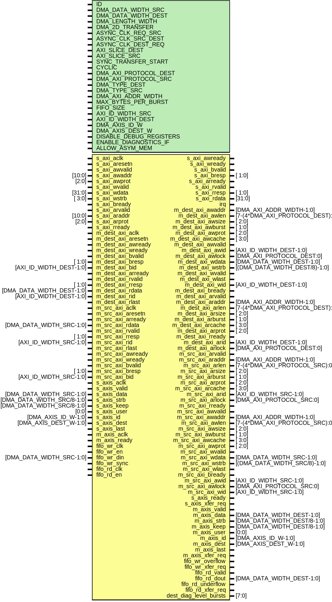

# Entity: axi_dmac

## Diagram

## Description

***************************************************************************
 ***************************************************************************
 Copyright 2014 - 2017 (c) Analog Devices, Inc. All rights reserved.
 In this HDL repository, there are many different and unique modules, consisting
 of various HDL (Verilog or VHDL) components. The individual modules are
 developed independently, and may be accompanied by separate and unique license
 terms.
 The user should read each of these license terms, and understand the
 freedoms and responsibilities that he or she has by using this source/core.
 This core is distributed in the hope that it will be useful, but WITHOUT ANY
 WARRANTY; without even the implied warranty of MERCHANTABILITY or FITNESS FOR
 A PARTICULAR PURPOSE.
 Redistribution and use of source or resulting binaries, with or without modification
 of this file, are permitted under one of the following two license terms:
   1. The GNU General Public License version 2 as published by the
      Free Software Foundation, which can be found in the top level directory
      of this repository (LICENSE_GPL2), and also online at:
      <https://www.gnu.org/licenses/old-licenses/gpl-2.0.html>
 OR
   2. An ADI specific BSD license, which can be found in the top level directory
      of this repository (LICENSE_ADIBSD), and also on-line at:
      https://github.com/analogdevicesinc/hdl/blob/master/LICENSE_ADIBSD
      This will allow to generate bit files and not release the source code,
      as long as it attaches to an ADI device.
 ***************************************************************************
 ***************************************************************************
 
## Generics

| Generic name            | Type | Value | Description |
| ----------------------- | ---- | ----- | ----------- |
| ID                      |      | 0     |             |
| DMA_DATA_WIDTH_SRC      |      | 64    |             |
| DMA_DATA_WIDTH_DEST     |      | 64    |             |
| DMA_LENGTH_WIDTH        |      | 24    |             |
| DMA_2D_TRANSFER         |      | 0     |             |
| ASYNC_CLK_REQ_SRC       |      | 1     |             |
| ASYNC_CLK_SRC_DEST      |      | 1     |             |
| ASYNC_CLK_DEST_REQ      |      | 1     |             |
| AXI_SLICE_DEST          |      | 0     |             |
| AXI_SLICE_SRC           |      | 0     |             |
| SYNC_TRANSFER_START     |      | 0     |             |
| CYCLIC                  |      | 1     |             |
| DMA_AXI_PROTOCOL_DEST   |      | 0     |             |
| DMA_AXI_PROTOCOL_SRC    |      | 0     |             |
| DMA_TYPE_DEST           |      | 0     |             |
| DMA_TYPE_SRC            |      | 2     |             |
| DMA_AXI_ADDR_WIDTH      |      | 32    |             |
| MAX_BYTES_PER_BURST     |      | 128   |             |
| FIFO_SIZE               |      | 8     | In bursts   |
| AXI_ID_WIDTH_SRC        |      | 1     |             |
| AXI_ID_WIDTH_DEST       |      | 1     |             |
| DMA_AXIS_ID_W           |      | 8     |             |
| DMA_AXIS_DEST_W         |      | 4     |             |
| DISABLE_DEBUG_REGISTERS |      | 0     |             |
| ENABLE_DIAGNOSTICS_IF   |      | 0     |             |
| ALLOW_ASYM_MEM          |      | 0     |             |
## Ports

| Port name              | Direction | Type                            | Description                    |
| ---------------------- | --------- | ------------------------------- | ------------------------------ |
| s_axi_aclk             | input     |                                 | Slave AXI interface            |
| s_axi_aresetn          | input     |                                 |                                |
| s_axi_awvalid          | input     |                                 |                                |
| s_axi_awaddr           | input     | [10:0]                          |                                |
| s_axi_awready          | output    |                                 |                                |
| s_axi_awprot           | input     | [2:0]                           |                                |
| s_axi_wvalid           | input     |                                 |                                |
| s_axi_wdata            | input     | [31:0]                          |                                |
| s_axi_wstrb            | input     | [ 3:0]                          |                                |
| s_axi_wready           | output    |                                 |                                |
| s_axi_bvalid           | output    |                                 |                                |
| s_axi_bresp            | output    | [ 1:0]                          |                                |
| s_axi_bready           | input     |                                 |                                |
| s_axi_arvalid          | input     |                                 |                                |
| s_axi_araddr           | input     | [10:0]                          |                                |
| s_axi_arready          | output    |                                 |                                |
| s_axi_arprot           | input     | [2:0]                           |                                |
| s_axi_rvalid           | output    |                                 |                                |
| s_axi_rready           | input     |                                 |                                |
| s_axi_rresp            | output    | [ 1:0]                          |                                |
| s_axi_rdata            | output    | [31:0]                          |                                |
| irq                    | output    |                                 | Interrupt                      |
| m_dest_axi_aclk        | input     |                                 | Master AXI interface           |
| m_dest_axi_aresetn     | input     |                                 |                                |
| m_dest_axi_awaddr      | output    | [DMA_AXI_ADDR_WIDTH-1:0]        | Write address                  |
| m_dest_axi_awlen       | output    | [7-(4*DMA_AXI_PROTOCOL_DEST):0] |                                |
| m_dest_axi_awsize      | output    | [ 2:0]                          |                                |
| m_dest_axi_awburst     | output    | [ 1:0]                          |                                |
| m_dest_axi_awprot      | output    | [ 2:0]                          |                                |
| m_dest_axi_awcache     | output    | [ 3:0]                          |                                |
| m_dest_axi_awvalid     | output    |                                 |                                |
| m_dest_axi_awready     | input     |                                 |                                |
| m_dest_axi_awid        | output    | [AXI_ID_WIDTH_DEST-1:0]         |                                |
| m_dest_axi_awlock      | output    | [DMA_AXI_PROTOCOL_DEST:0]       |                                |
| m_dest_axi_wdata       | output    | [DMA_DATA_WIDTH_DEST-1:0]       | Write data                     |
| m_dest_axi_wstrb       | output    | [(DMA_DATA_WIDTH_DEST/8)-1:0]   |                                |
| m_dest_axi_wready      | input     |                                 |                                |
| m_dest_axi_wvalid      | output    |                                 |                                |
| m_dest_axi_wlast       | output    |                                 |                                |
| m_dest_axi_wid         | output    | [AXI_ID_WIDTH_DEST-1:0]         |                                |
| m_dest_axi_bvalid      | input     |                                 | Write response                 |
| m_dest_axi_bresp       | input     | [ 1:0]                          |                                |
| m_dest_axi_bready      | output    |                                 |                                |
| m_dest_axi_bid         | input     | [AXI_ID_WIDTH_DEST-1:0]         |                                |
| m_dest_axi_arvalid     | output    |                                 | Unused read interface          |
| m_dest_axi_araddr      | output    | [DMA_AXI_ADDR_WIDTH-1:0]        |                                |
| m_dest_axi_arlen       | output    | [7-(4*DMA_AXI_PROTOCOL_DEST):0] |                                |
| m_dest_axi_arsize      | output    | [ 2:0]                          |                                |
| m_dest_axi_arburst     | output    | [ 1:0]                          |                                |
| m_dest_axi_arcache     | output    | [ 3:0]                          |                                |
| m_dest_axi_arprot      | output    | [ 2:0]                          |                                |
| m_dest_axi_arready     | input     |                                 |                                |
| m_dest_axi_rvalid      | input     |                                 |                                |
| m_dest_axi_rresp       | input     | [ 1:0]                          |                                |
| m_dest_axi_rdata       | input     | [DMA_DATA_WIDTH_DEST-1:0]       |                                |
| m_dest_axi_rready      | output    |                                 |                                |
| m_dest_axi_arid        | output    | [AXI_ID_WIDTH_DEST-1:0]         |                                |
| m_dest_axi_arlock      | output    | [DMA_AXI_PROTOCOL_DEST:0]       |                                |
| m_dest_axi_rid         | input     | [AXI_ID_WIDTH_DEST-1:0]         |                                |
| m_dest_axi_rlast       | input     |                                 |                                |
| m_src_axi_aclk         | input     |                                 | Master AXI interface           |
| m_src_axi_aresetn      | input     |                                 |                                |
| m_src_axi_arready      | input     |                                 | Read address                   |
| m_src_axi_arvalid      | output    |                                 |                                |
| m_src_axi_araddr       | output    | [DMA_AXI_ADDR_WIDTH-1:0]        |                                |
| m_src_axi_arlen        | output    | [7-(4*DMA_AXI_PROTOCOL_SRC):0]  |                                |
| m_src_axi_arsize       | output    | [ 2:0]                          |                                |
| m_src_axi_arburst      | output    | [ 1:0]                          |                                |
| m_src_axi_arprot       | output    | [ 2:0]                          |                                |
| m_src_axi_arcache      | output    | [ 3:0]                          |                                |
| m_src_axi_arid         | output    | [AXI_ID_WIDTH_SRC-1:0]          |                                |
| m_src_axi_arlock       | output    | [DMA_AXI_PROTOCOL_SRC:0]        |                                |
| m_src_axi_rdata        | input     | [DMA_DATA_WIDTH_SRC-1:0]        | Read data and response         |
| m_src_axi_rready       | output    |                                 |                                |
| m_src_axi_rvalid       | input     |                                 |                                |
| m_src_axi_rresp        | input     | [ 1:0]                          |                                |
| m_src_axi_rid          | input     | [AXI_ID_WIDTH_SRC-1:0]          |                                |
| m_src_axi_rlast        | input     |                                 |                                |
| m_src_axi_awvalid      | output    |                                 | Unused write interface         |
| m_src_axi_awaddr       | output    | [DMA_AXI_ADDR_WIDTH-1:0]        |                                |
| m_src_axi_awlen        | output    | [7-(4*DMA_AXI_PROTOCOL_SRC):0]  |                                |
| m_src_axi_awsize       | output    | [ 2:0]                          |                                |
| m_src_axi_awburst      | output    | [ 1:0]                          |                                |
| m_src_axi_awcache      | output    | [ 3:0]                          |                                |
| m_src_axi_awprot       | output    | [ 2:0]                          |                                |
| m_src_axi_awready      | input     |                                 |                                |
| m_src_axi_wvalid       | output    |                                 |                                |
| m_src_axi_wdata        | output    | [DMA_DATA_WIDTH_SRC-1:0]        |                                |
| m_src_axi_wstrb        | output    | [(DMA_DATA_WIDTH_SRC/8)-1:0]    |                                |
| m_src_axi_wlast        | output    |                                 |                                |
| m_src_axi_wready       | input     |                                 |                                |
| m_src_axi_bvalid       | input     |                                 |                                |
| m_src_axi_bresp        | input     | [ 1:0]                          |                                |
| m_src_axi_bready       | output    |                                 |                                |
| m_src_axi_awid         | output    | [AXI_ID_WIDTH_SRC-1:0]          |                                |
| m_src_axi_awlock       | output    | [DMA_AXI_PROTOCOL_SRC:0]        |                                |
| m_src_axi_wid          | output    | [AXI_ID_WIDTH_SRC-1:0]          |                                |
| m_src_axi_bid          | input     | [AXI_ID_WIDTH_SRC-1:0]          |                                |
| s_axis_aclk            | input     |                                 | Slave streaming AXI interface  |
| s_axis_ready           | output    |                                 |                                |
| s_axis_valid           | input     |                                 |                                |
| s_axis_data            | input     | [DMA_DATA_WIDTH_SRC-1:0]        |                                |
| s_axis_strb            | input     | [DMA_DATA_WIDTH_SRC/8-1:0]      |                                |
| s_axis_keep            | input     | [DMA_DATA_WIDTH_SRC/8-1:0]      |                                |
| s_axis_user            | input     | [0:0]                           |                                |
| s_axis_id              | input     | [DMA_AXIS_ID_W-1:0]             |                                |
| s_axis_dest            | input     | [DMA_AXIS_DEST_W-1:0]           |                                |
| s_axis_last            | input     |                                 |                                |
| s_axis_xfer_req        | output    |                                 |                                |
| m_axis_aclk            | input     |                                 | Master streaming AXI interface |
| m_axis_ready           | input     |                                 |                                |
| m_axis_valid           | output    |                                 |                                |
| m_axis_data            | output    | [DMA_DATA_WIDTH_DEST-1:0]       |                                |
| m_axis_strb            | output    | [DMA_DATA_WIDTH_DEST/8-1:0]     |                                |
| m_axis_keep            | output    | [DMA_DATA_WIDTH_DEST/8-1:0]     |                                |
| m_axis_user            | output    | [0:0]                           |                                |
| m_axis_id              | output    | [DMA_AXIS_ID_W-1:0]             |                                |
| m_axis_dest            | output    | [DMA_AXIS_DEST_W-1:0]           |                                |
| m_axis_last            | output    |                                 |                                |
| m_axis_xfer_req        | output    |                                 |                                |
| fifo_wr_clk            | input     |                                 | Input FIFO interface           |
| fifo_wr_en             | input     |                                 |                                |
| fifo_wr_din            | input     | [DMA_DATA_WIDTH_SRC-1:0]        |                                |
| fifo_wr_overflow       | output    |                                 |                                |
| fifo_wr_sync           | input     |                                 |                                |
| fifo_wr_xfer_req       | output    |                                 |                                |
| fifo_rd_clk            | input     |                                 | Input FIFO interface           |
| fifo_rd_en             | input     |                                 |                                |
| fifo_rd_valid          | output    |                                 |                                |
| fifo_rd_dout           | output    | [DMA_DATA_WIDTH_DEST-1:0]       |                                |
| fifo_rd_underflow      | output    |                                 |                                |
| fifo_rd_xfer_req       | output    |                                 |                                |
| dest_diag_level_bursts | output    | [7:0]                           | Diagnostics interface          |
## Signals

| Name                           | Type                                                  | Description                                   |
| ------------------------------ | ----------------------------------------------------- | --------------------------------------------- |
| dest_request_id                | wire [ID_WIDTH-1:0]                                   | ID signals from the DMAC, just for debugging  |
| dest_data_id                   | wire [ID_WIDTH-1:0]                                   |                                               |
| dest_address_id                | wire [ID_WIDTH-1:0]                                   |                                               |
| dest_response_id               | wire [ID_WIDTH-1:0]                                   |                                               |
| src_request_id                 | wire [ID_WIDTH-1:0]                                   |                                               |
| src_data_id                    | wire [ID_WIDTH-1:0]                                   |                                               |
| src_address_id                 | wire [ID_WIDTH-1:0]                                   |                                               |
| src_response_id                | wire [ID_WIDTH-1:0]                                   |                                               |
| dbg_status                     | wire [11:0]                                           |                                               |
| dbg_ids0                       | wire [31:0]                                           |                                               |
| dbg_ids1                       | wire [31:0]                                           |                                               |
| up_req_eot                     | wire                                                  |                                               |
| up_req_measured_burst_length   | wire [BYTES_PER_BURST_WIDTH-1:0]                      |                                               |
| up_response_partial            | wire                                                  |                                               |
| up_response_valid              | wire                                                  |                                               |
| up_response_ready              | wire                                                  |                                               |
| ctrl_enable                    | wire                                                  |                                               |
| ctrl_pause                     | wire                                                  |                                               |
| up_dma_req_valid               | wire                                                  |                                               |
| up_dma_req_ready               | wire                                                  |                                               |
| up_dma_req_dest_address        | wire [DMA_AXI_ADDR_WIDTH-1:BYTES_PER_BEAT_WIDTH_DEST] |                                               |
| up_dma_req_src_address         | wire [DMA_AXI_ADDR_WIDTH-1:BYTES_PER_BEAT_WIDTH_SRC]  |                                               |
| up_dma_req_x_length            | wire [DMA_LENGTH_WIDTH-1:0]                           |                                               |
| up_dma_req_y_length            | wire [DMA_LENGTH_WIDTH-1:0]                           |                                               |
| up_dma_req_dest_stride         | wire [DMA_LENGTH_WIDTH-1:0]                           |                                               |
| up_dma_req_src_stride          | wire [DMA_LENGTH_WIDTH-1:0]                           |                                               |
| up_dma_req_sync_transfer_start | wire                                                  |                                               |
| up_dma_req_last                | wire                                                  |                                               |
## Constants

| Name                       | Type | Value                                                            | Description                                                                                                                                                                                                                                                                                                         |
| -------------------------- | ---- | ---------------------------------------------------------------- | ------------------------------------------------------------------------------------------------------------------------------------------------------------------------------------------------------------------------------------------------------------------------------------------------------------------- |
| DMA_TYPE_AXI_MM            |      | 0                                                                |                                                                                                                                                                                                                                                                                                                     |
| DMA_TYPE_AXI_STREAM        |      | 1                                                                |                                                                                                                                                                                                                                                                                                                     |
| DMA_TYPE_FIFO              |      | 2                                                                |                                                                                                                                                                                                                                                                                                                     |
| HAS_DEST_ADDR              |      | DMA_TYPE_DEST == DMA_TYPE_AXI_MM                                 |                                                                                                                                                                                                                                                                                                                     |
| HAS_SRC_ADDR               |      | DMA_TYPE_SRC == DMA_TYPE_AXI_MM                                  |                                                                                                                                                                                                                                                                                                                     |
| BYTES_PER_BEAT_WIDTH_DEST  |      |                                                                  | Argh... "[Synth 8-2722] system function call clog2 is not allowed here"                                                                                                                                                                                                                                             |
| BYTES_PER_BEAT_WIDTH_SRC   |      |                                                                  |                                                                                                                                                                                                                                                                                                                     |
| ID_WIDTH                   |      |                                                                  |                                                                                                                                                                                                                                                                                                                     |
| DBG_ID_PADDING             |      | ID_WIDTH > 8 ? 0 : 8 - ID_WIDTH                                  |                                                                                                                                                                                                                                                                                                                     |
| BEATS_PER_BURST_LIMIT_DEST |      | 1024                                                             | AXI3 supports a maximum of 16 beats per burst. AXI4 supports a maximum of    256 beats per burst. If either bus is AXI3 set the maximum number of beats    per burst to 16. For non AXI interfaces the maximum beats per burst is in    theory unlimted. Set it to 1024 to provide a reasonable upper threshold */  |
| BYTES_PER_BURST_LIMIT_DEST |      | BEATS_PER_BURST_LIMIT_DEST * DMA_DATA_WIDTH_DEST / 8             |                                                                                                                                                                                                                                                                                                                     |
| BEATS_PER_BURST_LIMIT_SRC  |      | 1024                                                             |                                                                                                                                                                                                                                                                                                                     |
| BYTES_PER_BURST_LIMIT_SRC  |      | BEATS_PER_BURST_LIMIT_SRC * DMA_DATA_WIDTH_SRC / 8               |                                                                                                                                                                                                                                                                                                                     |
| BYTES_PER_BURST_LIMIT      |      | BYTES_PER_BURST_LIMIT_DEST                                       | The smaller bus limits the maximum bytes per burst. */                                                                                                                                                                                                                                                              |
| REAL_MAX_BYTES_PER_BURST   |      | BYTES_PER_BURST_LIMIT < MAX_BYTES_PER_BURST ?                    | Make sure the requested MAX_BYTES_PER_BURST does not exceed what the    interfaces can support. Limit the value if necessary. */                                                                                                                                                                                    |
| DMA_LENGTH_ALIGN_SRC       |      | DMA_TYPE_SRC == DMA_TYPE_AXI_MM ? 0 : BYTES_PER_BEAT_WIDTH_SRC   | MM has no alignment requirements */                                                                                                                                                                                                                                                                                 |
| DMA_LENGTH_ALIGN_DEST      |      | DMA_TYPE_DEST == DMA_TYPE_AXI_MM ? 0 : BYTES_PER_BEAT_WIDTH_DEST |                                                                                                                                                                                                                                                                                                                     |
| DMA_LENGTH_ALIGN           |      | DMA_LENGTH_ALIGN_SRC < DMA_LENGTH_ALIGN_DEST ?                   | Choose the larger of the two */                                                                                                                                                                                                                                                                                     |
| BYTES_PER_BURST_WIDTH      |      | REAL_MAX_BYTES_PER_BURST > 2048 ? 12                             |                                                                                                                                                                                                                                                                                                                     |
## Instantiations

- i_regmap: axi_dmac_regmap
- i_transfer: axi_dmac_transfer
