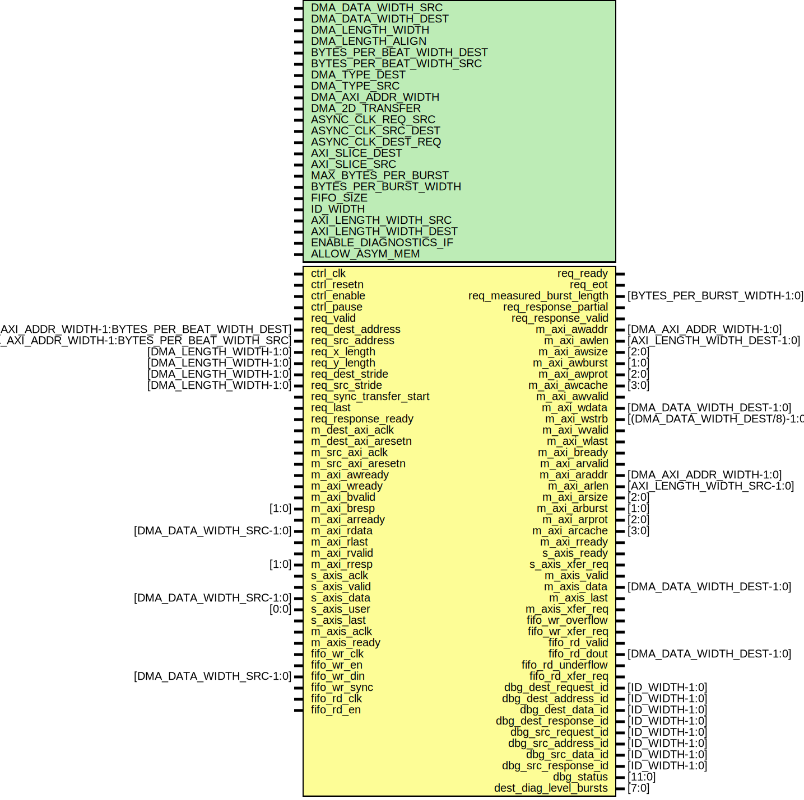

# Entity: axi_dmac_transfer

- **File**: axi_dmac_transfer.v
## Diagram

## Description

***************************************************************************
 ***************************************************************************
 Copyright 2014 - 2018 (c) Analog Devices, Inc. All rights reserved.
 In this HDL repository, there are many different and unique modules, consisting
 of various HDL (Verilog or VHDL) components. The individual modules are
 developed independently, and may be accompanied by separate and unique license
 terms.
 The user should read each of these license terms, and understand the
 freedoms and responsabilities that he or she has by using this source/core.
 This core is distributed in the hope that it will be useful, but WITHOUT ANY
 WARRANTY; without even the implied warranty of MERCHANTABILITY or FITNESS FOR
 A PARTICULAR PURPOSE.
 Redistribution and use of source or resulting binaries, with or without modification
 of this file, are permitted under one of the following two license terms:
   1. The GNU General Public License version 2 as published by the
      Free Software Foundation, which can be found in the top level directory
      of this repository (LICENSE_GPL2), and also online at:
      <https://www.gnu.org/licenses/old-licenses/gpl-2.0.html>
 OR
   2. An ADI specific BSD license, which can be found in the top level directory
      of this repository (LICENSE_ADIBSD), and also on-line at:
      https://github.com/analogdevicesinc/hdl/blob/master/LICENSE_ADIBSD
      This will allow to generate bit files and not release the source code,
      as long as it attaches to an ADI device.
 ***************************************************************************
 ***************************************************************************
 
## Generics

| Generic name              | Type | Value                         | Description |
| ------------------------- | ---- | ----------------------------- | ----------- |
| DMA_DATA_WIDTH_SRC        |      | 64                            |             |
| DMA_DATA_WIDTH_DEST       |      | 64                            |             |
| DMA_LENGTH_WIDTH          |      | 24                            |             |
| DMA_LENGTH_ALIGN          |      | 3                             |             |
| BYTES_PER_BEAT_WIDTH_DEST |      | $clog2(DMA_DATA_WIDTH_DEST/8) |             |
| BYTES_PER_BEAT_WIDTH_SRC  |      | $clog2(DMA_DATA_WIDTH_SRC/8)  |             |
| DMA_TYPE_DEST             |      | 0                             |             |
| DMA_TYPE_SRC              |      | 2                             |             |
| DMA_AXI_ADDR_WIDTH        |      | 32                            |             |
| DMA_2D_TRANSFER           |      | 1                             |             |
| ASYNC_CLK_REQ_SRC         |      | 1                             |             |
| ASYNC_CLK_SRC_DEST        |      | 1                             |             |
| ASYNC_CLK_DEST_REQ        |      | 1                             |             |
| AXI_SLICE_DEST            |      | 0                             |             |
| AXI_SLICE_SRC             |      | 0                             |             |
| MAX_BYTES_PER_BURST       |      | 128                           |             |
| BYTES_PER_BURST_WIDTH     |      | 7                             |             |
| FIFO_SIZE                 |      | 8                             |             |
| ID_WIDTH                  |      | $clog2(FIFO_SIZE*2)           |             |
| AXI_LENGTH_WIDTH_SRC      |      | 8                             |             |
| AXI_LENGTH_WIDTH_DEST     |      | 8                             |             |
| ENABLE_DIAGNOSTICS_IF     |      | 0                             |             |
| ALLOW_ASYM_MEM            |      | 0                             |             |
## Ports

| Port name                 | Direction | Type                                             | Description                    |
| ------------------------- | --------- | ------------------------------------------------ | ------------------------------ |
| ctrl_clk                  | input     |                                                  |                                |
| ctrl_resetn               | input     |                                                  |                                |
| ctrl_enable               | input     |                                                  |                                |
| ctrl_pause                | input     |                                                  |                                |
| req_valid                 | input     |                                                  |                                |
| req_ready                 | output    |                                                  |                                |
| req_dest_address          | input     | [DMA_AXI_ADDR_WIDTH-1:BYTES_PER_BEAT_WIDTH_DEST] |                                |
| req_src_address           | input     | [DMA_AXI_ADDR_WIDTH-1:BYTES_PER_BEAT_WIDTH_SRC]  |                                |
| req_x_length              | input     | [DMA_LENGTH_WIDTH-1:0]                           |                                |
| req_y_length              | input     | [DMA_LENGTH_WIDTH-1:0]                           |                                |
| req_dest_stride           | input     | [DMA_LENGTH_WIDTH-1:0]                           |                                |
| req_src_stride            | input     | [DMA_LENGTH_WIDTH-1:0]                           |                                |
| req_sync_transfer_start   | input     |                                                  |                                |
| req_last                  | input     |                                                  |                                |
| req_eot                   | output    |                                                  |                                |
| req_measured_burst_length | output    | [BYTES_PER_BURST_WIDTH-1:0]                      |                                |
| req_response_partial      | output    |                                                  |                                |
| req_response_valid        | output    |                                                  |                                |
| req_response_ready        | input     |                                                  |                                |
| m_dest_axi_aclk           | input     |                                                  | Master AXI interface           |
| m_dest_axi_aresetn        | input     |                                                  |                                |
| m_src_axi_aclk            | input     |                                                  |                                |
| m_src_axi_aresetn         | input     |                                                  |                                |
| m_axi_awaddr              | output    | [DMA_AXI_ADDR_WIDTH-1:0]                         | Write address                  |
| m_axi_awlen               | output    | [AXI_LENGTH_WIDTH_DEST-1:0]                      |                                |
| m_axi_awsize              | output    | [2:0]                                            |                                |
| m_axi_awburst             | output    | [1:0]                                            |                                |
| m_axi_awprot              | output    | [2:0]                                            |                                |
| m_axi_awcache             | output    | [3:0]                                            |                                |
| m_axi_awvalid             | output    |                                                  |                                |
| m_axi_awready             | input     |                                                  |                                |
| m_axi_wdata               | output    | [DMA_DATA_WIDTH_DEST-1:0]                        | Write data                     |
| m_axi_wstrb               | output    | [(DMA_DATA_WIDTH_DEST/8)-1:0]                    |                                |
| m_axi_wready              | input     |                                                  |                                |
| m_axi_wvalid              | output    |                                                  |                                |
| m_axi_wlast               | output    |                                                  |                                |
| m_axi_bvalid              | input     |                                                  | Write response                 |
| m_axi_bresp               | input     | [1:0]                                            |                                |
| m_axi_bready              | output    |                                                  |                                |
| m_axi_arready             | input     |                                                  | Read address                   |
| m_axi_arvalid             | output    |                                                  |                                |
| m_axi_araddr              | output    | [DMA_AXI_ADDR_WIDTH-1:0]                         |                                |
| m_axi_arlen               | output    | [AXI_LENGTH_WIDTH_SRC-1:0]                       |                                |
| m_axi_arsize              | output    | [2:0]                                            |                                |
| m_axi_arburst             | output    | [1:0]                                            |                                |
| m_axi_arprot              | output    | [2:0]                                            |                                |
| m_axi_arcache             | output    | [3:0]                                            |                                |
| m_axi_rdata               | input     | [DMA_DATA_WIDTH_SRC-1:0]                         | Read data and response         |
| m_axi_rlast               | input     |                                                  |                                |
| m_axi_rready              | output    |                                                  |                                |
| m_axi_rvalid              | input     |                                                  |                                |
| m_axi_rresp               | input     | [1:0]                                            |                                |
| s_axis_aclk               | input     |                                                  | Slave streaming AXI interface  |
| s_axis_ready              | output    |                                                  |                                |
| s_axis_valid              | input     |                                                  |                                |
| s_axis_data               | input     | [DMA_DATA_WIDTH_SRC-1:0]                         |                                |
| s_axis_user               | input     | [0:0]                                            |                                |
| s_axis_last               | input     |                                                  |                                |
| s_axis_xfer_req           | output    |                                                  |                                |
| m_axis_aclk               | input     |                                                  | Master streaming AXI interface |
| m_axis_ready              | input     |                                                  |                                |
| m_axis_valid              | output    |                                                  |                                |
| m_axis_data               | output    | [DMA_DATA_WIDTH_DEST-1:0]                        |                                |
| m_axis_last               | output    |                                                  |                                |
| m_axis_xfer_req           | output    |                                                  |                                |
| fifo_wr_clk               | input     |                                                  | Input FIFO interface           |
| fifo_wr_en                | input     |                                                  |                                |
| fifo_wr_din               | input     | [DMA_DATA_WIDTH_SRC-1:0]                         |                                |
| fifo_wr_overflow          | output    |                                                  |                                |
| fifo_wr_sync              | input     |                                                  |                                |
| fifo_wr_xfer_req          | output    |                                                  |                                |
| fifo_rd_clk               | input     |                                                  | Input FIFO interface           |
| fifo_rd_en                | input     |                                                  |                                |
| fifo_rd_valid             | output    |                                                  |                                |
| fifo_rd_dout              | output    | [DMA_DATA_WIDTH_DEST-1:0]                        |                                |
| fifo_rd_underflow         | output    |                                                  |                                |
| fifo_rd_xfer_req          | output    |                                                  |                                |
| dbg_dest_request_id       | output    | [ID_WIDTH-1:0]                                   |                                |
| dbg_dest_address_id       | output    | [ID_WIDTH-1:0]                                   |                                |
| dbg_dest_data_id          | output    | [ID_WIDTH-1:0]                                   |                                |
| dbg_dest_response_id      | output    | [ID_WIDTH-1:0]                                   |                                |
| dbg_src_request_id        | output    | [ID_WIDTH-1:0]                                   |                                |
| dbg_src_address_id        | output    | [ID_WIDTH-1:0]                                   |                                |
| dbg_src_data_id           | output    | [ID_WIDTH-1:0]                                   |                                |
| dbg_src_response_id       | output    | [ID_WIDTH-1:0]                                   |                                |
| dbg_status                | output    | [11:0]                                           |                                |
| dest_diag_level_bursts    | output    | [7:0]                                            | Diagnostics interface          |
## Signals

| Name                          | Type                                                  | Description |
| ----------------------------- | ----------------------------------------------------- | ----------- |
| dma_req_valid                 | wire                                                  |             |
| dma_req_ready                 | wire                                                  |             |
| dma_req_dest_address          | wire [DMA_AXI_ADDR_WIDTH-1:BYTES_PER_BEAT_WIDTH_DEST] |             |
| dma_req_src_address           | wire [DMA_AXI_ADDR_WIDTH-1:BYTES_PER_BEAT_WIDTH_SRC]  |             |
| dma_req_length                | wire [DMA_LENGTH_WIDTH-1:0]                           |             |
| dma_req_measured_burst_length | wire [BYTES_PER_BURST_WIDTH-1:0]                      |             |
| dma_req_eot                   | wire                                                  |             |
| dma_response_valid            | wire                                                  |             |
| dma_response_ready            | wire                                                  |             |
| dma_response_partial          | wire                                                  |             |
| dma_req_sync_transfer_start   | wire                                                  |             |
| dma_req_last                  | wire                                                  |             |
| req_clk                       | wire                                                  |             |
| req_resetn                    | wire                                                  |             |
| req_enable                    | wire                                                  |             |
| dest_clk                      | wire                                                  |             |
| dest_ext_resetn               | wire                                                  |             |
| dest_resetn                   | wire                                                  |             |
| dest_enable                   | wire                                                  |             |
| dest_enabled                  | wire                                                  |             |
| src_clk                       | wire                                                  |             |
| src_ext_resetn                | wire                                                  |             |
| src_resetn                    | wire                                                  |             |
| src_enable                    | wire                                                  |             |
| src_enabled                   | wire                                                  |             |
| req_valid_gated               | wire                                                  |             |
| req_ready_gated               | wire                                                  |             |
| abort_req                     | wire                                                  |             |
## Instantiations

- i_reset_manager: axi_dmac_reset_manager
- i_request_arb: dmac_request_arb
