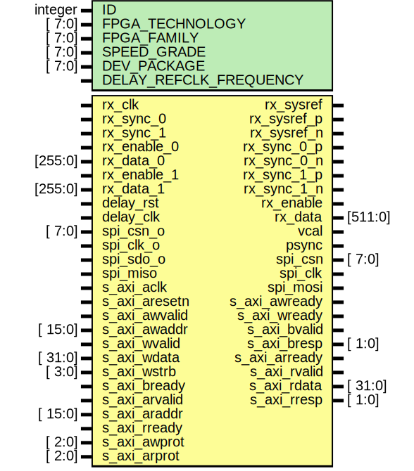

# Entity: axi_fmcadc5_sync

## Diagram

## Description

***************************************************************************
 ***************************************************************************
 Copyright 2014 - 2017 (c) Analog Devices, Inc. All rights reserved.
 In this HDL repository, there are many different and unique modules, consisting
 of various HDL (Verilog or VHDL) components. The individual modules are
 developed independently, and may be accompanied by separate and unique license
 terms.
 The user should read each of these license terms, and understand the
 freedoms and responsibilities that he or she has by using this source/core.
 This core is distributed in the hope that it will be useful, but WITHOUT ANY
 WARRANTY; without even the implied warranty of MERCHANTABILITY or FITNESS FOR
 A PARTICULAR PURPOSE.
 Redistribution and use of source or resulting binaries, with or without modification
 of this file, are permitted under one of the following two license terms:
   1. The GNU General Public License version 2 as published by the
      Free Software Foundation, which can be found in the top level directory
      of this repository (LICENSE_GPL2), and also online at:
      <https://www.gnu.org/licenses/old-licenses/gpl-2.0.html>
 OR
   2. An ADI specific BSD license, which can be found in the top level directory
      of this repository (LICENSE_ADIBSD), and also on-line at:
      https://github.com/analogdevicesinc/hdl/blob/master/LICENSE_ADIBSD
      This will allow to generate bit files and not release the source code,
      as long as it attaches to an ADI device.
 ***************************************************************************
 ***************************************************************************
 this module is a helper core for linux. as much as possible, try not to use this core.
 best thing to do is look at no-os and implement a proper frame work in linux.
 most controls are scattered around other cores, here we collect them to provide a common access.
 
## Generics

| Generic name           | Type    | Value | Description |
| ---------------------- | ------- | ----- | ----------- |
| ID                     | integer | 0     |             |
| FPGA_TECHNOLOGY        | [ 7:0]  | 0     |             |
| FPGA_FAMILY            | [ 7:0]  | 0     |             |
| SPEED_GRADE            | [ 7:0]  | 0     |             |
| DEV_PACKAGE            | [ 7:0]  | 0     |             |
| DELAY_REFCLK_FREQUENCY |         | 200   |             |
## Ports

| Port name     | Direction | Type    | Description                |
| ------------- | --------- | ------- | -------------------------- |
| rx_clk        | input     |         | receive interface          |
| rx_sysref     | output    |         |                            |
| rx_sync_0     | input     |         |                            |
| rx_sync_1     | input     |         |                            |
| rx_sysref_p   | output    |         |                            |
| rx_sysref_n   | output    |         |                            |
| rx_sync_0_p   | output    |         |                            |
| rx_sync_0_n   | output    |         |                            |
| rx_sync_1_p   | output    |         |                            |
| rx_sync_1_n   | output    |         |                            |
| rx_enable_0   | input     |         |                            |
| rx_data_0     | input     | [255:0] |                            |
| rx_enable_1   | input     |         |                            |
| rx_data_1     | input     | [255:0] |                            |
| rx_enable     | output    |         |                            |
| rx_data       | output    | [511:0] |                            |
| vcal          | output    |         | calibration signal         |
| psync         | output    |         | switching regulator clocks |
| delay_rst     | input     |         | delay interface            |
| delay_clk     | input     |         |                            |
| spi_csn_o     | input     | [  7:0] | spi override               |
| spi_clk_o     | input     |         |                            |
| spi_sdo_o     | input     |         |                            |
| spi_csn       | output    | [  7:0] |                            |
| spi_clk       | output    |         |                            |
| spi_mosi      | output    |         |                            |
| spi_miso      | input     |         |                            |
| s_axi_aclk    | input     |         | axi interface              |
| s_axi_aresetn | input     |         |                            |
| s_axi_awvalid | input     |         |                            |
| s_axi_awaddr  | input     | [ 15:0] |                            |
| s_axi_awready | output    |         |                            |
| s_axi_wvalid  | input     |         |                            |
| s_axi_wdata   | input     | [ 31:0] |                            |
| s_axi_wstrb   | input     | [  3:0] |                            |
| s_axi_wready  | output    |         |                            |
| s_axi_bvalid  | output    |         |                            |
| s_axi_bresp   | output    | [  1:0] |                            |
| s_axi_bready  | input     |         |                            |
| s_axi_arvalid | input     |         |                            |
| s_axi_araddr  | input     | [ 15:0] |                            |
| s_axi_arready | output    |         |                            |
| s_axi_rvalid  | output    |         |                            |
| s_axi_rdata   | output    | [ 31:0] |                            |
| s_axi_rresp   | output    | [  1:0] |                            |
| s_axi_rready  | input     |         |                            |
| s_axi_awprot  | input     | [  2:0] |                            |
| s_axi_arprot  | input     | [  2:0] |                            |
## Signals

| Name                   | Type            | Description         |
| ---------------------- | --------------- | ------------------- |
| up_psync_count         | reg     [  7:0] | internal registers  |
| up_psync               | reg             |                     |
| up_cal_done_t_m1       | reg             |                     |
| up_cal_done_t_m2       | reg             |                     |
| up_cal_done_t_m3       | reg             |                     |
| up_cal_max_0           | reg     [ 15:0] |                     |
| up_cal_min_0           | reg     [ 15:0] |                     |
| up_cal_max_1           | reg     [ 15:0] |                     |
| up_cal_min_1           | reg     [ 15:0] |                     |
| up_cal_enable          | reg             |                     |
| up_cor_enable          | reg             |                     |
| up_cor_enable_t        | reg             |                     |
| up_cor_scale_0         | reg     [ 15:0] |                     |
| up_cor_offset_0        | reg     [ 15:0] |                     |
| up_cor_scale_1         | reg     [ 15:0] |                     |
| up_cor_offset_1        | reg     [ 15:0] |                     |
| up_vcal_8              | reg     [  7:0] |                     |
| up_vcal                | reg             |                     |
| up_vcal_cnt            | reg     [  7:0] |                     |
| up_vcal_enable         | reg             |                     |
| up_sysref_ack_t_m1     | reg             |                     |
| up_sysref_ack_t_m2     | reg             |                     |
| up_sysref_ack_t_m3     | reg             |                     |
| up_sysref_control_t    | reg             |                     |
| up_sysref_mode_e       | reg     [  1:0] |                     |
| up_sysref_mode_i       | reg             |                     |
| up_sysref_req_t        | reg             |                     |
| up_sysref_status       | reg             |                     |
| up_sync_control_t      | reg             |                     |
| up_sync_mode           | reg             |                     |
| up_sync_disable_1      | reg             |                     |
| up_sync_disable_0      | reg             |                     |
| up_sync_status_t_m1    | reg             |                     |
| up_sync_status_t_m2    | reg             |                     |
| up_sync_status_t_m3    | reg             |                     |
| up_sync_status_1       | reg             |                     |
| up_sync_status_0       | reg             |                     |
| up_delay_ld            | reg             |                     |
| up_delay_wdata         | reg     [  4:0] |                     |
| up_spi_csn_int         | reg     [  7:0] |                     |
| up_spi_clk_int         | reg             |                     |
| up_spi_mosi_int        | reg             |                     |
| up_spi_gnt             | reg             |                     |
| up_spi_req             | reg             |                     |
| up_spi_csn             | reg     [  7:0] |                     |
| up_spi_cnt             | reg     [  5:0] |                     |
| up_spi_clk_32          | reg     [ 31:0] |                     |
| up_spi_out_32          | reg     [ 31:0] |                     |
| up_spi_in_32           | reg     [ 31:0] |                     |
| up_spi_out             | reg     [  7:0] |                     |
| up_scratch             | reg     [ 31:0] |                     |
| up_timer               | reg     [ 31:0] |                     |
| up_wack                | reg             |                     |
| up_rack                | reg             |                     |
| up_rdata               | reg     [ 31:0] |                     |
| rx_cal_enable_m1       | reg             |                     |
| rx_cal_enable          | reg             |                     |
| rx_cor_enable_t_m1     | reg             |                     |
| rx_cor_enable_t_m2     | reg             |                     |
| rx_cor_enable_t_m3     | reg             |                     |
| rx_cor_enable          | reg             |                     |
| rx_cor_scale_0         | reg     [ 15:0] |                     |
| rx_cor_offset_0        | reg     [ 15:0] |                     |
| rx_cor_scale_1         | reg     [ 15:0] |                     |
| rx_cor_offset_1        | reg     [ 15:0] |                     |
| rx_cor_scale_d_0       | reg     [ 15:0] |                     |
| rx_cor_offset_d_0      | reg     [ 15:0] |                     |
| rx_cor_scale_d_1       | reg     [ 15:0] |                     |
| rx_cor_offset_d_1      | reg     [ 15:0] |                     |
| rx_sysref_cnt          | reg     [  7:0] |                     |
| rx_sysref_control_t_m1 | reg             |                     |
| rx_sysref_control_t_m2 | reg             |                     |
| rx_sysref_control_t_m3 | reg             |                     |
| rx_sysref_mode_e       | reg     [  1:0] |                     |
| rx_sysref_mode_i       | reg             |                     |
| rx_sysref_req_t_m1     | reg             |                     |
| rx_sysref_req_t_m2     | reg             |                     |
| rx_sysref_req_t_m3     | reg             |                     |
| rx_sysref_req          | reg             |                     |
| rx_sysref_e            | reg             |                     |
| rx_sysref_i            | reg             |                     |
| rx_sysref_ack_t        | reg             |                     |
| rx_sysref_enb_e        | reg             |                     |
| rx_sysref_enb_i        | reg             |                     |
| rx_sync_control_t_m1   | reg             |                     |
| rx_sync_control_t_m2   | reg             |                     |
| rx_sync_control_t_m3   | reg             |                     |
| rx_sync_mode           | reg             |                     |
| rx_sync_disable_1      | reg             |                     |
| rx_sync_disable_0      | reg             |                     |
| rx_sync_out_1          | reg             |                     |
| rx_sync_out_0          | reg             |                     |
| rx_sync_cnt            | reg     [  7:0] |                     |
| rx_sync_hold_1         | reg             |                     |
| rx_sync_hold_0         | reg             |                     |
| rx_sync_status_t       | reg             |                     |
| rx_sync_status_1       | reg             |                     |
| rx_sync_status_0       | reg             |                     |
| up_cal_done_t_s        | wire            | internal signals    |
| up_sysref_ack_t_s      | wire            |                     |
| up_sync_status_t_s     | wire            |                     |
| up_spi_gnt_s           | wire            |                     |
| up_spi_out_32_s        | wire [ 31:0]    |                     |
| up_spi_in_s            | wire [  7:0]    |                     |
| rx_cor_enable_t_s      | wire            |                     |
| rx_cal_done_t_s        | wire            |                     |
| rx_cal_max_0_s         | wire [ 15:0]    |                     |
| rx_cal_min_0_s         | wire [ 15:0]    |                     |
| rx_cal_max_1_s         | wire [ 15:0]    |                     |
| rx_cal_min_1_s         | wire [ 15:0]    |                     |
| rx_sysref_control_t_s  | wire            |                     |
| rx_sysref_req_t_s      | wire            |                     |
| rx_sysref_enb_e_s      | wire            |                     |
| rx_sync_control_t_s    | wire            |                     |
| up_delay_rdata_s       | wire [  4:0]    |                     |
| up_delay_locked_s      | wire            |                     |
| up_wreq_s              | wire            |                     |
| up_waddr_s             | wire [ 13:0]    |                     |
| up_wdata_s             | wire [ 31:0]    |                     |
| up_rreq_s              | wire            |                     |
| up_raddr_s             | wire [ 13:0]    |                     |
| up_rstn                | wire            |                     |
| up_clk                 | wire            |                     |
## Constants

| Name          | Type   | Value        | Description |
| ------------- | ------ | ------------ | ----------- |
| PCORE_VERSION | [31:0] | 32'h00040063 | version     |
## Processes
- unnamed: ( @(negedge up_rstn or posedge up_clk) )
- unnamed: ( @(negedge up_rstn or posedge up_clk) )
**Description**
calibration (offset & gain only)

- unnamed: ( @(negedge up_rstn or posedge up_clk) )
- unnamed: ( @(negedge up_rstn or posedge up_clk) )
- unnamed: ( @(negedge up_rstn or posedge up_clk) )
- unnamed: ( @(negedge up_rstn or posedge up_clk) )
- unnamed: ( @(negedge up_rstn or posedge up_clk) )
- unnamed: ( @(negedge up_rstn or posedge up_clk) )
**Description**
sync register(s)

- unnamed: ( @(negedge up_rstn or posedge up_clk) )
- unnamed: ( @(negedge up_rstn or posedge up_clk) )
**Description**
delay register(s)

- unnamed: ( @(negedge up_clk) )
- unnamed: ( @(posedge up_clk or negedge up_rstn) )
- unnamed: ( @(negedge up_rstn or posedge up_clk) )
**Description**
spi register(s)

- unnamed: ( @(negedge up_rstn or posedge up_clk) )
**Description**
scratch register(s)

- unnamed: ( @(negedge up_rstn or posedge up_clk) )
**Description**
processor read interface

- unnamed: ( @(posedge rx_clk) )
**Description**
calibration at receive clock

- unnamed: ( @(posedge rx_clk) )
- unnamed: ( @(posedge rx_clk) )
- unnamed: ( @(posedge rx_clk) )
**Description**
sysref-control at receive clock

- unnamed: ( @(posedge rx_clk) )
- unnamed: ( @(posedge rx_clk) )
- unnamed: ( @(posedge rx_clk) )
- unnamed: ( @(posedge rx_clk) )
## Instantiations

- i_calcor: axi_fmcadc5_sync_calcor
- i_obufds_rx_sync_1: OBUFDS
**Description**
sync buffers

- i_obufds_rx_sync_0: OBUFDS
- i_rx_sysref: ad_data_out
- i_up_axi: up_axi
**Description**
up == micro("u") processor

