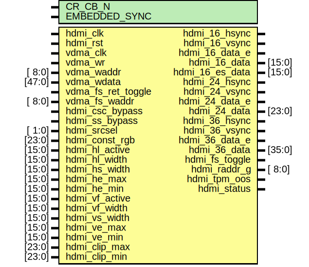

# Entity: axi_hdmi_tx_core

- **File**: axi_hdmi_tx_core.v
## Diagram

## Description

 ***************************************************************************
 ***************************************************************************
 Copyright 2014 - 2017 (c) Analog Devices, Inc. All rights reserved.

 In this HDL repository, there are many different and unique modules, consisting
 of various HDL (Verilog or VHDL) components. The individual modules are
 developed independently, and may be accompanied by separate and unique license
 terms.

 The user should read each of these license terms, and understand the
 freedoms and responsibilities that he or she has by using this source/core.

 This core is distributed in the hope that it will be useful, but WITHOUT ANY
 WARRANTY; without even the implied warranty of MERCHANTABILITY or FITNESS FOR
 A PARTICULAR PURPOSE.

 Redistribution and use of source or resulting binaries, with or without modification
 of this file, are permitted under one of the following two license terms:

   1. The GNU General Public License version 2 as published by the
      Free Software Foundation, which can be found in the top level directory
      of this repository (LICENSE_GPL2), and also online at:
      <https://www.gnu.org/licenses/old-licenses/gpl-2.0.html>

 OR

   2. An ADI specific BSD license, which can be found in the top level directory
      of this repository (LICENSE_ADIBSD), and also on-line at:
      https://github.com/analogdevicesinc/hdl/blob/master/LICENSE_ADIBSD
      This will allow to generate bit files and not release the source code,
      as long as it attaches to an ADI device.

 ***************************************************************************
 ***************************************************************************
 Transmit HDMI, video dma data in, hdmi separate syncs data out.

## Generics

| Generic name  | Type | Value | Description |
| ------------- | ---- | ----- | ----------- |
| CR_CB_N       |      | 0     |             |
| EMBEDDED_SYNC |      | 0     |             |
## Ports

| Port name          | Direction | Type   | Description          |
| ------------------ | --------- | ------ | -------------------- |
| hdmi_clk           | input     |        |  hdmi interface      |
| hdmi_rst           | input     |        |                      |
| hdmi_16_hsync      | output    |        |  16-bit interface    |
| hdmi_16_vsync      | output    |        |                      |
| hdmi_16_data_e     | output    |        |                      |
| hdmi_16_data       | output    | [15:0] |                      |
| hdmi_16_es_data    | output    | [15:0] |                      |
| hdmi_24_hsync      | output    |        |  24-bit interface    |
| hdmi_24_vsync      | output    |        |                      |
| hdmi_24_data_e     | output    |        |                      |
| hdmi_24_data       | output    | [23:0] |                      |
| hdmi_36_hsync      | output    |        |  36-bit interface    |
| hdmi_36_vsync      | output    |        |                      |
| hdmi_36_data_e     | output    |        |                      |
| hdmi_36_data       | output    | [35:0] |                      |
| hdmi_fs_toggle     | output    |        |  control signals     |
| hdmi_raddr_g       | output    | [ 8:0] |                      |
| hdmi_tpm_oos       | output    |        |                      |
| hdmi_status        | output    |        |                      |
| vdma_clk           | input     |        |  vdma interface      |
| vdma_wr            | input     |        |                      |
| vdma_waddr         | input     | [ 8:0] |                      |
| vdma_wdata         | input     | [47:0] |                      |
| vdma_fs_ret_toggle | input     |        |                      |
| vdma_fs_waddr      | input     | [ 8:0] |                      |
| hdmi_csc_bypass    | input     |        |  processor interface |
| hdmi_ss_bypass     | input     |        |                      |
| hdmi_srcsel        | input     | [ 1:0] |                      |
| hdmi_const_rgb     | input     | [23:0] |                      |
| hdmi_hl_active     | input     | [15:0] |                      |
| hdmi_hl_width      | input     | [15:0] |                      |
| hdmi_hs_width      | input     | [15:0] |                      |
| hdmi_he_max        | input     | [15:0] |                      |
| hdmi_he_min        | input     | [15:0] |                      |
| hdmi_vf_active     | input     | [15:0] |                      |
| hdmi_vf_width      | input     | [15:0] |                      |
| hdmi_vs_width      | input     | [15:0] |                      |
| hdmi_ve_max        | input     | [15:0] |                      |
| hdmi_ve_min        | input     | [15:0] |                      |
| hdmi_clip_max      | input     | [23:0] |                      |
| hdmi_clip_min      | input     | [23:0] |                      |
## Signals

| Name                     | Type           | Description          |
| ------------------------ | -------------- | -------------------- |
| hdmi_enable              | reg            |  internal registers  |
| hdmi_hs_count            | reg     [15:0] |                      |
| hdmi_vs_count            | reg     [15:0] |                      |
| hdmi_fs                  | reg            |                      |
| hdmi_fs_ret_toggle_m1    | reg            |                      |
| hdmi_fs_ret_toggle_m2    | reg            |                      |
| hdmi_fs_ret_toggle_m3    | reg            |                      |
| hdmi_fs_ret              | reg            |                      |
| hdmi_fs_waddr            | reg     [ 8:0] |                      |
| hdmi_hs                  | reg            |                      |
| hdmi_vs                  | reg            |                      |
| hdmi_hs_de               | reg            |                      |
| hdmi_vs_de               | reg            |                      |
| hdmi_raddr               | reg     [ 9:0] |                      |
| hdmi_hs_d                | reg            |                      |
| hdmi_vs_d                | reg            |                      |
| hdmi_hs_de_d             | reg            |                      |
| hdmi_vs_de_d             | reg            |                      |
| hdmi_de_d                | reg            |                      |
| hdmi_data_sel_d          | reg            |                      |
| hdmi_hs_2d               | reg            |                      |
| hdmi_vs_2d               | reg            |                      |
| hdmi_hs_de_2d            | reg            |                      |
| hdmi_vs_de_2d            | reg            |                      |
| hdmi_de_2d               | reg            |                      |
| hdmi_data_sel_2d         | reg            |                      |
| hdmi_data_2d             | reg     [47:0] |                      |
| hdmi_tpm_data            | reg     [23:0] |                      |
| hdmi_hsync               | reg            |                      |
| hdmi_vsync               | reg            |                      |
| hdmi_hsync_data_e        | reg            |                      |
| hdmi_vsync_data_e        | reg            |                      |
| hdmi_data_e              | reg            |                      |
| hdmi_data                | reg     [23:0] |                      |
| hdmi_24_csc_hsync        | reg            |                      |
| hdmi_24_csc_vsync        | reg            |                      |
| hdmi_24_csc_hsync_data_e | reg            |                      |
| hdmi_24_csc_vsync_data_e | reg            |                      |
| hdmi_24_csc_data_e       | reg            |                      |
| hdmi_24_csc_data         | reg     [23:0] |                      |
| hdmi_16_hsync_d          | reg            |                      |
| hdmi_16_vsync_d          | reg            |                      |
| hdmi_16_hsync_data_e_d   | reg            |                      |
| hdmi_16_vsync_data_e_d   | reg            |                      |
| hdmi_16_data_e_d         | reg            |                      |
| hdmi_16_data_d           | reg     [15:0] |                      |
| hdmi_es_hs_de            | reg            |                      |
| hdmi_es_vs_de            | reg            |                      |
| hdmi_es_data             | reg     [15:0] |                      |
| hdmi_clip_data           | reg     [23:0] |                      |
| hdmi_clip_hs_de_d        | reg            |                      |
| hdmi_clip_vs_de_d        | reg            |                      |
| hdmi_clip_hs_d           | reg            |                      |
| hdmi_clip_vs_d           | reg            |                      |
| hdmi_clip_de_d           | reg            |                      |
| hdmi_hl_width_s          | wire [15:0]    |  internal wires      |
| hdmi_vf_width_s          | wire [15:0]    |                      |
| hdmi_he_width_s          | wire [15:0]    |                      |
| hdmi_ve_width_s          | wire [15:0]    |                      |
| hdmi_fs_ret_s            | wire           |                      |
| hdmi_de_s                | wire           |                      |
| hdmi_rdata_s             | wire [47:0]    |                      |
| hdmi_data_2d_s           | wire [23:0]    |                      |
| hdmi_tpm_mismatch_s      | wire           |                      |
| hdmi_tpg_data_s          | wire [23:0]    |                      |
| hdmi_csc_hsync_s         | wire           |                      |
| hdmi_csc_vsync_s         | wire           |                      |
| hdmi_csc_hsync_data_e_s  | wire           |                      |
| hdmi_csc_vsync_data_e_s  | wire           |                      |
| hdmi_csc_data_e_s        | wire           |                      |
| hdmi_csc_data_s          | wire [23:0]    |                      |
| hdmi_ss_hsync_s          | wire           |                      |
| hdmi_ss_vsync_s          | wire           |                      |
| hdmi_ss_hsync_data_e_s   | wire           |                      |
| hdmi_ss_vsync_data_e_s   | wire           |                      |
| hdmi_ss_data_e_s         | wire           |                      |
| hdmi_ss_data_s           | wire [15:0]    |                      |
| hdmi_es_data_s           | wire [15:0]    |                      |
## Functions
- b2g () return ([8:0])
**Description**
 binary to grey conversion

## Processes
- unnamed: ( @(posedge hdmi_clk) )
  - **Type:** always
**Description**
 status and enable 
- unnamed: ( @(posedge hdmi_clk) )
  - **Type:** always
**Description**
 hdmi counters 
- unnamed: ( @(posedge hdmi_clk) )
  - **Type:** always
**Description**
 hdmi start of frame 
- unnamed: ( @(posedge hdmi_clk or posedge hdmi_rst) )
  - **Type:** always
- unnamed: ( @(posedge hdmi_clk) )
  - **Type:** always
- unnamed: ( @(posedge hdmi_clk) )
  - **Type:** always
**Description**
 hdmi sync signals 
- unnamed: ( @(posedge hdmi_clk) )
  - **Type:** always
- unnamed: ( @(posedge hdmi_clk) )
  - **Type:** always
**Description**
 control and data pipe line 
- unnamed: ( @(posedge hdmi_clk) )
  - **Type:** always
- unnamed: ( @(posedge hdmi_clk) )
  - **Type:** always
**Description**
 hdmi data select 
- unnamed: ( @(posedge hdmi_clk) )
  - **Type:** always
**Description**
 Color space conversion bypass (RGB/YCbCr) 
- unnamed: ( @(posedge hdmi_clk) )
  - **Type:** always
**Description**
 hdmi clipping 
- unnamed: ( @(posedge hdmi_clk) )
  - **Type:** always
**Description**
 hdmi csc 16, 24 and 36 outputs 
- unnamed: ( @(posedge hdmi_clk) )
  - **Type:** always
**Description**
 hdmi embedded sync 
## Instantiations

- i_mem: ad_mem
**Description**
 data memory

- i_csc_RGB2CrYCb: ad_csc_RGB2CrYCb
**Description**
 color space coversion, RGB to CrYCb

- i_ss_444to422: ad_ss_444to422
**Description**
 sub sampling, 444 to 422

- i_es: axi_hdmi_tx_es
**Description**
 embedded sync

