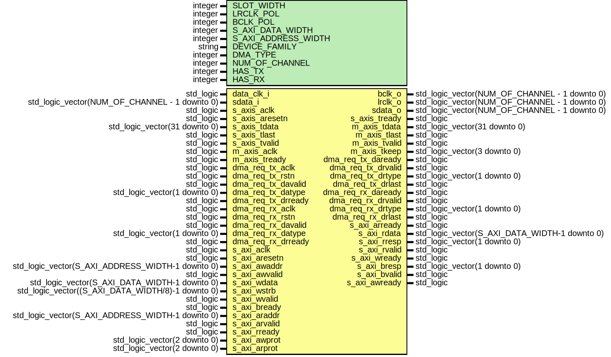

# Entity: axi_i2s_adi

## Diagram

## Description

***************************************************************************
***************************************************************************
Copyright 2014 - 2017 (c) Analog Devices, Inc. All rights reserved.
In this HDL repository, there are many different and unique modules, consisting
of various HDL (Verilog or VHDL) components. The individual modules are
developed independently, and may be accompanied by separate and unique license
terms.
The user should read each of these license terms, and understand the
freedoms and responsibilities that he or she has by using this source/core.
This core is distributed in the hope that it will be useful, but WITHOUT ANY
WARRANTY; without even the implied warranty of MERCHANTABILITY or FITNESS FOR
A PARTICULAR PURPOSE.
Redistribution and use of source or resulting binaries, with or without modification
of this file, are permitted under one of the following two license terms:
  1. The GNU General Public License version 2 as published by the
     Free Software Foundation, which can be found in the top level directory
     of this repository (LICENSE_GPL2), and also online at:
     <https://www.gnu.org/licenses/old-licenses/gpl-2.0.html>
OR
  2. An ADI specific BSD license, which can be found in the top level directory
     of this repository (LICENSE_ADIBSD), and also on-line at:
     https://github.com/analogdevicesinc/hdl/blob/master/LICENSE_ADIBSD
     This will allow to generate bit files and not release the source code,
     as long as it attaches to an ADI device.
***************************************************************************
***************************************************************************
## Generics

| Generic name        | Type    | Value     | Description                                                                                                                                           |
| ------------------- | ------- | --------- | ----------------------------------------------------------------------------------------------------------------------------------------------------- |
| SLOT_WIDTH          | integer | 24        | ADD USER GENERICS BELOW THIS LINE ---------------                                                                                                     |
| LRCLK_POL           | integer | 0         | LRCLK Polarity (0 - Falling edge, 1 - Rising edge)                                                                                                    |
| BCLK_POL            | integer | 0         | BCLK Polarity (0 - Falling edge, 1 - Rising edge)                                                                                                     |
| S_AXI_DATA_WIDTH    | integer | 32        | ADD USER GENERICS ABOVE THIS LINE --------------- DO NOT EDIT BELOW THIS LINE --------------------- Bus protocol parameters, do not add to or delete  |
| S_AXI_ADDRESS_WIDTH | integer | 32        |                                                                                                                                                       |
| DEVICE_FAMILY       | string  | "virtex6" |                                                                                                                                                       |
| DMA_TYPE            | integer | 0         | DO NOT EDIT ABOVE THIS LINE ---------------------                                                                                                     |
| NUM_OF_CHANNEL      | integer | 1         |                                                                                                                                                       |
| HAS_TX              | integer | 1         |                                                                                                                                                       |
| HAS_RX              | integer | 1         |                                                                                                                                                       |
## Ports

| Port name          | Direction | Type                                              | Description                    |
| ------------------ | --------- | ------------------------------------------------- | ------------------------------ |
| data_clk_i         | in        | std_logic                                         | Serial Data interface          |
| bclk_o             | out       | std_logic_vector(NUM_OF_CHANNEL - 1 downto 0)     |                                |
| lrclk_o            | out       | std_logic_vector(NUM_OF_CHANNEL - 1 downto 0)     |                                |
| sdata_o            | out       | std_logic_vector(NUM_OF_CHANNEL - 1 downto 0)     |                                |
| sdata_i            | in        | std_logic_vector(NUM_OF_CHANNEL - 1 downto 0)     |                                |
| s_axis_aclk        | in        | std_logic                                         | AXI Streaming DMA TX interface |
| s_axis_aresetn     | in        | std_logic                                         |                                |
| s_axis_tready      | out       | std_logic                                         |                                |
| s_axis_tdata       | in        | std_logic_vector(31 downto 0)                     |                                |
| s_axis_tlast       | in        | std_logic                                         |                                |
| s_axis_tvalid      | in        | std_logic                                         |                                |
| m_axis_aclk        | in        | std_logic                                         | AXI Streaming DMA RX interface |
| m_axis_tready      | in        | std_logic                                         |                                |
| m_axis_tdata       | out       | std_logic_vector(31 downto 0)                     |                                |
| m_axis_tlast       | out       | std_logic                                         |                                |
| m_axis_tvalid      | out       | std_logic                                         |                                |
| m_axis_tkeep       | out       | std_logic_vector(3 downto 0)                      |                                |
| dma_req_tx_aclk    | in        | std_logic                                         |                                |
| dma_req_tx_rstn    | in        | std_logic                                         |                                |
| dma_req_tx_davalid | in        | std_logic                                         |                                |
| dma_req_tx_datype  | in        | std_logic_vector(1 downto 0)                      |                                |
| dma_req_tx_daready | out       | std_logic                                         |                                |
| dma_req_tx_drvalid | out       | std_logic                                         |                                |
| dma_req_tx_drtype  | out       | std_logic_vector(1 downto 0)                      |                                |
| dma_req_tx_drlast  | out       | std_logic                                         |                                |
| dma_req_tx_drready | in        | std_logic                                         |                                |
| dma_req_rx_aclk    | in        | std_logic                                         | PL330 DMA RX interface         |
| dma_req_rx_rstn    | in        | std_logic                                         |                                |
| dma_req_rx_davalid | in        | std_logic                                         |                                |
| dma_req_rx_datype  | in        | std_logic_vector(1 downto 0)                      |                                |
| dma_req_rx_daready | out       | std_logic                                         |                                |
| dma_req_rx_drvalid | out       | std_logic                                         |                                |
| dma_req_rx_drtype  | out       | std_logic_vector(1 downto 0)                      |                                |
| dma_req_rx_drlast  | out       | std_logic                                         |                                |
| dma_req_rx_drready | in        | std_logic                                         |                                |
| s_axi_aclk         | in        | std_logic                                         | AXI bus interface              |
| s_axi_aresetn      | in        | std_logic                                         |                                |
| s_axi_awaddr       | in        | std_logic_vector(S_AXI_ADDRESS_WIDTH-1 downto 0)  |                                |
| s_axi_awvalid      | in        | std_logic                                         |                                |
| s_axi_wdata        | in        | std_logic_vector(S_AXI_DATA_WIDTH-1 downto 0)     |                                |
| s_axi_wstrb        | in        | std_logic_vector((S_AXI_DATA_WIDTH/8)-1 downto 0) |                                |
| s_axi_wvalid       | in        | std_logic                                         |                                |
| s_axi_bready       | in        | std_logic                                         |                                |
| s_axi_araddr       | in        | std_logic_vector(S_AXI_ADDRESS_WIDTH-1 downto 0)  |                                |
| s_axi_arvalid      | in        | std_logic                                         |                                |
| s_axi_rready       | in        | std_logic                                         |                                |
| s_axi_arready      | out       | std_logic                                         |                                |
| s_axi_rdata        | out       | std_logic_vector(S_AXI_DATA_WIDTH-1 downto 0)     |                                |
| s_axi_rresp        | out       | std_logic_vector(1 downto 0)                      |                                |
| s_axi_rvalid       | out       | std_logic                                         |                                |
| s_axi_wready       | out       | std_logic                                         |                                |
| s_axi_bresp        | out       | std_logic_vector(1 downto 0)                      |                                |
| s_axi_bvalid       | out       | std_logic                                         |                                |
| s_axi_awready      | out       | std_logic                                         |                                |
| s_axi_awprot       | in        | std_logic_vector(2 downto 0)                      |                                |
| s_axi_arprot       | in        | std_logic_vector(2 downto 0)                      |                                |
## Signals

| Name                  | Type                                      | Description     |
| --------------------- | ----------------------------------------- | --------------- |
| i2s_reset             | std_logic                                 |                 |
| tx_fifo_reset         | std_logic                                 |                 |
| tx_enable             | Boolean                                   |                 |
| tx_data               | std_logic_vector(SLOT_WIDTH - 1 downto 0) |                 |
| tx_ack                | std_logic                                 |                 |
| tx_stb                | std_logic                                 |                 |
| rx_enable             | Boolean                                   |                 |
| rx_fifo_reset         | std_logic                                 |                 |
| rx_data               | std_logic_vector(SLOT_WIDTH - 1 downto 0) |                 |
| rx_ack                | std_logic                                 |                 |
| rx_stb                | std_logic                                 |                 |
| const_1               | std_logic                                 |                 |
| bclk_div_rate         | natural range 0 to 255                    |                 |
| lrclk_div_rate        | natural range 0 to 255                    |                 |
| period_len            | integer range 0 to 65535                  |                 |
| I2S_RESET_REG         | std_logic_vector(31 downto 0)             |                 |
| I2S_CONTROL_REG       | std_logic_vector(31 downto 0)             |                 |
| I2S_CLK_CONTROL_REG   | std_logic_vector(31 downto 0)             |                 |
| PERIOD_LEN_REG        | std_logic_vector(31 downto 0)             |                 |
| audio_fifo_rx         | RAM_TYPE                                  | RX FIFO signals |
| audio_fifo_rx_wr_addr | integer range 0 to 2**RAM_ADDR_WIDTH-1    |                 |
| audio_fifo_rx_rd_addr | integer range 0 to 2**RAM_ADDR_WIDTH-1    |                 |
| tvalid                | std_logic                                 |                 |
| rx_tlast              | std_logic                                 |                 |
| drain_tx_dma          | std_logic                                 |                 |
| rx_sample             | std_logic_vector(23 downto 0)             |                 |
| wr_data               | std_logic_vector(31 downto 0)             |                 |
| rd_data               | std_logic_vector(31 downto 0)             |                 |
| wr_addr               | integer range 0 to 11                     |                 |
| rd_addr               | integer range 0 to 11                     |                 |
| wr_stb                | std_logic                                 |                 |
| rd_ack                | std_logic                                 |                 |
| tx_fifo_stb           | std_logic                                 |                 |
| rx_fifo_ack           | std_logic                                 |                 |
| cnt                   | integer range 0 to 2**16-1                |                 |
## Constants

| Name           | Type    | Value                                          | Description        |
| -------------- | ------- | ---------------------------------------------- | ------------------ |
| FIFO_AWIDTH    | integer |  integer(ceil(log2(real(NUM_OF_CHANNEL * 8)))) |                    |
| RAM_ADDR_WIDTH | integer |  7                                             | Audio samples FIFO |
## Types

| Name     | Type | Description |
| -------- | ---- | ----------- |
| RAM_TYPE |      |             |
## Processes
- unnamed: ( s_axi_aclk )
- unnamed: ( rd_addr, I2S_CONTROL_REG, I2S_CLK_CONTROL_REG, PERIOD_LEN_REG, rx_sample, cnt )
- unnamed: ( s_axi_aclk )
## Instantiations

- ctrl: i2s_controller
- ctrlif: axi_ctrlif
