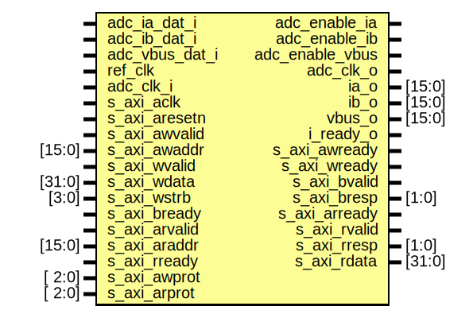

# Entity: axi_mc_current_monitor

- **File**: axi_mc_current_monitor.v
## Diagram

## Description

 ***************************************************************************
 ***************************************************************************
 Copyright 2014 - 2017 (c) Analog Devices, Inc. All rights reserved.

 In this HDL repository, there are many different and unique modules, consisting
 of various HDL (Verilog or VHDL) components. The individual modules are
 developed independently, and may be accompanied by separate and unique license
 terms.

 The user should read each of these license terms, and understand the
 freedoms and responsibilities that he or she has by using this source/core.

 This core is distributed in the hope that it will be useful, but WITHOUT ANY
 WARRANTY; without even the implied warranty of MERCHANTABILITY or FITNESS FOR
 A PARTICULAR PURPOSE.

 Redistribution and use of source or resulting binaries, with or without modification
 of this file, are permitted under one of the following two license terms:

   1. The GNU General Public License version 2 as published by the
      Free Software Foundation, which can be found in the top level directory
      of this repository (LICENSE_GPL2), and also online at:
      <https://www.gnu.org/licenses/old-licenses/gpl-2.0.html>

 OR

   2. An ADI specific BSD license, which can be found in the top level directory
      of this repository (LICENSE_ADIBSD), and also on-line at:
      https://github.com/analogdevicesinc/hdl/blob/master/LICENSE_ADIBSD
      This will allow to generate bit files and not release the source code,
      as long as it attaches to an ADI device.

 ***************************************************************************
 ***************************************************************************

## Ports

| Port name       | Direction | Type   | Description         |
| --------------- | --------- | ------ | ------------------- |
| adc_ia_dat_i    | input     |        |  physical interface |
| adc_enable_ia   | output    |        |                     |
| adc_ib_dat_i    | input     |        |                     |
| adc_enable_ib   | output    |        |                     |
| adc_vbus_dat_i  | input     |        |                     |
| adc_enable_vbus | output    |        |                     |
| adc_clk_o       | output    |        |                     |
| ref_clk         | input     |        |                     |
| adc_clk_i       | input     |        |                     |
| ia_o            | output    | [15:0] |                     |
| ib_o            | output    | [15:0] |                     |
| vbus_o          | output    | [15:0] |                     |
| i_ready_o       | output    |        |                     |
| s_axi_aclk      | input     |        |  axi interface      |
| s_axi_aresetn   | input     |        |                     |
| s_axi_awvalid   | input     |        |                     |
| s_axi_awaddr    | input     | [15:0] |                     |
| s_axi_awready   | output    |        |                     |
| s_axi_wvalid    | input     |        |                     |
| s_axi_wdata     | input     | [31:0] |                     |
| s_axi_wstrb     | input     | [3:0]  |                     |
| s_axi_wready    | output    |        |                     |
| s_axi_bvalid    | output    |        |                     |
| s_axi_bresp     | output    | [1:0]  |                     |
| s_axi_bready    | input     |        |                     |
| s_axi_arvalid   | input     |        |                     |
| s_axi_araddr    | input     | [15:0] |                     |
| s_axi_arready   | output    |        |                     |
| s_axi_rvalid    | output    |        |                     |
| s_axi_rresp     | output    | [1:0]  |                     |
| s_axi_rdata     | output    | [31:0] |                     |
| s_axi_rready    | input     |        |                     |
| s_axi_awprot    | input     | [ 2:0] |                     |
| s_axi_arprot    | input     | [ 2:0] |                     |
## Signals

| Name                  | Type           | Description                                                                                                                                                                                                                                                             |
| --------------------- | -------------- | ----------------------------------------------------------------------------------------------------------------------------------------------------------------------------------------------------------------------------------------------------------------------- |
| up_rdata              | reg     [31:0] | ------------------------------------------------------------------------------ ----------- Registers Declarations ------------------------------------------- ------------------------------------------------------------------------------                            |
| up_wack               | reg            |                                                                                                                                                                                                                                                                         |
| up_rack               | reg            |                                                                                                                                                                                                                                                                         |
| adc_rst               | wire           | ------------------------------------------------------------------------------ ----------- Wires Declarations ----------------------------------------------- ------------------------------------------------------------------------------  internal clocks & resets  |
| up_rstn               | wire           |                                                                                                                                                                                                                                                                         |
| up_clk                | wire           |                                                                                                                                                                                                                                                                         |
| up_rreq_s             | wire           |  internal signals                                                                                                                                                                                                                                                       |
| up_wreq_s             | wire           |                                                                                                                                                                                                                                                                         |
| up_waddr_s            | wire [13:0]    |                                                                                                                                                                                                                                                                         |
| up_raddr_s            | wire [13:0]    |                                                                                                                                                                                                                                                                         |
| up_wdata_s            | wire [31:0]    |                                                                                                                                                                                                                                                                         |
| up_adc_common_rdata_s | wire [31:0]    |                                                                                                                                                                                                                                                                         |
| up_adc_common_ack_s   | wire           |                                                                                                                                                                                                                                                                         |
| up_rdata_0_s          | wire [31:0]    |                                                                                                                                                                                                                                                                         |
| up_rdata_1_s          | wire [31:0]    |                                                                                                                                                                                                                                                                         |
| up_rdata_2_s          | wire [31:0]    |                                                                                                                                                                                                                                                                         |
| up_rack_0_s           | wire           |                                                                                                                                                                                                                                                                         |
| up_rack_1_s           | wire           |                                                                                                                                                                                                                                                                         |
| up_rack_2_s           | wire           |                                                                                                                                                                                                                                                                         |
| up_wack_0_s           | wire           |                                                                                                                                                                                                                                                                         |
| up_wack_1_s           | wire           |                                                                                                                                                                                                                                                                         |
| up_wack_2_s           | wire           |                                                                                                                                                                                                                                                                         |
| adc_status_a_s        | wire           |                                                                                                                                                                                                                                                                         |
| adc_data_ia_s         | wire [15:0]    |                                                                                                                                                                                                                                                                         |
| data_rd_ready_ia_s    | wire           |                                                                                                                                                                                                                                                                         |
| adc_status_b_s        | wire           |                                                                                                                                                                                                                                                                         |
| adc_data_ib_s         | wire [15:0]    |                                                                                                                                                                                                                                                                         |
| adc_status_vbus_s     | wire           |                                                                                                                                                                                                                                                                         |
| adc_data_vbus_s       | wire [15:0]    |                                                                                                                                                                                                                                                                         |
## Processes
- unnamed: ( @(negedge up_rstn or posedge up_clk) )
  - **Type:** always
 **Description**
 processor read interface 
## Instantiations

- ia_if: ad7401
 **Description**
 adc interfaces

- ib_if: ad7401
- vbus_if: ad7401
- i_up_adc_channel_ia: up_adc_channel
- i_up_adc_channel_ib: up_adc_channel
- i_up_adc_channel_vbus: up_adc_channel
- i_up_adc_common: up_adc_common
 **Description**
 common processor control

- i_up_axi: up_axi
 **Description**
 up bus interface

