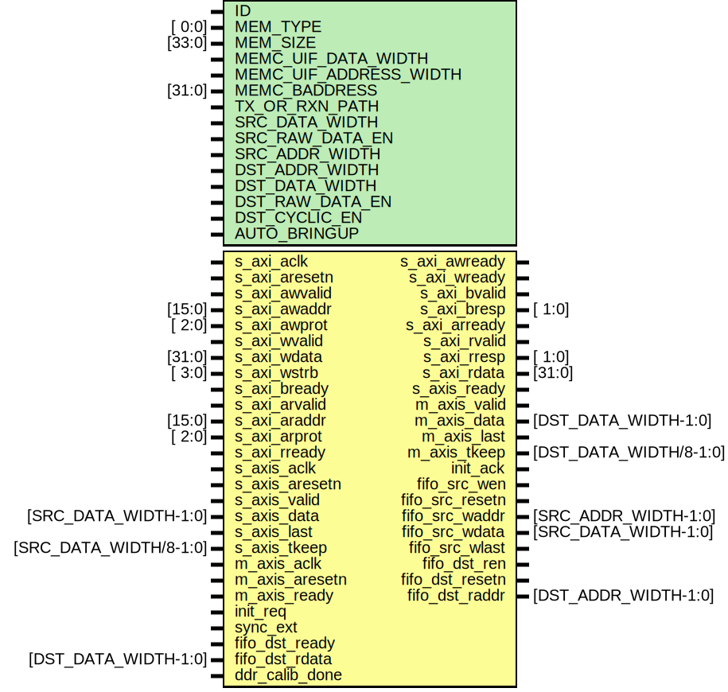

# Entity: data_offload

- **File**: data_offload.v
## Diagram

## Description

 ***************************************************************************
 ***************************************************************************
 Copyright 2018 (c) Analog Devices, Inc. All rights reserved.

 In this HDL repository, there are many different and unique modules, consisting
 of various HDL (Verilog or VHDL) components. The individual modules are
 developed independently, and may be accompanied by separate and unique license
 terms.

 The user should read each of these license terms, and understand the
 freedoms and responsibilities that he or she has by using this source/core.

 This core is distributed in the hope that it will be useful, but WITHOUT ANY
 WARRANTY; without even the implied warranty of MERCHANTABILITY or FITNESS FOR
 A PARTICULAR PURPOSE.

 Redistribution and use of source or resulting binaries, with or without modification
 of this file, are permitted under one of the following two license terms:

   1. The GNU General Public License version 2 as published by the
      Free Software Foundation, which can be found in the top level directory
      of this repository (LICENSE_GPL2), and also online at:
      <https://www.gnu.org/licenses/old-licenses/gpl-2.0.html>

 OR

   2. An ADI specific BSD license, which can be found in the top level directory
      of this repository (LICENSE_ADIBSD), and also on-line at:
      https://github.com/analogdevicesinc/hdl/blob/master/LICENSE_ADIBSD
      This will allow to generate bit files and not release the source code,
      as long as it attaches to an ADI device.

 ***************************************************************************
 ***************************************************************************

## Generics

| Generic name           | Type   | Value        | Description                                               |
| ---------------------- | ------ | ------------ | --------------------------------------------------------- |
| ID                     |        | 0            |                                                           |
| MEM_TYPE               | [ 0:0] | 1'b0         |  1'b0 -FPGA RAM; 1'b1 - external memory                   |
| MEM_SIZE               | [33:0] | 1024         |  memory size in bytes -1 - max 16 GB                      |
| MEMC_UIF_DATA_WIDTH    |        | 512          |                                                           |
| MEMC_UIF_ADDRESS_WIDTH |        | 31           |                                                           |
| MEMC_BADDRESS          | [31:0] | 32'h00000000 |                                                           |
| TX_OR_RXN_PATH         |        | 0            |  if set IP is used in TX path, other wise in RX path      |
| SRC_DATA_WIDTH         |        | 64           |                                                           |
| SRC_RAW_DATA_EN        |        | 1'b0         |                                                           |
| SRC_ADDR_WIDTH         |        | 8            |                                                           |
| DST_ADDR_WIDTH         |        | 7            |                                                           |
| DST_DATA_WIDTH         |        | 128          |                                                           |
| DST_RAW_DATA_EN        |        | 1'b0         |  TBD                                                      |
| DST_CYCLIC_EN          |        | 1'b0         |  1'b1 - CYCLIC mode enabled; 1'b0 - CYCLIC mode disabled  |
| AUTO_BRINGUP           |        | 1            |                                                           |
## Ports

| Port name       | Direction | Type                   | Description                                                                          |
| --------------- | --------- | ---------------------- | ------------------------------------------------------------------------------------ |
| s_axi_aclk      | input     |                        |  AXI4 Slave for configuration                                                        |
| s_axi_aresetn   | input     |                        |                                                                                      |
| s_axi_awvalid   | input     |                        |                                                                                      |
| s_axi_awaddr    | input     | [15:0]                 |                                                                                      |
| s_axi_awprot    | input     | [ 2:0]                 |                                                                                      |
| s_axi_awready   | output    |                        |                                                                                      |
| s_axi_wvalid    | input     |                        |                                                                                      |
| s_axi_wdata     | input     | [31:0]                 |                                                                                      |
| s_axi_wstrb     | input     | [ 3:0]                 |                                                                                      |
| s_axi_wready    | output    |                        |                                                                                      |
| s_axi_bvalid    | output    |                        |                                                                                      |
| s_axi_bresp     | output    | [ 1:0]                 |                                                                                      |
| s_axi_bready    | input     |                        |                                                                                      |
| s_axi_arvalid   | input     |                        |                                                                                      |
| s_axi_araddr    | input     | [15:0]                 |                                                                                      |
| s_axi_arprot    | input     | [ 2:0]                 |                                                                                      |
| s_axi_arready   | output    |                        |                                                                                      |
| s_axi_rvalid    | output    |                        |                                                                                      |
| s_axi_rready    | input     |                        |                                                                                      |
| s_axi_rresp     | output    | [ 1:0]                 |                                                                                      |
| s_axi_rdata     | output    | [31:0]                 |                                                                                      |
| s_axis_aclk     | input     |                        |  AXI4 stream slave for source stream (TX_DMA or ADC) -- Source interface             |
| s_axis_aresetn  | input     |                        |                                                                                      |
| s_axis_ready    | output    |                        |                                                                                      |
| s_axis_valid    | input     |                        |                                                                                      |
| s_axis_data     | input     | [SRC_DATA_WIDTH-1:0]   |                                                                                      |
| s_axis_last     | input     |                        |                                                                                      |
| s_axis_tkeep    | input     | [SRC_DATA_WIDTH/8-1:0] |                                                                                      |
| m_axis_aclk     | input     |                        |  AXI4 stream master for destination stream (RX_DMA or DAC) -- Destination interface  |
| m_axis_aresetn  | input     |                        |                                                                                      |
| m_axis_ready    | input     |                        |                                                                                      |
| m_axis_valid    | output    |                        |                                                                                      |
| m_axis_data     | output    | [DST_DATA_WIDTH-1:0]   |                                                                                      |
| m_axis_last     | output    |                        |                                                                                      |
| m_axis_tkeep    | output    | [DST_DATA_WIDTH/8-1:0] |                                                                                      |
| init_req        | input     |                        |  initialization request interface                                                    |
| init_ack        | output    |                        |                                                                                      |
| sync_ext        | input     |                        |                                                                                      |
| fifo_src_wen    | output    |                        |  FIFO interface - Memory UI                                                          |
| fifo_src_resetn | output    |                        |                                                                                      |
| fifo_src_waddr  | output    | [SRC_ADDR_WIDTH-1:0]   |                                                                                      |
| fifo_src_wdata  | output    | [SRC_DATA_WIDTH-1:0]   |                                                                                      |
| fifo_src_wlast  | output    |                        |                                                                                      |
| fifo_dst_ren    | output    |                        |                                                                                      |
| fifo_dst_ready  | input     |                        |                                                                                      |
| fifo_dst_resetn | output    |                        |                                                                                      |
| fifo_dst_raddr  | output    | [DST_ADDR_WIDTH-1:0]   |                                                                                      |
| fifo_dst_rdata  | input     | [DST_DATA_WIDTH-1:0]   |                                                                                      |
| ddr_calib_done  | input     |                        |  Status and monitor                                                                  |
## Signals

| Name                  | Type                        | Description                                                                                                                                                      |
| --------------------- | --------------------------- | ---------------------------------------------------------------------------------------------------------------------------------------------------------------- |
| up_clk                | wire                        |  NOTE: Clock domain prefixes     src_*  - AXI4 Stream Slave interface's clock domain     dst_*  - AXI4 Stream Master interface's clock domain  internal signals  |
| up_rstn               | wire                        |                                                                                                                                                                  |
| up_wreq_s             | wire                        |                                                                                                                                                                  |
| up_waddr_s            | wire [13:0]                 |                                                                                                                                                                  |
| up_wdata_s            | wire [31:0]                 |                                                                                                                                                                  |
| up_rreq_s             | wire                        |                                                                                                                                                                  |
| up_raddr_s            | wire [13:0]                 |                                                                                                                                                                  |
| up_wack_s             | wire                        |                                                                                                                                                                  |
| up_rack_s             | wire                        |                                                                                                                                                                  |
| up_rdata_s            | wire [31:0]                 |                                                                                                                                                                  |
| src_clk               | wire                        |                                                                                                                                                                  |
| src_rstn              | wire                        |                                                                                                                                                                  |
| src_valid_out_s       | wire                        |                                                                                                                                                                  |
| src_wr_addr_s         | wire [SRC_ADDR_WIDTH-1:0]   |                                                                                                                                                                  |
| src_wr_ready_s        | wire                        |                                                                                                                                                                  |
| src_wr_last_s         | wire                        |                                                                                                                                                                  |
| src_wr_tkeep_s        | wire [SRC_DATA_WIDTH/8-1:0] |                                                                                                                                                                  |
| dst_clk               | wire                        |                                                                                                                                                                  |
| dst_rstn              | wire                        |                                                                                                                                                                  |
| dst_raddr_s           | wire [DST_ADDR_WIDTH-1:0]   |                                                                                                                                                                  |
| dst_mem_data_s        | wire [DST_DATA_WIDTH-1:0]   |                                                                                                                                                                  |
| src_bypass_s          | wire                        |                                                                                                                                                                  |
| dst_bypass_s          | wire                        |                                                                                                                                                                  |
| oneshot_s             | wire                        |                                                                                                                                                                  |
| sample_count_s        | wire [63:0]                 |                                                                                                                                                                  |
| sync_config_s         | wire [ 1:0]                 |                                                                                                                                                                  |
| sync_int_s            | wire                        |                                                                                                                                                                  |
| valid_bypass_s        | wire                        |                                                                                                                                                                  |
| data_bypass_s         | wire [DST_DATA_WIDTH-1:0]   |                                                                                                                                                                  |
| ready_bypass_s        | wire                        |                                                                                                                                                                  |
| src_fsm_status_s      | wire [ 1:0]                 |                                                                                                                                                                  |
| dst_fsm_status_s      | wire [ 1:0]                 |                                                                                                                                                                  |
| m_axis_valid_s        | wire                        |                                                                                                                                                                  |
| m_axis_last_s         | wire                        |                                                                                                                                                                  |
| m_axis_data_s         | wire [DST_DATA_WIDTH-1:0]   |                                                                                                                                                                  |
| dst_mem_valid_s       | wire                        |                                                                                                                                                                  |
| dst_mem_valid_int_s   | wire                        |                                                                                                                                                                  |
| m_axis_reset_int_s    | wire                        |                                                                                                                                                                  |
| src_transfer_length_s | wire [33:0]                 |                                                                                                                                                                  |
| src_wr_last_int_s     | wire                        |                                                                                                                                                                  |
| src_wr_last_beat_s    | wire [33:0]                 |                                                                                                                                                                  |
| int_not_full          | wire                        |                                                                                                                                                                  |
| src_data_counter      | reg [33:0]                  |  internal registers                                                                                                                                              |
| dst_mem_valid_d       | reg                         |                                                                                                                                                                  |
## Constants

| Name                  | Type | Value                                     | Description                                          |
| --------------------- | ---- | ----------------------------------------- | ---------------------------------------------------- |
| SRC_ADDR_WIDTH_BYPASS |      | 3                                         |  local parameters -- to make the code more readable  |
| DST_ADDR_WIDTH_BYPASS |      | 3 + $clog2(DST_DATA_WIDTH/SRC_DATA_WIDTH) |                                                      |
| SRC_BEAT_BYTE         |      | $clog2(SRC_DATA_WIDTH/8)                  |                                                      |
## Processes
- unnamed: ( @(posedge s_axis_aclk) )
  - **Type:** always
**Description**
 Beat counter on the source interface *  * The storage unit can have size of a couple of Gbyte, which in case of an RX  * path would mean to fill up all that memory space before pushing over the  * stream to the RX DMA. (ADC can not generate a tlast) To make things more  * practical, user can set an arbitrary transfer length using the  * transfer_length register, which will be used to generate an internal tlast  * signal for the source FSM. If the register is set to zero, all the memory  * will be filled up, before passing control to the destination FSM.  *  */ 
## Instantiations

- i_data_offload_fsm: data_offload_fsm
**Description**
 Offload FSM and control

- i_rx_axis_inf: ad_axis_inf_rx
- i_bypass_fifo: util_axis_fifo_asym
**Description**
 Bypass module instance -- the same FIFO, just a smaller depth
 NOTE: Generating an overflow is making sense just in BYPASS mode, and
 it's supported just with the FIFO interface

- i_regmap: data_offload_regmap
**Description**
 register map

- i_up_axi: up_axi
