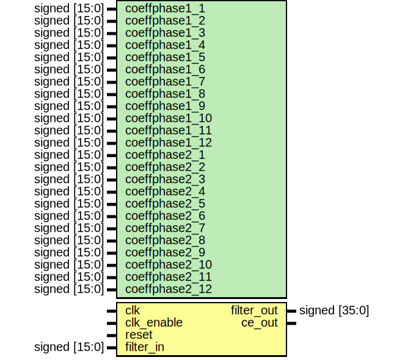

# Entity: fir_interp

## Diagram

## Description

-------------------------------------------------------------
 Module: fir_interp
 Generated by MATLAB(R) 9.0 and the Filter Design HDL Coder 3.0.
 Generated on: 2016-07-05 15:54:12
 -------------------------------------------------------------
 -------------------------------------------------------------
 HDL Code Generation Options:
 FIRAdderStyle: tree
 OptimizeForHDL: on
 EDAScriptGeneration: off
 AddPipelineRegisters: on
 Name: fir_interp
 TargetLanguage: Verilog
 TestBenchName: fo_copy_tb
 TestBenchStimulus: step ramp chirp noise
 GenerateHDLTestBench: off
 -------------------------------------------------------------
 HDL Implementation    : Fully parallel
 Multipliers           : 12
 Folding Factor        : 1
 -------------------------------------------------------------
 Filter Settings:
 Discrete-Time FIR Multirate Filter (real)
 -----------------------------------------
 Filter Structure      : Direct-Form FIR Polyphase Interpolator
 Interpolation Factor  : 2
 Polyphase Length      : 12
 Filter Length         : 24
 Stable                : Yes
 Linear Phase          : Yes (Type 2)
 Arithmetic            : fixed
 Numerator             : s16,15 -> [-1 1)
 -------------------------------------------------------------
 
## Generics

| Generic name   | Type          | Value                | Description                                 |
| -------------- | ------------- | -------------------- | ------------------------------------------- |
| coeffphase1_1  | signed [15:0] | 16'b1111111110101001 | Local Functions Type Definitions Constants  |
| coeffphase1_2  | signed [15:0] | 16'b1111111101111010 |                                             |
| coeffphase1_3  | signed [15:0] | 16'b0000010011111111 |                                             |
| coeffphase1_4  | signed [15:0] | 16'b1111101010101110 |                                             |
| coeffphase1_5  | signed [15:0] | 16'b1111001001101000 |                                             |
| coeffphase1_6  | signed [15:0] | 16'b0011011010110011 |                                             |
| coeffphase1_7  | signed [15:0] | 16'b0101011100111111 |                                             |
| coeffphase1_8  | signed [15:0] | 16'b0000110010011010 |                                             |
| coeffphase1_9  | signed [15:0] | 16'b1111000000000010 |                                             |
| coeffphase1_10 | signed [15:0] | 16'b0000001110101000 |                                             |
| coeffphase1_11 | signed [15:0] | 16'b0000000111110010 |                                             |
| coeffphase1_12 | signed [15:0] | 16'b1111111100011100 |                                             |
| coeffphase2_1  | signed [15:0] | 16'b1111111100011100 |                                             |
| coeffphase2_2  | signed [15:0] | 16'b0000000111110010 |                                             |
| coeffphase2_3  | signed [15:0] | 16'b0000001110101000 |                                             |
| coeffphase2_4  | signed [15:0] | 16'b1111000000000010 |                                             |
| coeffphase2_5  | signed [15:0] | 16'b0000110010011010 |                                             |
| coeffphase2_6  | signed [15:0] | 16'b0101011100111111 |                                             |
| coeffphase2_7  | signed [15:0] | 16'b0011011010110011 |                                             |
| coeffphase2_8  | signed [15:0] | 16'b1111001001101000 |                                             |
| coeffphase2_9  | signed [15:0] | 16'b1111101010101110 |                                             |
| coeffphase2_10 | signed [15:0] | 16'b0000010011111111 |                                             |
| coeffphase2_11 | signed [15:0] | 16'b1111111101111010 |                                             |
| coeffphase2_12 | signed [15:0] | 16'b1111111110101001 |                                             |
## Ports

| Port name  | Direction | Type          | Description |
| ---------- | --------- | ------------- | ----------- |
| clk        | input     |               |             |
| clk_enable | input     |               |             |
| reset      | input     |               |             |
| filter_in  | input     | signed [15:0] |             |
| filter_out | output    | signed [35:0] |             |
| ce_out     | output    |               |             |
## Signals

| Name               | Type               | Description |
| ------------------ | ------------------ | ----------- |
| cur_count          | reg  [1:0]         | ufix2       |
| phase_1            | wire               | boolean     |
| delay_pipeline     | reg  signed [15:0] | sfix16_En15 |
| product            | wire [31:0]        | sfix32_En30 |
| product_mux        | wire [15:0]        | sfix16_En15 |
| product_1          | wire [31:0]        | sfix32_En30 |
| product_mux_1      | wire [15:0]        | sfix16_En15 |
| product_2          | wire [31:0]        | sfix32_En30 |
| product_mux_2      | wire [15:0]        | sfix16_En15 |
| product_3          | wire [31:0]        | sfix32_En30 |
| product_mux_3      | wire [15:0]        | sfix16_En15 |
| product_4          | wire [31:0]        | sfix32_En30 |
| product_mux_4      | wire [15:0]        | sfix16_En15 |
| product_5          | wire [31:0]        | sfix32_En30 |
| product_mux_5      | wire [15:0]        | sfix16_En15 |
| product_6          | wire [31:0]        | sfix32_En30 |
| product_mux_6      | wire [15:0]        | sfix16_En15 |
| product_7          | wire [31:0]        | sfix32_En30 |
| product_mux_7      | wire [15:0]        | sfix16_En15 |
| product_8          | wire [31:0]        | sfix32_En30 |
| product_mux_8      | wire [15:0]        | sfix16_En15 |
| product_9          | wire [31:0]        | sfix32_En30 |
| product_mux_9      | wire [15:0]        | sfix16_En15 |
| product_10         | wire [31:0]        | sfix32_En30 |
| product_mux_10     | wire [15:0]        | sfix16_En15 |
| product_11         | wire [31:0]        | sfix32_En30 |
| product_mux_11     | wire [15:0]        | sfix16_En15 |
| sumvector1         | wire [35:0]        | sfix36_En30 |
| add_signext        | wire [31:0]        | sfix32_En30 |
| add_signext_1      | wire [31:0]        | sfix32_En30 |
| add_temp           | wire [32:0]        | sfix33_En30 |
| add_signext_2      | wire [31:0]        | sfix32_En30 |
| add_signext_3      | wire [31:0]        | sfix32_En30 |
| add_temp_1         | wire [32:0]        | sfix33_En30 |
| add_signext_4      | wire [31:0]        | sfix32_En30 |
| add_signext_5      | wire [31:0]        | sfix32_En30 |
| add_temp_2         | wire [32:0]        | sfix33_En30 |
| add_signext_6      | wire [31:0]        | sfix32_En30 |
| add_signext_7      | wire [31:0]        | sfix32_En30 |
| add_temp_3         | wire [32:0]        | sfix33_En30 |
| add_signext_8      | wire [31:0]        | sfix32_En30 |
| add_signext_9      | wire [31:0]        | sfix32_En30 |
| add_temp_4         | wire [32:0]        | sfix33_En30 |
| add_signext_10     | wire [31:0]        | sfix32_En30 |
| add_signext_11     | wire [31:0]        | sfix32_En30 |
| add_temp_5         | wire [32:0]        | sfix33_En30 |
| sumdelay_pipeline1 | reg  signed [35:0] | sfix36_En30 |
| sumvector2         | wire [35:0]        | sfix36_En30 |
| add_signext_12     | wire [35:0]        | sfix36_En30 |
| add_signext_13     | wire [35:0]        | sfix36_En30 |
| add_temp_6         | wire [36:0]        | sfix37_En30 |
| add_signext_14     | wire [35:0]        | sfix36_En30 |
| add_signext_15     | wire [35:0]        | sfix36_En30 |
| add_temp_7         | wire [36:0]        | sfix37_En30 |
| add_signext_16     | wire [35:0]        | sfix36_En30 |
| add_signext_17     | wire [35:0]        | sfix36_En30 |
| add_temp_8         | wire [36:0]        | sfix37_En30 |
| sumdelay_pipeline2 | reg  signed [35:0] | sfix36_En30 |
| sumvector3         | wire [35:0]        | sfix36_En30 |
| add_signext_18     | wire [35:0]        | sfix36_En30 |
| add_signext_19     | wire [35:0]        | sfix36_En30 |
| add_temp_9         | wire [36:0]        | sfix37_En30 |
| sumdelay_pipeline3 | reg  signed [35:0] | sfix36_En30 |
| sum4               | wire [35:0]        | sfix36_En30 |
| add_signext_20     | wire [35:0]        | sfix36_En30 |
| add_signext_21     | wire [35:0]        | sfix36_En30 |
| add_temp_10        | wire [36:0]        | sfix37_En30 |
| output_register    | reg  signed [35:0] | sfix36_En30 |
## Processes
- ce_output: ( @ (posedge clk or posedge reset) )
**Description**
Block Statements

- Delay_Pipeline_process: ( @( posedge clk or posedge reset) )
**Description**
---------------- Delay Registers ----------------

- sumdelay_pipeline_process1: ( @ (posedge clk or posedge reset) )
- sumdelay_pipeline_process2: ( @ (posedge clk or posedge reset) )
- sumdelay_pipeline_process3: ( @ (posedge clk or posedge reset) )
- Output_Register_process: ( @ (posedge clk or posedge reset) )
