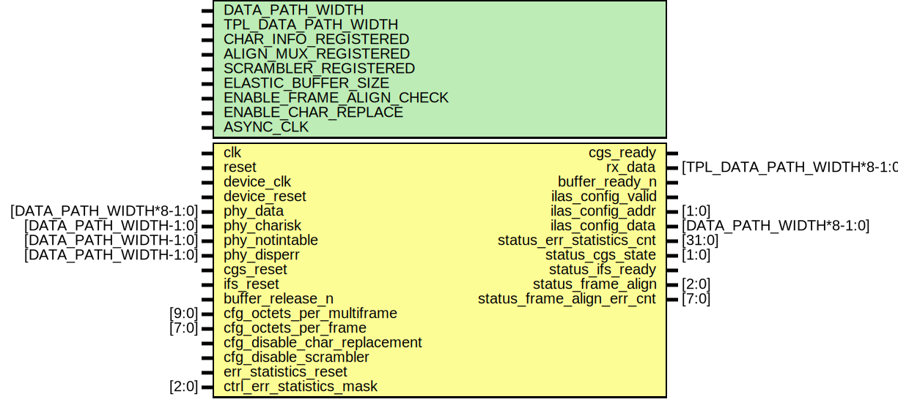

# Entity: jesd204_rx_lane

- **File**: jesd204_rx_lane.v
## Diagram

## Description

 The ADI JESD204 Core is released under the following license, which is
 different than all other HDL cores in this repository.

 Please read this, and understand the freedoms and responsibilities you have
 by using this source code/core.

 The JESD204 HDL, is copyright © 2016-2017 Analog Devices Inc.

 This core is free software, you can use run, copy, study, change, ask
 questions about and improve this core. Distribution of source, or resulting
 binaries (including those inside an FPGA or ASIC) require you to release the
 source of the entire project (excluding the system libraries provide by the
 tools/compiler/FPGA vendor). These are the terms of the GNU General Public
 License version 2 as published by the Free Software Foundation.

 This core  is distributed in the hope that it will be useful, but WITHOUT ANY
 WARRANTY; without even the implied warranty of MERCHANTABILITY or FITNESS FOR
 A PARTICULAR PURPOSE. See the GNU General Public License for more details.

 You should have received a copy of the GNU General Public License version 2
 along with this source code, and binary.  If not, see
 <http://www.gnu.org/licenses/>.

 Commercial licenses (with commercial support) of this JESD204 core are also
 available under terms different than the General Public License. (e.g. they
 do not require you to accompany any image (FPGA or ASIC) using the JESD204
 core with any corresponding source code.) For these alternate terms you must
 purchase a license from Analog Devices Technology Licensing Office. Users
 interested in such a license should contact jesd204-licensing@analog.com for
 more information. This commercial license is sub-licensable (if you purchase
 chips from Analog Devices, incorporate them into your PCB level product, and
 purchase a JESD204 license, end users of your product will also have a
 license to use this core in a commercial setting without releasing their
 source code).

 In addition, we kindly ask you to acknowledge ADI in any program, application
 or publication in which you use this JESD204 HDL core. (You are not required
 to do so; it is up to your common sense to decide whether you want to comply
 with this request or not.) For general publications, we suggest referencing :
 “The design and implementation of the JESD204 HDL Core used in this project
 is copyright © 2016-2017, Analog Devices, Inc.”

## Generics

| Generic name             | Type | Value | Description |
| ------------------------ | ---- | ----- | ----------- |
| DATA_PATH_WIDTH          |      | 4     |             |
| TPL_DATA_PATH_WIDTH      |      | 4     |             |
| CHAR_INFO_REGISTERED     |      | 0     |             |
| ALIGN_MUX_REGISTERED     |      | 0     |             |
| SCRAMBLER_REGISTERED     |      | 0     |             |
| ELASTIC_BUFFER_SIZE      |      | 256   |             |
| ENABLE_FRAME_ALIGN_CHECK |      | 0     |             |
| ENABLE_CHAR_REPLACE      |      | 0     |             |
| ASYNC_CLK                |      | 0     |             |
## Ports

| Port name                    | Direction | Type                        | Description |
| ---------------------------- | --------- | --------------------------- | ----------- |
| clk                          | input     |                             |             |
| reset                        | input     |                             |             |
| device_clk                   | input     |                             |             |
| device_reset                 | input     |                             |             |
| phy_data                     | input     | [DATA_PATH_WIDTH*8-1:0]     |             |
| phy_charisk                  | input     | [DATA_PATH_WIDTH-1:0]       |             |
| phy_notintable               | input     | [DATA_PATH_WIDTH-1:0]       |             |
| phy_disperr                  | input     | [DATA_PATH_WIDTH-1:0]       |             |
| cgs_reset                    | input     |                             |             |
| cgs_ready                    | output    |                             |             |
| ifs_reset                    | input     |                             |             |
| rx_data                      | output    | [TPL_DATA_PATH_WIDTH*8-1:0] |             |
| buffer_ready_n               | output    |                             |             |
| buffer_release_n             | input     |                             |             |
| cfg_octets_per_multiframe    | input     | [9:0]                       |             |
| cfg_octets_per_frame         | input     | [7:0]                       |             |
| cfg_disable_char_replacement | input     |                             |             |
| cfg_disable_scrambler        | input     |                             |             |
| ilas_config_valid            | output    |                             |             |
| ilas_config_addr             | output    | [1:0]                       |             |
| ilas_config_data             | output    | [DATA_PATH_WIDTH*8-1:0]     |             |
| err_statistics_reset         | input     |                             |             |
| ctrl_err_statistics_mask     | input     | [2:0]                       |             |
| status_err_statistics_cnt    | output    | [31:0]                      |             |
| status_cgs_state             | output    | [1:0]                       |             |
| status_ifs_ready             | output    |                             |             |
| status_frame_align           | output    | [2:0]                       |             |
| status_frame_align_err_cnt   | output    | [7:0]                       |             |
## Signals

| Name                 | Type                         | Description |
| -------------------- | ---------------------------- | ----------- |
| char                 | wire [7:0]                   |             |
| char_is_valid        | wire [DATA_PATH_WIDTH-1:0]   |             |
| char_is_cgs          | reg [DATA_PATH_WIDTH-1:0]    | K28.5 /K/   |
| char_is_error        | reg [DATA_PATH_WIDTH-1:0]    |             |
| charisk28            | reg [DATA_PATH_WIDTH-1:0]    |             |
| cgs_beat_is_cgs      | wire                         |             |
| cgs_beat_has_error   | wire                         |             |
| ifs_ready            | reg                          |             |
| frame_align          | reg [2:0]                    |             |
| frame_align_int      | reg [2:0]                    |             |
| phy_data_s           | wire [DATA_PATH_WIDTH*8-1:0] |             |
| charisk28_aligned_s  | wire [DATA_PATH_WIDTH-1:0]   |             |
| data_aligned_s       | wire [DATA_PATH_WIDTH*8-1:0] |             |
| charisk28_aligned    | wire [DATA_PATH_WIDTH-1:0]   |             |
| data_aligned         | wire [DATA_PATH_WIDTH*8-1:0] |             |
| data_replaced        | wire [DATA_PATH_WIDTH*8-1:0] |             |
| data_scrambled_s     | wire [DATA_PATH_WIDTH*8-1:0] |             |
| data_scrambled       | wire [DATA_PATH_WIDTH*8-1:0] |             |
| unexpected_char      | reg  [DATA_PATH_WIDTH-1:0]   |             |
| phy_char_err         | reg  [DATA_PATH_WIDTH-1:0]   |             |
| ilas_monitor_reset_s | wire                         |             |
| ilas_monitor_reset   | wire                         |             |
| buffer_ready_n_s     | wire                         |             |
| jj                   | reg  [DPW_LOG2:0]            |             |
| align_found          | reg                          |             |
## Constants

| Name                | Type | Value                                                   | Description |
| ------------------- | ---- | ------------------------------------------------------- | ----------- |
| MAX_DATA_PATH_WIDTH |      | 8                                                       |             |
| DPW_LOG2            |      | DATA_PATH_WIDTH == 8 ? 3 : DATA_PATH_WIDTH == 4 ? 2 : 1 |             |
## Functions
- num_set_bits () return ([7:0])
## Processes
- unnamed: ( @(posedge clk) )
  - **Type:** always
- unnamed: ( @(posedge clk) )
  - **Type:** always
- unnamed: ( @(posedge clk) )
  - **Type:** always
- unnamed: ( @(*) )
  - **Type:** always
- unnamed: ( @(posedge clk) )
  - **Type:** always
## Instantiations

- i_pipeline_stage0: pipeline_stage
- i_align_mux: align_mux
- i_pipeline_stage1: pipeline_stage
- i_descrambler: jesd204_scrambler
- i_pipeline_stage2: pipeline_stage
- i_elastic_buffer: elastic_buffer
- i_ilas_monitor: jesd204_ilas_monitor
- i_cgs: jesd204_rx_cgs
