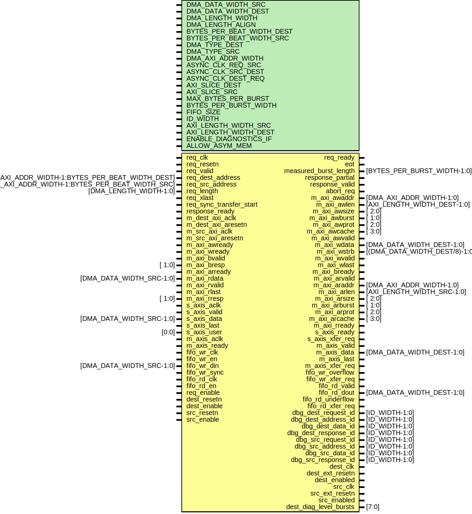

# Entity: dmac_request_arb

- **File**: request_arb.v
## Diagram

## Description

 ***************************************************************************
 ***************************************************************************
 Copyright 2014 - 2017 (c) Analog Devices, Inc. All rights reserved.

 In this HDL repository, there are many different and unique modules, consisting
 of various HDL (Verilog or VHDL) components. The individual modules are
 developed independently, and may be accompanied by separate and unique license
 terms.

 The user should read each of these license terms, and understand the
 freedoms and responsibilities that he or she has by using this source/core.

 This core is distributed in the hope that it will be useful, but WITHOUT ANY
 WARRANTY; without even the implied warranty of MERCHANTABILITY or FITNESS FOR
 A PARTICULAR PURPOSE.

 Redistribution and use of source or resulting binaries, with or without modification
 of this file, are permitted under one of the following two license terms:

   1. The GNU General Public License version 2 as published by the
      Free Software Foundation, which can be found in the top level directory
      of this repository (LICENSE_GPL2), and also online at:
      <https://www.gnu.org/licenses/old-licenses/gpl-2.0.html>

 OR

   2. An ADI specific BSD license, which can be found in the top level directory
      of this repository (LICENSE_ADIBSD), and also on-line at:
      https://github.com/analogdevicesinc/hdl/blob/master/LICENSE_ADIBSD
      This will allow to generate bit files and not release the source code,
      as long as it attaches to an ADI device.

 ***************************************************************************
 ***************************************************************************

## Generics

| Generic name              | Type | Value                         | Description |
| ------------------------- | ---- | ----------------------------- | ----------- |
| DMA_DATA_WIDTH_SRC        |      | 64                            |             |
| DMA_DATA_WIDTH_DEST       |      | 64                            |             |
| DMA_LENGTH_WIDTH          |      | 24                            |             |
| DMA_LENGTH_ALIGN          |      | 3                             |             |
| BYTES_PER_BEAT_WIDTH_DEST |      | $clog2(DMA_DATA_WIDTH_DEST/8) |             |
| BYTES_PER_BEAT_WIDTH_SRC  |      | $clog2(DMA_DATA_WIDTH_SRC/8)  |             |
| DMA_TYPE_DEST             |      | 0                             |             |
| DMA_TYPE_SRC              |      | 2                             |             |
| DMA_AXI_ADDR_WIDTH        |      | 32                            |             |
| ASYNC_CLK_REQ_SRC         |      | 1                             |             |
| ASYNC_CLK_SRC_DEST        |      | 1                             |             |
| ASYNC_CLK_DEST_REQ        |      | 1                             |             |
| AXI_SLICE_DEST            |      | 0                             |             |
| AXI_SLICE_SRC             |      | 0                             |             |
| MAX_BYTES_PER_BURST       |      | 128                           |             |
| BYTES_PER_BURST_WIDTH     |      | 7                             |             |
| FIFO_SIZE                 |      | 8                             |             |
| ID_WIDTH                  |      | $clog2(FIFO_SIZE*2)           |             |
| AXI_LENGTH_WIDTH_SRC      |      | 8                             |             |
| AXI_LENGTH_WIDTH_DEST     |      | 8                             |             |
| ENABLE_DIAGNOSTICS_IF     |      | 0                             |             |
| ALLOW_ASYM_MEM            |      | 0                             |             |
## Ports

| Port name               | Direction | Type                                             | Description                     |
| ----------------------- | --------- | ------------------------------------------------ | ------------------------------- |
| req_clk                 | input     |                                                  |                                 |
| req_resetn              | input     |                                                  |                                 |
| req_valid               | input     |                                                  |                                 |
| req_ready               | output    |                                                  |                                 |
| req_dest_address        | input     | [DMA_AXI_ADDR_WIDTH-1:BYTES_PER_BEAT_WIDTH_DEST] |                                 |
| req_src_address         | input     | [DMA_AXI_ADDR_WIDTH-1:BYTES_PER_BEAT_WIDTH_SRC]  |                                 |
| req_length              | input     | [DMA_LENGTH_WIDTH-1:0]                           |                                 |
| req_xlast               | input     |                                                  |                                 |
| req_sync_transfer_start | input     |                                                  |                                 |
| eot                     | output    |                                                  |                                 |
| measured_burst_length   | output    | [BYTES_PER_BURST_WIDTH-1:0]                      |                                 |
| response_partial        | output    |                                                  |                                 |
| response_valid          | output    |                                                  |                                 |
| response_ready          | input     |                                                  |                                 |
| abort_req               | output    |                                                  |                                 |
| m_dest_axi_aclk         | input     |                                                  |  Master AXI interface           |
| m_dest_axi_aresetn      | input     |                                                  |                                 |
| m_src_axi_aclk          | input     |                                                  |                                 |
| m_src_axi_aresetn       | input     |                                                  |                                 |
| m_axi_awaddr            | output    | [DMA_AXI_ADDR_WIDTH-1:0]                         |  Write address                  |
| m_axi_awlen             | output    | [AXI_LENGTH_WIDTH_DEST-1:0]                      |                                 |
| m_axi_awsize            | output    | [ 2:0]                                           |                                 |
| m_axi_awburst           | output    | [ 1:0]                                           |                                 |
| m_axi_awprot            | output    | [ 2:0]                                           |                                 |
| m_axi_awcache           | output    | [ 3:0]                                           |                                 |
| m_axi_awvalid           | output    |                                                  |                                 |
| m_axi_awready           | input     |                                                  |                                 |
| m_axi_wdata             | output    | [DMA_DATA_WIDTH_DEST-1:0]                        |  Write data                     |
| m_axi_wstrb             | output    | [(DMA_DATA_WIDTH_DEST/8)-1:0]                    |                                 |
| m_axi_wready            | input     |                                                  |                                 |
| m_axi_wvalid            | output    |                                                  |                                 |
| m_axi_wlast             | output    |                                                  |                                 |
| m_axi_bvalid            | input     |                                                  |  Write response                 |
| m_axi_bresp             | input     | [ 1:0]                                           |                                 |
| m_axi_bready            | output    |                                                  |                                 |
| m_axi_arready           | input     |                                                  |  Read address                   |
| m_axi_arvalid           | output    |                                                  |                                 |
| m_axi_araddr            | output    | [DMA_AXI_ADDR_WIDTH-1:0]                         |                                 |
| m_axi_arlen             | output    | [AXI_LENGTH_WIDTH_SRC-1:0]                       |                                 |
| m_axi_arsize            | output    | [ 2:0]                                           |                                 |
| m_axi_arburst           | output    | [ 1:0]                                           |                                 |
| m_axi_arprot            | output    | [ 2:0]                                           |                                 |
| m_axi_arcache           | output    | [ 3:0]                                           |                                 |
| m_axi_rdata             | input     | [DMA_DATA_WIDTH_SRC-1:0]                         |  Read data and response         |
| m_axi_rready            | output    |                                                  |                                 |
| m_axi_rvalid            | input     |                                                  |                                 |
| m_axi_rlast             | input     |                                                  |                                 |
| m_axi_rresp             | input     | [ 1:0]                                           |                                 |
| s_axis_aclk             | input     |                                                  |  Slave streaming AXI interface  |
| s_axis_ready            | output    |                                                  |                                 |
| s_axis_valid            | input     |                                                  |                                 |
| s_axis_data             | input     | [DMA_DATA_WIDTH_SRC-1:0]                         |                                 |
| s_axis_last             | input     |                                                  |                                 |
| s_axis_user             | input     | [0:0]                                            |                                 |
| s_axis_xfer_req         | output    |                                                  |                                 |
| m_axis_aclk             | input     |                                                  |  Master streaming AXI interface |
| m_axis_ready            | input     |                                                  |                                 |
| m_axis_valid            | output    |                                                  |                                 |
| m_axis_data             | output    | [DMA_DATA_WIDTH_DEST-1:0]                        |                                 |
| m_axis_last             | output    |                                                  |                                 |
| m_axis_xfer_req         | output    |                                                  |                                 |
| fifo_wr_clk             | input     |                                                  |  Input FIFO interface           |
| fifo_wr_en              | input     |                                                  |                                 |
| fifo_wr_din             | input     | [DMA_DATA_WIDTH_SRC-1:0]                         |                                 |
| fifo_wr_overflow        | output    |                                                  |                                 |
| fifo_wr_sync            | input     |                                                  |                                 |
| fifo_wr_xfer_req        | output    |                                                  |                                 |
| fifo_rd_clk             | input     |                                                  |  Input FIFO interface           |
| fifo_rd_en              | input     |                                                  |                                 |
| fifo_rd_valid           | output    |                                                  |                                 |
| fifo_rd_dout            | output    | [DMA_DATA_WIDTH_DEST-1:0]                        |                                 |
| fifo_rd_underflow       | output    |                                                  |                                 |
| fifo_rd_xfer_req        | output    |                                                  |                                 |
| dbg_dest_request_id     | output    | [ID_WIDTH-1:0]                                   |                                 |
| dbg_dest_address_id     | output    | [ID_WIDTH-1:0]                                   |                                 |
| dbg_dest_data_id        | output    | [ID_WIDTH-1:0]                                   |                                 |
| dbg_dest_response_id    | output    | [ID_WIDTH-1:0]                                   |                                 |
| dbg_src_request_id      | output    | [ID_WIDTH-1:0]                                   |                                 |
| dbg_src_address_id      | output    | [ID_WIDTH-1:0]                                   |                                 |
| dbg_src_data_id         | output    | [ID_WIDTH-1:0]                                   |                                 |
| dbg_src_response_id     | output    | [ID_WIDTH-1:0]                                   |                                 |
| req_enable              | input     |                                                  |                                 |
| dest_clk                | output    |                                                  |                                 |
| dest_resetn             | input     |                                                  |                                 |
| dest_ext_resetn         | output    |                                                  |                                 |
| dest_enable             | input     |                                                  |                                 |
| dest_enabled            | output    |                                                  |                                 |
| src_clk                 | output    |                                                  |                                 |
| src_resetn              | input     |                                                  |                                 |
| src_ext_resetn          | output    |                                                  |                                 |
| src_enable              | input     |                                                  |                                 |
| src_enabled             | output    |                                                  |                                 |
| dest_diag_level_bursts  | output    | [7:0]                                            |  Diagnostics interface          |
## Signals

| Name                            | Type                                 | Description                                                                                                        |
| ------------------------------- | ------------------------------------ | ------------------------------------------------------------------------------------------------------------------ |
| eot_mem_src                     | reg                                  |                                                                                                                    |
| eot_mem_dest                    | reg                                  |                                                                                                                    |
| request_eot                     | wire                                 |                                                                                                                    |
| source_eot                      | wire                                 |                                                                                                                    |
| request_id                      | wire [ID_WIDTH-1:0]                  |                                                                                                                    |
| source_id                       | wire [ID_WIDTH-1:0]                  |                                                                                                                    |
| response_id                     | wire [ID_WIDTH-1:0]                  |                                                                                                                    |
| enabled_src                     | wire                                 |                                                                                                                    |
| enabled_dest                    | wire                                 |                                                                                                                    |
| req_gen_valid                   | wire                                 |                                                                                                                    |
| req_gen_ready                   | wire                                 |                                                                                                                    |
| src_dest_valid                  | wire                                 |                                                                                                                    |
| src_dest_ready                  | wire                                 |                                                                                                                    |
| req_src_valid                   | wire                                 |                                                                                                                    |
| req_src_ready                   | wire                                 |                                                                                                                    |
| dest_req_valid                  | wire                                 |                                                                                                                    |
| dest_req_ready                  | wire                                 |                                                                                                                    |
| dest_req_dest_address           | wire [DMA_ADDRESS_WIDTH_DEST-1:0]    |                                                                                                                    |
| dest_req_xlast                  | wire                                 |                                                                                                                    |
| dest_response_valid             | wire                                 |                                                                                                                    |
| dest_response_ready             | wire                                 |                                                                                                                    |
| dest_response_resp              | wire [1:0]                           |                                                                                                                    |
| dest_response_resp_eot          | wire                                 |                                                                                                                    |
| dest_response_data_burst_length | wire [BYTES_PER_BURST_WIDTH-1:0]     |                                                                                                                    |
| dest_response_partial           | wire                                 |                                                                                                                    |
| dest_request_id                 | wire [ID_WIDTH-1:0]                  |                                                                                                                    |
| dest_data_request_id            | wire [ID_WIDTH-1:0]                  |                                                                                                                    |
| dest_data_response_id           | wire [ID_WIDTH-1:0]                  |                                                                                                                    |
| dest_response_id                | wire [ID_WIDTH-1:0]                  |                                                                                                                    |
| dest_valid                      | wire                                 |                                                                                                                    |
| dest_ready                      | wire                                 |                                                                                                                    |
| dest_data                       | wire [DMA_DATA_WIDTH_DEST-1:0]       |                                                                                                                    |
| dest_strb                       | wire [DMA_DATA_WIDTH_DEST/8-1:0]     |                                                                                                                    |
| dest_last                       | wire                                 |                                                                                                                    |
| dest_fifo_valid                 | wire                                 |                                                                                                                    |
| dest_fifo_ready                 | wire                                 |                                                                                                                    |
| dest_fifo_data                  | wire [DMA_DATA_WIDTH_DEST-1:0]       |                                                                                                                    |
| dest_fifo_strb                  | wire [DMA_DATA_WIDTH_DEST/8-1:0]     |                                                                                                                    |
| dest_fifo_last                  | wire                                 |                                                                                                                    |
| src_req_valid                   | wire                                 |                                                                                                                    |
| src_req_ready                   | wire                                 |                                                                                                                    |
| src_req_dest_address            | wire [DMA_ADDRESS_WIDTH_DEST-1:0]    |                                                                                                                    |
| src_req_src_address             | wire [DMA_ADDRESS_WIDTH_SRC-1:0]     |                                                                                                                    |
| src_req_last_burst_length       | wire [BEATS_PER_BURST_WIDTH_SRC-1:0] |                                                                                                                    |
| src_req_last_beat_bytes         | wire [BYTES_PER_BEAT_WIDTH_SRC-1:0]  |                                                                                                                    |
| src_req_sync_transfer_start     | wire                                 |                                                                                                                    |
| src_req_xlast                   | wire                                 |                                                                                                                    |
| src_req_dest_address_cur        | reg [DMA_ADDRESS_WIDTH_DEST-1:0]     |                                                                                                                    |
| src_req_xlast_cur               | reg                                  |                                                                                                                    |
| src_request_id                  | wire [ID_WIDTH-1:0]                  |  TODO wire src_response_valid; wire src_response_ready; wire src_response_empty; wire [1:0] src_response_resp; */  |
| src_throttled_request_id        | reg [ID_WIDTH-1:0]                   |                                                                                                                    |
| src_data_request_id             | wire [ID_WIDTH-1:0]                  |                                                                                                                    |
| src_response_id                 | wire [ID_WIDTH-1:0]                  |                                                                                                                    |
| src_valid                       | wire                                 |                                                                                                                    |
| src_data                        | wire [DMA_DATA_WIDTH_SRC-1:0]        |                                                                                                                    |
| src_valid_bytes                 | wire [BYTES_PER_BEAT_WIDTH_SRC-1:0]  |                                                                                                                    |
| src_last                        | wire                                 |                                                                                                                    |
| src_partial_burst               | wire                                 |                                                                                                                    |
| block_descr_to_dst              | wire                                 |                                                                                                                    |
| src_fifo_valid                  | wire                                 |                                                                                                                    |
| src_fifo_data                   | wire [DMA_DATA_WIDTH_SRC-1:0]        |                                                                                                                    |
| src_fifo_valid_bytes            | wire [BYTES_PER_BEAT_WIDTH_SRC-1:0]  |                                                                                                                    |
| src_fifo_last                   | wire                                 |                                                                                                                    |
| src_fifo_partial_burst          | wire                                 |                                                                                                                    |
| src_bl_valid                    | wire                                 |                                                                                                                    |
| src_bl_ready                    | wire                                 |                                                                                                                    |
| src_burst_length                | wire [BEATS_PER_BURST_WIDTH_SRC-1:0] |                                                                                                                    |
| dest_burst_info_length          | wire [BYTES_PER_BURST_WIDTH-1:0]     |                                                                                                                    |
| dest_burst_info_partial         | wire                                 |                                                                                                                    |
| dest_burst_info_id              | wire [ID_WIDTH-1:0]                  |                                                                                                                    |
| dest_burst_info_write           | wire                                 |                                                                                                                    |
| src_dest_valid_hs               | reg                                  |                                                                                                                    |
| src_dest_valid_hs_masked        | wire                                 |                                                                                                                    |
| src_dest_ready_hs               | wire                                 |                                                                                                                    |
| req_rewind_req_valid            | wire                                 |                                                                                                                    |
| req_rewind_req_ready            | wire                                 |                                                                                                                    |
| req_rewind_req_data             | wire [ID_WIDTH+3-1:0]                |                                                                                                                    |
| completion_req_valid            | wire                                 |                                                                                                                    |
| completion_req_ready            | wire                                 |                                                                                                                    |
| completion_req_last             | wire                                 |                                                                                                                    |
| completion_transfer_id          | wire [1:0]                           |                                                                                                                    |
| rewind_req_valid                | wire                                 |                                                                                                                    |
| rewind_req_ready                | wire                                 |                                                                                                                    |
| rewind_req_data                 | wire [ID_WIDTH+3-1:0]                |                                                                                                                    |
| src_throttler_enabled           | reg                                  |                                                                                                                    |
| src_throttler_enable            | wire                                 |                                                                                                                    |
| rewind_state                    | wire                                 |                                                                                                                    |
## Constants

| Name                       | Type | Value                                             | Description                                                                                                             |
| -------------------------- | ---- | ------------------------------------------------- | ----------------------------------------------------------------------------------------------------------------------- |
| DMA_TYPE_MM_AXI            |      | 0                                                 |                                                                                                                         |
| DMA_TYPE_STREAM_AXI        |      | 1                                                 |                                                                                                                         |
| DMA_TYPE_FIFO              |      | 2                                                 |                                                                                                                         |
| DMA_ADDRESS_WIDTH_DEST     |      | DMA_AXI_ADDR_WIDTH - BYTES_PER_BEAT_WIDTH_DEST    |                                                                                                                         |
| DMA_ADDRESS_WIDTH_SRC      |      | DMA_AXI_ADDR_WIDTH - BYTES_PER_BEAT_WIDTH_SRC     |                                                                                                                         |
| BEATS_PER_BURST_WIDTH_SRC  |      | BYTES_PER_BURST_WIDTH - BYTES_PER_BEAT_WIDTH_SRC  |  Bytes per burst is the same for both dest and src, but bytes per beat may  differ, so beats per burst may also differ  |
| BEATS_PER_BURST_WIDTH_DEST |      | BYTES_PER_BURST_WIDTH - BYTES_PER_BEAT_WIDTH_DEST |                                                                                                                         |
| BURSTS_PER_TRANSFER_WIDTH  |      | DMA_LENGTH_WIDTH - BYTES_PER_BURST_WIDTH          |                                                                                                                         |
## Functions
- compare_id () return ()
## Processes
- unnamed: ( @(posedge req_clk) )
  - **Type:** always
- unnamed: ( @(posedge src_clk) )
  - **Type:** always
- unnamed: ( @(posedge src_clk) )
  - **Type:** always
- unnamed: ( @(posedge src_clk) )
  - **Type:** always
 **Description**
  * Make sure that we do not request more data than what fits into the  * store-and-forward burst memory.  * Throttler must be blocked during rewind since it does not tolerate  * a decrement of the request ID.  */ 
- unnamed: ( @(posedge src_clk) )
  - **Type:** always
 **Description**
 Save the descriptor in the source clock domain since the submission to  destination is delayed. 
- unnamed: ( @(posedge src_clk) )
  - **Type:** always
## Instantiations

- i_sync_src_request_id: sync_bits
- sync_rewind: sync_event
- i_sync_req_response_id: sync_bits
- i_src_slice: axi_register_slice
- i_store_and_forward: axi_dmac_burst_memory
- i_dest_slice: axi_register_slice
- i_dest_req_fifo: util_axis_fifo
- i_response_manager: axi_dmac_response_manager
