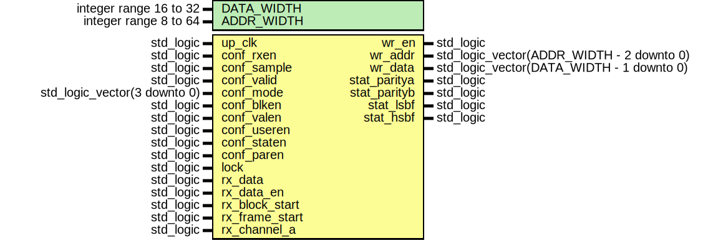
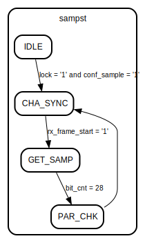

# Entity: rx_decode

- **File**: rx_decode.vhd
## Diagram

## Description

--------------------------------------------------------------------
--                                                              ----
-- WISHBONE SPDIF IP Core                                       ----
--                                                              ----
-- This file is part of the SPDIF project                       ----
-- http://www.opencores.org/cores/spdif_interface/              ----
--                                                              ----
-- Description                                                  ----
-- Sample decoder. Extract sample words and write to sample     ----
-- buffer.                                                      ----
--                                                              ----
--                                                              ----
-- To Do:                                                       ----
-- -                                                            ----
--                                                              ----
-- Author(s):                                                   ----
-- - Geir Drange, gedra@opencores.org                           ----
--                                                              ----
--------------------------------------------------------------------
--                                                              ----
-- Copyright (C) 2004 Authors and OPENCORES.ORG                 ----
--                                                              ----
-- This source file may be used and distributed without         ----
-- restriction provided that this copyright statement is not    ----
-- removed from the file and that any derivative work contains  ----
-- the original copyright notice and the associated disclaimer. ----
--                                                              ----
-- This source file is free software; you can redistribute it   ----
-- and/or modify it under the terms of the GNU Lesser General   ----
-- Public License as published by the Free Software Foundation; ----
-- either version 2.1 of the License, or (at your option) any   ----
-- later version.                                               ----
--                                                              ----
-- This source is distributed in the hope that it will be       ----
-- useful, but WITHOUT ANY WARRANTY; without even the implied   ----
-- warranty of MERCHANTABILITY or FITNESS FOR A PARTICULAR      ----
-- PURPOSE. See the GNU Lesser General Public License for more  ----
-- details.                                                     ----
--                                                              ----
-- You should have received a copy of the GNU Lesser General    ----
-- Public License along with this source; if not, download it   ----
-- from http://www.opencores.org/lgpl.shtml                     ----
--                                                              ----
--------------------------------------------------------------------

 CVS Revision History

 $Log: not supported by cvs2svn $
 Revision 1.4  2004/07/11 16:19:50  gedra
 Bug-fix.

 Revision 1.3  2004/06/26 14:14:47  gedra
 Converted to numeric_std and fixed a few bugs.

 Revision 1.2  2004/06/16 19:04:09  gedra
 Fixed a few bugs.

 Revision 1.1  2004/06/13 18:07:47  gedra
 Frame decoder and sample extractor
                        

## Generics

| Generic name | Type                   | Value | Description |
| ------------ | ---------------------- | ----- | ----------- |
| DATA_WIDTH   | integer range 16 to 32 |       |             |
| ADDR_WIDTH   | integer range 8 to 64  |       |             |
## Ports

| Port name      | Direction | Type                                      | Description |
| -------------- | --------- | ----------------------------------------- | ----------- |
| up_clk         | in        | std_logic                                 |             |
| conf_rxen      | in        | std_logic                                 |             |
| conf_sample    | in        | std_logic                                 |             |
| conf_valid     | in        | std_logic                                 |             |
| conf_mode      | in        | std_logic_vector(3 downto 0)              |             |
| conf_blken     | in        | std_logic                                 |             |
| conf_valen     | in        | std_logic                                 |             |
| conf_useren    | in        | std_logic                                 |             |
| conf_staten    | in        | std_logic                                 |             |
| conf_paren     | in        | std_logic                                 |             |
| lock           | in        | std_logic                                 |             |
| rx_data        | in        | std_logic                                 |             |
| rx_data_en     | in        | std_logic                                 |             |
| rx_block_start | in        | std_logic                                 |             |
| rx_frame_start | in        | std_logic                                 |             |
| rx_channel_a   | in        | std_logic                                 |             |
| wr_en          | out       | std_logic                                 |             |
| wr_addr        | out       | std_logic_vector(ADDR_WIDTH - 2 downto 0) |             |
| wr_data        | out       | std_logic_vector(DATA_WIDTH - 1 downto 0) |             |
| stat_paritya   | out       | std_logic                                 |             |
| stat_parityb   | out       | std_logic                                 |             |
| stat_lsbf      | out       | std_logic                                 |             |
| stat_hsbf      | out       | std_logic                                 |             |
## Signals

| Name       | Type                                       | Description |
| ---------- | ------------------------------------------ | ----------- |
| adr_cnt    | integer range 0 to 2**(ADDR_WIDTH - 1) - 1 |             |
| sampst     | samp_states                                |             |
| bit_cnt    | integer range 0 to 31                      |             |
|  par_cnt   | integer range 0 to 31                      |             |
| samp_start | integer range 0 to 15                      |             |
| tmp_data   | std_logic_vector(31 downto 0)              |             |
| tmp_stat   | std_logic_vector(4 downto 0)               |             |
| valid      | std_logic                                  |             |
|  next_is_a | std_logic                                  |             |
|  blk_start | std_logic                                  |             |
## Types

| Name        | Type                                                                                                                                             | Description |
| ----------- | ------------------------------------------------------------------------------------------------------------------------------------------------ | ----------- |
| samp_states | (IDLE,  CHA_SYNC,  GET_SAMP,  PAR_CHK)  |             |
## Processes
- SAEX: ( up_clk, conf_rxen )
 **Description**
 State machine extracting audio samples 
## State machines

-  State machine extracting audio samples

