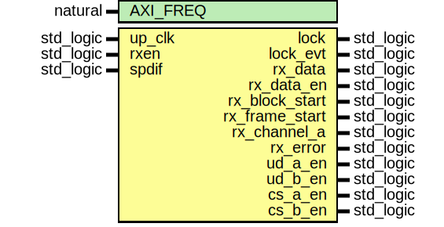

# Entity: rx_phase_det

- **File**: rx_phase_det.vhd
## Diagram

## Description

CVS Revision History
$Log: not supported by cvs2svn $
Revision 1.5  2004/07/19 16:58:37  gedra
Fixed bug.
Revision 1.4  2004/07/12 17:06:41  gedra
Fixed bug with lock event generation.
Revision 1.3  2004/07/11 16:19:50  gedra
Bug-fix.
Revision 1.2  2004/06/13 18:08:50  gedra
Renamed generic and cleaned some lint's
Revision 1.1  2004/06/06 15:43:02  gedra
Early version of the bi-phase mark decoder.
## Generics

| Generic name | Type    | Value | Description |
| ------------ | ------- | ----- | ----------- |
| AXI_FREQ     | natural | 100   |             |
## Ports

| Port name      | Direction | Type      | Description                      |
| -------------- | --------- | --------- | -------------------------------- |
| up_clk         | in        | std_logic | wishbone clock                   |
| rxen           | in        | std_logic | phase detector enable            |
| spdif          | in        | std_logic | SPDIF input signal               |
| lock           | out       | std_logic | true if locked to spdif input    |
| lock_evt       | out       | std_logic | lock status change event         |
| rx_data        | out       | std_logic | recevied data                    |
| rx_data_en     | out       | std_logic | received data enable             |
| rx_block_start | out       | std_logic | start-of-block pulse             |
| rx_frame_start | out       | std_logic | start-of-frame pulse             |
| rx_channel_a   | out       | std_logic | 1 if channel A frame is recevied |
| rx_error       | out       | std_logic | signal error was detected        |
| ud_a_en        | out       | std_logic | user data ch. A enable           |
| ud_b_en        | out       | std_logic | user data ch. B enable           |
| cs_a_en        | out       | std_logic | channel status ch. A enable      |
| cs_b_en        | out       | std_logic |                                  |
## Signals

| Name           | Type                               | Description |
| -------------- | ---------------------------------- | ----------- |
| maxpulse       | integer range 0 to 16 * AXI_FREQ   |             |
|  maxp          | integer range 0 to 16 * AXI_FREQ   |             |
|  mp_cnt        | integer range 0 to 16 * AXI_FREQ   |             |
| last_cnt       | integer range 0 to 16 * AXI_FREQ   |             |
|  max_thres     | integer range 0 to 16 * AXI_FREQ   |             |
| minpulse       | integer range 0 to 8 * AXI_FREQ    |             |
|  minp          | integer range 0 to 8 * AXI_FREQ    |             |
|  min_thres     | integer range 0 to 8 * AXI_FREQ    |             |
| zspdif         | std_logic                          |             |
|  spdif_in      | std_logic                          |             |
|  zspdif_in     | std_logic                          |             |
|  trans         | std_logic                          |             |
|  ztrans        | std_logic                          |             |
| trans_cnt      | integer range 0 to TRANSITIONS     |             |
| valid          | std_logic                          |             |
|  p_long        | std_logic                          |             |
|  p_short       | std_logic                          |             |
| preamble       | pulse_array                        |             |
| new_pulse      | std_logic                          |             |
|  short_idx     | std_logic                          |             |
|  ilock         | std_logic                          |             |
| framerx        | frame_state                        |             |
| frame_cnt      | integer range 0 to FRAMES_FOR_LOCK |             |
| bit_cnt        | integer range 0 to 63              |             |
| pre_cnt        | integer range 0 to 7               |             |
| new_preamble   | preamble_types                     |             |
|  last_preamble | preamble_types                     |             |
| irx_channel_a  | std_logic                          |             |
|  zilock        | std_logic                          |             |
## Constants

| Name            | Type    | Value | Description |
| --------------- | ------- | ----- | ----------- |
| TRANSITIONS     | integer |  70   |             |
| FRAMES_FOR_LOCK | integer |  3    |             |
## Types

| Name           | Type                                                                                                                                            | Description |
| -------------- | ----------------------------------------------------------------------------------------------------------------------------------------------- | ----------- |
| pulse_type     | (ZERO,  SHORT,  MED,  LONG)            |             |
| pulse_array    |                                                                                                                                                 |             |
| frame_state    | (IDLE,  HUNT,  FRAMESTART,  FRAME_RX)  |             |
| preamble_types | (NONE,  PRE_X,  PRE_Y,  PRE_Z)         |             |
## Processes
- PHDET: ( up_clk, rxen )
- FRX: ( up_clk, rxen )
**Description**
State machine that hunt for and lock onto sub-frames

