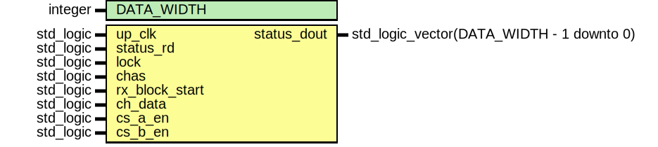

# Entity: rx_status_reg

- **File**: rx_status_reg.vhd
## Diagram

## Description

--------------------------------------------------------------------
--                                                              ----
-- WISHBONE SPDIF IP Core                                       ----
--                                                              ----
-- This file is part of the SPDIF project                       ----
-- http://www.opencores.org/cores/spdif_interface/              ----
--                                                              ----
-- Description                                                  ----
-- SPDIF receiver status register                               ----
--                                                              ----
--                                                              ----
-- To Do:                                                       ----
-- -                                                            ----
--                                                              ----
-- Author(s):                                                   ----
-- - Geir Drange, gedra@opencores.org                           ----
--                                                              ----
--------------------------------------------------------------------
--                                                              ----
-- Copyright (C) 2004 Authors and OPENCORES.ORG                 ----
--                                                              ----
-- This source file may be used and distributed without         ----
-- restriction provided that this copyright statement is not    ----
-- removed from the file and that any derivative work contains  ----
-- the original copyright notice and the associated disclaimer. ----
--                                                              ----
-- This source file is free software; you can redistribute it   ----
-- and/or modify it under the terms of the GNU Lesser General   ----
-- Public License as published by the Free Software Foundation; ----
-- either version 2.1 of the License, or (at your option) any   ----
-- later version.                                               ----
--                                                              ----
-- This source is distributed in the hope that it will be       ----
-- useful, but WITHOUT ANY WARRANTY; without even the implied   ----
-- warranty of MERCHANTABILITY or FITNESS FOR A PARTICULAR      ----
-- PURPOSE. See the GNU Lesser General Public License for more  ----
-- details.                                                     ----
--                                                              ----
-- You should have received a copy of the GNU Lesser General    ----
-- Public License along with this source; if not, download it   ----
-- from http://www.opencores.org/lgpl.shtml                     ----
--                                                              ----
--------------------------------------------------------------------

 CVS Revision History

 $Log: not supported by cvs2svn $
 Revision 1.4  2004/06/27 16:16:55  gedra
 Signal renaming and bug fix.

 Revision 1.3  2004/06/26 14:14:47  gedra
 Converted to numeric_std and fixed a few bugs.

 Revision 1.2  2004/06/16 19:03:10  gedra
 Added channel status decoding.

 Revision 1.1  2004/06/05 17:17:12  gedra
 Recevier status register

## Generics

| Generic name | Type    | Value | Description |
| ------------ | ------- | ----- | ----------- |
| DATA_WIDTH   | integer |       |             |
## Ports

| Port name      | Direction | Type                                      | Description                  |
| -------------- | --------- | ----------------------------------------- | ---------------------------- |
| up_clk         | in        | std_logic                                 |  clock                       |
| status_rd      | in        | std_logic                                 |  status register read        |
| lock           | in        | std_logic                                 |  signal lock status          |
| chas           | in        | std_logic                                 |  channel A or B select       |
| rx_block_start | in        | std_logic                                 |  start of block signal       |
| ch_data        | in        | std_logic                                 |  channel status/user data    |
| cs_a_en        | in        | std_logic                                 |  channel status ch. A enable |
| cs_b_en        | in        | std_logic                                 |  channel status ch. B enable |
| status_dout    | out       | std_logic_vector(DATA_WIDTH - 1 downto 0) |                              |
## Signals

| Name          | Type                                      | Description |
| ------------- | ----------------------------------------- | ----------- |
| status_vector | std_logic_vector(DATA_WIDTH - 1 downto 0) |             |
| cur_pos       | integer range 0 to 255                    |             |
| pro_mode      | std_logic                                 |             |
## Processes
- CDAT: ( up_clk, lock )
 **Description**
 extract channel status bits to be used 
