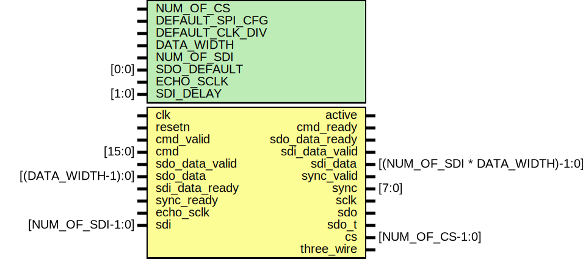

# Entity: spi_engine_execution

- **File**: spi_engine_execution.v
## Diagram

## Description

 ***************************************************************************
 ***************************************************************************
 Copyright 2014 - 2017 (c) Analog Devices, Inc. All rights reserved.

 In this HDL repository, there are many different and unique modules, consisting
 of various HDL (Verilog or VHDL) components. The individual modules are
 developed independently, and may be accompanied by separate and unique license
 terms.

 The user should read each of these license terms, and understand the
 freedoms and responsibilities that he or she has by using this source/core.

 This core is distributed in the hope that it will be useful, but WITHOUT ANY
 WARRANTY; without even the implied warranty of MERCHANTABILITY or FITNESS FOR
 A PARTICULAR PURPOSE.

 Redistribution and use of source or resulting binaries, with or without modification
 of this file, are permitted under one of the following two license terms:

   1. The GNU General Public License version 2 as published by the
      Free Software Foundation, which can be found in the top level directory
      of this repository (LICENSE_GPL2), and also online at:
      <https://www.gnu.org/licenses/old-licenses/gpl-2.0.html>

 OR

   2. An ADI specific BSD license, which can be found in the top level directory
      of this repository (LICENSE_ADIBSD), and also on-line at:
      https://github.com/analogdevicesinc/hdl/blob/master/LICENSE_ADIBSD
      This will allow to generate bit files and not release the source code,
      as long as it attaches to an ADI device.

 ***************************************************************************
 ***************************************************************************

## Generics

| Generic name    | Type  | Value | Description                               |
| --------------- | ----- | ----- | ----------------------------------------- |
| NUM_OF_CS       |       | 1     |                                           |
| DEFAULT_SPI_CFG |       | 0     |                                           |
| DEFAULT_CLK_DIV |       | 0     |                                           |
| DATA_WIDTH      |       | 8     |  Valid data widths values are 8/16/24/32  |
| NUM_OF_SDI      |       | 1     |                                           |
| SDO_DEFAULT     | [0:0] | 1'b0  |                                           |
| ECHO_SCLK       |       | 0     |                                           |
| SDI_DELAY       | [1:0] | 2'b00 |                                           |
## Ports

| Port name      | Direction | Type                            | Description |
| -------------- | --------- | ------------------------------- | ----------- |
| clk            | input     |                                 |             |
| resetn         | input     |                                 |             |
| active         | output    |                                 |             |
| cmd_ready      | output    |                                 |             |
| cmd_valid      | input     |                                 |             |
| cmd            | input     | [15:0]                          |             |
| sdo_data_valid | input     |                                 |             |
| sdo_data_ready | output    |                                 |             |
| sdo_data       | input     | [(DATA_WIDTH-1):0]              |             |
| sdi_data_ready | input     |                                 |             |
| sdi_data_valid | output    |                                 |             |
| sdi_data       | output    | [(NUM_OF_SDI * DATA_WIDTH)-1:0] |             |
| sync_ready     | input     |                                 |             |
| sync_valid     | output    |                                 |             |
| sync           | output    | [7:0]                           |             |
| echo_sclk      | input     |                                 |             |
| sclk           | output    |                                 |             |
| sdo            | output    |                                 |             |
| sdo_t          | output    |                                 |             |
| sdi            | input     | [NUM_OF_SDI-1:0]                |             |
| cs             | output    | [NUM_OF_CS-1:0]                 |             |
| three_wire     | output    |                                 |             |
## Signals

| Name                     | Type                                | Description                                                                                                                                                                                                                                                                                                                                                                                                                                                                                                           |
| ------------------------ | ----------------------------------- | --------------------------------------------------------------------------------------------------------------------------------------------------------------------------------------------------------------------------------------------------------------------------------------------------------------------------------------------------------------------------------------------------------------------------------------------------------------------------------------------------------------------- |
| sclk_int                 | reg                                 |                                                                                                                                                                                                                                                                                                                                                                                                                                                                                                                       |
| sdo_int_s                | wire                                |                                                                                                                                                                                                                                                                                                                                                                                                                                                                                                                       |
| sdo_t_int                | reg                                 |                                                                                                                                                                                                                                                                                                                                                                                                                                                                                                                       |
| idle                     | reg                                 |                                                                                                                                                                                                                                                                                                                                                                                                                                                                                                                       |
| clk_div_counter          | reg [7:0]                           |                                                                                                                                                                                                                                                                                                                                                                                                                                                                                                                       |
| clk_div_counter_next     | reg [7:0]                           |                                                                                                                                                                                                                                                                                                                                                                                                                                                                                                                       |
| clk_div_last             | reg                                 |                                                                                                                                                                                                                                                                                                                                                                                                                                                                                                                       |
| counter                  | reg [(BIT_COUNTER_WIDTH+8):0]       |                                                                                                                                                                                                                                                                                                                                                                                                                                                                                                                       |
| sleep_counter            | wire [7:0]                          |                                                                                                                                                                                                                                                                                                                                                                                                                                                                                                                       |
| cs_sleep_counter         | wire [1:0]                          |                                                                                                                                                                                                                                                                                                                                                                                                                                                                                                                       |
| bit_counter              | wire [(BIT_COUNTER_WIDTH-1):0]      |                                                                                                                                                                                                                                                                                                                                                                                                                                                                                                                       |
| transfer_counter         | wire [7:0]                          |                                                                                                                                                                                                                                                                                                                                                                                                                                                                                                                       |
| ntx_rx                   | wire                                |                                                                                                                                                                                                                                                                                                                                                                                                                                                                                                                       |
| trigger                  | reg                                 |                                                                                                                                                                                                                                                                                                                                                                                                                                                                                                                       |
| trigger_next             | reg                                 |                                                                                                                                                                                                                                                                                                                                                                                                                                                                                                                       |
| wait_for_io              | reg                                 |                                                                                                                                                                                                                                                                                                                                                                                                                                                                                                                       |
| transfer_active          | reg                                 |                                                                                                                                                                                                                                                                                                                                                                                                                                                                                                                       |
| last_bit                 | wire                                |                                                                                                                                                                                                                                                                                                                                                                                                                                                                                                                       |
| first_bit                | wire                                |                                                                                                                                                                                                                                                                                                                                                                                                                                                                                                                       |
| last_transfer            | reg                                 |                                                                                                                                                                                                                                                                                                                                                                                                                                                                                                                       |
| word_length              | reg [7:0]                           |                                                                                                                                                                                                                                                                                                                                                                                                                                                                                                                       |
| left_aligned             | reg [7:0]                           |                                                                                                                                                                                                                                                                                                                                                                                                                                                                                                                       |
| end_of_word              | wire                                |                                                                                                                                                                                                                                                                                                                                                                                                                                                                                                                       |
| sdi_counter              | reg [7:0]                           |                                                                                                                                                                                                                                                                                                                                                                                                                                                                                                                       |
| cmd_d1                   | reg [15:0]                          |                                                                                                                                                                                                                                                                                                                                                                                                                                                                                                                       |
| cpha                     | reg                                 |                                                                                                                                                                                                                                                                                                                                                                                                                                                                                                                       |
| cpol                     | reg                                 |                                                                                                                                                                                                                                                                                                                                                                                                                                                                                                                       |
| clk_div                  | reg [7:0]                           |                                                                                                                                                                                                                                                                                                                                                                                                                                                                                                                       |
| sdo_enabled              | reg                                 |                                                                                                                                                                                                                                                                                                                                                                                                                                                                                                                       |
| sdi_enabled              | reg                                 |                                                                                                                                                                                                                                                                                                                                                                                                                                                                                                                       |
| data_sdo_shift           | reg [(DATA_WIDTH-1):0]              |                                                                                                                                                                                                                                                                                                                                                                                                                                                                                                                       |
| trigger_rx_d             | reg [SDI_DELAY+1:0]                 |                                                                                                                                                                                                                                                                                                                                                                                                                                                                                                                       |
| inst                     | wire [1:0]                          |                                                                                                                                                                                                                                                                                                                                                                                                                                                                                                                       |
| inst_d1                  | wire [1:0]                          |                                                                                                                                                                                                                                                                                                                                                                                                                                                                                                                       |
| exec_cmd                 | wire                                |                                                                                                                                                                                                                                                                                                                                                                                                                                                                                                                       |
| exec_transfer_cmd        | wire                                |                                                                                                                                                                                                                                                                                                                                                                                                                                                                                                                       |
| exec_write_cmd           | wire                                |                                                                                                                                                                                                                                                                                                                                                                                                                                                                                                                       |
| exec_chipselect_cmd      | wire                                |                                                                                                                                                                                                                                                                                                                                                                                                                                                                                                                       |
| exec_misc_cmd            | wire                                |                                                                                                                                                                                                                                                                                                                                                                                                                                                                                                                       |
| exec_sync_cmd            | wire                                |                                                                                                                                                                                                                                                                                                                                                                                                                                                                                                                       |
| trigger_tx               | wire                                |                                                                                                                                                                                                                                                                                                                                                                                                                                                                                                                       |
| trigger_rx               | wire                                |                                                                                                                                                                                                                                                                                                                                                                                                                                                                                                                       |
| sleep_counter_compare    | wire                                |                                                                                                                                                                                                                                                                                                                                                                                                                                                                                                                       |
| cs_sleep_counter_compare | wire                                |                                                                                                                                                                                                                                                                                                                                                                                                                                                                                                                       |
| io_ready1                | wire                                |                                                                                                                                                                                                                                                                                                                                                                                                                                                                                                                       |
| io_ready2                | wire                                |                                                                                                                                                                                                                                                                                                                                                                                                                                                                                                                       |
| trigger_rx_s             | wire                                |                                                                                                                                                                                                                                                                                                                                                                                                                                                                                                                       |
| last_sdi_bit             | wire                                |                                                                                                                                                                                                                                                                                                                                                                                                                                                                                                                       |
| end_of_sdi_latch         | wire                                |                                                                                                                                                                                                                                                                                                                                                                                                                                                                                                                       |
| cs_active_s              | wire                                |  Load the serial data into SDI shift register(s), then link it to the output  register of the module  NOTE: ECHO_SCLK mode can be used when the SCLK line is looped back to the FPGA  through an other level shifter, in order to remove the round-trip timing delays  introduced by the level shifters. This can improve the timing significantly  on higher SCLK rates. Devices like ad4630 have an echod SCLK, which can be  used to latch the MISO lines, improving the overall timing margin of the  interface.  |
| num_of_transfers         | reg [7:0]                           |                                                                                                                                                                                                                                                                                                                                                                                                                                                                                                                       |
| sdi_data_latch           | reg [(NUM_OF_SDI * DATA_WIDTH)-1:0] |                                                                                                                                                                                                                                                                                                                                                                                                                                                                                                                       |
| last_sdi_bit_m           | reg [3:0]                           |  sdi_data_valid is synchronous to SPI clock, so synchronize the  last_sdi_bit to SPI clock                                                                                                                                                                                                                                                                                                                                                                                                                            |
| end_of_sdi_latch         | end                                 | g_echo_sclk_miso_latch */                                                                                                                                                                                                                                                                                                                                                                                                                                                                                             |
| endgenerate              | end                                 | g_sclk_miso_latch */                                                                                                                                                                                                                                                                                                                                                                                                                                                                                                  |
## Constants

| Name              | Type | Value                 | Description |
| ----------------- | ---- | --------------------- | ----------- |
| CMD_TRANSFER      |      | 2'b00                 |             |
| CMD_CHIPSELECT    |      | 2'b01                 |             |
| CMD_WRITE         |      | 2'b10                 |             |
| CMD_MISC          |      | 2'b11                 |             |
| MISC_SYNC         |      | 1'b0                  |             |
| MISC_SLEEP        |      | 1'b1                  |             |
| REG_CLK_DIV       |      | 2'b00                 |             |
| REG_CONFIG        |      | 2'b01                 |             |
| REG_WORD_LENGTH   |      | 2'b10                 |             |
| BIT_COUNTER_WIDTH |      | DATA_WIDTH > 16 ? 5 : |             |
| BIT_COUNTER_CARRY |      | 2                     |             |
| BIT_COUNTER_CLEAR |      | undefined             |             |
## Processes
- unnamed: ( @(posedge clk) )
  - **Type:** always
- unnamed: ( @(posedge clk) )
  - **Type:** always
- unnamed: ( @(posedge clk) )
  - **Type:** always
- unnamed: ( @(posedge clk) )
  - **Type:** always
**Description**
 Load the interface configurations from the 'Configuration Write'  instruction 
- unnamed: ( @(posedge clk) )
  - **Type:** always
- unnamed: ( @(posedge clk) )
  - **Type:** always
- unnamed: ( @(posedge clk) )
  - **Type:** always
- unnamed: ( @(posedge clk) )
  - **Type:** always
- unnamed: ( @(posedge clk) )
  - **Type:** always
- unnamed: ( @(posedge clk) )
  - **Type:** always
- unnamed: ( @(posedge clk) )
  - **Type:** always
- unnamed: ( @(posedge clk) )
  - **Type:** always
- unnamed: ( @(posedge clk) )
  - **Type:** always
- unnamed: ( @(posedge clk) )
  - **Type:** always
- unnamed: ( @(posedge clk) )
  - **Type:** always
**Description**
 Load the SDO parallel data into the SDO shift register. In case of a custom  data width, additional bit shifting must done at load. 
- unnamed: ( @(posedge clk) )
  - **Type:** always
**Description**
 In case of an interface with high clock rate (SCLK > 50MHz), the latch of  the SDI line can be delayed with 1, 2 or 3 SPI core clock cycle.  Taking the fact that in high SCLK frequencies the pre-scaler most likely will  be set to 0, to reduce the core clock's speed, this delay will mean that SDI will  be latched at one of the next consecutive SCLK edge. 
- unnamed: ( @(posedge clk) )
  - **Type:** always
- unnamed: ( @(posedge clk) )
  - **Type:** always
- unnamed: ( @(posedge clk) )
  - **Type:** always
- unnamed: ( @(posedge clk) )
  - **Type:** always
- unnamed: ( @(posedge clk) )
  - **Type:** always
- unnamed: ( @(posedge clk) )
  - **Type:** always
- unnamed: ( @(posedge clk) )
  - **Type:** always
- unnamed: ( @(posedge clk) )
  - **Type:** always
**Description**
 Additional register stage to improve timing 
