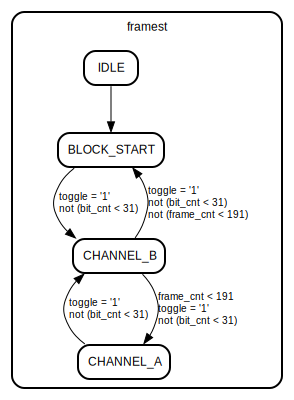

# Entity: tx_encoder

- **File**: tx_encoder.vhd
## Diagram

## Description

CVS Revision History
$Log: not supported by cvs2svn $
## Generics

| Generic name | Type                   | Value | Description |
| ------------ | ---------------------- | ----- | ----------- |
| DATA_WIDTH   | integer range 16 to 32 | 32    |             |
## Ports

| Port name       | Direction | Type                                      | Description         |
| --------------- | --------- | ----------------------------------------- | ------------------- |
| up_clk          | in        | std_logic                                 | clock               |
| data_clk        | in        | std_logic                                 | data clock          |
| resetn          | in        | std_logic                                 | resetn              |
| conf_mode       | in        | std_logic_vector(3 downto 0)              | sample format       |
| conf_ratio      | in        | std_logic_vector(7 downto 0)              | clock divider       |
| conf_txdata     | in        | std_logic                                 | sample data enable  |
| conf_txen       | in        | std_logic                                 | spdif signal enable |
| chstat_freq     | in        | std_logic_vector(1 downto 0)              | sample freq.        |
| chstat_gstat    | in        | std_logic                                 | generation status   |
| chstat_preem    | in        | std_logic                                 | preemphasis status  |
| chstat_copy     | in        | std_logic                                 | copyright bit       |
| chstat_audio    | in        | std_logic                                 | data format         |
| sample_data     | in        | std_logic_vector(DATA_WIDTH - 1 downto 0) | audio data          |
| sample_data_ack | out       | std_logic                                 | sample buffer read  |
| channel         | out       | std_logic                                 |                     |
| spdif_tx_o      | out       | std_logic                                 |                     |
## Signals

| Name                         | Type                           | Description |
| ---------------------------- | ------------------------------ | ----------- |
| spdif_clk_en                 | std_logic                      |             |
|  spdif_out                   | std_logic                      |             |
| clk_cnt                      | integer range 0 to 511         |             |
| bufctrl                      | buf_states                     |             |
| cha_samp_ack                 | std_logic                      |             |
|  chb_samp_ack                | std_logic                      |             |
| framest                      | frame_states                   |             |
| frame_cnt                    | integer range 0 to 191         |             |
| bit_cnt                      | integer range 0 to 31          |             |
|  par_cnt                     | integer range 0 to 31          |             |
| inv_preamble                 | std_logic                      |             |
|  toggle                      | std_logic                      |             |
|  valid                       | std_logic                      |             |
| def_user_data                | std_logic_vector(191 downto 0) |             |
|  def_ch_status               | std_logic_vector(191 downto 0) |             |
| active_user_data             | std_logic_vector(191 downto 0) |             |
|  active_ch_status            | std_logic_vector(191 downto 0) |             |
| audio                        | std_logic_vector(23 downto 0)  |             |
| par_vector                   | std_logic_vector(26 downto 0)  |             |
| send_audio                   | std_logic                      |             |
| cdc_sync_stage0_tick_counter | std_logic                      |             |
| cdc_sync_stage1_tick_counter | std_logic                      |             |
| cdc_sync_stage2_tick_counter | std_logic                      |             |
| cdc_sync_stage3_tick_counter | std_logic                      |             |
| tick_counter                 | std_logic                      |             |
## Constants

| Name       | Type                     | Value       | Description |
| ---------- | ------------------------ | ----------- | ----------- |
| X_PREAMBLE | std_logic_vector(0 to 7) |  "11100010" |             |
| Y_PREAMBLE | std_logic_vector(0 to 7) |  "11100100" |             |
| Z_PREAMBLE | std_logic_vector(0 to 7) |  "11101000" |             |
## Types

| Name         | Type                                                                                                                                                                                          | Description |
| ------------ | --------------------------------------------------------------------------------------------------------------------------------------------------------------------------------------------- | ----------- |
| buf_states   | (IDLE,  READ_CHA,  READ_CHB,  CHA_RDY,  CHB_RDY)  |             |
| frame_states | (IDLE,  BLOCK_START,  CHANNEL_A,  CHANNEL_B)                                         |             |
## Functions
- encode_bit ( signal bit_cnt    : integer;         -- sub-frame bit position signal valid : std_logic;            -- validity bit signal frame_cnt : integer;          -- frame counter signal par_cnt : integer;            -- parity counter signal user_data  : std_logic_vector(191 downto 0);  signal ch_status  : std_logic_vector(191 downto 0);  signal audio      : std_logic_vector(23 downto 0);  signal toggle     : std_logic;  signal prev_spdif : std_logic)  return std_logic 
## Processes
- DCLK: ( data_clk )
- unnamed: ( up_clk )
- CGEN: ( up_clk )
- SRD: ( up_clk )
- TXSYNC: ( data_clk )
- FRST: ( up_clk )
**Description**
State machine that generates sub-frames and blocks

## State machines

- State machine that generates sub-frames and blocks
