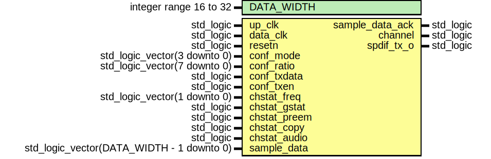
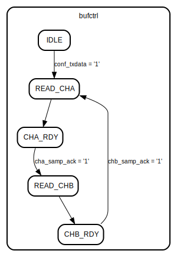

# Entity: tx_encoder

- **File**: tx_encoder.vhd
## Diagram

## Description

--------------------------------------------------------------------
--                                                              ----
-- WISHBONE SPDIF IP Core                                       ----
--                                                              ----
-- This file is part of the SPDIF project                       ----
-- http://www.opencores.org/cores/spdif_interface/              ----
--                                                              ----
-- Description                                                  ----
-- SPDIF transmitter signal encoder. Reads out samples from the ----
-- sample buffer, assembles frames and subframes and encodes    ----
-- serial data as bi-phase mark code.                           ----
--                                                              ----
-- To Do:                                                       ----
-- -                                                            ----
--                                                              ----
-- Author(s):                                                   ----
-- - Geir Drange, gedra@opencores.org                           ----
--                                                              ----
--------------------------------------------------------------------
--                                                              ----
-- Copyright (C) 2004 Authors and OPENCORES.ORG                 ----
--                                                              ----
-- This source file may be used and distributed without         ----
-- restriction provided that this copyright statement is not    ----
-- removed from the file and that any derivative work contains  ----
-- the original copyright notice and the associated disclaimer. ----
--                                                              ----
-- This source file is free software; you can redistribute it   ----
-- and/or modify it under the terms of the GNU Lesser General   ----
-- Public License as published by the Free Software Foundation; ----
-- either version 2.1 of the License, or (at your option) any   ----
-- later version.                                               ----
--                                                              ----
-- This source is distributed in the hope that it will be       ----
-- useful, but WITHOUT ANY WARRANTY; without even the implied   ----
-- warranty of MERCHANTABILITY or FITNESS FOR A PARTICULAR      ----
-- PURPOSE. See the GNU Lesser General Public License for more  ----
-- details.                                                     ----
--                                                              ----
-- You should have received a copy of the GNU Lesser General    ----
-- Public License along with this source; if not, download it   ----
-- from http://www.opencores.org/lgpl.shtml                     ----
--                                                              ----
--------------------------------------------------------------------

 CVS Revision History

 $Log: not supported by cvs2svn $

## Generics

| Generic name | Type                   | Value | Description |
| ------------ | ---------------------- | ----- | ----------- |
| DATA_WIDTH   | integer range 16 to 32 | 32    |             |
## Ports

| Port name       | Direction | Type                                      | Description          |
| --------------- | --------- | ----------------------------------------- | -------------------- |
| up_clk          | in        | std_logic                                 |  clock               |
| data_clk        | in        | std_logic                                 |  data clock          |
| resetn          | in        | std_logic                                 |  resetn              |
| conf_mode       | in        | std_logic_vector(3 downto 0)              |  sample format       |
| conf_ratio      | in        | std_logic_vector(7 downto 0)              |  clock divider       |
| conf_txdata     | in        | std_logic                                 |  sample data enable  |
| conf_txen       | in        | std_logic                                 |  spdif signal enable |
| chstat_freq     | in        | std_logic_vector(1 downto 0)              |  sample freq.        |
| chstat_gstat    | in        | std_logic                                 |  generation status   |
| chstat_preem    | in        | std_logic                                 |  preemphasis status  |
| chstat_copy     | in        | std_logic                                 |  copyright bit       |
| chstat_audio    | in        | std_logic                                 |  data format         |
| sample_data     | in        | std_logic_vector(DATA_WIDTH - 1 downto 0) |  audio data          |
| sample_data_ack | out       | std_logic                                 |  sample buffer read  |
| channel         | out       | std_logic                                 |                      |
| spdif_tx_o      | out       | std_logic                                 |                      |
## Signals

| Name                         | Type                           | Description |
| ---------------------------- | ------------------------------ | ----------- |
| spdif_clk_en                 | std_logic                      |             |
|  spdif_out                   | std_logic                      |             |
| clk_cnt                      | integer range 0 to 511         |             |
| bufctrl                      | buf_states                     |             |
| cha_samp_ack                 | std_logic                      |             |
|  chb_samp_ack                | std_logic                      |             |
| framest                      | frame_states                   |             |
| frame_cnt                    | integer range 0 to 191         |             |
| bit_cnt                      | integer range 0 to 31          |             |
|  par_cnt                     | integer range 0 to 31          |             |
| inv_preamble                 | std_logic                      |             |
|  toggle                      | std_logic                      |             |
|  valid                       | std_logic                      |             |
| def_user_data                | std_logic_vector(191 downto 0) |             |
|  def_ch_status               | std_logic_vector(191 downto 0) |             |
| active_user_data             | std_logic_vector(191 downto 0) |             |
|  active_ch_status            | std_logic_vector(191 downto 0) |             |
| audio                        | std_logic_vector(23 downto 0)  |             |
| par_vector                   | std_logic_vector(26 downto 0)  |             |
| send_audio                   | std_logic                      |             |
| cdc_sync_stage0_tick_counter | std_logic                      |             |
| cdc_sync_stage1_tick_counter | std_logic                      |             |
| cdc_sync_stage2_tick_counter | std_logic                      |             |
| cdc_sync_stage3_tick_counter | std_logic                      |             |
| tick_counter                 | std_logic                      |             |
## Constants

| Name       | Type                     | Value       | Description |
| ---------- | ------------------------ | ----------- | ----------- |
| X_PREAMBLE | std_logic_vector(0 to 7) |  "11100010" |             |
| Y_PREAMBLE | std_logic_vector(0 to 7) |  "11100100" |             |
| Z_PREAMBLE | std_logic_vector(0 to 7) |  "11101000" |             |
## Types

| Name         | Type                                                                                                                                                                                          | Description |
| ------------ | --------------------------------------------------------------------------------------------------------------------------------------------------------------------------------------------- | ----------- |
| buf_states   | (IDLE,  READ_CHA,  READ_CHB,  CHA_RDY,  CHB_RDY)  |             |
| frame_states | (IDLE,  BLOCK_START,  CHANNEL_A,  CHANNEL_B)                                         |             |
## Functions
- encode_bit ( signal bit_cnt    : integer;         -- sub-frame bit position signal valid : std_logic;            -- validity bit signal frame_cnt : integer;          -- frame counter signal par_cnt : integer;            -- parity counter signal user_data  : std_logic_vector(191 downto 0);  signal ch_status  : std_logic_vector(191 downto 0);  signal audio      : std_logic_vector(23 downto 0);  signal toggle     : std_logic;  signal prev_spdif : std_logic)  return std_logic 
## Processes
- DCLK: ( data_clk )
- unnamed: ( up_clk )
- CGEN: ( up_clk )
- SRD: ( up_clk )
- TXSYNC: ( data_clk )
- FRST: ( up_clk )
 **Description**
 State machine that generates sub-frames and blocks 
## State machines

-  State machine that generates sub-frames and blocks

