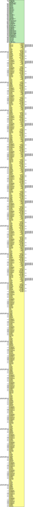

# Entity: util_adxcvr

- **File**: util_adxcvr.v
## Diagram

## Description

 ***************************************************************************
 ***************************************************************************
 Copyright 2014 - 2017 (c) Analog Devices, Inc. All rights reserved.

 In this HDL repository, there are many different and unique modules, consisting
 of various HDL (Verilog or VHDL) components. The individual modules are
 developed independently, and may be accompanied by separate and unique license
 terms.

 The user should read each of these license terms, and understand the
 freedoms and responsibilities that he or she has by using this source/core.

 This core is distributed in the hope that it will be useful, but WITHOUT ANY
 WARRANTY; without even the implied warranty of MERCHANTABILITY or FITNESS FOR
 A PARTICULAR PURPOSE.

 Redistribution and use of source or resulting binaries, with or without modification
 of this file, are permitted under one of the following two license terms:

   1. The GNU General Public License version 2 as published by the
      Free Software Foundation, which can be found in the top level directory
      of this repository (LICENSE_GPL2), and also online at:
      <https://www.gnu.org/licenses/old-licenses/gpl-2.0.html>

 OR

   2. An ADI specific BSD license, which can be found in the top level directory
      of this repository (LICENSE_ADIBSD), and also on-line at:
      https://github.com/analogdevicesinc/hdl/blob/master/LICENSE_ADIBSD
      This will allow to generate bit files and not release the source code,
      as long as it attaches to an ADI device.

 ***************************************************************************
 ***************************************************************************
 AUTO GENERATED BY util_adxcvr.pl, DO NOT MODIFY!

## Generics

| Generic name     | Type    | Value                  | Description                                                     |
| ---------------- | ------- | ---------------------- | --------------------------------------------------------------- |
| XCVR_TYPE        | integer | 0                      |  gtxe2(2), gthe3(5), gthe4(8), gtye4(9)                         |
| RX_LANE_RATE     | real    | 12.5                   |                                                                 |
| TX_LANE_RATE     | real    | 12.5                   |                                                                 |
| LINK_MODE        |         | 1                      |  2 - 64B/66B;  1 - 8B/10B                                       |
| DATA_PATH_WIDTH  |         | LINK_MODE == 2 ? 8 : 4 |  Only 4 is supported at the moment for 8b/10b and 8 for 64b */  |
| QPLL_REFCLK_DIV  | integer | 1                      |  qpll-configuration                                             |
| QPLL_FBDIV_RATIO | integer | 1                      |                                                                 |
| POR_CFG          | [15:0]  | 16'b0000000000000110   |                                                                 |
| PPF0_CFG         | [15:0]  | 16'b0000011000000000   |                                                                 |
| PPF1_CFG         | [15:0]  | 16'b0000011000000000   |                                                                 |
| QPLL_CFG         | [26:0]  | 27'h0680181            |                                                                 |
| QPLL_FBDIV       | [ 9:0]  | 10'b0000110000         |                                                                 |
| QPLL_CFG0        | [15:0]  | 16'b0011001100011100   |                                                                 |
| QPLL_CFG1        | [15:0]  | 16'b1101000000111000   |                                                                 |
| QPLL_CFG1_G3     | [15:0]  | 16'b1101000000111000   |                                                                 |
| QPLL_CFG2        | [15:0]  | 16'b0000111111000000   |                                                                 |
| QPLL_CFG2_G3     | [15:0]  | 16'b0000111111000000   |                                                                 |
| QPLL_CFG3        | [15:0]  | 16'b0000000100100000   |                                                                 |
| QPLL_CFG4        | [15:0]  | 16'b0000000000000011   |                                                                 |
| QPLL_CP_G3       | [15:0]  | 10'b0000011111         |                                                                 |
| QPLL_LPF         | [15:0]  | 10'b0100110111         |                                                                 |
| QPLL_CP          | [15:0]  | 10'b0001111111         |                                                                 |
| CPLL_FBDIV       | integer | 2                      |  cpll-configuration                                             |
| CPLL_FBDIV_4_5   | integer | 5                      |                                                                 |
| CPLL_CFG0        | [15:0]  | 16'b0000000111111010   |                                                                 |
| CPLL_CFG1        | [15:0]  | 16'b0000000000100011   |                                                                 |
| CPLL_CFG2        | [15:0]  | 16'b0000000000000010   |                                                                 |
| CPLL_CFG3        | [15:0]  | 16'b0000000000000000   |                                                                 |
| CH_HSPMUX        | [15:0]  | 16'b0010010000100100   |                                                                 |
| PREIQ_FREQ_BST   | integer | 0                      |                                                                 |
| RXPI_CFG0        | [15:0]  | 16'b0000000000000010   |                                                                 |
| RXPI_CFG1        | [15:0]  | 16'b0000000000010101   |                                                                 |
| RTX_BUF_CML_CTRL | [2:0]   | 3'b011                 |                                                                 |
| TX_NUM_OF_LANES  | integer | 8                      |  tx-configuration                                               |
| TX_OUT_DIV       | integer | 1                      |                                                                 |
| TX_CLK25_DIV     | integer | 20                     |                                                                 |
| TX_LANE_INVERT   | integer | 0                      |                                                                 |
| TX_PI_BIASSET    | [15:0]  | 1                      |                                                                 |
| TXPI_CFG         | [15:0]  | 16'b0000000001010100   |                                                                 |
| A_TXDIFFCTRL     | [15:0]  | 5'b10110               |                                                                 |
| RX_NUM_OF_LANES  | integer | 8                      |  rx-configuration                                               |
| RX_OUT_DIV       | integer | 1                      |                                                                 |
| RX_CLK25_DIV     | integer | 20                     |                                                                 |
| RX_DFE_LPM_CFG   | [15:0]  | 16'h0104               |                                                                 |
| RX_PMA_CFG       | [31:0]  | 32'h001e7080           |                                                                 |
| RX_CDR_CFG       | [72:0]  | 72'h0b000023ff10400020 |                                                                 |
| RXCDR_CFG0       | [15:0]  | 16'b0000000000000010   |                                                                 |
| RXCDR_CFG2       | [15:0]  | 16'b0000001001101001   |                                                                 |
| RXCDR_CFG2_GEN2  | [ 9:0]  | 10'b1001100101         |                                                                 |
| RXCDR_CFG2_GEN4  | [15:0]  | 16'b0000000010110100   |                                                                 |
| RXCDR_CFG3       | [15:0]  | 16'b0000000000010010   |                                                                 |
| RXCDR_CFG3_GEN2  | [ 5:0]  | 6'b011010              |                                                                 |
| RXCDR_CFG3_GEN3  | [15:0]  | 16'b0000000000010010   |                                                                 |
| RXCDR_CFG3_GEN4  | [15:0]  | 16'b0000000000100100   |                                                                 |
| RXDFE_KH_CFG2    | [15:0]  | 16'h0200               |                                                                 |
| RXDFE_KH_CFG3    | [15:0]  | 16'h4101               |                                                                 |
| RX_WIDEMODE_CDR  | [ 1:0]  | 2'b00                  |                                                                 |
| RX_XMODE_SEL     | [ 0:0]  | 1'b1                   |                                                                 |
| TXDRV_FREQBAND   | integer | 0                      |                                                                 |
| TXFE_CFG0        | [15:0]  | 16'b0000001111000010   |                                                                 |
| TXFE_CFG1        | [15:0]  | 16'b0110110000000000   |                                                                 |
| TXFE_CFG2        | [15:0]  | 16'b0110110000000000   |                                                                 |
| TXFE_CFG3        | [15:0]  | 16'b0110110000000000   |                                                                 |
| TXPI_CFG0        | [15:0]  | 16'b0000001100000000   |                                                                 |
| TXPI_CFG1        | [15:0]  | 16'b0001000000000000   |                                                                 |
| TXSWBST_EN       | integer | 0                      |                                                                 |
| RX_LANE_INVERT   | integer | 0                      |                                                                 |
## Ports

| Port name             | Direction | Type                    | Description |
| --------------------- | --------- | ----------------------- | ----------- |
| up_rstn               | input     |                         |             |
| up_clk                | input     |                         |             |
| qpll_ref_clk_0        | input     |                         |             |
| up_qpll_rst_0         | input     |                         |             |
| cpll_ref_clk_0        | input     |                         |             |
| up_cpll_rst_0         | input     |                         |             |
| rx_0_p                | input     |                         |             |
| rx_0_n                | input     |                         |             |
| rx_out_clk_0          | output    |                         |             |
| rx_out_clk_div2_0     | output    |                         |             |
| rx_clk_0              | input     |                         |             |
| rx_clk_2x_0           | input     |                         |             |
| rx_charisk_0          | output    | [DATA_PATH_WIDTH-1:0]   |             |
| rx_disperr_0          | output    | [DATA_PATH_WIDTH-1:0]   |             |
| rx_notintable_0       | output    | [DATA_PATH_WIDTH-1:0]   |             |
| rx_data_0             | output    | [DATA_PATH_WIDTH*8-1:0] |             |
| rx_calign_0           | input     |                         |             |
| rx_header_0           | output    | [1:0]                   |             |
| rx_block_sync_0       | output    |                         |             |
| tx_0_p                | output    |                         |             |
| tx_0_n                | output    |                         |             |
| tx_out_clk_0          | output    |                         |             |
| tx_out_clk_div2_0     | output    |                         |             |
| tx_clk_0              | input     |                         |             |
| tx_clk_2x_0           | input     |                         |             |
| tx_charisk_0          | input     | [DATA_PATH_WIDTH-1:0]   |             |
| tx_data_0             | input     | [DATA_PATH_WIDTH*8-1:0] |             |
| tx_header_0           | input     | [1:0]                   |             |
| up_cm_enb_0           | input     |                         |             |
| up_cm_addr_0          | input     | [11:0]                  |             |
| up_cm_wr_0            | input     |                         |             |
| up_cm_wdata_0         | input     | [15:0]                  |             |
| up_cm_rdata_0         | output    | [15:0]                  |             |
| up_cm_ready_0         | output    |                         |             |
| up_es_enb_0           | input     |                         |             |
| up_es_addr_0          | input     | [11:0]                  |             |
| up_es_wr_0            | input     |                         |             |
| up_es_wdata_0         | input     | [15:0]                  |             |
| up_es_rdata_0         | output    | [15:0]                  |             |
| up_es_ready_0         | output    |                         |             |
| up_es_reset_0         | input     |                         |             |
| up_rx_pll_locked_0    | output    |                         |             |
| up_rx_rst_0           | input     |                         |             |
| up_rx_user_ready_0    | input     |                         |             |
| up_rx_rst_done_0      | output    |                         |             |
| up_rx_prbssel_0       | input     | [ 3:0]                  |             |
| up_rx_prbscntreset_0  | input     |                         |             |
| up_rx_prbserr_0       | output    |                         |             |
| up_rx_prbslocked_0    | output    |                         |             |
| up_rx_lpm_dfe_n_0     | input     |                         |             |
| up_rx_rate_0          | input     | [ 2:0]                  |             |
| up_rx_sys_clk_sel_0   | input     | [ 1:0]                  |             |
| up_rx_out_clk_sel_0   | input     | [ 2:0]                  |             |
| up_rx_enb_0           | input     |                         |             |
| up_rx_addr_0          | input     | [11:0]                  |             |
| up_rx_wr_0            | input     |                         |             |
| up_rx_wdata_0         | input     | [15:0]                  |             |
| up_rx_rdata_0         | output    | [15:0]                  |             |
| up_rx_ready_0         | output    |                         |             |
| up_tx_pll_locked_0    | output    |                         |             |
| up_tx_rst_0           | input     |                         |             |
| up_tx_user_ready_0    | input     |                         |             |
| up_tx_rst_done_0      | output    |                         |             |
| up_tx_prbsforceerr_0  | input     |                         |             |
| up_tx_prbssel_0       | input     | [ 3:0]                  |             |
| up_tx_lpm_dfe_n_0     | input     |                         |             |
| up_tx_rate_0          | input     | [ 2:0]                  |             |
| up_tx_sys_clk_sel_0   | input     | [ 1:0]                  |             |
| up_tx_out_clk_sel_0   | input     | [ 2:0]                  |             |
| up_tx_diffctrl_0      | input     | [ 4:0]                  |             |
| up_tx_postcursor_0    | input     | [ 4:0]                  |             |
| up_tx_precursor_0     | input     | [ 4:0]                  |             |
| up_tx_enb_0           | input     |                         |             |
| up_tx_addr_0          | input     | [11:0]                  |             |
| up_tx_wr_0            | input     |                         |             |
| up_tx_wdata_0         | input     | [15:0]                  |             |
| up_tx_rdata_0         | output    | [15:0]                  |             |
| up_tx_ready_0         | output    |                         |             |
| cpll_ref_clk_1        | input     |                         |             |
| up_cpll_rst_1         | input     |                         |             |
| rx_1_p                | input     |                         |             |
| rx_1_n                | input     |                         |             |
| rx_out_clk_1          | output    |                         |             |
| rx_out_clk_div2_1     | output    |                         |             |
| rx_clk_1              | input     |                         |             |
| rx_clk_2x_1           | input     |                         |             |
| rx_charisk_1          | output    | [DATA_PATH_WIDTH-1:0]   |             |
| rx_disperr_1          | output    | [DATA_PATH_WIDTH-1:0]   |             |
| rx_notintable_1       | output    | [DATA_PATH_WIDTH-1:0]   |             |
| rx_data_1             | output    | [DATA_PATH_WIDTH*8-1:0] |             |
| rx_calign_1           | input     |                         |             |
| rx_header_1           | output    | [1:0]                   |             |
| rx_block_sync_1       | output    |                         |             |
| tx_1_p                | output    |                         |             |
| tx_1_n                | output    |                         |             |
| tx_out_clk_1          | output    |                         |             |
| tx_out_clk_div2_1     | output    |                         |             |
| tx_clk_1              | input     |                         |             |
| tx_clk_2x_1           | input     |                         |             |
| tx_charisk_1          | input     | [DATA_PATH_WIDTH-1:0]   |             |
| tx_data_1             | input     | [DATA_PATH_WIDTH*8-1:0] |             |
| tx_header_1           | input     | [1:0]                   |             |
| up_es_enb_1           | input     |                         |             |
| up_es_addr_1          | input     | [11:0]                  |             |
| up_es_wr_1            | input     |                         |             |
| up_es_wdata_1         | input     | [15:0]                  |             |
| up_es_rdata_1         | output    | [15:0]                  |             |
| up_es_ready_1         | output    |                         |             |
| up_es_reset_1         | input     |                         |             |
| up_rx_pll_locked_1    | output    |                         |             |
| up_rx_rst_1           | input     |                         |             |
| up_rx_user_ready_1    | input     |                         |             |
| up_rx_rst_done_1      | output    |                         |             |
| up_rx_prbssel_1       | input     | [ 3:0]                  |             |
| up_rx_prbscntreset_1  | input     |                         |             |
| up_rx_prbserr_1       | output    |                         |             |
| up_rx_prbslocked_1    | output    |                         |             |
| up_rx_lpm_dfe_n_1     | input     |                         |             |
| up_rx_rate_1          | input     | [ 2:0]                  |             |
| up_rx_sys_clk_sel_1   | input     | [ 1:0]                  |             |
| up_rx_out_clk_sel_1   | input     | [ 2:0]                  |             |
| up_rx_enb_1           | input     |                         |             |
| up_rx_addr_1          | input     | [11:0]                  |             |
| up_rx_wr_1            | input     |                         |             |
| up_rx_wdata_1         | input     | [15:0]                  |             |
| up_rx_rdata_1         | output    | [15:0]                  |             |
| up_rx_ready_1         | output    |                         |             |
| up_tx_pll_locked_1    | output    |                         |             |
| up_tx_rst_1           | input     |                         |             |
| up_tx_user_ready_1    | input     |                         |             |
| up_tx_rst_done_1      | output    |                         |             |
| up_tx_prbsforceerr_1  | input     |                         |             |
| up_tx_prbssel_1       | input     | [ 3:0]                  |             |
| up_tx_lpm_dfe_n_1     | input     |                         |             |
| up_tx_rate_1          | input     | [ 2:0]                  |             |
| up_tx_sys_clk_sel_1   | input     | [ 1:0]                  |             |
| up_tx_out_clk_sel_1   | input     | [ 2:0]                  |             |
| up_tx_diffctrl_1      | input     | [ 4:0]                  |             |
| up_tx_postcursor_1    | input     | [ 4:0]                  |             |
| up_tx_precursor_1     | input     | [ 4:0]                  |             |
| up_tx_enb_1           | input     |                         |             |
| up_tx_addr_1          | input     | [11:0]                  |             |
| up_tx_wr_1            | input     |                         |             |
| up_tx_wdata_1         | input     | [15:0]                  |             |
| up_tx_rdata_1         | output    | [15:0]                  |             |
| up_tx_ready_1         | output    |                         |             |
| cpll_ref_clk_2        | input     |                         |             |
| up_cpll_rst_2         | input     |                         |             |
| rx_2_p                | input     |                         |             |
| rx_2_n                | input     |                         |             |
| rx_out_clk_2          | output    |                         |             |
| rx_out_clk_div2_2     | output    |                         |             |
| rx_clk_2              | input     |                         |             |
| rx_clk_2x_2           | input     |                         |             |
| rx_charisk_2          | output    | [DATA_PATH_WIDTH-1:0]   |             |
| rx_disperr_2          | output    | [DATA_PATH_WIDTH-1:0]   |             |
| rx_notintable_2       | output    | [DATA_PATH_WIDTH-1:0]   |             |
| rx_data_2             | output    | [DATA_PATH_WIDTH*8-1:0] |             |
| rx_calign_2           | input     |                         |             |
| rx_header_2           | output    | [1:0]                   |             |
| rx_block_sync_2       | output    |                         |             |
| tx_2_p                | output    |                         |             |
| tx_2_n                | output    |                         |             |
| tx_out_clk_2          | output    |                         |             |
| tx_out_clk_div2_2     | output    |                         |             |
| tx_clk_2              | input     |                         |             |
| tx_clk_2x_2           | input     |                         |             |
| tx_charisk_2          | input     | [DATA_PATH_WIDTH-1:0]   |             |
| tx_data_2             | input     | [DATA_PATH_WIDTH*8-1:0] |             |
| tx_header_2           | input     | [1:0]                   |             |
| up_es_enb_2           | input     |                         |             |
| up_es_addr_2          | input     | [11:0]                  |             |
| up_es_wr_2            | input     |                         |             |
| up_es_wdata_2         | input     | [15:0]                  |             |
| up_es_rdata_2         | output    | [15:0]                  |             |
| up_es_ready_2         | output    |                         |             |
| up_es_reset_2         | input     |                         |             |
| up_rx_pll_locked_2    | output    |                         |             |
| up_rx_rst_2           | input     |                         |             |
| up_rx_user_ready_2    | input     |                         |             |
| up_rx_rst_done_2      | output    |                         |             |
| up_rx_prbssel_2       | input     | [ 3:0]                  |             |
| up_rx_prbscntreset_2  | input     |                         |             |
| up_rx_prbserr_2       | output    |                         |             |
| up_rx_prbslocked_2    | output    |                         |             |
| up_rx_lpm_dfe_n_2     | input     |                         |             |
| up_rx_rate_2          | input     | [ 2:0]                  |             |
| up_rx_sys_clk_sel_2   | input     | [ 1:0]                  |             |
| up_rx_out_clk_sel_2   | input     | [ 2:0]                  |             |
| up_rx_enb_2           | input     |                         |             |
| up_rx_addr_2          | input     | [11:0]                  |             |
| up_rx_wr_2            | input     |                         |             |
| up_rx_wdata_2         | input     | [15:0]                  |             |
| up_rx_rdata_2         | output    | [15:0]                  |             |
| up_rx_ready_2         | output    |                         |             |
| up_tx_pll_locked_2    | output    |                         |             |
| up_tx_rst_2           | input     |                         |             |
| up_tx_user_ready_2    | input     |                         |             |
| up_tx_rst_done_2      | output    |                         |             |
| up_tx_prbsforceerr_2  | input     |                         |             |
| up_tx_prbssel_2       | input     | [ 3:0]                  |             |
| up_tx_lpm_dfe_n_2     | input     |                         |             |
| up_tx_rate_2          | input     | [ 2:0]                  |             |
| up_tx_sys_clk_sel_2   | input     | [ 1:0]                  |             |
| up_tx_out_clk_sel_2   | input     | [ 2:0]                  |             |
| up_tx_diffctrl_2      | input     | [ 4:0]                  |             |
| up_tx_postcursor_2    | input     | [ 4:0]                  |             |
| up_tx_precursor_2     | input     | [ 4:0]                  |             |
| up_tx_enb_2           | input     |                         |             |
| up_tx_addr_2          | input     | [11:0]                  |             |
| up_tx_wr_2            | input     |                         |             |
| up_tx_wdata_2         | input     | [15:0]                  |             |
| up_tx_rdata_2         | output    | [15:0]                  |             |
| up_tx_ready_2         | output    |                         |             |
| cpll_ref_clk_3        | input     |                         |             |
| up_cpll_rst_3         | input     |                         |             |
| rx_3_p                | input     |                         |             |
| rx_3_n                | input     |                         |             |
| rx_out_clk_3          | output    |                         |             |
| rx_out_clk_div2_3     | output    |                         |             |
| rx_clk_3              | input     |                         |             |
| rx_clk_2x_3           | input     |                         |             |
| rx_charisk_3          | output    | [DATA_PATH_WIDTH-1:0]   |             |
| rx_disperr_3          | output    | [DATA_PATH_WIDTH-1:0]   |             |
| rx_notintable_3       | output    | [DATA_PATH_WIDTH-1:0]   |             |
| rx_data_3             | output    | [DATA_PATH_WIDTH*8-1:0] |             |
| rx_calign_3           | input     |                         |             |
| rx_header_3           | output    | [1:0]                   |             |
| rx_block_sync_3       | output    |                         |             |
| tx_3_p                | output    |                         |             |
| tx_3_n                | output    |                         |             |
| tx_out_clk_3          | output    |                         |             |
| tx_out_clk_div2_3     | output    |                         |             |
| tx_clk_3              | input     |                         |             |
| tx_clk_2x_3           | input     |                         |             |
| tx_charisk_3          | input     | [DATA_PATH_WIDTH-1:0]   |             |
| tx_data_3             | input     | [DATA_PATH_WIDTH*8-1:0] |             |
| tx_header_3           | input     | [1:0]                   |             |
| up_es_enb_3           | input     |                         |             |
| up_es_addr_3          | input     | [11:0]                  |             |
| up_es_wr_3            | input     |                         |             |
| up_es_wdata_3         | input     | [15:0]                  |             |
| up_es_rdata_3         | output    | [15:0]                  |             |
| up_es_ready_3         | output    |                         |             |
| up_es_reset_3         | input     |                         |             |
| up_rx_pll_locked_3    | output    |                         |             |
| up_rx_rst_3           | input     |                         |             |
| up_rx_user_ready_3    | input     |                         |             |
| up_rx_rst_done_3      | output    |                         |             |
| up_rx_prbssel_3       | input     | [ 3:0]                  |             |
| up_rx_prbscntreset_3  | input     |                         |             |
| up_rx_prbserr_3       | output    |                         |             |
| up_rx_prbslocked_3    | output    |                         |             |
| up_rx_lpm_dfe_n_3     | input     |                         |             |
| up_rx_rate_3          | input     | [ 2:0]                  |             |
| up_rx_sys_clk_sel_3   | input     | [ 1:0]                  |             |
| up_rx_out_clk_sel_3   | input     | [ 2:0]                  |             |
| up_rx_enb_3           | input     |                         |             |
| up_rx_addr_3          | input     | [11:0]                  |             |
| up_rx_wr_3            | input     |                         |             |
| up_rx_wdata_3         | input     | [15:0]                  |             |
| up_rx_rdata_3         | output    | [15:0]                  |             |
| up_rx_ready_3         | output    |                         |             |
| up_tx_pll_locked_3    | output    |                         |             |
| up_tx_rst_3           | input     |                         |             |
| up_tx_user_ready_3    | input     |                         |             |
| up_tx_rst_done_3      | output    |                         |             |
| up_tx_prbsforceerr_3  | input     |                         |             |
| up_tx_prbssel_3       | input     | [ 3:0]                  |             |
| up_tx_lpm_dfe_n_3     | input     |                         |             |
| up_tx_rate_3          | input     | [ 2:0]                  |             |
| up_tx_sys_clk_sel_3   | input     | [ 1:0]                  |             |
| up_tx_out_clk_sel_3   | input     | [ 2:0]                  |             |
| up_tx_diffctrl_3      | input     | [ 4:0]                  |             |
| up_tx_postcursor_3    | input     | [ 4:0]                  |             |
| up_tx_precursor_3     | input     | [ 4:0]                  |             |
| up_tx_enb_3           | input     |                         |             |
| up_tx_addr_3          | input     | [11:0]                  |             |
| up_tx_wr_3            | input     |                         |             |
| up_tx_wdata_3         | input     | [15:0]                  |             |
| up_tx_rdata_3         | output    | [15:0]                  |             |
| up_tx_ready_3         | output    |                         |             |
| qpll_ref_clk_4        | input     |                         |             |
| up_qpll_rst_4         | input     |                         |             |
| cpll_ref_clk_4        | input     |                         |             |
| up_cpll_rst_4         | input     |                         |             |
| rx_4_p                | input     |                         |             |
| rx_4_n                | input     |                         |             |
| rx_out_clk_4          | output    |                         |             |
| rx_out_clk_div2_4     | output    |                         |             |
| rx_clk_4              | input     |                         |             |
| rx_clk_2x_4           | input     |                         |             |
| rx_charisk_4          | output    | [DATA_PATH_WIDTH-1:0]   |             |
| rx_disperr_4          | output    | [DATA_PATH_WIDTH-1:0]   |             |
| rx_notintable_4       | output    | [DATA_PATH_WIDTH-1:0]   |             |
| rx_data_4             | output    | [DATA_PATH_WIDTH*8-1:0] |             |
| rx_calign_4           | input     |                         |             |
| rx_header_4           | output    | [1:0]                   |             |
| rx_block_sync_4       | output    |                         |             |
| tx_4_p                | output    |                         |             |
| tx_4_n                | output    |                         |             |
| tx_out_clk_4          | output    |                         |             |
| tx_out_clk_div2_4     | output    |                         |             |
| tx_clk_4              | input     |                         |             |
| tx_clk_2x_4           | input     |                         |             |
| tx_charisk_4          | input     | [DATA_PATH_WIDTH-1:0]   |             |
| tx_data_4             | input     | [DATA_PATH_WIDTH*8-1:0] |             |
| tx_header_4           | input     | [1:0]                   |             |
| up_cm_enb_4           | input     |                         |             |
| up_cm_addr_4          | input     | [11:0]                  |             |
| up_cm_wr_4            | input     |                         |             |
| up_cm_wdata_4         | input     | [15:0]                  |             |
| up_cm_rdata_4         | output    | [15:0]                  |             |
| up_cm_ready_4         | output    |                         |             |
| up_es_enb_4           | input     |                         |             |
| up_es_addr_4          | input     | [11:0]                  |             |
| up_es_wr_4            | input     |                         |             |
| up_es_wdata_4         | input     | [15:0]                  |             |
| up_es_rdata_4         | output    | [15:0]                  |             |
| up_es_ready_4         | output    |                         |             |
| up_es_reset_4         | input     |                         |             |
| up_rx_pll_locked_4    | output    |                         |             |
| up_rx_rst_4           | input     |                         |             |
| up_rx_user_ready_4    | input     |                         |             |
| up_rx_rst_done_4      | output    |                         |             |
| up_rx_prbssel_4       | input     | [ 3:0]                  |             |
| up_rx_prbscntreset_4  | input     |                         |             |
| up_rx_prbserr_4       | output    |                         |             |
| up_rx_prbslocked_4    | output    |                         |             |
| up_rx_lpm_dfe_n_4     | input     |                         |             |
| up_rx_rate_4          | input     | [ 2:0]                  |             |
| up_rx_sys_clk_sel_4   | input     | [ 1:0]                  |             |
| up_rx_out_clk_sel_4   | input     | [ 2:0]                  |             |
| up_rx_enb_4           | input     |                         |             |
| up_rx_addr_4          | input     | [11:0]                  |             |
| up_rx_wr_4            | input     |                         |             |
| up_rx_wdata_4         | input     | [15:0]                  |             |
| up_rx_rdata_4         | output    | [15:0]                  |             |
| up_rx_ready_4         | output    |                         |             |
| up_tx_pll_locked_4    | output    |                         |             |
| up_tx_rst_4           | input     |                         |             |
| up_tx_user_ready_4    | input     |                         |             |
| up_tx_rst_done_4      | output    |                         |             |
| up_tx_prbsforceerr_4  | input     |                         |             |
| up_tx_prbssel_4       | input     | [ 3:0]                  |             |
| up_tx_lpm_dfe_n_4     | input     |                         |             |
| up_tx_rate_4          | input     | [ 2:0]                  |             |
| up_tx_sys_clk_sel_4   | input     | [ 1:0]                  |             |
| up_tx_out_clk_sel_4   | input     | [ 2:0]                  |             |
| up_tx_diffctrl_4      | input     | [ 4:0]                  |             |
| up_tx_postcursor_4    | input     | [ 4:0]                  |             |
| up_tx_precursor_4     | input     | [ 4:0]                  |             |
| up_tx_enb_4           | input     |                         |             |
| up_tx_addr_4          | input     | [11:0]                  |             |
| up_tx_wr_4            | input     |                         |             |
| up_tx_wdata_4         | input     | [15:0]                  |             |
| up_tx_rdata_4         | output    | [15:0]                  |             |
| up_tx_ready_4         | output    |                         |             |
| cpll_ref_clk_5        | input     |                         |             |
| up_cpll_rst_5         | input     |                         |             |
| rx_5_p                | input     |                         |             |
| rx_5_n                | input     |                         |             |
| rx_out_clk_5          | output    |                         |             |
| rx_out_clk_div2_5     | output    |                         |             |
| rx_clk_5              | input     |                         |             |
| rx_clk_2x_5           | input     |                         |             |
| rx_charisk_5          | output    | [DATA_PATH_WIDTH-1:0]   |             |
| rx_disperr_5          | output    | [DATA_PATH_WIDTH-1:0]   |             |
| rx_notintable_5       | output    | [DATA_PATH_WIDTH-1:0]   |             |
| rx_data_5             | output    | [DATA_PATH_WIDTH*8-1:0] |             |
| rx_calign_5           | input     |                         |             |
| rx_header_5           | output    | [1:0]                   |             |
| rx_block_sync_5       | output    |                         |             |
| tx_5_p                | output    |                         |             |
| tx_5_n                | output    |                         |             |
| tx_out_clk_5          | output    |                         |             |
| tx_out_clk_div2_5     | output    |                         |             |
| tx_clk_5              | input     |                         |             |
| tx_clk_2x_5           | input     |                         |             |
| tx_charisk_5          | input     | [DATA_PATH_WIDTH-1:0]   |             |
| tx_data_5             | input     | [DATA_PATH_WIDTH*8-1:0] |             |
| tx_header_5           | input     | [1:0]                   |             |
| up_es_enb_5           | input     |                         |             |
| up_es_addr_5          | input     | [11:0]                  |             |
| up_es_wr_5            | input     |                         |             |
| up_es_wdata_5         | input     | [15:0]                  |             |
| up_es_rdata_5         | output    | [15:0]                  |             |
| up_es_ready_5         | output    |                         |             |
| up_es_reset_5         | input     |                         |             |
| up_rx_pll_locked_5    | output    |                         |             |
| up_rx_rst_5           | input     |                         |             |
| up_rx_user_ready_5    | input     |                         |             |
| up_rx_rst_done_5      | output    |                         |             |
| up_rx_prbssel_5       | input     | [ 3:0]                  |             |
| up_rx_prbscntreset_5  | input     |                         |             |
| up_rx_prbserr_5       | output    |                         |             |
| up_rx_prbslocked_5    | output    |                         |             |
| up_rx_lpm_dfe_n_5     | input     |                         |             |
| up_rx_rate_5          | input     | [ 2:0]                  |             |
| up_rx_sys_clk_sel_5   | input     | [ 1:0]                  |             |
| up_rx_out_clk_sel_5   | input     | [ 2:0]                  |             |
| up_rx_enb_5           | input     |                         |             |
| up_rx_addr_5          | input     | [11:0]                  |             |
| up_rx_wr_5            | input     |                         |             |
| up_rx_wdata_5         | input     | [15:0]                  |             |
| up_rx_rdata_5         | output    | [15:0]                  |             |
| up_rx_ready_5         | output    |                         |             |
| up_tx_pll_locked_5    | output    |                         |             |
| up_tx_rst_5           | input     |                         |             |
| up_tx_user_ready_5    | input     |                         |             |
| up_tx_rst_done_5      | output    |                         |             |
| up_tx_prbsforceerr_5  | input     |                         |             |
| up_tx_prbssel_5       | input     | [ 3:0]                  |             |
| up_tx_lpm_dfe_n_5     | input     |                         |             |
| up_tx_rate_5          | input     | [ 2:0]                  |             |
| up_tx_sys_clk_sel_5   | input     | [ 1:0]                  |             |
| up_tx_out_clk_sel_5   | input     | [ 2:0]                  |             |
| up_tx_diffctrl_5      | input     | [ 4:0]                  |             |
| up_tx_postcursor_5    | input     | [ 4:0]                  |             |
| up_tx_precursor_5     | input     | [ 4:0]                  |             |
| up_tx_enb_5           | input     |                         |             |
| up_tx_addr_5          | input     | [11:0]                  |             |
| up_tx_wr_5            | input     |                         |             |
| up_tx_wdata_5         | input     | [15:0]                  |             |
| up_tx_rdata_5         | output    | [15:0]                  |             |
| up_tx_ready_5         | output    |                         |             |
| cpll_ref_clk_6        | input     |                         |             |
| up_cpll_rst_6         | input     |                         |             |
| rx_6_p                | input     |                         |             |
| rx_6_n                | input     |                         |             |
| rx_out_clk_6          | output    |                         |             |
| rx_out_clk_div2_6     | output    |                         |             |
| rx_clk_6              | input     |                         |             |
| rx_clk_2x_6           | input     |                         |             |
| rx_charisk_6          | output    | [DATA_PATH_WIDTH-1:0]   |             |
| rx_disperr_6          | output    | [DATA_PATH_WIDTH-1:0]   |             |
| rx_notintable_6       | output    | [DATA_PATH_WIDTH-1:0]   |             |
| rx_data_6             | output    | [DATA_PATH_WIDTH*8-1:0] |             |
| rx_calign_6           | input     |                         |             |
| rx_header_6           | output    | [1:0]                   |             |
| rx_block_sync_6       | output    |                         |             |
| tx_6_p                | output    |                         |             |
| tx_6_n                | output    |                         |             |
| tx_out_clk_6          | output    |                         |             |
| tx_out_clk_div2_6     | output    |                         |             |
| tx_clk_6              | input     |                         |             |
| tx_clk_2x_6           | input     |                         |             |
| tx_charisk_6          | input     | [DATA_PATH_WIDTH-1:0]   |             |
| tx_data_6             | input     | [DATA_PATH_WIDTH*8-1:0] |             |
| tx_header_6           | input     | [1:0]                   |             |
| up_es_enb_6           | input     |                         |             |
| up_es_addr_6          | input     | [11:0]                  |             |
| up_es_wr_6            | input     |                         |             |
| up_es_wdata_6         | input     | [15:0]                  |             |
| up_es_rdata_6         | output    | [15:0]                  |             |
| up_es_ready_6         | output    |                         |             |
| up_es_reset_6         | input     |                         |             |
| up_rx_pll_locked_6    | output    |                         |             |
| up_rx_rst_6           | input     |                         |             |
| up_rx_user_ready_6    | input     |                         |             |
| up_rx_rst_done_6      | output    |                         |             |
| up_rx_prbssel_6       | input     | [ 3:0]                  |             |
| up_rx_prbscntreset_6  | input     |                         |             |
| up_rx_prbserr_6       | output    |                         |             |
| up_rx_prbslocked_6    | output    |                         |             |
| up_rx_lpm_dfe_n_6     | input     |                         |             |
| up_rx_rate_6          | input     | [ 2:0]                  |             |
| up_rx_sys_clk_sel_6   | input     | [ 1:0]                  |             |
| up_rx_out_clk_sel_6   | input     | [ 2:0]                  |             |
| up_rx_enb_6           | input     |                         |             |
| up_rx_addr_6          | input     | [11:0]                  |             |
| up_rx_wr_6            | input     |                         |             |
| up_rx_wdata_6         | input     | [15:0]                  |             |
| up_rx_rdata_6         | output    | [15:0]                  |             |
| up_rx_ready_6         | output    |                         |             |
| up_tx_pll_locked_6    | output    |                         |             |
| up_tx_rst_6           | input     |                         |             |
| up_tx_user_ready_6    | input     |                         |             |
| up_tx_rst_done_6      | output    |                         |             |
| up_tx_prbsforceerr_6  | input     |                         |             |
| up_tx_prbssel_6       | input     | [ 3:0]                  |             |
| up_tx_lpm_dfe_n_6     | input     |                         |             |
| up_tx_rate_6          | input     | [ 2:0]                  |             |
| up_tx_sys_clk_sel_6   | input     | [ 1:0]                  |             |
| up_tx_out_clk_sel_6   | input     | [ 2:0]                  |             |
| up_tx_diffctrl_6      | input     | [ 4:0]                  |             |
| up_tx_postcursor_6    | input     | [ 4:0]                  |             |
| up_tx_precursor_6     | input     | [ 4:0]                  |             |
| up_tx_enb_6           | input     |                         |             |
| up_tx_addr_6          | input     | [11:0]                  |             |
| up_tx_wr_6            | input     |                         |             |
| up_tx_wdata_6         | input     | [15:0]                  |             |
| up_tx_rdata_6         | output    | [15:0]                  |             |
| up_tx_ready_6         | output    |                         |             |
| cpll_ref_clk_7        | input     |                         |             |
| up_cpll_rst_7         | input     |                         |             |
| rx_7_p                | input     |                         |             |
| rx_7_n                | input     |                         |             |
| rx_out_clk_7          | output    |                         |             |
| rx_out_clk_div2_7     | output    |                         |             |
| rx_clk_7              | input     |                         |             |
| rx_clk_2x_7           | input     |                         |             |
| rx_charisk_7          | output    | [DATA_PATH_WIDTH-1:0]   |             |
| rx_disperr_7          | output    | [DATA_PATH_WIDTH-1:0]   |             |
| rx_notintable_7       | output    | [DATA_PATH_WIDTH-1:0]   |             |
| rx_data_7             | output    | [DATA_PATH_WIDTH*8-1:0] |             |
| rx_calign_7           | input     |                         |             |
| rx_header_7           | output    | [1:0]                   |             |
| rx_block_sync_7       | output    |                         |             |
| tx_7_p                | output    |                         |             |
| tx_7_n                | output    |                         |             |
| tx_out_clk_7          | output    |                         |             |
| tx_out_clk_div2_7     | output    |                         |             |
| tx_clk_7              | input     |                         |             |
| tx_clk_2x_7           | input     |                         |             |
| tx_charisk_7          | input     | [DATA_PATH_WIDTH-1:0]   |             |
| tx_data_7             | input     | [DATA_PATH_WIDTH*8-1:0] |             |
| tx_header_7           | input     | [1:0]                   |             |
| up_es_enb_7           | input     |                         |             |
| up_es_addr_7          | input     | [11:0]                  |             |
| up_es_wr_7            | input     |                         |             |
| up_es_wdata_7         | input     | [15:0]                  |             |
| up_es_rdata_7         | output    | [15:0]                  |             |
| up_es_ready_7         | output    |                         |             |
| up_es_reset_7         | input     |                         |             |
| up_rx_pll_locked_7    | output    |                         |             |
| up_rx_rst_7           | input     |                         |             |
| up_rx_user_ready_7    | input     |                         |             |
| up_rx_rst_done_7      | output    |                         |             |
| up_rx_prbssel_7       | input     | [ 3:0]                  |             |
| up_rx_prbscntreset_7  | input     |                         |             |
| up_rx_prbserr_7       | output    |                         |             |
| up_rx_prbslocked_7    | output    |                         |             |
| up_rx_lpm_dfe_n_7     | input     |                         |             |
| up_rx_rate_7          | input     | [ 2:0]                  |             |
| up_rx_sys_clk_sel_7   | input     | [ 1:0]                  |             |
| up_rx_out_clk_sel_7   | input     | [ 2:0]                  |             |
| up_rx_enb_7           | input     |                         |             |
| up_rx_addr_7          | input     | [11:0]                  |             |
| up_rx_wr_7            | input     |                         |             |
| up_rx_wdata_7         | input     | [15:0]                  |             |
| up_rx_rdata_7         | output    | [15:0]                  |             |
| up_rx_ready_7         | output    |                         |             |
| up_tx_pll_locked_7    | output    |                         |             |
| up_tx_rst_7           | input     |                         |             |
| up_tx_user_ready_7    | input     |                         |             |
| up_tx_rst_done_7      | output    |                         |             |
| up_tx_prbsforceerr_7  | input     |                         |             |
| up_tx_prbssel_7       | input     | [ 3:0]                  |             |
| up_tx_lpm_dfe_n_7     | input     |                         |             |
| up_tx_rate_7          | input     | [ 2:0]                  |             |
| up_tx_sys_clk_sel_7   | input     | [ 1:0]                  |             |
| up_tx_out_clk_sel_7   | input     | [ 2:0]                  |             |
| up_tx_diffctrl_7      | input     | [ 4:0]                  |             |
| up_tx_postcursor_7    | input     | [ 4:0]                  |             |
| up_tx_precursor_7     | input     | [ 4:0]                  |             |
| up_tx_enb_7           | input     |                         |             |
| up_tx_addr_7          | input     | [11:0]                  |             |
| up_tx_wr_7            | input     |                         |             |
| up_tx_wdata_7         | input     | [15:0]                  |             |
| up_tx_rdata_7         | output    | [15:0]                  |             |
| up_tx_ready_7         | output    |                         |             |
| qpll_ref_clk_8        | input     |                         |             |
| up_qpll_rst_8         | input     |                         |             |
| cpll_ref_clk_8        | input     |                         |             |
| up_cpll_rst_8         | input     |                         |             |
| rx_8_p                | input     |                         |             |
| rx_8_n                | input     |                         |             |
| rx_out_clk_8          | output    |                         |             |
| rx_out_clk_div2_8     | output    |                         |             |
| rx_clk_8              | input     |                         |             |
| rx_clk_2x_8           | input     |                         |             |
| rx_charisk_8          | output    | [DATA_PATH_WIDTH-1:0]   |             |
| rx_disperr_8          | output    | [DATA_PATH_WIDTH-1:0]   |             |
| rx_notintable_8       | output    | [DATA_PATH_WIDTH-1:0]   |             |
| rx_data_8             | output    | [DATA_PATH_WIDTH*8-1:0] |             |
| rx_calign_8           | input     |                         |             |
| rx_header_8           | output    | [1:0]                   |             |
| rx_block_sync_8       | output    |                         |             |
| tx_8_p                | output    |                         |             |
| tx_8_n                | output    |                         |             |
| tx_out_clk_8          | output    |                         |             |
| tx_out_clk_div2_8     | output    |                         |             |
| tx_clk_8              | input     |                         |             |
| tx_clk_2x_8           | input     |                         |             |
| tx_charisk_8          | input     | [DATA_PATH_WIDTH-1:0]   |             |
| tx_data_8             | input     | [DATA_PATH_WIDTH*8-1:0] |             |
| tx_header_8           | input     | [1:0]                   |             |
| up_cm_enb_8           | input     |                         |             |
| up_cm_addr_8          | input     | [11:0]                  |             |
| up_cm_wr_8            | input     |                         |             |
| up_cm_wdata_8         | input     | [15:0]                  |             |
| up_cm_rdata_8         | output    | [15:0]                  |             |
| up_cm_ready_8         | output    |                         |             |
| up_es_enb_8           | input     |                         |             |
| up_es_addr_8          | input     | [11:0]                  |             |
| up_es_wr_8            | input     |                         |             |
| up_es_wdata_8         | input     | [15:0]                  |             |
| up_es_rdata_8         | output    | [15:0]                  |             |
| up_es_ready_8         | output    |                         |             |
| up_es_reset_8         | input     |                         |             |
| up_rx_pll_locked_8    | output    |                         |             |
| up_rx_rst_8           | input     |                         |             |
| up_rx_user_ready_8    | input     |                         |             |
| up_rx_rst_done_8      | output    |                         |             |
| up_rx_prbssel_8       | input     | [ 3:0]                  |             |
| up_rx_prbscntreset_8  | input     |                         |             |
| up_rx_prbserr_8       | output    |                         |             |
| up_rx_prbslocked_8    | output    |                         |             |
| up_rx_lpm_dfe_n_8     | input     |                         |             |
| up_rx_rate_8          | input     | [ 2:0]                  |             |
| up_rx_sys_clk_sel_8   | input     | [ 1:0]                  |             |
| up_rx_out_clk_sel_8   | input     | [ 2:0]                  |             |
| up_rx_enb_8           | input     |                         |             |
| up_rx_addr_8          | input     | [11:0]                  |             |
| up_rx_wr_8            | input     |                         |             |
| up_rx_wdata_8         | input     | [15:0]                  |             |
| up_rx_rdata_8         | output    | [15:0]                  |             |
| up_rx_ready_8         | output    |                         |             |
| up_tx_pll_locked_8    | output    |                         |             |
| up_tx_rst_8           | input     |                         |             |
| up_tx_user_ready_8    | input     |                         |             |
| up_tx_rst_done_8      | output    |                         |             |
| up_tx_prbsforceerr_8  | input     |                         |             |
| up_tx_prbssel_8       | input     | [ 3:0]                  |             |
| up_tx_lpm_dfe_n_8     | input     |                         |             |
| up_tx_rate_8          | input     | [ 2:0]                  |             |
| up_tx_sys_clk_sel_8   | input     | [ 1:0]                  |             |
| up_tx_out_clk_sel_8   | input     | [ 2:0]                  |             |
| up_tx_diffctrl_8      | input     | [ 4:0]                  |             |
| up_tx_postcursor_8    | input     | [ 4:0]                  |             |
| up_tx_precursor_8     | input     | [ 4:0]                  |             |
| up_tx_enb_8           | input     |                         |             |
| up_tx_addr_8          | input     | [11:0]                  |             |
| up_tx_wr_8            | input     |                         |             |
| up_tx_wdata_8         | input     | [15:0]                  |             |
| up_tx_rdata_8         | output    | [15:0]                  |             |
| up_tx_ready_8         | output    |                         |             |
| cpll_ref_clk_9        | input     |                         |             |
| up_cpll_rst_9         | input     |                         |             |
| rx_9_p                | input     |                         |             |
| rx_9_n                | input     |                         |             |
| rx_out_clk_9          | output    |                         |             |
| rx_out_clk_div2_9     | output    |                         |             |
| rx_clk_9              | input     |                         |             |
| rx_clk_2x_9           | input     |                         |             |
| rx_charisk_9          | output    | [DATA_PATH_WIDTH-1:0]   |             |
| rx_disperr_9          | output    | [DATA_PATH_WIDTH-1:0]   |             |
| rx_notintable_9       | output    | [DATA_PATH_WIDTH-1:0]   |             |
| rx_data_9             | output    | [DATA_PATH_WIDTH*8-1:0] |             |
| rx_calign_9           | input     |                         |             |
| rx_header_9           | output    | [1:0]                   |             |
| rx_block_sync_9       | output    |                         |             |
| tx_9_p                | output    |                         |             |
| tx_9_n                | output    |                         |             |
| tx_out_clk_9          | output    |                         |             |
| tx_out_clk_div2_9     | output    |                         |             |
| tx_clk_9              | input     |                         |             |
| tx_clk_2x_9           | input     |                         |             |
| tx_charisk_9          | input     | [DATA_PATH_WIDTH-1:0]   |             |
| tx_data_9             | input     | [DATA_PATH_WIDTH*8-1:0] |             |
| tx_header_9           | input     | [1:0]                   |             |
| up_es_enb_9           | input     |                         |             |
| up_es_addr_9          | input     | [11:0]                  |             |
| up_es_wr_9            | input     |                         |             |
| up_es_wdata_9         | input     | [15:0]                  |             |
| up_es_rdata_9         | output    | [15:0]                  |             |
| up_es_ready_9         | output    |                         |             |
| up_es_reset_9         | input     |                         |             |
| up_rx_pll_locked_9    | output    |                         |             |
| up_rx_rst_9           | input     |                         |             |
| up_rx_user_ready_9    | input     |                         |             |
| up_rx_rst_done_9      | output    |                         |             |
| up_rx_prbssel_9       | input     | [ 3:0]                  |             |
| up_rx_prbscntreset_9  | input     |                         |             |
| up_rx_prbserr_9       | output    |                         |             |
| up_rx_prbslocked_9    | output    |                         |             |
| up_rx_lpm_dfe_n_9     | input     |                         |             |
| up_rx_rate_9          | input     | [ 2:0]                  |             |
| up_rx_sys_clk_sel_9   | input     | [ 1:0]                  |             |
| up_rx_out_clk_sel_9   | input     | [ 2:0]                  |             |
| up_rx_enb_9           | input     |                         |             |
| up_rx_addr_9          | input     | [11:0]                  |             |
| up_rx_wr_9            | input     |                         |             |
| up_rx_wdata_9         | input     | [15:0]                  |             |
| up_rx_rdata_9         | output    | [15:0]                  |             |
| up_rx_ready_9         | output    |                         |             |
| up_tx_pll_locked_9    | output    |                         |             |
| up_tx_rst_9           | input     |                         |             |
| up_tx_user_ready_9    | input     |                         |             |
| up_tx_rst_done_9      | output    |                         |             |
| up_tx_prbsforceerr_9  | input     |                         |             |
| up_tx_prbssel_9       | input     | [ 3:0]                  |             |
| up_tx_lpm_dfe_n_9     | input     |                         |             |
| up_tx_rate_9          | input     | [ 2:0]                  |             |
| up_tx_sys_clk_sel_9   | input     | [ 1:0]                  |             |
| up_tx_out_clk_sel_9   | input     | [ 2:0]                  |             |
| up_tx_diffctrl_9      | input     | [ 4:0]                  |             |
| up_tx_postcursor_9    | input     | [ 4:0]                  |             |
| up_tx_precursor_9     | input     | [ 4:0]                  |             |
| up_tx_enb_9           | input     |                         |             |
| up_tx_addr_9          | input     | [11:0]                  |             |
| up_tx_wr_9            | input     |                         |             |
| up_tx_wdata_9         | input     | [15:0]                  |             |
| up_tx_rdata_9         | output    | [15:0]                  |             |
| up_tx_ready_9         | output    |                         |             |
| cpll_ref_clk_10       | input     |                         |             |
| up_cpll_rst_10        | input     |                         |             |
| rx_10_p               | input     |                         |             |
| rx_10_n               | input     |                         |             |
| rx_out_clk_10         | output    |                         |             |
| rx_out_clk_div2_10    | output    |                         |             |
| rx_clk_10             | input     |                         |             |
| rx_clk_2x_10          | input     |                         |             |
| rx_charisk_10         | output    | [DATA_PATH_WIDTH-1:0]   |             |
| rx_disperr_10         | output    | [DATA_PATH_WIDTH-1:0]   |             |
| rx_notintable_10      | output    | [DATA_PATH_WIDTH-1:0]   |             |
| rx_data_10            | output    | [DATA_PATH_WIDTH*8-1:0] |             |
| rx_calign_10          | input     |                         |             |
| rx_header_10          | output    | [1:0]                   |             |
| rx_block_sync_10      | output    |                         |             |
| tx_10_p               | output    |                         |             |
| tx_10_n               | output    |                         |             |
| tx_out_clk_10         | output    |                         |             |
| tx_out_clk_div2_10    | output    |                         |             |
| tx_clk_10             | input     |                         |             |
| tx_clk_2x_10          | input     |                         |             |
| tx_charisk_10         | input     | [DATA_PATH_WIDTH-1:0]   |             |
| tx_data_10            | input     | [DATA_PATH_WIDTH*8-1:0] |             |
| tx_header_10          | input     | [1:0]                   |             |
| up_es_enb_10          | input     |                         |             |
| up_es_addr_10         | input     | [11:0]                  |             |
| up_es_wr_10           | input     |                         |             |
| up_es_wdata_10        | input     | [15:0]                  |             |
| up_es_rdata_10        | output    | [15:0]                  |             |
| up_es_ready_10        | output    |                         |             |
| up_es_reset_10        | input     |                         |             |
| up_rx_pll_locked_10   | output    |                         |             |
| up_rx_rst_10          | input     |                         |             |
| up_rx_user_ready_10   | input     |                         |             |
| up_rx_rst_done_10     | output    |                         |             |
| up_rx_prbssel_10      | input     | [ 3:0]                  |             |
| up_rx_prbscntreset_10 | input     |                         |             |
| up_rx_prbserr_10      | output    |                         |             |
| up_rx_prbslocked_10   | output    |                         |             |
| up_rx_lpm_dfe_n_10    | input     |                         |             |
| up_rx_rate_10         | input     | [ 2:0]                  |             |
| up_rx_sys_clk_sel_10  | input     | [ 1:0]                  |             |
| up_rx_out_clk_sel_10  | input     | [ 2:0]                  |             |
| up_rx_enb_10          | input     |                         |             |
| up_rx_addr_10         | input     | [11:0]                  |             |
| up_rx_wr_10           | input     |                         |             |
| up_rx_wdata_10        | input     | [15:0]                  |             |
| up_rx_rdata_10        | output    | [15:0]                  |             |
| up_rx_ready_10        | output    |                         |             |
| up_tx_pll_locked_10   | output    |                         |             |
| up_tx_rst_10          | input     |                         |             |
| up_tx_user_ready_10   | input     |                         |             |
| up_tx_rst_done_10     | output    |                         |             |
| up_tx_prbsforceerr_10 | input     |                         |             |
| up_tx_prbssel_10      | input     | [ 3:0]                  |             |
| up_tx_lpm_dfe_n_10    | input     |                         |             |
| up_tx_rate_10         | input     | [ 2:0]                  |             |
| up_tx_sys_clk_sel_10  | input     | [ 1:0]                  |             |
| up_tx_out_clk_sel_10  | input     | [ 2:0]                  |             |
| up_tx_diffctrl_10     | input     | [ 4:0]                  |             |
| up_tx_postcursor_10   | input     | [ 4:0]                  |             |
| up_tx_precursor_10    | input     | [ 4:0]                  |             |
| up_tx_enb_10          | input     |                         |             |
| up_tx_addr_10         | input     | [11:0]                  |             |
| up_tx_wr_10           | input     |                         |             |
| up_tx_wdata_10        | input     | [15:0]                  |             |
| up_tx_rdata_10        | output    | [15:0]                  |             |
| up_tx_ready_10        | output    |                         |             |
| cpll_ref_clk_11       | input     |                         |             |
| up_cpll_rst_11        | input     |                         |             |
| rx_11_p               | input     |                         |             |
| rx_11_n               | input     |                         |             |
| rx_out_clk_11         | output    |                         |             |
| rx_out_clk_div2_11    | output    |                         |             |
| rx_clk_11             | input     |                         |             |
| rx_clk_2x_11          | input     |                         |             |
| rx_charisk_11         | output    | [DATA_PATH_WIDTH-1:0]   |             |
| rx_disperr_11         | output    | [DATA_PATH_WIDTH-1:0]   |             |
| rx_notintable_11      | output    | [DATA_PATH_WIDTH-1:0]   |             |
| rx_data_11            | output    | [DATA_PATH_WIDTH*8-1:0] |             |
| rx_calign_11          | input     |                         |             |
| rx_header_11          | output    | [1:0]                   |             |
| rx_block_sync_11      | output    |                         |             |
| tx_11_p               | output    |                         |             |
| tx_11_n               | output    |                         |             |
| tx_out_clk_11         | output    |                         |             |
| tx_out_clk_div2_11    | output    |                         |             |
| tx_clk_11             | input     |                         |             |
| tx_clk_2x_11          | input     |                         |             |
| tx_charisk_11         | input     | [DATA_PATH_WIDTH-1:0]   |             |
| tx_data_11            | input     | [DATA_PATH_WIDTH*8-1:0] |             |
| tx_header_11          | input     | [1:0]                   |             |
| up_es_enb_11          | input     |                         |             |
| up_es_addr_11         | input     | [11:0]                  |             |
| up_es_wr_11           | input     |                         |             |
| up_es_wdata_11        | input     | [15:0]                  |             |
| up_es_rdata_11        | output    | [15:0]                  |             |
| up_es_ready_11        | output    |                         |             |
| up_es_reset_11        | input     |                         |             |
| up_rx_pll_locked_11   | output    |                         |             |
| up_rx_rst_11          | input     |                         |             |
| up_rx_user_ready_11   | input     |                         |             |
| up_rx_rst_done_11     | output    |                         |             |
| up_rx_prbssel_11      | input     | [ 3:0]                  |             |
| up_rx_prbscntreset_11 | input     |                         |             |
| up_rx_prbserr_11      | output    |                         |             |
| up_rx_prbslocked_11   | output    |                         |             |
| up_rx_lpm_dfe_n_11    | input     |                         |             |
| up_rx_rate_11         | input     | [ 2:0]                  |             |
| up_rx_sys_clk_sel_11  | input     | [ 1:0]                  |             |
| up_rx_out_clk_sel_11  | input     | [ 2:0]                  |             |
| up_rx_enb_11          | input     |                         |             |
| up_rx_addr_11         | input     | [11:0]                  |             |
| up_rx_wr_11           | input     |                         |             |
| up_rx_wdata_11        | input     | [15:0]                  |             |
| up_rx_rdata_11        | output    | [15:0]                  |             |
| up_rx_ready_11        | output    |                         |             |
| up_tx_pll_locked_11   | output    |                         |             |
| up_tx_rst_11          | input     |                         |             |
| up_tx_user_ready_11   | input     |                         |             |
| up_tx_rst_done_11     | output    |                         |             |
| up_tx_prbsforceerr_11 | input     |                         |             |
| up_tx_prbssel_11      | input     | [ 3:0]                  |             |
| up_tx_lpm_dfe_n_11    | input     |                         |             |
| up_tx_rate_11         | input     | [ 2:0]                  |             |
| up_tx_sys_clk_sel_11  | input     | [ 1:0]                  |             |
| up_tx_out_clk_sel_11  | input     | [ 2:0]                  |             |
| up_tx_diffctrl_11     | input     | [ 4:0]                  |             |
| up_tx_postcursor_11   | input     | [ 4:0]                  |             |
| up_tx_precursor_11    | input     | [ 4:0]                  |             |
| up_tx_enb_11          | input     |                         |             |
| up_tx_addr_11         | input     | [11:0]                  |             |
| up_tx_wr_11           | input     |                         |             |
| up_tx_wdata_11        | input     | [15:0]                  |             |
| up_tx_rdata_11        | output    | [15:0]                  |             |
| up_tx_ready_11        | output    |                         |             |
| qpll_ref_clk_12       | input     |                         |             |
| up_qpll_rst_12        | input     |                         |             |
| cpll_ref_clk_12       | input     |                         |             |
| up_cpll_rst_12        | input     |                         |             |
| rx_12_p               | input     |                         |             |
| rx_12_n               | input     |                         |             |
| rx_out_clk_12         | output    |                         |             |
| rx_out_clk_div2_12    | output    |                         |             |
| rx_clk_12             | input     |                         |             |
| rx_clk_2x_12          | input     |                         |             |
| rx_charisk_12         | output    | [DATA_PATH_WIDTH-1:0]   |             |
| rx_disperr_12         | output    | [DATA_PATH_WIDTH-1:0]   |             |
| rx_notintable_12      | output    | [DATA_PATH_WIDTH-1:0]   |             |
| rx_data_12            | output    | [DATA_PATH_WIDTH*8-1:0] |             |
| rx_calign_12          | input     |                         |             |
| rx_header_12          | output    | [1:0]                   |             |
| rx_block_sync_12      | output    |                         |             |
| tx_12_p               | output    |                         |             |
| tx_12_n               | output    |                         |             |
| tx_out_clk_12         | output    |                         |             |
| tx_out_clk_div2_12    | output    |                         |             |
| tx_clk_12             | input     |                         |             |
| tx_clk_2x_12          | input     |                         |             |
| tx_charisk_12         | input     | [DATA_PATH_WIDTH-1:0]   |             |
| tx_data_12            | input     | [DATA_PATH_WIDTH*8-1:0] |             |
| tx_header_12          | input     | [1:0]                   |             |
| up_cm_enb_12          | input     |                         |             |
| up_cm_addr_12         | input     | [11:0]                  |             |
| up_cm_wr_12           | input     |                         |             |
| up_cm_wdata_12        | input     | [15:0]                  |             |
| up_cm_rdata_12        | output    | [15:0]                  |             |
| up_cm_ready_12        | output    |                         |             |
| up_es_enb_12          | input     |                         |             |
| up_es_addr_12         | input     | [11:0]                  |             |
| up_es_wr_12           | input     |                         |             |
| up_es_wdata_12        | input     | [15:0]                  |             |
| up_es_rdata_12        | output    | [15:0]                  |             |
| up_es_ready_12        | output    |                         |             |
| up_es_reset_12        | input     |                         |             |
| up_rx_pll_locked_12   | output    |                         |             |
| up_rx_rst_12          | input     |                         |             |
| up_rx_user_ready_12   | input     |                         |             |
| up_rx_rst_done_12     | output    |                         |             |
| up_rx_prbssel_12      | input     | [ 3:0]                  |             |
| up_rx_prbscntreset_12 | input     |                         |             |
| up_rx_prbserr_12      | output    |                         |             |
| up_rx_prbslocked_12   | output    |                         |             |
| up_rx_lpm_dfe_n_12    | input     |                         |             |
| up_rx_rate_12         | input     | [ 2:0]                  |             |
| up_rx_sys_clk_sel_12  | input     | [ 1:0]                  |             |
| up_rx_out_clk_sel_12  | input     | [ 2:0]                  |             |
| up_rx_enb_12          | input     |                         |             |
| up_rx_addr_12         | input     | [11:0]                  |             |
| up_rx_wr_12           | input     |                         |             |
| up_rx_wdata_12        | input     | [15:0]                  |             |
| up_rx_rdata_12        | output    | [15:0]                  |             |
| up_rx_ready_12        | output    |                         |             |
| up_tx_pll_locked_12   | output    |                         |             |
| up_tx_rst_12          | input     |                         |             |
| up_tx_user_ready_12   | input     |                         |             |
| up_tx_rst_done_12     | output    |                         |             |
| up_tx_prbsforceerr_12 | input     |                         |             |
| up_tx_prbssel_12      | input     | [ 3:0]                  |             |
| up_tx_lpm_dfe_n_12    | input     |                         |             |
| up_tx_rate_12         | input     | [ 2:0]                  |             |
| up_tx_sys_clk_sel_12  | input     | [ 1:0]                  |             |
| up_tx_out_clk_sel_12  | input     | [ 2:0]                  |             |
| up_tx_diffctrl_12     | input     | [ 4:0]                  |             |
| up_tx_postcursor_12   | input     | [ 4:0]                  |             |
| up_tx_precursor_12    | input     | [ 4:0]                  |             |
| up_tx_enb_12          | input     |                         |             |
| up_tx_addr_12         | input     | [11:0]                  |             |
| up_tx_wr_12           | input     |                         |             |
| up_tx_wdata_12        | input     | [15:0]                  |             |
| up_tx_rdata_12        | output    | [15:0]                  |             |
| up_tx_ready_12        | output    |                         |             |
| cpll_ref_clk_13       | input     |                         |             |
| up_cpll_rst_13        | input     |                         |             |
| rx_13_p               | input     |                         |             |
| rx_13_n               | input     |                         |             |
| rx_out_clk_13         | output    |                         |             |
| rx_out_clk_div2_13    | output    |                         |             |
| rx_clk_13             | input     |                         |             |
| rx_clk_2x_13          | input     |                         |             |
| rx_charisk_13         | output    | [DATA_PATH_WIDTH-1:0]   |             |
| rx_disperr_13         | output    | [DATA_PATH_WIDTH-1:0]   |             |
| rx_notintable_13      | output    | [DATA_PATH_WIDTH-1:0]   |             |
| rx_data_13            | output    | [DATA_PATH_WIDTH*8-1:0] |             |
| rx_calign_13          | input     |                         |             |
| rx_header_13          | output    | [1:0]                   |             |
| rx_block_sync_13      | output    |                         |             |
| tx_13_p               | output    |                         |             |
| tx_13_n               | output    |                         |             |
| tx_out_clk_13         | output    |                         |             |
| tx_out_clk_div2_13    | output    |                         |             |
| tx_clk_13             | input     |                         |             |
| tx_clk_2x_13          | input     |                         |             |
| tx_charisk_13         | input     | [DATA_PATH_WIDTH-1:0]   |             |
| tx_data_13            | input     | [DATA_PATH_WIDTH*8-1:0] |             |
| tx_header_13          | input     | [1:0]                   |             |
| up_es_enb_13          | input     |                         |             |
| up_es_addr_13         | input     | [11:0]                  |             |
| up_es_wr_13           | input     |                         |             |
| up_es_wdata_13        | input     | [15:0]                  |             |
| up_es_rdata_13        | output    | [15:0]                  |             |
| up_es_ready_13        | output    |                         |             |
| up_es_reset_13        | input     |                         |             |
| up_rx_pll_locked_13   | output    |                         |             |
| up_rx_rst_13          | input     |                         |             |
| up_rx_user_ready_13   | input     |                         |             |
| up_rx_rst_done_13     | output    |                         |             |
| up_rx_prbssel_13      | input     | [ 3:0]                  |             |
| up_rx_prbscntreset_13 | input     |                         |             |
| up_rx_prbserr_13      | output    |                         |             |
| up_rx_prbslocked_13   | output    |                         |             |
| up_rx_lpm_dfe_n_13    | input     |                         |             |
| up_rx_rate_13         | input     | [ 2:0]                  |             |
| up_rx_sys_clk_sel_13  | input     | [ 1:0]                  |             |
| up_rx_out_clk_sel_13  | input     | [ 2:0]                  |             |
| up_rx_enb_13          | input     |                         |             |
| up_rx_addr_13         | input     | [11:0]                  |             |
| up_rx_wr_13           | input     |                         |             |
| up_rx_wdata_13        | input     | [15:0]                  |             |
| up_rx_rdata_13        | output    | [15:0]                  |             |
| up_rx_ready_13        | output    |                         |             |
| up_tx_pll_locked_13   | output    |                         |             |
| up_tx_rst_13          | input     |                         |             |
| up_tx_user_ready_13   | input     |                         |             |
| up_tx_rst_done_13     | output    |                         |             |
| up_tx_prbsforceerr_13 | input     |                         |             |
| up_tx_prbssel_13      | input     | [ 3:0]                  |             |
| up_tx_lpm_dfe_n_13    | input     |                         |             |
| up_tx_rate_13         | input     | [ 2:0]                  |             |
| up_tx_sys_clk_sel_13  | input     | [ 1:0]                  |             |
| up_tx_out_clk_sel_13  | input     | [ 2:0]                  |             |
| up_tx_diffctrl_13     | input     | [ 4:0]                  |             |
| up_tx_postcursor_13   | input     | [ 4:0]                  |             |
| up_tx_precursor_13    | input     | [ 4:0]                  |             |
| up_tx_enb_13          | input     |                         |             |
| up_tx_addr_13         | input     | [11:0]                  |             |
| up_tx_wr_13           | input     |                         |             |
| up_tx_wdata_13        | input     | [15:0]                  |             |
| up_tx_rdata_13        | output    | [15:0]                  |             |
| up_tx_ready_13        | output    |                         |             |
| cpll_ref_clk_14       | input     |                         |             |
| up_cpll_rst_14        | input     |                         |             |
| rx_14_p               | input     |                         |             |
| rx_14_n               | input     |                         |             |
| rx_out_clk_14         | output    |                         |             |
| rx_out_clk_div2_14    | output    |                         |             |
| rx_clk_14             | input     |                         |             |
| rx_clk_2x_14          | input     |                         |             |
| rx_charisk_14         | output    | [DATA_PATH_WIDTH-1:0]   |             |
| rx_disperr_14         | output    | [DATA_PATH_WIDTH-1:0]   |             |
| rx_notintable_14      | output    | [DATA_PATH_WIDTH-1:0]   |             |
| rx_data_14            | output    | [DATA_PATH_WIDTH*8-1:0] |             |
| rx_calign_14          | input     |                         |             |
| rx_header_14          | output    | [1:0]                   |             |
| rx_block_sync_14      | output    |                         |             |
| tx_14_p               | output    |                         |             |
| tx_14_n               | output    |                         |             |
| tx_out_clk_14         | output    |                         |             |
| tx_out_clk_div2_14    | output    |                         |             |
| tx_clk_14             | input     |                         |             |
| tx_clk_2x_14          | input     |                         |             |
| tx_charisk_14         | input     | [DATA_PATH_WIDTH-1:0]   |             |
| tx_data_14            | input     | [DATA_PATH_WIDTH*8-1:0] |             |
| tx_header_14          | input     | [1:0]                   |             |
| up_es_enb_14          | input     |                         |             |
| up_es_addr_14         | input     | [11:0]                  |             |
| up_es_wr_14           | input     |                         |             |
| up_es_wdata_14        | input     | [15:0]                  |             |
| up_es_rdata_14        | output    | [15:0]                  |             |
| up_es_ready_14        | output    |                         |             |
| up_es_reset_14        | input     |                         |             |
| up_rx_pll_locked_14   | output    |                         |             |
| up_rx_rst_14          | input     |                         |             |
| up_rx_user_ready_14   | input     |                         |             |
| up_rx_rst_done_14     | output    |                         |             |
| up_rx_prbssel_14      | input     | [ 3:0]                  |             |
| up_rx_prbscntreset_14 | input     |                         |             |
| up_rx_prbserr_14      | output    |                         |             |
| up_rx_prbslocked_14   | output    |                         |             |
| up_rx_lpm_dfe_n_14    | input     |                         |             |
| up_rx_rate_14         | input     | [ 2:0]                  |             |
| up_rx_sys_clk_sel_14  | input     | [ 1:0]                  |             |
| up_rx_out_clk_sel_14  | input     | [ 2:0]                  |             |
| up_rx_enb_14          | input     |                         |             |
| up_rx_addr_14         | input     | [11:0]                  |             |
| up_rx_wr_14           | input     |                         |             |
| up_rx_wdata_14        | input     | [15:0]                  |             |
| up_rx_rdata_14        | output    | [15:0]                  |             |
| up_rx_ready_14        | output    |                         |             |
| up_tx_pll_locked_14   | output    |                         |             |
| up_tx_rst_14          | input     |                         |             |
| up_tx_user_ready_14   | input     |                         |             |
| up_tx_rst_done_14     | output    |                         |             |
| up_tx_prbsforceerr_14 | input     |                         |             |
| up_tx_prbssel_14      | input     | [ 3:0]                  |             |
| up_tx_lpm_dfe_n_14    | input     |                         |             |
| up_tx_rate_14         | input     | [ 2:0]                  |             |
| up_tx_sys_clk_sel_14  | input     | [ 1:0]                  |             |
| up_tx_out_clk_sel_14  | input     | [ 2:0]                  |             |
| up_tx_diffctrl_14     | input     | [ 4:0]                  |             |
| up_tx_postcursor_14   | input     | [ 4:0]                  |             |
| up_tx_precursor_14    | input     | [ 4:0]                  |             |
| up_tx_enb_14          | input     |                         |             |
| up_tx_addr_14         | input     | [11:0]                  |             |
| up_tx_wr_14           | input     |                         |             |
| up_tx_wdata_14        | input     | [15:0]                  |             |
| up_tx_rdata_14        | output    | [15:0]                  |             |
| up_tx_ready_14        | output    |                         |             |
| cpll_ref_clk_15       | input     |                         |             |
| up_cpll_rst_15        | input     |                         |             |
| rx_15_p               | input     |                         |             |
| rx_15_n               | input     |                         |             |
| rx_out_clk_15         | output    |                         |             |
| rx_out_clk_div2_15    | output    |                         |             |
| rx_clk_15             | input     |                         |             |
| rx_clk_2x_15          | input     |                         |             |
| rx_charisk_15         | output    | [DATA_PATH_WIDTH-1:0]   |             |
| rx_disperr_15         | output    | [DATA_PATH_WIDTH-1:0]   |             |
| rx_notintable_15      | output    | [DATA_PATH_WIDTH-1:0]   |             |
| rx_data_15            | output    | [DATA_PATH_WIDTH*8-1:0] |             |
| rx_calign_15          | input     |                         |             |
| rx_header_15          | output    | [1:0]                   |             |
| rx_block_sync_15      | output    |                         |             |
| tx_15_p               | output    |                         |             |
| tx_15_n               | output    |                         |             |
| tx_out_clk_15         | output    |                         |             |
| tx_out_clk_div2_15    | output    |                         |             |
| tx_clk_15             | input     |                         |             |
| tx_clk_2x_15          | input     |                         |             |
| tx_charisk_15         | input     | [DATA_PATH_WIDTH-1:0]   |             |
| tx_data_15            | input     | [DATA_PATH_WIDTH*8-1:0] |             |
| tx_header_15          | input     | [1:0]                   |             |
| up_es_enb_15          | input     |                         |             |
| up_es_addr_15         | input     | [11:0]                  |             |
| up_es_wr_15           | input     |                         |             |
| up_es_wdata_15        | input     | [15:0]                  |             |
| up_es_rdata_15        | output    | [15:0]                  |             |
| up_es_ready_15        | output    |                         |             |
| up_es_reset_15        | input     |                         |             |
| up_rx_pll_locked_15   | output    |                         |             |
| up_rx_rst_15          | input     |                         |             |
| up_rx_user_ready_15   | input     |                         |             |
| up_rx_rst_done_15     | output    |                         |             |
| up_rx_prbssel_15      | input     | [ 3:0]                  |             |
| up_rx_prbscntreset_15 | input     |                         |             |
| up_rx_prbserr_15      | output    |                         |             |
| up_rx_prbslocked_15   | output    |                         |             |
| up_rx_lpm_dfe_n_15    | input     |                         |             |
| up_rx_rate_15         | input     | [ 2:0]                  |             |
| up_rx_sys_clk_sel_15  | input     | [ 1:0]                  |             |
| up_rx_out_clk_sel_15  | input     | [ 2:0]                  |             |
| up_rx_enb_15          | input     |                         |             |
| up_rx_addr_15         | input     | [11:0]                  |             |
| up_rx_wr_15           | input     |                         |             |
| up_rx_wdata_15        | input     | [15:0]                  |             |
| up_rx_rdata_15        | output    | [15:0]                  |             |
| up_rx_ready_15        | output    |                         |             |
| up_tx_pll_locked_15   | output    |                         |             |
| up_tx_rst_15          | input     |                         |             |
| up_tx_user_ready_15   | input     |                         |             |
| up_tx_rst_done_15     | output    |                         |             |
| up_tx_prbsforceerr_15 | input     |                         |             |
| up_tx_prbssel_15      | input     | [ 3:0]                  |             |
| up_tx_lpm_dfe_n_15    | input     |                         |             |
| up_tx_rate_15         | input     | [ 2:0]                  |             |
| up_tx_sys_clk_sel_15  | input     | [ 1:0]                  |             |
| up_tx_out_clk_sel_15  | input     | [ 2:0]                  |             |
| up_tx_diffctrl_15     | input     | [ 4:0]                  |             |
| up_tx_postcursor_15   | input     | [ 4:0]                  |             |
| up_tx_precursor_15    | input     | [ 4:0]                  |             |
| up_tx_enb_15          | input     |                         |             |
| up_tx_addr_15         | input     | [11:0]                  |             |
| up_tx_wr_15           | input     |                         |             |
| up_tx_wdata_15        | input     | [15:0]                  |             |
| up_tx_rdata_15        | output    | [15:0]                  |             |
| up_tx_ready_15        | output    |                         |             |
## Signals

| Name               | Type        | Description        |
| ------------------ | ----------- | ------------------ |
| qpll2ch_clk_0      | wire        |  internal signals  |
| qpll2ch_ref_clk_0  | wire        |                    |
| qpll2ch_locked_0   | wire        |                    |
| qpll1_clk_0        | wire        |                    |
| qpll1_ref_clk_0    | wire        |                    |
| qpll1_locked_0     | wire        |                    |
| sys_clk_sel_0      | wire [ 1:0] |                    |
| qpll_sel_0         | wire        |                    |
| qpll2ch_clk_4      | wire        |                    |
| qpll2ch_ref_clk_4  | wire        |                    |
| qpll2ch_locked_4   | wire        |                    |
| qpll1_clk_4        | wire        |                    |
| qpll1_ref_clk_4    | wire        |                    |
| qpll1_locked_4     | wire        |                    |
| sys_clk_sel_4      | wire [ 1:0] |                    |
| qpll_sel_4         | wire        |                    |
| qpll2ch_clk_8      | wire        |                    |
| qpll2ch_ref_clk_8  | wire        |                    |
| qpll2ch_locked_8   | wire        |                    |
| qpll1_clk_8        | wire        |                    |
| qpll1_ref_clk_8    | wire        |                    |
| qpll1_locked_8     | wire        |                    |
| sys_clk_sel_8      | wire [ 1:0] |                    |
| qpll_sel_8         | wire        |                    |
| qpll2ch_clk_12     | wire        |                    |
| qpll2ch_ref_clk_12 | wire        |                    |
| qpll2ch_locked_12  | wire        |                    |
| qpll1_clk_12       | wire        |                    |
| qpll1_ref_clk_12   | wire        |                    |
| qpll1_locked_12    | wire        |                    |
| sys_clk_sel_12     | wire [ 1:0] |                    |
| qpll_sel_12        | wire        |                    |
## Constants

| Name         | Type    | Value           | Description  |
| ------------ | ------- | --------------- | ------------ |
| NUM_OF_LANES | integer | TX_NUM_OF_LANES |  parameters  |
