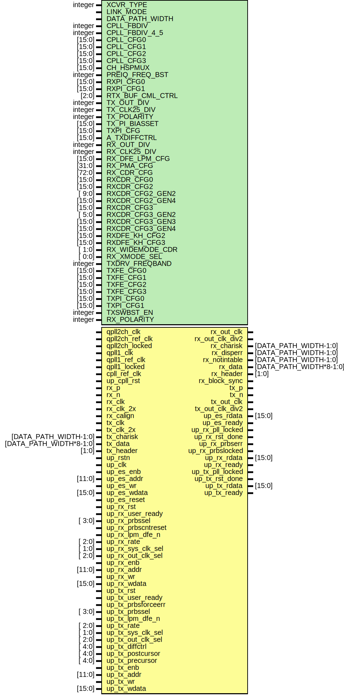

# Entity: util_adxcvr_xch

- **File**: util_adxcvr_xch.v
## Diagram

## Description

 ***************************************************************************
 ***************************************************************************
 Copyright 2014 - 2017 (c) Analog Devices, Inc. All rights reserved.

 In this HDL repository, there are many different and unique modules, consisting
 of various HDL (Verilog or VHDL) components. The individual modules are
 developed independently, and may be accompanied by separate and unique license
 terms.

 The user should read each of these license terms, and understand the
 freedoms and responsibilities that he or she has by using this source/core.

 This core is distributed in the hope that it will be useful, but WITHOUT ANY
 WARRANTY; without even the implied warranty of MERCHANTABILITY or FITNESS FOR
 A PARTICULAR PURPOSE.

 Redistribution and use of source or resulting binaries, with or without modification
 of this file, are permitted under one of the following two license terms:

   1. The GNU General Public License version 2 as published by the
      Free Software Foundation, which can be found in the top level directory
      of this repository (LICENSE_GPL2), and also online at:
      <https://www.gnu.org/licenses/old-licenses/gpl-2.0.html>

 OR

   2. An ADI specific BSD license, which can be found in the top level directory
      of this repository (LICENSE_ADIBSD), and also on-line at:
      https://github.com/analogdevicesinc/hdl/blob/master/LICENSE_ADIBSD
      This will allow to generate bit files and not release the source code,
      as long as it attaches to an ADI device.

 ***************************************************************************
 ***************************************************************************

## Generics

| Generic name     | Type    | Value                  | Description                                                     |
| ---------------- | ------- | ---------------------- | --------------------------------------------------------------- |
| XCVR_TYPE        | integer | 0                      |  parameters                                                     |
| LINK_MODE        |         | 1                      |  2 - 64B/66B;  1 - 8B/10B                                       |
| DATA_PATH_WIDTH  |         | LINK_MODE == 2 ? 8 : 4 |  Only 4 is supported at the moment for 8b/10b and 8 for 64b */  |
| CPLL_FBDIV       | integer | 2                      |                                                                 |
| CPLL_FBDIV_4_5   | integer | 5                      |                                                                 |
| CPLL_CFG0        | [15:0]  | 16'b0000000111111010   |                                                                 |
| CPLL_CFG1        | [15:0]  | 16'b0000000000100011   |                                                                 |
| CPLL_CFG2        | [15:0]  | 16'b0000000000000010   |                                                                 |
| CPLL_CFG3        | [15:0]  | 16'b0000000000000000   |                                                                 |
| CH_HSPMUX        | [15:0]  | 16'b0010010000100100   |                                                                 |
| PREIQ_FREQ_BST   | integer | 0                      |                                                                 |
| RXPI_CFG0        | [15:0]  | 16'b0000000000000010   |                                                                 |
| RXPI_CFG1        | [15:0]  | 16'b0000000000010101   |                                                                 |
| RTX_BUF_CML_CTRL | [2:0]   | 3'b011                 |                                                                 |
| TX_OUT_DIV       | integer | 1                      |                                                                 |
| TX_CLK25_DIV     | integer | 20                     |                                                                 |
| TX_POLARITY      | integer | 0                      |                                                                 |
| TX_PI_BIASSET    | [15:0]  | 1                      |                                                                 |
| TXPI_CFG         | [15:0]  | 16'b0000000001010100   |                                                                 |
| A_TXDIFFCTRL     | [15:0]  | 5'b10110               |                                                                 |
| RX_OUT_DIV       | integer | 1                      |                                                                 |
| RX_CLK25_DIV     | integer | 20                     |                                                                 |
| RX_DFE_LPM_CFG   | [15:0]  | 16'h0104               |                                                                 |
| RX_PMA_CFG       | [31:0]  | 32'h001e7080           |                                                                 |
| RX_CDR_CFG       | [72:0]  | 72'h0b000023ff10400020 |                                                                 |
| RXCDR_CFG0       | [15:0]  | 16'b0000000000000010   |                                                                 |
| RXCDR_CFG2       | [15:0]  | 16'b0000001001101001   |                                                                 |
| RXCDR_CFG2_GEN2  | [ 9:0]  | 10'b1001100101         |                                                                 |
| RXCDR_CFG2_GEN4  | [15:0]  | 16'b0000000010110100   |                                                                 |
| RXCDR_CFG3       | [15:0]  | 16'b0000000000010010   |                                                                 |
| RXCDR_CFG3_GEN2  | [ 5:0]  | 6'b011010              |                                                                 |
| RXCDR_CFG3_GEN3  | [15:0]  | 16'b0000000000010010   |                                                                 |
| RXCDR_CFG3_GEN4  | [15:0]  | 16'b0000000000100100   |                                                                 |
| RXDFE_KH_CFG2    | [15:0]  | 16'h0200               |                                                                 |
| RXDFE_KH_CFG3    | [15:0]  | 16'h4101               |                                                                 |
| RX_WIDEMODE_CDR  | [ 1:0]  | 2'b00                  |                                                                 |
| RX_XMODE_SEL     | [ 0:0]  | 1'b1                   |                                                                 |
| TXDRV_FREQBAND   | integer | 0                      |                                                                 |
| TXFE_CFG0        | [15:0]  | 16'b0000001111000010   |                                                                 |
| TXFE_CFG1        | [15:0]  | 16'b0110110000000000   |                                                                 |
| TXFE_CFG2        | [15:0]  | 16'b0110110000000000   |                                                                 |
| TXFE_CFG3        | [15:0]  | 16'b0110110000000000   |                                                                 |
| TXPI_CFG0        | [15:0]  | 16'b0000001100000000   |                                                                 |
| TXPI_CFG1        | [15:0]  | 16'b0001000000000000   |                                                                 |
| TXSWBST_EN       | integer | 0                      |                                                                 |
| RX_POLARITY      | integer | 0                      |                                                                 |
## Ports

| Port name          | Direction | Type                    | Description    |
| ------------------ | --------- | ----------------------- | -------------- |
| qpll2ch_clk        | input     |                         |  pll interface |
| qpll2ch_ref_clk    | input     |                         |                |
| qpll2ch_locked     | input     |                         |                |
| qpll1_clk          | input     |                         |                |
| qpll1_ref_clk      | input     |                         |                |
| qpll1_locked       | input     |                         |                |
| cpll_ref_clk       | input     |                         |                |
| up_cpll_rst        | input     |                         |                |
| rx_p               | input     |                         |  receive       |
| rx_n               | input     |                         |                |
| rx_out_clk         | output    |                         |                |
| rx_out_clk_div2    | output    |                         |                |
| rx_clk             | input     |                         |                |
| rx_clk_2x          | input     |                         |                |
| rx_charisk         | output    | [DATA_PATH_WIDTH-1:0]   |                |
| rx_disperr         | output    | [DATA_PATH_WIDTH-1:0]   |                |
| rx_notintable      | output    | [DATA_PATH_WIDTH-1:0]   |                |
| rx_data            | output    | [DATA_PATH_WIDTH*8-1:0] |                |
| rx_calign          | input     |                         |                |
| rx_header          | output    | [1:0]                   |                |
| rx_block_sync      | output    |                         |                |
| tx_p               | output    |                         |  transmit      |
| tx_n               | output    |                         |                |
| tx_out_clk         | output    |                         |                |
| tx_out_clk_div2    | output    |                         |                |
| tx_clk             | input     |                         |                |
| tx_clk_2x          | input     |                         |                |
| tx_charisk         | input     | [DATA_PATH_WIDTH-1:0]   |                |
| tx_data            | input     | [DATA_PATH_WIDTH*8-1:0] |                |
| tx_header          | input     | [1:0]                   |                |
| up_rstn            | input     |                         |  up interface  |
| up_clk             | input     |                         |                |
| up_es_enb          | input     |                         |                |
| up_es_addr         | input     | [11:0]                  |                |
| up_es_wr           | input     |                         |                |
| up_es_wdata        | input     | [15:0]                  |                |
| up_es_rdata        | output    | [15:0]                  |                |
| up_es_ready        | output    |                         |                |
| up_es_reset        | input     |                         |                |
| up_rx_pll_locked   | output    |                         |                |
| up_rx_rst          | input     |                         |                |
| up_rx_user_ready   | input     |                         |                |
| up_rx_rst_done     | output    |                         |                |
| up_rx_prbssel      | input     | [ 3:0]                  |                |
| up_rx_prbscntreset | input     |                         |                |
| up_rx_prbserr      | output    |                         |                |
| up_rx_prbslocked   | output    |                         |                |
| up_rx_lpm_dfe_n    | input     |                         |                |
| up_rx_rate         | input     | [ 2:0]                  |                |
| up_rx_sys_clk_sel  | input     | [ 1:0]                  |                |
| up_rx_out_clk_sel  | input     | [ 2:0]                  |                |
| up_rx_enb          | input     |                         |                |
| up_rx_addr         | input     | [11:0]                  |                |
| up_rx_wr           | input     |                         |                |
| up_rx_wdata        | input     | [15:0]                  |                |
| up_rx_rdata        | output    | [15:0]                  |                |
| up_rx_ready        | output    |                         |                |
| up_tx_pll_locked   | output    |                         |                |
| up_tx_rst          | input     |                         |                |
| up_tx_user_ready   | input     |                         |                |
| up_tx_rst_done     | output    |                         |                |
| up_tx_prbsforceerr | input     |                         |                |
| up_tx_prbssel      | input     | [ 3:0]                  |                |
| up_tx_lpm_dfe_n    | input     |                         |                |
| up_tx_rate         | input     | [ 2:0]                  |                |
| up_tx_sys_clk_sel  | input     | [ 1:0]                  |                |
| up_tx_out_clk_sel  | input     | [ 2:0]                  |                |
| up_tx_diffctrl     | input     | [ 4:0]                  |                |
| up_tx_postcursor   | input     | [ 4:0]                  |                |
| up_tx_precursor    | input     | [ 4:0]                  |                |
| up_tx_enb          | input     |                         |                |
| up_tx_addr         | input     | [11:0]                  |                |
| up_tx_wr           | input     |                         |                |
| up_tx_wdata        | input     | [15:0]                  |                |
| up_tx_rdata        | output    | [15:0]                  |                |
| up_tx_ready        | output    |                         |                |
## Signals

| Name                 | Type           | Description               |
| -------------------- | -------------- | ------------------------- |
| up_es_rdata_int      | reg     [15:0] |  internal registers       |
| up_es_ready_int      | reg            |                           |
| up_rx_rdata_int      | reg     [15:0] |                           |
| up_rx_ready_int      | reg            |                           |
| up_tx_rdata_int      | reg     [15:0] |                           |
| up_tx_ready_int      | reg            |                           |
| up_sel_int           | reg     [ 2:0] |                           |
| up_enb_int           | reg            |                           |
| up_addr_int          | reg     [11:0] |                           |
| up_wr_int            | reg            |                           |
| up_wdata_int         | reg     [15:0] |                           |
| up_rx_rst_done_m1    | reg            |                           |
| up_rx_rst_done_m2    | reg            |                           |
| up_tx_rst_done_m1    | reg            |                           |
| up_tx_rst_done_m2    | reg            |                           |
| rx_rate_m1           | reg     [ 2:0] |                           |
| rx_rate_m2           | reg     [ 2:0] |                           |
| tx_rate_m1           | reg     [ 2:0] |                           |
| tx_rate_m2           | reg     [ 2:0] |                           |
| up_rdata_s           | wire [15:0]    |  internal signals         |
| up_ready_s           | wire           |                           |
| rx_sys_clk_sel_s     | wire [ 1:0]    |                           |
| rx_out_clk_s         | wire           |                           |
| rx_rst_done_s        | wire           |                           |
| tx_sys_clk_sel_s     | wire [ 1:0]    |                           |
| tx_out_clk_s         | wire           |                           |
| tx_rst_done_s        | wire           |                           |
| rx_pll_clk_sel_s     | wire [ 1:0]    |                           |
| tx_pll_clk_sel_s     | wire [ 1:0]    |                           |
| rx_charisk_open_s    | wire [11:0]    |                           |
| rx_disperr_open_s    | wire [11:0]    |                           |
| rx_notintable_open_s | wire [ 3:0]    |                           |
| rx_data_open_s       | wire [95:0]    |                           |
| cpll_locked_s        | wire           |                           |
| rx_usrclk            | wire           |                           |
| rx_usrclk2           | wire           |                           |
| tx_usrclk            | wire           |                           |
| tx_usrclk2           | wire           |                           |
| rx_prbscntreset      | wire           |  Rx PRBS interface logic  |
| rx_prbserr           | wire           |                           |
| rx_prbslocked        | wire           |                           |
| rx_prbssel           | wire [ 3:0]    |                           |
| rx_prbserr_sticky    | reg            |                           |
| tx_prbsforceerr      | wire           |  Tx PRBS interface logic  |
| tx_prbssel           | wire [ 3:0]    |                           |
| rx_header_s          | wire [1:0]     |                           |
| rx_data_s            | wire [127:0]   |                           |
| tx_data_s            | wire [127:0]   |                           |
| rx_bitslip_s         | wire           |                           |
## Constants

| Name                     | Type | Value                  | Description           |
| ------------------------ | ---- | ---------------------- | --------------------- |
| GTXE2_TRANSCEIVERS       |      | 2                      |                       |
| GTHE3_TRANSCEIVERS       |      | 5                      |                       |
| GTHE4_TRANSCEIVERS       |      | 8                      |                       |
| GTYE4_TRANSCEIVERS       |      | 9                      |                       |
| ALIGN_COMMA_ENABLE       |      | 10'b0000000000         |  204C specific logic  |
| ALIGN_MCOMMA_DET         |      | "FALSE"                |                       |
| ALIGN_PCOMMA_DET         |      | "FALSE"                |                       |
| CBCC_DATA_SOURCE_SEL     |      | "ENCODED"              |                       |
| DEC_MCOMMA_DETECT        |      | "FALSE"                |                       |
| DEC_PCOMMA_DETECT        |      | "FALSE"                |                       |
| RXBUF_EN                 |      | "FALSE"                |                       |
| TXBUF_EN                 |      | "FALSE"                |                       |
| RX_DATA_WIDTH            |      | LINK_MODE[1] ? 64 : 40 |                       |
| TX_DATA_WIDTH            |      | LINK_MODE[1] ? 64 : 40 |                       |
| GEARBOX_MODE             |      | 5'b10001               |                       |
| RXGEARBOX_EN             |      | "TRUE"                 |                       |
| TXGEARBOX_EN             |      | "TRUE"                 |                       |
| RX_INT_DATAWIDTH         |      | LINK_MODE[1] ? 2 : 1   |                       |
| TX_INT_DATAWIDTH         |      | LINK_MODE[1] ? 2 : 1   |                       |
| RX8B10BEN                |      | LINK_MODE[1] ? 0 : 1   |                       |
| TX8B10BEN                |      | LINK_MODE[1] ? 0 : 1   |                       |
| RXGBOX_FIFO_INIT_RD_ADDR |      | LINK_MODE[1] ? 3 : 4   |                       |
| RXBUF_THRESH_UNDFLW      |      | LINK_MODE[1] ? 4 : 3   |                       |
## Processes
- unnamed: ( @(negedge up_rstn or posedge up_clk) )
  - **Type:** always
- unnamed: ( @(negedge up_rstn or posedge up_clk) )
  - **Type:** always
- unnamed: ( @(posedge rx_clk) )
  - **Type:** always
- unnamed: ( @(posedge tx_clk) )
  - **Type:** always
- unnamed: ( @(posedge rx_clk) )
  - **Type:** always
## Instantiations

- i_sync_bits_rx_prbs_in: sync_bits
- i_sync_bits_rx_prbs_out: sync_bits
- i_sync_bits_tx_prbs_in: sync_bits
