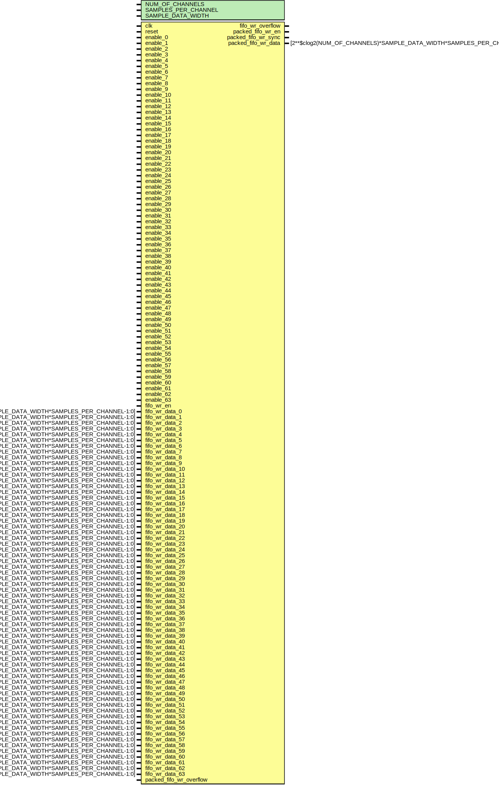

# Entity: util_cpack2

- **File**: util_cpack2.v
## Diagram

## Description

***************************************************************************
 ***************************************************************************
 Copyright 2018 (c) Analog Devices, Inc. All rights reserved.
 In this HDL repository, there are many different and unique modules, consisting
 of various HDL (Verilog or VHDL) components. The individual modules are
 developed independently, and may be accompanied by separate and unique license
 terms.
 The user should read each of these license terms, and understand the
 freedoms and responsabilities that he or she has by using this source/core.
 This core is distributed in the hope that it will be useful, but WITHOUT ANY
 WARRANTY; without even the implied warranty of MERCHANTABILITY or FITNESS FOR
 A PARTICULAR PURPOSE.
 Redistribution and use of source or resulting binaries, with or without modification
 of this file, are permitted under one of the following two license terms:
   1. The GNU General Public License version 2 as published by the
      Free Software Foundation, which can be found in the top level directory
      of this repository (LICENSE_GPL2), and also online at:
      <https://www.gnu.org/licenses/old-licenses/gpl-2.0.html>
 OR
   2. An ADI specific BSD license, which can be found in the top level directory
      of this repository (LICENSE_ADIBSD), and also on-line at:
      https://github.com/analogdevicesinc/hdl/blob/master/LICENSE_ADIBSD
      This will allow to generate bit files and not release the source code,
      as long as it attaches to an ADI device.
 ***************************************************************************
 ***************************************************************************
 
## Generics

| Generic name        | Type | Value | Description |
| ------------------- | ---- | ----- | ----------- |
| NUM_OF_CHANNELS     |      | 4     |             |
| SAMPLES_PER_CHANNEL |      | 1     |             |
| SAMPLE_DATA_WIDTH   |      | 16    |             |
## Ports

| Port name               | Direction | Type                                                                   | Description |
| ----------------------- | --------- | ---------------------------------------------------------------------- | ----------- |
| clk                     | input     |                                                                        |             |
| reset                   | input     |                                                                        |             |
| enable_0                | input     |                                                                        |             |
| enable_1                | input     |                                                                        |             |
| enable_2                | input     |                                                                        |             |
| enable_3                | input     |                                                                        |             |
| enable_4                | input     |                                                                        |             |
| enable_5                | input     |                                                                        |             |
| enable_6                | input     |                                                                        |             |
| enable_7                | input     |                                                                        |             |
| enable_8                | input     |                                                                        |             |
| enable_9                | input     |                                                                        |             |
| enable_10               | input     |                                                                        |             |
| enable_11               | input     |                                                                        |             |
| enable_12               | input     |                                                                        |             |
| enable_13               | input     |                                                                        |             |
| enable_14               | input     |                                                                        |             |
| enable_15               | input     |                                                                        |             |
| enable_16               | input     |                                                                        |             |
| enable_17               | input     |                                                                        |             |
| enable_18               | input     |                                                                        |             |
| enable_19               | input     |                                                                        |             |
| enable_20               | input     |                                                                        |             |
| enable_21               | input     |                                                                        |             |
| enable_22               | input     |                                                                        |             |
| enable_23               | input     |                                                                        |             |
| enable_24               | input     |                                                                        |             |
| enable_25               | input     |                                                                        |             |
| enable_26               | input     |                                                                        |             |
| enable_27               | input     |                                                                        |             |
| enable_28               | input     |                                                                        |             |
| enable_29               | input     |                                                                        |             |
| enable_30               | input     |                                                                        |             |
| enable_31               | input     |                                                                        |             |
| enable_32               | input     |                                                                        |             |
| enable_33               | input     |                                                                        |             |
| enable_34               | input     |                                                                        |             |
| enable_35               | input     |                                                                        |             |
| enable_36               | input     |                                                                        |             |
| enable_37               | input     |                                                                        |             |
| enable_38               | input     |                                                                        |             |
| enable_39               | input     |                                                                        |             |
| enable_40               | input     |                                                                        |             |
| enable_41               | input     |                                                                        |             |
| enable_42               | input     |                                                                        |             |
| enable_43               | input     |                                                                        |             |
| enable_44               | input     |                                                                        |             |
| enable_45               | input     |                                                                        |             |
| enable_46               | input     |                                                                        |             |
| enable_47               | input     |                                                                        |             |
| enable_48               | input     |                                                                        |             |
| enable_49               | input     |                                                                        |             |
| enable_50               | input     |                                                                        |             |
| enable_51               | input     |                                                                        |             |
| enable_52               | input     |                                                                        |             |
| enable_53               | input     |                                                                        |             |
| enable_54               | input     |                                                                        |             |
| enable_55               | input     |                                                                        |             |
| enable_56               | input     |                                                                        |             |
| enable_57               | input     |                                                                        |             |
| enable_58               | input     |                                                                        |             |
| enable_59               | input     |                                                                        |             |
| enable_60               | input     |                                                                        |             |
| enable_61               | input     |                                                                        |             |
| enable_62               | input     |                                                                        |             |
| enable_63               | input     |                                                                        |             |
| fifo_wr_en              | input     |                                                                        |             |
| fifo_wr_overflow        | output    |                                                                        |             |
| fifo_wr_data_0          | input     | [SAMPLE_DATA_WIDTH*SAMPLES_PER_CHANNEL-1:0]                            |             |
| fifo_wr_data_1          | input     | [SAMPLE_DATA_WIDTH*SAMPLES_PER_CHANNEL-1:0]                            |             |
| fifo_wr_data_2          | input     | [SAMPLE_DATA_WIDTH*SAMPLES_PER_CHANNEL-1:0]                            |             |
| fifo_wr_data_3          | input     | [SAMPLE_DATA_WIDTH*SAMPLES_PER_CHANNEL-1:0]                            |             |
| fifo_wr_data_4          | input     | [SAMPLE_DATA_WIDTH*SAMPLES_PER_CHANNEL-1:0]                            |             |
| fifo_wr_data_5          | input     | [SAMPLE_DATA_WIDTH*SAMPLES_PER_CHANNEL-1:0]                            |             |
| fifo_wr_data_6          | input     | [SAMPLE_DATA_WIDTH*SAMPLES_PER_CHANNEL-1:0]                            |             |
| fifo_wr_data_7          | input     | [SAMPLE_DATA_WIDTH*SAMPLES_PER_CHANNEL-1:0]                            |             |
| fifo_wr_data_8          | input     | [SAMPLE_DATA_WIDTH*SAMPLES_PER_CHANNEL-1:0]                            |             |
| fifo_wr_data_9          | input     | [SAMPLE_DATA_WIDTH*SAMPLES_PER_CHANNEL-1:0]                            |             |
| fifo_wr_data_10         | input     | [SAMPLE_DATA_WIDTH*SAMPLES_PER_CHANNEL-1:0]                            |             |
| fifo_wr_data_11         | input     | [SAMPLE_DATA_WIDTH*SAMPLES_PER_CHANNEL-1:0]                            |             |
| fifo_wr_data_12         | input     | [SAMPLE_DATA_WIDTH*SAMPLES_PER_CHANNEL-1:0]                            |             |
| fifo_wr_data_13         | input     | [SAMPLE_DATA_WIDTH*SAMPLES_PER_CHANNEL-1:0]                            |             |
| fifo_wr_data_14         | input     | [SAMPLE_DATA_WIDTH*SAMPLES_PER_CHANNEL-1:0]                            |             |
| fifo_wr_data_15         | input     | [SAMPLE_DATA_WIDTH*SAMPLES_PER_CHANNEL-1:0]                            |             |
| fifo_wr_data_16         | input     | [SAMPLE_DATA_WIDTH*SAMPLES_PER_CHANNEL-1:0]                            |             |
| fifo_wr_data_17         | input     | [SAMPLE_DATA_WIDTH*SAMPLES_PER_CHANNEL-1:0]                            |             |
| fifo_wr_data_18         | input     | [SAMPLE_DATA_WIDTH*SAMPLES_PER_CHANNEL-1:0]                            |             |
| fifo_wr_data_19         | input     | [SAMPLE_DATA_WIDTH*SAMPLES_PER_CHANNEL-1:0]                            |             |
| fifo_wr_data_20         | input     | [SAMPLE_DATA_WIDTH*SAMPLES_PER_CHANNEL-1:0]                            |             |
| fifo_wr_data_21         | input     | [SAMPLE_DATA_WIDTH*SAMPLES_PER_CHANNEL-1:0]                            |             |
| fifo_wr_data_22         | input     | [SAMPLE_DATA_WIDTH*SAMPLES_PER_CHANNEL-1:0]                            |             |
| fifo_wr_data_23         | input     | [SAMPLE_DATA_WIDTH*SAMPLES_PER_CHANNEL-1:0]                            |             |
| fifo_wr_data_24         | input     | [SAMPLE_DATA_WIDTH*SAMPLES_PER_CHANNEL-1:0]                            |             |
| fifo_wr_data_25         | input     | [SAMPLE_DATA_WIDTH*SAMPLES_PER_CHANNEL-1:0]                            |             |
| fifo_wr_data_26         | input     | [SAMPLE_DATA_WIDTH*SAMPLES_PER_CHANNEL-1:0]                            |             |
| fifo_wr_data_27         | input     | [SAMPLE_DATA_WIDTH*SAMPLES_PER_CHANNEL-1:0]                            |             |
| fifo_wr_data_28         | input     | [SAMPLE_DATA_WIDTH*SAMPLES_PER_CHANNEL-1:0]                            |             |
| fifo_wr_data_29         | input     | [SAMPLE_DATA_WIDTH*SAMPLES_PER_CHANNEL-1:0]                            |             |
| fifo_wr_data_30         | input     | [SAMPLE_DATA_WIDTH*SAMPLES_PER_CHANNEL-1:0]                            |             |
| fifo_wr_data_31         | input     | [SAMPLE_DATA_WIDTH*SAMPLES_PER_CHANNEL-1:0]                            |             |
| fifo_wr_data_32         | input     | [SAMPLE_DATA_WIDTH*SAMPLES_PER_CHANNEL-1:0]                            |             |
| fifo_wr_data_33         | input     | [SAMPLE_DATA_WIDTH*SAMPLES_PER_CHANNEL-1:0]                            |             |
| fifo_wr_data_34         | input     | [SAMPLE_DATA_WIDTH*SAMPLES_PER_CHANNEL-1:0]                            |             |
| fifo_wr_data_35         | input     | [SAMPLE_DATA_WIDTH*SAMPLES_PER_CHANNEL-1:0]                            |             |
| fifo_wr_data_36         | input     | [SAMPLE_DATA_WIDTH*SAMPLES_PER_CHANNEL-1:0]                            |             |
| fifo_wr_data_37         | input     | [SAMPLE_DATA_WIDTH*SAMPLES_PER_CHANNEL-1:0]                            |             |
| fifo_wr_data_38         | input     | [SAMPLE_DATA_WIDTH*SAMPLES_PER_CHANNEL-1:0]                            |             |
| fifo_wr_data_39         | input     | [SAMPLE_DATA_WIDTH*SAMPLES_PER_CHANNEL-1:0]                            |             |
| fifo_wr_data_40         | input     | [SAMPLE_DATA_WIDTH*SAMPLES_PER_CHANNEL-1:0]                            |             |
| fifo_wr_data_41         | input     | [SAMPLE_DATA_WIDTH*SAMPLES_PER_CHANNEL-1:0]                            |             |
| fifo_wr_data_42         | input     | [SAMPLE_DATA_WIDTH*SAMPLES_PER_CHANNEL-1:0]                            |             |
| fifo_wr_data_43         | input     | [SAMPLE_DATA_WIDTH*SAMPLES_PER_CHANNEL-1:0]                            |             |
| fifo_wr_data_44         | input     | [SAMPLE_DATA_WIDTH*SAMPLES_PER_CHANNEL-1:0]                            |             |
| fifo_wr_data_45         | input     | [SAMPLE_DATA_WIDTH*SAMPLES_PER_CHANNEL-1:0]                            |             |
| fifo_wr_data_46         | input     | [SAMPLE_DATA_WIDTH*SAMPLES_PER_CHANNEL-1:0]                            |             |
| fifo_wr_data_47         | input     | [SAMPLE_DATA_WIDTH*SAMPLES_PER_CHANNEL-1:0]                            |             |
| fifo_wr_data_48         | input     | [SAMPLE_DATA_WIDTH*SAMPLES_PER_CHANNEL-1:0]                            |             |
| fifo_wr_data_49         | input     | [SAMPLE_DATA_WIDTH*SAMPLES_PER_CHANNEL-1:0]                            |             |
| fifo_wr_data_50         | input     | [SAMPLE_DATA_WIDTH*SAMPLES_PER_CHANNEL-1:0]                            |             |
| fifo_wr_data_51         | input     | [SAMPLE_DATA_WIDTH*SAMPLES_PER_CHANNEL-1:0]                            |             |
| fifo_wr_data_52         | input     | [SAMPLE_DATA_WIDTH*SAMPLES_PER_CHANNEL-1:0]                            |             |
| fifo_wr_data_53         | input     | [SAMPLE_DATA_WIDTH*SAMPLES_PER_CHANNEL-1:0]                            |             |
| fifo_wr_data_54         | input     | [SAMPLE_DATA_WIDTH*SAMPLES_PER_CHANNEL-1:0]                            |             |
| fifo_wr_data_55         | input     | [SAMPLE_DATA_WIDTH*SAMPLES_PER_CHANNEL-1:0]                            |             |
| fifo_wr_data_56         | input     | [SAMPLE_DATA_WIDTH*SAMPLES_PER_CHANNEL-1:0]                            |             |
| fifo_wr_data_57         | input     | [SAMPLE_DATA_WIDTH*SAMPLES_PER_CHANNEL-1:0]                            |             |
| fifo_wr_data_58         | input     | [SAMPLE_DATA_WIDTH*SAMPLES_PER_CHANNEL-1:0]                            |             |
| fifo_wr_data_59         | input     | [SAMPLE_DATA_WIDTH*SAMPLES_PER_CHANNEL-1:0]                            |             |
| fifo_wr_data_60         | input     | [SAMPLE_DATA_WIDTH*SAMPLES_PER_CHANNEL-1:0]                            |             |
| fifo_wr_data_61         | input     | [SAMPLE_DATA_WIDTH*SAMPLES_PER_CHANNEL-1:0]                            |             |
| fifo_wr_data_62         | input     | [SAMPLE_DATA_WIDTH*SAMPLES_PER_CHANNEL-1:0]                            |             |
| fifo_wr_data_63         | input     | [SAMPLE_DATA_WIDTH*SAMPLES_PER_CHANNEL-1:0]                            |             |
| packed_fifo_wr_en       | output    |                                                                        |             |
| packed_fifo_wr_overflow | input     |                                                                        |             |
| packed_fifo_wr_sync     | output    |                                                                        |             |
| packed_fifo_wr_data     | output    | [2**$clog2(NUM_OF_CHANNELS)*SAMPLE_DATA_WIDTH*SAMPLES_PER_CHANNEL-1:0] |             |
## Signals

| Name           | Type                                               | Description                                       |
| -------------- | -------------------------------------------------- | ------------------------------------------------- |
| enable         | wire [REAL_NUM_OF_CHANNELS-1:0]                    | FIXME: Find out how to do this in the IP-XACT */  |
| enable_s       | wire [63:0]                                        |                                                   |
| fifo_wr_data   | wire [CHANNEL_DATA_WIDTH*REAL_NUM_OF_CHANNELS-1:0] |                                                   |
| fifo_wr_data_s | wire [CHANNEL_DATA_WIDTH*64-1:0]                   |                                                   |
## Constants

| Name                 | Type | Value                                   | Description |
| -------------------- | ---- | --------------------------------------- | ----------- |
| CHANNEL_DATA_WIDTH   |      | SAMPLE_DATA_WIDTH * SAMPLES_PER_CHANNEL |             |
| REAL_NUM_OF_CHANNELS |      |                                         |             |
## Instantiations

- i_cpack: util_cpack2_impl
