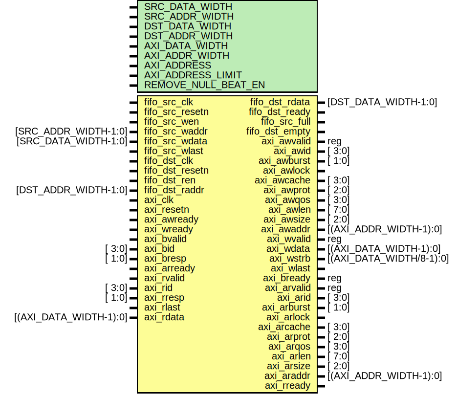

# Entity: util_fifo2axi_bridge

- **File**: util_fifo2axi_bridge.v
## Diagram

## Description

 ***************************************************************************
 ***************************************************************************
 Copyright 2014 - 2017 (c) Analog Devices, Inc. All rights reserved.

 In this HDL repository, there are many different and unique modules, consisting
 of various HDL (Verilog or VHDL) components. The individual modules are
 developed independently, and may be accompanied by separate and unique license
 terms.

 The user should read each of these license terms, and understand the
 freedoms and responsibilities that he or she has by using this source/core.

 This core is distributed in the hope that it will be useful, but WITHOUT ANY
 WARRANTY; without even the implied warranty of MERCHANTABILITY or FITNESS FOR
 A PARTICULAR PURPOSE.

 Redistribution and use of source or resulting binaries, with or without modification
 of this file, are permitted under one of the following two license terms:

   1. The GNU General Public License version 2 as published by the
      Free Software Foundation, which can be found in the top level directory
      of this repository (LICENSE_GPL2), and also online at:
      <https://www.gnu.org/licenses/old-licenses/gpl-2.0.html>

 OR

   2. An ADI specific BSD license, which can be found in the top level directory
      of this repository (LICENSE_ADIBSD), and also on-line at:
      https://github.com/analogdevicesinc/hdl/blob/master/LICENSE_ADIBSD
      This will allow to generate bit files and not release the source code,
      as long as it attaches to an ADI device.

 ***************************************************************************
 ***************************************************************************

## Generics

| Generic name        | Type | Value        | Description |
| ------------------- | ---- | ------------ | ----------- |
| SRC_DATA_WIDTH      |      | 64           |             |
| SRC_ADDR_WIDTH      |      | 8            |             |
| DST_DATA_WIDTH      |      | 128          |             |
| DST_ADDR_WIDTH      |      | 7            |             |
| AXI_DATA_WIDTH      |      | 512          |             |
| AXI_ADDR_WIDTH      |      | 32           |             |
| AXI_ADDRESS         |      | 32'h00000000 |             |
| AXI_ADDRESS_LIMIT   |      | 32'hffffffff |             |
| REMOVE_NULL_BEAT_EN |      | 0            |             |
## Ports

| Port name       | Direction | Type                     | Description                                                                          |
| --------------- | --------- | ------------------------ | ------------------------------------------------------------------------------------ |
| fifo_src_clk    | input     |                          |                                                                                      |
| fifo_src_resetn | input     |                          |                                                                                      |
| fifo_src_wen    | input     |                          |                                                                                      |
| fifo_src_waddr  | input     | [SRC_ADDR_WIDTH-1:0]     |                                                                                      |
| fifo_src_wdata  | input     | [SRC_DATA_WIDTH-1:0]     |                                                                                      |
| fifo_src_wlast  | input     |                          |                                                                                      |
| fifo_dst_clk    | input     |                          |                                                                                      |
| fifo_dst_resetn | input     |                          |                                                                                      |
| fifo_dst_ren    | input     |                          |                                                                                      |
| fifo_dst_raddr  | input     | [DST_ADDR_WIDTH-1:0]     |                                                                                      |
| fifo_dst_rdata  | output    | [DST_DATA_WIDTH-1:0]     |                                                                                      |
| fifo_dst_ready  | output    |                          |  Signal to the controller, that the bridge is ready to push data to the destination  |
| fifo_src_full   | output    |                          | FULL asserts when SOURCE data rate (e.g. ADC) is higher than DDR data rate           |
| fifo_dst_empty  | output    |                          | EMPTY asserts when DESTINATION data rate (e.g. DAC) is higher than DDR data rate     |
| axi_clk         | input     |                          |  AXI4 interface                                                                      |
| axi_resetn      | input     |                          |                                                                                      |
| axi_awvalid     | output    | reg                      |                                                                                      |
| axi_awid        | output    | [ 3:0]                   |                                                                                      |
| axi_awburst     | output    | [ 1:0]                   |                                                                                      |
| axi_awlock      | output    |                          |                                                                                      |
| axi_awcache     | output    | [ 3:0]                   |                                                                                      |
| axi_awprot      | output    | [ 2:0]                   |                                                                                      |
| axi_awqos       | output    | [ 3:0]                   |                                                                                      |
| axi_awlen       | output    | [ 7:0]                   |                                                                                      |
| axi_awsize      | output    | [ 2:0]                   |                                                                                      |
| axi_awaddr      | output    | [(AXI_ADDR_WIDTH-1):0]   |                                                                                      |
| axi_awready     | input     |                          |                                                                                      |
| axi_wvalid      | output    | reg                      |                                                                                      |
| axi_wdata       | output    | [(AXI_DATA_WIDTH-1):0]   |                                                                                      |
| axi_wstrb       | output    | [(AXI_DATA_WIDTH/8-1):0] |                                                                                      |
| axi_wlast       | output    |                          |                                                                                      |
| axi_wready      | input     |                          |                                                                                      |
| axi_bvalid      | input     |                          |                                                                                      |
| axi_bid         | input     | [ 3:0]                   |                                                                                      |
| axi_bresp       | input     | [ 1:0]                   |                                                                                      |
| axi_bready      | output    | reg                      | always ready for write response                                                      |
| axi_arvalid     | output    | reg                      |                                                                                      |
| axi_arid        | output    | [ 3:0]                   |                                                                                      |
| axi_arburst     | output    | [ 1:0]                   |                                                                                      |
| axi_arlock      | output    |                          |                                                                                      |
| axi_arcache     | output    | [ 3:0]                   |                                                                                      |
| axi_arprot      | output    | [ 2:0]                   |                                                                                      |
| axi_arqos       | output    | [ 3:0]                   |                                                                                      |
| axi_arlen       | output    | [ 7:0]                   |                                                                                      |
| axi_arsize      | output    | [ 2:0]                   |                                                                                      |
| axi_araddr      | output    | [(AXI_ADDR_WIDTH-1):0]   |                                                                                      |
| axi_arready     | input     |                          |                                                                                      |
| axi_rvalid      | input     |                          |                                                                                      |
| axi_rid         | input     | [ 3:0]                   |                                                                                      |
| axi_rresp       | input     | [ 1:0]                   |                                                                                      |
| axi_rlast       | input     |                          |                                                                                      |
| axi_rdata       | input     | [(AXI_DATA_WIDTH-1):0]   |                                                                                      |
| axi_rready      | output    |                          |                                                                                      |
## Signals

| Name                         | Type                           | Description                                                                                                            |
| ---------------------------- | ------------------------------ | ---------------------------------------------------------------------------------------------------------------------- |
| axi_wkeep_int_s              | wire [AXI_DATA_WIDTH/8-1:0]    |                                                                                                                        |
| axi_wlast_int_s              | wire                           |                                                                                                                        |
| axi_fifo_src_last_received_s | wire                           |                                                                                                                        |
| axi_wcdc_almost_empty        | wire                           |                                                                                                                        |
| axi_wcdc_empty               | wire                           |                                                                                                                        |
| axi_wcdc_level_s             | wire [AXI_CDC_ADDR_WIDTH-1:0]  |                                                                                                                        |
| axi_wdata_en_s               | wire                           |                                                                                                                        |
| axi_fifo_src_resetn          | wire                           |                                                                                                                        |
| axi_fifo_dst_resetn          | wire                           |                                                                                                                        |
| axi_rxfer_start_s            | wire                           |                                                                                                                        |
| axi_src_resetn               | wire                           |                                                                                                                        |
| axi_dst_resetn               | wire                           |                                                                                                                        |
| fifo_src_last_received       | reg                            |                                                                                                                        |
| axi_wxfer_active             | reg                            |                                                                                                                        |
| axi_rxfer_active             | reg                            |                                                                                                                        |
| axi_rdata_en                 | reg                            |                                                                                                                        |
| axi_awlen_d                  | reg   [ 7:0]                   |                                                                                                                        |
| axi_wbeat_counter            | reg   [ 7:0]                   |                                                                                                                        |
| axi_wburst_counter           | reg   [31:0]                   |                                                                                                                        |
| axi_rburst_counter           | reg   [31:0]                   |                                                                                                                        |
| axi_last_burst_length        | reg   [AXI_CDC_ADDR_WIDTH-1:0] |                                                                                                                        |
| axi_wxfer_active_d           | reg   [ 1:0]                   |                                                                                                                        |
| axi_write_done               | reg                            |                                                                                                                        |
| axi_rxfer_active_d           | reg                            |                                                                                                                        |
| axi_wlast_tkeep              | reg [AXI_DATA_WIDTH/8-1:0]     |  save the last TKEEP for read  NOTE: we are writing invalid data to the memory in case of a fractional last beat       |
| axi_rlast_keep_s             | wire [AXI_DATA_WIDTH/8:0]      |                                                                                                                        |
| fifo_dst_tkeep_int_s         | wire [DST_DATA_WIDTH/8-1:0]    |                                                                                                                        |
| fifo_dst_tdata_int_s         | wire [DST_DATA_WIDTH-1:0]      |                                                                                                                        |
| fifo_dst_tready_int_s        | wire                           |                                                                                                                        |
| fifo_dst_tvalid_int_s        | wire                           |                                                                                                                        |
| fifo_dst_almost_empty_s      | wire                           |                                                                                                                        |
| fifo_dst_empty_s             | wire                           |                                                                                                                        |
| fifo_dst_cdc_ready           | reg                            |  Assuming that the EMIF has a higher bandwidth than the destination  interface, load at least one burst into CDC FIFO  |
## Constants

| Name                          | Type   | Value                                        | Description                                                                                                           |
| ----------------------------- | ------ | -------------------------------------------- | --------------------------------------------------------------------------------------------------------------------- |
| AXI_BYTE_WIDTH                |        | AXI_DATA_WIDTH/8                             |  AXI Memory Mapped related parameters                                                                                 |
| AXI_SIZE                      |        | 3'b111 :                                     |                                                                                                                       |
| AXI_LENGTH                    |        | 4096/AXI_BYTE_WIDTH - 1                      |  we are using the max burst length by default, respecting the 4kbyte  boundary defined by the AXI4 standard           |
| AXI_LENGTH_INDEX              |        | $clog2(AXI_LENGTH)                           |                                                                                                                       |
| AXI_ADDR_INCR                 |        | AXI_BYTE_WIDTH                               |                                                                                                                       |
| FOUR_KB                       |        | 4096 * 8                                     |  CDC FIFO's must be capable to store a 2 x 4Kbytes  WARNING: Changing this depth will brake other part of the bridge  |
| AXI_CDC_ADDR_WIDTH            | [31:0] | $clog2(((2 * FOUR_KB) / AXI_DATA_WIDTH) - 1) |                                                                                                                       |
| SRC_CDC_ADDR_WIDTH            | [31:0] | $clog2(((2 * FOUR_KB) / SRC_DATA_WIDTH) - 1) |                                                                                                                       |
| DST_CDC_ADDR_WIDTH            | [31:0] | $clog2(((2 * FOUR_KB) / DST_DATA_WIDTH) - 1) |                                                                                                                       |
| SRC_4KB_BYTE                  |        | FOUR_KB/SRC_DATA_WIDTH                       |                                                                                                                       |
| DST_4KB_BYTE                  |        | FOUR_KB/DST_DATA_WIDTH                       |                                                                                                                       |
| DST_4KB_BYTE_INDEX            |        | $clog2(FOUR_KB/DST_DATA_WIDTH)               |                                                                                                                       |
| AXI_4KB_BYTE                  |        | FOUR_KB/AXI_DATA_WIDTH                       |                                                                                                                       |
| WR_CDC_ALMOST_EMPTY_THRESHOLD |        | AXI_4KB_BYTE                                 |  almost full and almost empty thresholds for the CDC FIFO's                                                           |
| RD_CDC_ALMOST_EMPTY_THRESHOLD |        | DS                                           |                                                                                                                       |
## Processes
- unnamed: ( @(posedge axi_clk) )
  - **Type:** always
- unnamed: ( @(posedge fifo_src_clk) )
  - **Type:** always
 **Description**
 it helps to flush the source CDC FIFO 
- unnamed: ( @(posedge axi_clk) )
  - **Type:** always
- unnamed: ( @(posedge axi_clk) )
  - **Type:** always
- unnamed: ( @(posedge axi_clk) )
  - **Type:** always
- awvalid_control: ( @(posedge axi_clk) )
  - **Type:** always
 **Description**
 WRITE address and data channel control 
- wvalid_control: ( @(posedge axi_clk) )
  - **Type:** always
 **Description**
 awvalid_control */ 
- awaddr_control: ( @(posedge axi_clk) )
  - **Type:** always
 **Description**
 wvalid_control */ 
- unnamed: ( @(posedge axi_clk) )
  - **Type:** always
 **Description**
 latch AWLEN for WLAST generation 
- unnamed: ( @(posedge axi_clk) )
  - **Type:** always
 **Description**
 WRITE beat counter to assert WLAST at the right time 
- unnamed: ( @(posedge axi_clk) )
  - **Type:** always
 **Description**
 NOTE: the write CDC FIFO has a 2x4KB depth, so we need to save the last  burst length when the level is less than 4KB  WARNING: if the CDC depth changes for some reason this will brake 
- unnamed: ( @(posedge axi_clk) )
  - **Type:** always
 **Description**
 the bridge is in a constant read state after the write was finished, until  resets (e.g. before the next initialization/write) 
- unnamed: ( @(posedge axi_clk) )
  - **Type:** always
 **Description**
 status flag to indicate an active read transfer 
- unnamed: ( @(posedge axi_clk) )
  - **Type:** always
- unnamed: ( @(posedge axi_clk) )
  - **Type:** always
 **Description**
 the bridge needs to predict the last read burst to specify its length  this is done by counting the write and read burst, and presuming that after  a X number of write burst will follow n*X number of read burst, where n is  an integer number 
- unnamed: ( @(posedge axi_clk) )
  - **Type:** always
- unnamed: ( @(posedge axi_clk) )
  - **Type:** always
 **Description**
 READ address generation 
- unnamed: ( @(posedge fifo_dst_clk) )
  - **Type:** always
## Instantiations

- i_source_cdc_fifo: util_axis_fifo_asym
 **Description**
-----------------------------------------------------------------------------
 Source side logic - CDC FIFO instance
-----------------------------------------------------------------------------
 Source CDC FIFO - source clock domain to storage unit's clock domain

- i_axi_fifo_src_last_received_sync: sync_bits
- i_axi_fifo_resetn_sync: sync_bits
 **Description**
 transfer FIFO resets to AXI clock domain

- i_destination_cdc_fifo: util_axis_fifo_asym
 **Description**
 Destination CDC FIFO - storage unit's clock domain to destination clock
 domain

