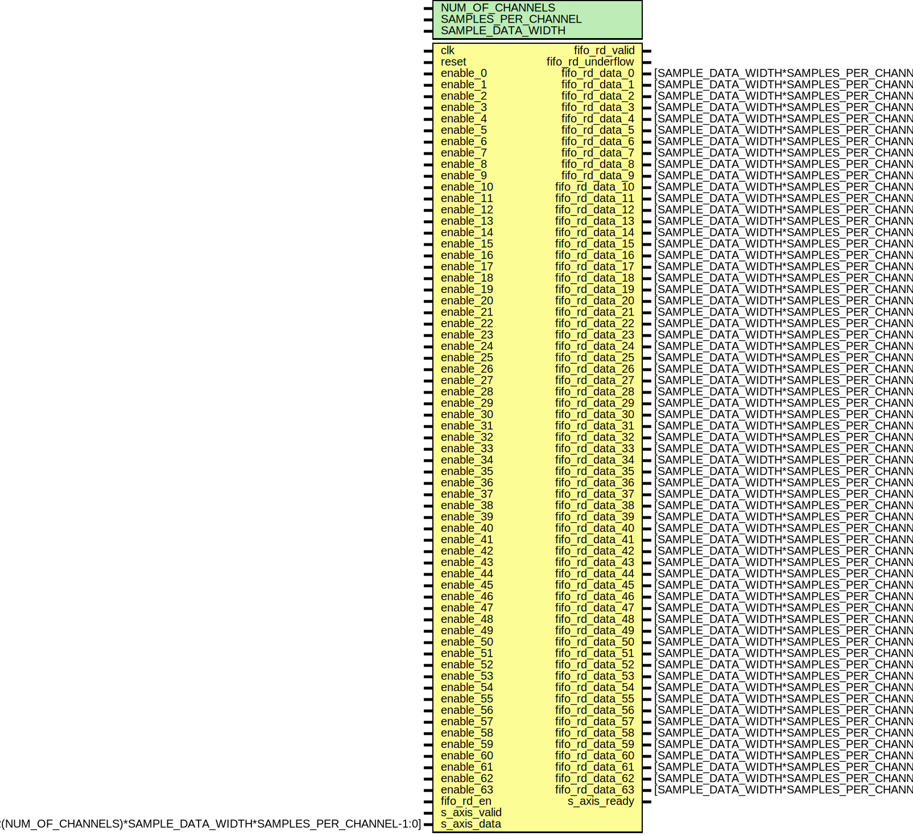

# Entity: util_upack2

- **File**: util_upack2.v
## Diagram

## Description

***************************************************************************
 ***************************************************************************
 Copyright 2017 (c) Analog Devices, Inc. All rights reserved.
 In this HDL repository, there are many different and unique modules, consisting
 of various HDL (Verilog or VHDL) components. The individual modules are
 developed independently, and may be accompanied by separate and unique license
 terms.
 The user should read each of these license terms, and understand the
 freedoms and responsabilities that he or she has by using this source/core.
 This core is distributed in the hope that it will be useful, but WITHOUT ANY
 WARRANTY; without even the implied warranty of MERCHANTABILITY or FITNESS FOR
 A PARTICULAR PURPOSE.
 Redistribution and use of source or resulting binaries, with or without modification
 of this file, are permitted under one of the following two license terms:
   1. The GNU General Public License version 2 as published by the
      Free Software Foundation, which can be found in the top level directory
      of this repository (LICENSE_GPL2), and also online at:
      <https://www.gnu.org/licenses/old-licenses/gpl-2.0.html>
 OR
   2. An ADI specific BSD license, which can be found in the top level directory
      of this repository (LICENSE_ADIBSD), and also on-line at:
      https://github.com/analogdevicesinc/hdl/blob/master/LICENSE_ADIBSD
      This will allow to generate bit files and not release the source code,
      as long as it attaches to an ADI device.
 ***************************************************************************
 ***************************************************************************
 
## Generics

| Generic name        | Type | Value | Description |
| ------------------- | ---- | ----- | ----------- |
| NUM_OF_CHANNELS     |      | 4     |             |
| SAMPLES_PER_CHANNEL |      | 1     |             |
| SAMPLE_DATA_WIDTH   |      | 16    |             |
## Ports

| Port name         | Direction | Type                                                                   | Description |
| ----------------- | --------- | ---------------------------------------------------------------------- | ----------- |
| clk               | input     |                                                                        |             |
| reset             | input     |                                                                        |             |
| enable_0          | input     |                                                                        |             |
| enable_1          | input     |                                                                        |             |
| enable_2          | input     |                                                                        |             |
| enable_3          | input     |                                                                        |             |
| enable_4          | input     |                                                                        |             |
| enable_5          | input     |                                                                        |             |
| enable_6          | input     |                                                                        |             |
| enable_7          | input     |                                                                        |             |
| enable_8          | input     |                                                                        |             |
| enable_9          | input     |                                                                        |             |
| enable_10         | input     |                                                                        |             |
| enable_11         | input     |                                                                        |             |
| enable_12         | input     |                                                                        |             |
| enable_13         | input     |                                                                        |             |
| enable_14         | input     |                                                                        |             |
| enable_15         | input     |                                                                        |             |
| enable_16         | input     |                                                                        |             |
| enable_17         | input     |                                                                        |             |
| enable_18         | input     |                                                                        |             |
| enable_19         | input     |                                                                        |             |
| enable_20         | input     |                                                                        |             |
| enable_21         | input     |                                                                        |             |
| enable_22         | input     |                                                                        |             |
| enable_23         | input     |                                                                        |             |
| enable_24         | input     |                                                                        |             |
| enable_25         | input     |                                                                        |             |
| enable_26         | input     |                                                                        |             |
| enable_27         | input     |                                                                        |             |
| enable_28         | input     |                                                                        |             |
| enable_29         | input     |                                                                        |             |
| enable_30         | input     |                                                                        |             |
| enable_31         | input     |                                                                        |             |
| enable_32         | input     |                                                                        |             |
| enable_33         | input     |                                                                        |             |
| enable_34         | input     |                                                                        |             |
| enable_35         | input     |                                                                        |             |
| enable_36         | input     |                                                                        |             |
| enable_37         | input     |                                                                        |             |
| enable_38         | input     |                                                                        |             |
| enable_39         | input     |                                                                        |             |
| enable_40         | input     |                                                                        |             |
| enable_41         | input     |                                                                        |             |
| enable_42         | input     |                                                                        |             |
| enable_43         | input     |                                                                        |             |
| enable_44         | input     |                                                                        |             |
| enable_45         | input     |                                                                        |             |
| enable_46         | input     |                                                                        |             |
| enable_47         | input     |                                                                        |             |
| enable_48         | input     |                                                                        |             |
| enable_49         | input     |                                                                        |             |
| enable_50         | input     |                                                                        |             |
| enable_51         | input     |                                                                        |             |
| enable_52         | input     |                                                                        |             |
| enable_53         | input     |                                                                        |             |
| enable_54         | input     |                                                                        |             |
| enable_55         | input     |                                                                        |             |
| enable_56         | input     |                                                                        |             |
| enable_57         | input     |                                                                        |             |
| enable_58         | input     |                                                                        |             |
| enable_59         | input     |                                                                        |             |
| enable_60         | input     |                                                                        |             |
| enable_61         | input     |                                                                        |             |
| enable_62         | input     |                                                                        |             |
| enable_63         | input     |                                                                        |             |
| fifo_rd_en        | input     |                                                                        |             |
| fifo_rd_valid     | output    |                                                                        |             |
| fifo_rd_underflow | output    |                                                                        |             |
| fifo_rd_data_0    | output    | [SAMPLE_DATA_WIDTH*SAMPLES_PER_CHANNEL-1:0]                            |             |
| fifo_rd_data_1    | output    | [SAMPLE_DATA_WIDTH*SAMPLES_PER_CHANNEL-1:0]                            |             |
| fifo_rd_data_2    | output    | [SAMPLE_DATA_WIDTH*SAMPLES_PER_CHANNEL-1:0]                            |             |
| fifo_rd_data_3    | output    | [SAMPLE_DATA_WIDTH*SAMPLES_PER_CHANNEL-1:0]                            |             |
| fifo_rd_data_4    | output    | [SAMPLE_DATA_WIDTH*SAMPLES_PER_CHANNEL-1:0]                            |             |
| fifo_rd_data_5    | output    | [SAMPLE_DATA_WIDTH*SAMPLES_PER_CHANNEL-1:0]                            |             |
| fifo_rd_data_6    | output    | [SAMPLE_DATA_WIDTH*SAMPLES_PER_CHANNEL-1:0]                            |             |
| fifo_rd_data_7    | output    | [SAMPLE_DATA_WIDTH*SAMPLES_PER_CHANNEL-1:0]                            |             |
| fifo_rd_data_8    | output    | [SAMPLE_DATA_WIDTH*SAMPLES_PER_CHANNEL-1:0]                            |             |
| fifo_rd_data_9    | output    | [SAMPLE_DATA_WIDTH*SAMPLES_PER_CHANNEL-1:0]                            |             |
| fifo_rd_data_10   | output    | [SAMPLE_DATA_WIDTH*SAMPLES_PER_CHANNEL-1:0]                            |             |
| fifo_rd_data_11   | output    | [SAMPLE_DATA_WIDTH*SAMPLES_PER_CHANNEL-1:0]                            |             |
| fifo_rd_data_12   | output    | [SAMPLE_DATA_WIDTH*SAMPLES_PER_CHANNEL-1:0]                            |             |
| fifo_rd_data_13   | output    | [SAMPLE_DATA_WIDTH*SAMPLES_PER_CHANNEL-1:0]                            |             |
| fifo_rd_data_14   | output    | [SAMPLE_DATA_WIDTH*SAMPLES_PER_CHANNEL-1:0]                            |             |
| fifo_rd_data_15   | output    | [SAMPLE_DATA_WIDTH*SAMPLES_PER_CHANNEL-1:0]                            |             |
| fifo_rd_data_16   | output    | [SAMPLE_DATA_WIDTH*SAMPLES_PER_CHANNEL-1:0]                            |             |
| fifo_rd_data_17   | output    | [SAMPLE_DATA_WIDTH*SAMPLES_PER_CHANNEL-1:0]                            |             |
| fifo_rd_data_18   | output    | [SAMPLE_DATA_WIDTH*SAMPLES_PER_CHANNEL-1:0]                            |             |
| fifo_rd_data_19   | output    | [SAMPLE_DATA_WIDTH*SAMPLES_PER_CHANNEL-1:0]                            |             |
| fifo_rd_data_20   | output    | [SAMPLE_DATA_WIDTH*SAMPLES_PER_CHANNEL-1:0]                            |             |
| fifo_rd_data_21   | output    | [SAMPLE_DATA_WIDTH*SAMPLES_PER_CHANNEL-1:0]                            |             |
| fifo_rd_data_22   | output    | [SAMPLE_DATA_WIDTH*SAMPLES_PER_CHANNEL-1:0]                            |             |
| fifo_rd_data_23   | output    | [SAMPLE_DATA_WIDTH*SAMPLES_PER_CHANNEL-1:0]                            |             |
| fifo_rd_data_24   | output    | [SAMPLE_DATA_WIDTH*SAMPLES_PER_CHANNEL-1:0]                            |             |
| fifo_rd_data_25   | output    | [SAMPLE_DATA_WIDTH*SAMPLES_PER_CHANNEL-1:0]                            |             |
| fifo_rd_data_26   | output    | [SAMPLE_DATA_WIDTH*SAMPLES_PER_CHANNEL-1:0]                            |             |
| fifo_rd_data_27   | output    | [SAMPLE_DATA_WIDTH*SAMPLES_PER_CHANNEL-1:0]                            |             |
| fifo_rd_data_28   | output    | [SAMPLE_DATA_WIDTH*SAMPLES_PER_CHANNEL-1:0]                            |             |
| fifo_rd_data_29   | output    | [SAMPLE_DATA_WIDTH*SAMPLES_PER_CHANNEL-1:0]                            |             |
| fifo_rd_data_30   | output    | [SAMPLE_DATA_WIDTH*SAMPLES_PER_CHANNEL-1:0]                            |             |
| fifo_rd_data_31   | output    | [SAMPLE_DATA_WIDTH*SAMPLES_PER_CHANNEL-1:0]                            |             |
| fifo_rd_data_32   | output    | [SAMPLE_DATA_WIDTH*SAMPLES_PER_CHANNEL-1:0]                            |             |
| fifo_rd_data_33   | output    | [SAMPLE_DATA_WIDTH*SAMPLES_PER_CHANNEL-1:0]                            |             |
| fifo_rd_data_34   | output    | [SAMPLE_DATA_WIDTH*SAMPLES_PER_CHANNEL-1:0]                            |             |
| fifo_rd_data_35   | output    | [SAMPLE_DATA_WIDTH*SAMPLES_PER_CHANNEL-1:0]                            |             |
| fifo_rd_data_36   | output    | [SAMPLE_DATA_WIDTH*SAMPLES_PER_CHANNEL-1:0]                            |             |
| fifo_rd_data_37   | output    | [SAMPLE_DATA_WIDTH*SAMPLES_PER_CHANNEL-1:0]                            |             |
| fifo_rd_data_38   | output    | [SAMPLE_DATA_WIDTH*SAMPLES_PER_CHANNEL-1:0]                            |             |
| fifo_rd_data_39   | output    | [SAMPLE_DATA_WIDTH*SAMPLES_PER_CHANNEL-1:0]                            |             |
| fifo_rd_data_40   | output    | [SAMPLE_DATA_WIDTH*SAMPLES_PER_CHANNEL-1:0]                            |             |
| fifo_rd_data_41   | output    | [SAMPLE_DATA_WIDTH*SAMPLES_PER_CHANNEL-1:0]                            |             |
| fifo_rd_data_42   | output    | [SAMPLE_DATA_WIDTH*SAMPLES_PER_CHANNEL-1:0]                            |             |
| fifo_rd_data_43   | output    | [SAMPLE_DATA_WIDTH*SAMPLES_PER_CHANNEL-1:0]                            |             |
| fifo_rd_data_44   | output    | [SAMPLE_DATA_WIDTH*SAMPLES_PER_CHANNEL-1:0]                            |             |
| fifo_rd_data_45   | output    | [SAMPLE_DATA_WIDTH*SAMPLES_PER_CHANNEL-1:0]                            |             |
| fifo_rd_data_46   | output    | [SAMPLE_DATA_WIDTH*SAMPLES_PER_CHANNEL-1:0]                            |             |
| fifo_rd_data_47   | output    | [SAMPLE_DATA_WIDTH*SAMPLES_PER_CHANNEL-1:0]                            |             |
| fifo_rd_data_48   | output    | [SAMPLE_DATA_WIDTH*SAMPLES_PER_CHANNEL-1:0]                            |             |
| fifo_rd_data_49   | output    | [SAMPLE_DATA_WIDTH*SAMPLES_PER_CHANNEL-1:0]                            |             |
| fifo_rd_data_50   | output    | [SAMPLE_DATA_WIDTH*SAMPLES_PER_CHANNEL-1:0]                            |             |
| fifo_rd_data_51   | output    | [SAMPLE_DATA_WIDTH*SAMPLES_PER_CHANNEL-1:0]                            |             |
| fifo_rd_data_52   | output    | [SAMPLE_DATA_WIDTH*SAMPLES_PER_CHANNEL-1:0]                            |             |
| fifo_rd_data_53   | output    | [SAMPLE_DATA_WIDTH*SAMPLES_PER_CHANNEL-1:0]                            |             |
| fifo_rd_data_54   | output    | [SAMPLE_DATA_WIDTH*SAMPLES_PER_CHANNEL-1:0]                            |             |
| fifo_rd_data_55   | output    | [SAMPLE_DATA_WIDTH*SAMPLES_PER_CHANNEL-1:0]                            |             |
| fifo_rd_data_56   | output    | [SAMPLE_DATA_WIDTH*SAMPLES_PER_CHANNEL-1:0]                            |             |
| fifo_rd_data_57   | output    | [SAMPLE_DATA_WIDTH*SAMPLES_PER_CHANNEL-1:0]                            |             |
| fifo_rd_data_58   | output    | [SAMPLE_DATA_WIDTH*SAMPLES_PER_CHANNEL-1:0]                            |             |
| fifo_rd_data_59   | output    | [SAMPLE_DATA_WIDTH*SAMPLES_PER_CHANNEL-1:0]                            |             |
| fifo_rd_data_60   | output    | [SAMPLE_DATA_WIDTH*SAMPLES_PER_CHANNEL-1:0]                            |             |
| fifo_rd_data_61   | output    | [SAMPLE_DATA_WIDTH*SAMPLES_PER_CHANNEL-1:0]                            |             |
| fifo_rd_data_62   | output    | [SAMPLE_DATA_WIDTH*SAMPLES_PER_CHANNEL-1:0]                            |             |
| fifo_rd_data_63   | output    | [SAMPLE_DATA_WIDTH*SAMPLES_PER_CHANNEL-1:0]                            |             |
| s_axis_valid      | input     |                                                                        |             |
| s_axis_ready      | output    |                                                                        |             |
| s_axis_data       | input     | [2**$clog2(NUM_OF_CHANNELS)*SAMPLE_DATA_WIDTH*SAMPLES_PER_CHANNEL-1:0] |             |
## Signals

| Name           | Type                                               | Description                                       |
| -------------- | -------------------------------------------------- | ------------------------------------------------- |
| enable_s       | wire [63:0]                                        | FIXME: Find out how to do this in the IP-XACT */  |
| fifo_rd_data   | wire [CHANNEL_DATA_WIDTH*REAL_NUM_OF_CHANNELS-1:0] |                                                   |
| fifo_rd_data_s | wire [CHANNEL_DATA_WIDTH*64-1:0]                   |                                                   |
## Constants

| Name                 | Type | Value                                   | Description |
| -------------------- | ---- | --------------------------------------- | ----------- |
| CHANNEL_DATA_WIDTH   |      | SAMPLE_DATA_WIDTH * SAMPLES_PER_CHANNEL |             |
| REAL_NUM_OF_CHANNELS |      |                                         |             |
