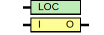

# Entity: BUF

- **File**: BUF.v
## Diagram

## Generics

| Generic name | Type | Value      | Description |
| ------------ | ---- | ---------- | ----------- |
| LOC          |      | "UNPLACED" |             |
## Ports

| Port name | Direction | Type | Description |
| --------- | --------- | ---- | ----------- |
| O         | output    |      |             |
| I         | input     |      |             |
