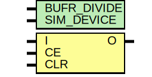

# Entity: BUFR

- **File**: BUFR.v
## Diagram

## Description

#

## Generics

| Generic name | Type | Value | Description |
| ------------ | ---- | ----- | ----------- |
| BUFR_DIVIDE  |      | 4     |             |
| SIM_DEVICE   |      | 0     |             |
## Ports

| Port name | Direction | Type | Description                   |
| --------- | --------- | ---- | ----------------------------- |
| I         | input     |      | clock input                   |
| CE        | input     |      | async output clock enable     |
| CLR       | input     |      | async clear for divider logic |
| O         | output    |      | clock output                  |
## Instantiations

- clock_divider: clock_divider
 **Description**
assign O=I & CE & ~CLR;
TODO: need to paraemtrize this!!!   

