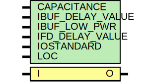

# Entity: IBUF

- **File**: IBUF.v
## Diagram

## Generics

| Generic name     | Type | Value       | Description |
| ---------------- | ---- | ----------- | ----------- |
| CAPACITANCE      |      | "DONT_CARE" |             |
| IBUF_DELAY_VALUE |      | "0"         |             |
| IBUF_LOW_PWR     |      | "TRUE"      |             |
| IFD_DELAY_VALUE  |      | "AUTO"      |             |
| IOSTANDARD       |      | "DEFAULT"   |             |
| LOC              |      | " UNPLACED" |             |
## Ports

| Port name | Direction | Type | Description |
| --------- | --------- | ---- | ----------- |
| O         | output    |      |             |
| I         | input     |      |             |
