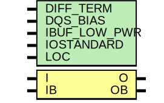

# Entity: IBUFDS_DIFF_OUT

- **File**: IBUFDS_DIFF_OUT.v
## Diagram

## Generics

| Generic name | Type | Value       | Description |
| ------------ | ---- | ----------- | ----------- |
| DIFF_TERM    |      | "FALSE"     |             |
| DQS_BIAS     |      | "FALSE"     |             |
| IBUF_LOW_PWR |      | "TRUE"      |             |
| IOSTANDARD   |      | "DEFAULT"   |             |
| LOC          |      | " UNPLACED" |             |
## Ports

| Port name | Direction | Type | Description |
| --------- | --------- | ---- | ----------- |
| O         | output    |      |             |
| OB        | output    |      |             |
| I         | input     |      |             |
|  IB       | input     |      |             |
