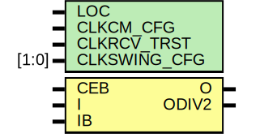

# Entity: IBUFDS_GTE2

- **File**: IBUFDS_GTE2.v
## Diagram

## Generics

| Generic name | Type  | Value      | Description |
| ------------ | ----- | ---------- | ----------- |
| LOC          |       | "UNPLACED" |             |
| CLKCM_CFG    |       | "TRUE"     |             |
| CLKRCV_TRST  |       | "TRUE"     |             |
| CLKSWING_CFG | [1:0] | 2'b11      |             |
## Ports

| Port name | Direction | Type | Description |
| --------- | --------- | ---- | ----------- |
| O         | output    |      |             |
| ODIV2     | output    |      |             |
| CEB       | input     |      |             |
| I         | input     |      |             |
| IB        | input     |      |             |
