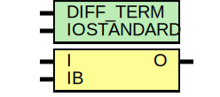

# Entity: IBUFGDS

- **File**: IBUFGDS.v
## Diagram

## Generics

| Generic name | Type | Value | Description |
| ------------ | ---- | ----- | ----------- |
| DIFF_TERM    |      | 0     |             |
| IOSTANDARD   |      | 0     |             |
## Ports

| Port name | Direction | Type | Description |
| --------- | --------- | ---- | ----------- |
| I         | input     |      |             |
| IB        | input     |      |             |
| O         | output    |      |             |
