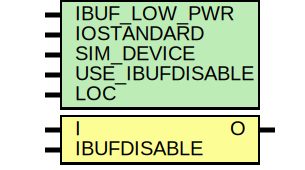

# Entity: IBUF_IBUFDISABLE

- **File**: IBUF_IBUFDISABLE.v
## Diagram

## Generics

| Generic name    | Type | Value      | Description |
| --------------- | ---- | ---------- | ----------- |
| IBUF_LOW_PWR    |      | "TRUE"     |             |
| IOSTANDARD      |      | "DEFAULT"  |             |
| SIM_DEVICE      |      | "7SERIES"  |             |
| USE_IBUFDISABLE |      | "TRUE"     |             |
| LOC             |      | "UNPLACED" |             |
## Ports

| Port name   | Direction | Type | Description        |
| ----------- | --------- | ---- | ------------------ |
| O           | output    |      |  `ifdef XIL_TIMING |
| I           | input     |      |                    |
| IBUFDISABLE | input     |      |                    |
