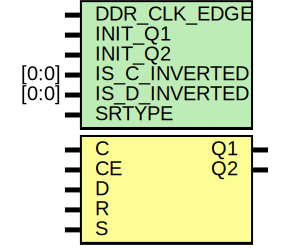

# Entity: IDDR

- **File**: IDDR.v
## Diagram

## Generics

| Generic name  | Type  | Value           | Description         |
| ------------- | ----- | --------------- | ------------------- |
| DDR_CLK_EDGE  |       | "OPPOSITE_EDGE" | Default parameters  |
| INIT_Q1       |       | 1'b0            |                     |
| INIT_Q2       |       | 1'b0            |                     |
| IS_C_INVERTED | [0:0] | 1'b0            |                     |
| IS_D_INVERTED | [0:0] | 1'b0            |                     |
| SRTYPE        |       | "SYNC"          |                     |
## Ports

| Port name | Direction | Type | Description                                |
| --------- | --------- | ---- | ------------------------------------------ |
| Q1        | output    |      | IDDR registered output (first)             |
| Q2        | output    |      | IDDR registered output (second)            |
| C         | input     |      | clock                                      |
| CE        | input     |      | clock enable, set to high to clock in data |
| D         | input     |      | data input from IOB                        |
| R         | input     |      | sync or async reset                        |
| S         | input     |      | syn/async "set to 1"                       |
## Signals

| Name   | Type | Description |
| ------ | ---- | ----------- |
| Q1_pos | reg  |             |
| Q1_reg | reg  |             |
| Q2_pos | reg  |             |
| Q2_neg | reg  |             |
## Constants

| Name             | Type    | Value        | Description                  |
| ---------------- | ------- | ------------ | ---------------------------- |
| HOLDHACK         |         | 0.1          |                              |
| DDR_CLK_EDGE_REG | [152:1] | DDR_CLK_EDGE | trick for string comparison  |
## Processes
- unnamed: ( @ (posedge C) )
  - **Type:** always
- unnamed: ( @ (posedge C) )
  - **Type:** always
- unnamed: ( @ (negedge C) )
  - **Type:** always
- unnamed: ( @ (posedge C) )
  - **Type:** always
