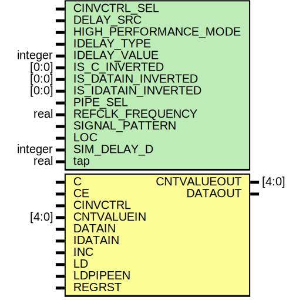

# Entity: IDELAYE2

- **File**: IDELAYE2.v
## Diagram

## Description

 verilator lint_off WIDTH */

## Generics

| Generic name          | Type    | Value      | Description               |
| --------------------- | ------- | ---------- | ------------------------- |
| CINVCTRL_SEL          |         | "FALSE"    |  Enable clock inversion   |
| DELAY_SRC             |         | "IDATAIN"  |  Delay input              |
| HIGH_PERFORMANCE_MODE |         | "FALSE"    |  Reduced jitter           |
| IDELAY_TYPE           |         | "FIXED"    |  Type of delay line       |
| IDELAY_VALUE          | integer | 0          |  Input delay tap setting  |
| IS_C_INVERTED         | [0:0]   | 1'b0       |                           |
| IS_DATAIN_INVERTED    | [0:0]   | 1'b0       |                           |
| IS_IDATAIN_INVERTED   | [0:0]   | 1'b0       |                           |
| PIPE_SEL              |         | "FALSE"    |  Select pipelined mode    |
| REFCLK_FREQUENCY      | real    | 200.0      |  Ref clock frequency      |
| SIGNAL_PATTERN        |         | "DATA"     |  Input signal type        |
| LOC                   |         | "UNPLACED" |                           |
| SIM_DELAY_D           | integer | 0          |                           |
| tap                   | real    | 1          |                           |
## Ports

| Port name   | Direction | Type  | Description                          |
| ----------- | --------- | ----- | ------------------------------------ |
| CNTVALUEOUT | output    | [4:0] | count value for monitoring tap value |
| DATAOUT     | output    |       | delayed data                         |
| C           | input     |       | clock input for variable mode        |
| CE          | input     |       | enable increment/decrement function  |
| CINVCTRL    | input     |       | dynamically inverts clock polarity   |
| CNTVALUEIN  | input     | [4:0] | counter value for tap delay          |
| DATAIN      | input     |       | data input from FGPA logic           |
| IDATAIN     | input     |       | data input from IBUF                 |
| INC         | input     |       | increment tap delay                  |
| LD          | input     |       | loads the delay primitive            |
| LDPIPEEN    | input     |       | enables the pipeline register delay  |
| REGRST      | input     |       | reset for pipeline register          |
## Signals

| Name       | Type      | Description |
| ---------- | --------- | ----------- |
| DELAY_D    | integer   |             |
| idelay_reg | reg [4:0] |             |
| DATAOUT    | reg       |             |
## Constants

| Name    | Type | Value       | Description |
| ------- | ---- | ----------- | ----------- |
| DELAY_D |      | SIM_DELAY_D |             |
## Processes
- unnamed: ( @ (posedge C) )
  - **Type:** always
- unnamed: ( @ (IDATAIN) )
  - **Type:** always
 **Description**
Variable delay 
