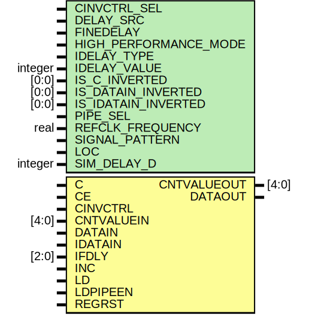

# Entity: IDELAYE2_FINEDELAY

- **File**: IDELAYE2_FINEDELAY.v
## Diagram

## Generics

| Generic name          | Type    | Value      | Description |
| --------------------- | ------- | ---------- | ----------- |
| CINVCTRL_SEL          |         | "FALSE"    |             |
| DELAY_SRC             |         | "IDATAIN"  |             |
| FINEDELAY             |         | "BYPASS"   |             |
| HIGH_PERFORMANCE_MODE |         | "FALSE"    |             |
| IDELAY_TYPE           |         | "FIXED"    |             |
| IDELAY_VALUE          | integer | 0          |             |
| IS_C_INVERTED         | [0:0]   | 1'b0       |             |
| IS_DATAIN_INVERTED    | [0:0]   | 1'b0       |             |
| IS_IDATAIN_INVERTED   | [0:0]   | 1'b0       |             |
| PIPE_SEL              |         | "FALSE"    |             |
| REFCLK_FREQUENCY      | real    | 200.0      |             |
| SIGNAL_PATTERN        |         | "DATA"     |             |
| LOC                   |         | "UNPLACED" |             |
| SIM_DELAY_D           | integer | 0          |             |
## Ports

| Port name   | Direction | Type  | Description        |
| ----------- | --------- | ----- | ------------------ |
| CNTVALUEOUT | output    | [4:0] |  ifndef XIL_TIMING |
| DATAOUT     | output    |       |                    |
| C           | input     |       |                    |
| CE          | input     |       |                    |
| CINVCTRL    | input     |       |                    |
| CNTVALUEIN  | input     | [4:0] |                    |
| DATAIN      | input     |       |                    |
| IDATAIN     | input     |       |                    |
| IFDLY       | input     | [2:0] |                    |
| INC         | input     |       |                    |
| LD          | input     |       |                    |
| LDPIPEEN    | input     |       |                    |
| REGRST      | input     |       |                    |
## Signals

| Name    | Type    | Description |
| ------- | ------- | ----------- |
| DELAY_D | integer |             |
## Constants

| Name    | Type | Value       | Description |
| ------- | ---- | ----------- | ----------- |
| DELAY_D |      | SIM_DELAY_D |             |
