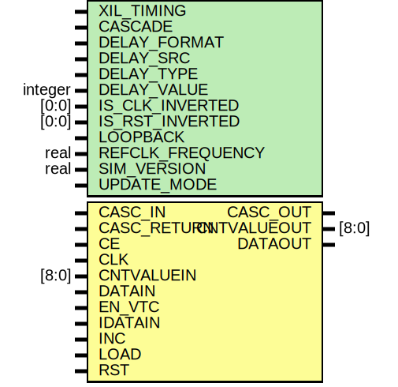

# Entity: IDELAYE3

- **File**: IDELAYE3.v
## Diagram

## Generics

| Generic name     | Type    | Value      | Description |
| ---------------- | ------- | ---------- | ----------- |
| XIL_TIMING       |         | "UNPLACED" |             |
| CASCADE          |         | "NONE"     |             |
| DELAY_FORMAT     |         | "TIME"     |             |
| DELAY_SRC        |         | "IDATAIN"  |             |
| DELAY_TYPE       |         | "FIXED"    |             |
| DELAY_VALUE      | integer | 0          |             |
| IS_CLK_INVERTED  | [0:0]   | 1'b0       |             |
| IS_RST_INVERTED  | [0:0]   | 1'b0       |             |
| LOOPBACK         |         | "FALSE"    |             |
| REFCLK_FREQUENCY | real    | 300.0      |             |
| SIM_VERSION      | real    | 2.0        |             |
| UPDATE_MODE      |         | "ASYNC"    |             |
## Ports

| Port name   | Direction | Type  | Description |
| ----------- | --------- | ----- | ----------- |
| CASC_OUT    | output    |       |             |
| CNTVALUEOUT | output    | [8:0] |             |
| DATAOUT     | output    |       |             |
| CASC_IN     | input     |       |             |
| CASC_RETURN | input     |       |             |
| CE          | input     |       |             |
| CLK         | input     |       |             |
| CNTVALUEIN  | input     | [8:0] |             |
| DATAIN      | input     |       |             |
| EN_VTC      | input     |       |             |
| IDATAIN     | input     |       |             |
| INC         | input     |       |             |
| LOAD        | input     |       |             |
| RST         | input     |       |             |
