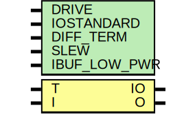

# Entity: IOBUF

- **File**: IOBUF.v
## Diagram

## Generics

| Generic name | Type | Value     | Description |
| ------------ | ---- | --------- | ----------- |
| DRIVE        |      | 8         |             |
| IOSTANDARD   |      | "LVDS_25" |             |
| DIFF_TERM    |      | "TRUE"    |             |
| SLEW         |      | "FAST"    |             |
| IBUF_LOW_PWR |      | "TRUE"    |             |
## Ports

| Port name | Direction | Type | Description |
| --------- | --------- | ---- | ----------- |
| IO        | inout     |      |             |
| T         | input     |      |             |
| I         | input     |      |             |
| O         | output    |      |             |
