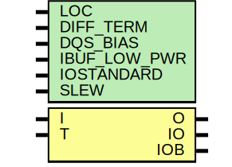

# Entity: IOBUFDS

- **File**: IOBUFDS.v
## Diagram

## Generics

| Generic name | Type | Value      | Description         |
| ------------ | ---- | ---------- | ------------------- |
| LOC          |      | "UNPLACED" |                     |
| DIFF_TERM    |      | "FALSE"    |  `ifdef XIL_TIMING  |
| DQS_BIAS     |      | "FALSE"    |                     |
| IBUF_LOW_PWR |      | "TRUE"     |                     |
| IOSTANDARD   |      | "DEFAULT"  |                     |
| SLEW         |      | "SLOW"     |                     |
## Ports

| Port name | Direction | Type | Description |
| --------- | --------- | ---- | ----------- |
| O         | output    |      |             |
| IO        | inout     |      |             |
|  IOB      | inout     |      |             |
| I         | input     |      |             |
|  T        | input     |      |             |
## Constants

| Name        | Type | Value     | Description |
| ----------- | ---- | --------- | ----------- |
| MODULE_NAME |      | "IOBUFDS" |             |
