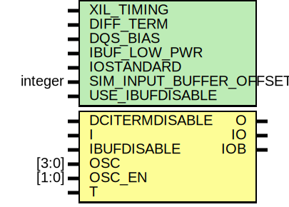

# Entity: IOBUFDSE3

- **File**: IOBUFDSE3.v
## Diagram

## Generics

| Generic name            | Type    | Value      | Description |
| ----------------------- | ------- | ---------- | ----------- |
| XIL_TIMING              |         | "UNPLACED" |             |
| DIFF_TERM               |         | "FALSE"    |             |
| DQS_BIAS                |         | "FALSE"    |             |
| IBUF_LOW_PWR            |         | "TRUE"     |             |
| IOSTANDARD              |         | "DEFAULT"  |             |
| SIM_INPUT_BUFFER_OFFSET | integer | 0          |             |
| USE_IBUFDISABLE         |         | "FALSE"    |             |
## Ports

| Port name      | Direction | Type  | Description |
| -------------- | --------- | ----- | ----------- |
| O              | output    |       |             |
| IO             | inout     |       |             |
| IOB            | inout     |       |             |
| DCITERMDISABLE | input     |       |             |
| I              | input     |       |             |
| IBUFDISABLE    | input     |       |             |
| OSC            | input     | [3:0] |             |
| OSC_EN         | input     | [1:0] |             |
| T              | input     |       |             |
## Signals

| Name      | Type | Description                                    |
| --------- | ---- | ---------------------------------------------- |
| trig_attr | reg  |  include dynamic registers - XILINX test only  |
## Constants

| Name                        | Type    | Value                   | Description                         |
| --------------------------- | ------- | ----------------------- | ----------------------------------- |
| MODULE_NAME                 |         | "IOBUFDSE3"             |  define constants                   |
| in_delay                    |         | 0                       |                                     |
| out_delay                   |         | 0                       |                                     |
| inclk_delay                 |         | 0                       |                                     |
| outclk_delay                |         | 0                       |                                     |
| DIFF_TERM_FALSE             |         | 0                       |  Parameter encodings and registers  |
| DIFF_TERM_TRUE              |         | 1                       |                                     |
| DQS_BIAS_FALSE              |         | 0                       |                                     |
| DQS_BIAS_TRUE               |         | 1                       |                                     |
| IBUF_LOW_PWR_FALSE          |         | 1                       |                                     |
| IBUF_LOW_PWR_TRUE           |         | 0                       |                                     |
| USE_IBUFDISABLE_FALSE       |         | 0                       |                                     |
| USE_IBUFDISABLE_TRUE        |         | 1                       |                                     |
| DIFF_TERM_REG               | [40:1]  | DIFF_TERM               |                                     |
| DQS_BIAS_REG                | [40:1]  | DQS_BIAS                |                                     |
| IBUF_LOW_PWR_REG            | [40:1]  | IBUF_LOW_PWR            |                                     |
| SIM_INPUT_BUFFER_OFFSET_REG | integer | SIM_INPUT_BUFFER_OFFSET |                                     |
| USE_IBUFDISABLE_REG         | [40:1]  | USE_IBUFDISABLE         |                                     |
