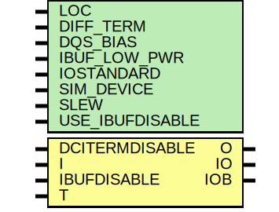

# Entity: IOBUFDS_DCIEN

- **File**: IOBUFDS_DCIEN.v
## Diagram

## Generics

| Generic name    | Type | Value      | Description         |
| --------------- | ---- | ---------- | ------------------- |
| LOC             |      | "UNPLACED" |                     |
| DIFF_TERM       |      | "FALSE"    |  `ifdef XIL_TIMING  |
| DQS_BIAS        |      | "FALSE"    |                     |
| IBUF_LOW_PWR    |      | "TRUE"     |                     |
| IOSTANDARD      |      | "DEFAULT"  |                     |
| SIM_DEVICE      |      | "7SERIES"  |                     |
| SLEW            |      | "SLOW"     |                     |
| USE_IBUFDISABLE |      | "TRUE"     |                     |
## Ports

| Port name      | Direction | Type | Description |
| -------------- | --------- | ---- | ----------- |
| O              | output    |      |             |
| IO             | inout     |      |             |
| IOB            | inout     |      |             |
| DCITERMDISABLE | input     |      |             |
| I              | input     |      |             |
| IBUFDISABLE    | input     |      |             |
| T              | input     |      |             |
## Constants

| Name        | Type | Value           | Description |
| ----------- | ---- | --------------- | ----------- |
| MODULE_NAME |      | "IOBUFDS_DCIEN" |             |
