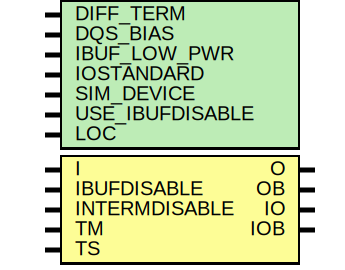

# Entity: IOBUFDS_DIFF_OUT_INTERMDISABLE

- **File**: IOBUFDS_DIFF_OUT_INTERMDISABLE.v
## Diagram

## Generics

| Generic name    | Type | Value      | Description |
| --------------- | ---- | ---------- | ----------- |
| DIFF_TERM       |      | "FALSE"    |             |
| DQS_BIAS        |      | "FALSE"    |             |
| IBUF_LOW_PWR    |      | "TRUE"     |             |
| IOSTANDARD      |      | "DEFAULT"  |             |
| SIM_DEVICE      |      | "7SERIES"  |             |
| USE_IBUFDISABLE |      | "TRUE"     |             |
| LOC             |      | "UNPLACED" |             |
## Ports

| Port name     | Direction | Type | Description        |
| ------------- | --------- | ---- | ------------------ |
| O             | output    |      |  `ifdef XIL_TIMING |
| OB            | output    |      |                    |
| IO            | inout     |      |                    |
| IOB           | inout     |      |                    |
| I             | input     |      |                    |
| IBUFDISABLE   | input     |      |                    |
| INTERMDISABLE | input     |      |                    |
| TM            | input     |      |                    |
| TS            | input     |      |                    |
