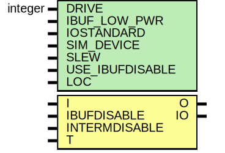

# Entity: IOBUF_INTERMDISABLE

- **File**: IOBUF_INTERMDISABLE.v
## Diagram

## Generics

| Generic name    | Type    | Value      | Description |
| --------------- | ------- | ---------- | ----------- |
| DRIVE           | integer | 12         |             |
| IBUF_LOW_PWR    |         | "TRUE"     |             |
| IOSTANDARD      |         | "DEFAULT"  |             |
| SIM_DEVICE      |         | "7SERIES"  |             |
| SLEW            |         | "SLOW"     |             |
| USE_IBUFDISABLE |         | "TRUE"     |             |
| LOC             |         | "UNPLACED" |             |
## Ports

| Port name     | Direction | Type | Description        |
| ------------- | --------- | ---- | ------------------ |
| O             | output    |      |  `ifdef XIL_TIMING |
| IO            | inout     |      |                    |
| I             | input     |      |                    |
| IBUFDISABLE   | input     |      |                    |
| INTERMDISABLE | input     |      |                    |
| T             | input     |      |                    |
