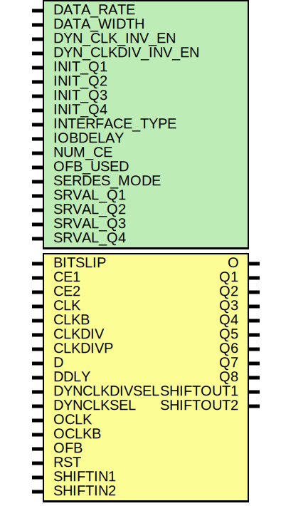

# Entity: ISERDESE2

- **File**: ISERDESE2.v
## Diagram

## Description

W

## Generics

| Generic name      | Type | Value | Description                              |
| ----------------- | ---- | ----- | ---------------------------------------- |
| DATA_RATE         |      | 0     |  "DDR" or "SDR"                          |
| DATA_WIDTH        |      | 0     |  4,2,3,5,6,7,8,10,14                     |
| DYN_CLK_INV_EN    |      | 0     |  "FALSE", "TRUE"                         |
| DYN_CLKDIV_INV_EN |      | 0     |  "FALSE", "TRUE"                         |
| INIT_Q1           |      | 0     |  1'b0 to 1'b1                            |
| INIT_Q2           |      | 0     |  1'b0 to 1'b1                            |
| INIT_Q3           |      | 0     |  1'b0 to 1'b1                            |
| INIT_Q4           |      | 0     |  1'b0 to 1'b1                            |
| INTERFACE_TYPE    |      | 0     |  "MEMORY","MEMORY_DDR3", "MEMORY_QDR",   |
| IOBDELAY          |      | 0     |  "NONE", "BOTH", "IBUF", "IFD"           |
| NUM_CE            |      | 0     |  2,1                                     |
| OFB_USED          |      | 0     |  "FALSE", "TRUE"                         |
| SERDES_MODE       |      | 0     |  "MASTER" or "SLAVE"                     |
| SRVAL_Q1          |      | 0     |  1'b0 or 1'b1                            |
| SRVAL_Q2          |      | 0     |  1'b0 or 1'b1                            |
| SRVAL_Q3          |      | 0     |  1'b0 or 1'b1                            |
| SRVAL_Q4          |      | 0     |  1'b0 or 1'b1                            |
## Ports

| Port name    | Direction | Type | Description                                |
| ------------ | --------- | ---- | ------------------------------------------ |
| BITSLIP      | input     |      | performs bitslip operation                 |
| CE1          | input     |      | clock enable                               |
| CE2          | input     |      | clock enable                               |
| CLK          | input     |      | high speed clock input                     |
| CLKB         | input     |      | high speed clock input (inverted)          |
| CLKDIV       | input     |      | divided clock (for bitslip and CE module)  |
| CLKDIVP      | input     |      | for MIG only                               |
| D            | input     |      | serial input data pin                      |
| DDLY         | input     |      | serial input data from IDELAYE2            |
| DYNCLKDIVSEL | input     |      | dynamically select CLKDIV inversion        |
| DYNCLKSEL    | input     |      | dynamically select CLK and CLKB inversion. |
| OCLK         | input     |      | clock for strobe based memory interfaces   |
| OCLKB        | input     |      | clock for strobe based memory interfaces   |
| OFB          | input     |      | data feebdack from OSERDESE2?              |
| RST          | input     |      | asynchronous reset                         |
| SHIFTIN1     | input     |      | slave of multie serdes                     |
| SHIFTIN2     | input     |      | slave of multie serdes                     |
| O            | output    |      | pass through from D or DDLY                |
| Q1           | output    |      | parallel data out (last bit)               |
| Q2           | output    |      |                                            |
| Q3           | output    |      |                                            |
| Q4           | output    |      |                                            |
| Q5           | output    |      |                                            |
| Q6           | output    |      |                                            |
| Q7           | output    |      |                                            |
| Q8           | output    |      | first bit of D appears here                |
| SHIFTOUT1    | output    |      | master of multi serdes                     |
| SHIFTOUT2    | output    |      | master of multi serdes                     |
## Signals

| Name         | Type      | Description |
| ------------ | --------- | ----------- |
| even_samples | reg [3:0] |             |
| odd_samples  | reg [3:0] |             |
| Q1           | reg       |             |
| Q2           | reg       |             |
| Q3           | reg       |             |
| Q4           | reg       |             |
| Q5           | reg       |             |
| Q6           | reg       |             |
| Q7           | reg       |             |
| Q8           | reg       |             |
## Processes
- unnamed: ( @ (posedge CLK) )
  - **Type:** always
- unnamed: ( @ (negedge CLK) )
  - **Type:** always
 **Description**
#0.1 
- unnamed: ( @ (posedge CLKDIV) )
  - **Type:** always
 **Description**
#0.1 
